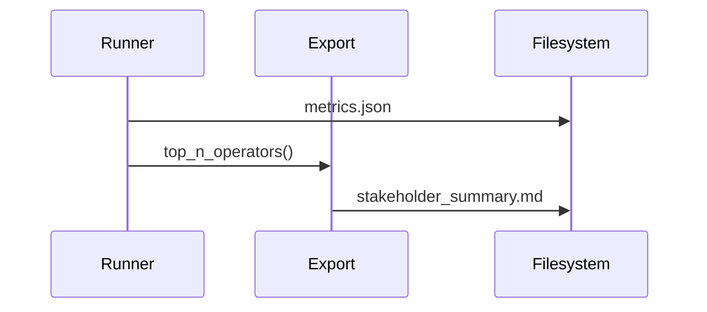

# Implementation Guide: User Story 2 — Stakeholder Summary

**Phase**: 4 | **Feature**: Basic Profiling for DeepSeek‑OCR (Stage 1) | **Tasks**: T030–T032

## Files

### Modified
- `/data2/huangzhe/code/llm-perf-opt/src/llm_perf_opt/profiling/export.py` (top‑N extraction helpers)

### Created (runtime artifacts)
- `/data2/huangzhe/code/llm-perf-opt/tmp/stage1/<run_id>/stakeholder_summary.md`

## Public APIs

### T031: Top‑N operator extraction and stage attribution

```python
# /data2/huangzhe/code/llm-perf-opt/src/llm_perf_opt/profiling/export.py
from __future__ import annotations
from typing import Iterable

def top_n_operators(records: Iterable[dict], n: int = 10) -> list[dict]:
    """Return top‑N ops by total time with optional stage hints."""
    ...

def write_stakeholder_summary(path: str, top_ops: list[dict], stage_takeaways: dict[str, str]) -> None:
    """Write a concise stakeholder summary in Markdown."""
    ...
```

### T030/T032: Generate stakeholder_summary.md

```python
def build_summary(metrics_path: str, out_md: str) -> None:
    # 1) Load metrics.json
    # 2) Derive top‑N operators and stage attribution
    # 3) Write stakeholder_summary.md with recommendations
    ...
```

**Usage Flow**:



## Phase Integration


## Testing

```bash
pixi run python - <<'PY'
from llm_perf_opt.profiling.export import write_stakeholder_summary
write_stakeholder_summary('/tmp/tmp.md', [], {"decode": "Decode dominated by attention"})
print('ok')
PY
```

## References
- Spec (US2): `/data2/huangzhe/code/llm-perf-opt/specs/001-profile-deepseek-ocr/spec.md`

## Summary of Work Done

- Export helpers implemented in `src/llm_perf_opt/profiling/export.py`:
- `top_n_operators(records, n=10)`: returns top‑N by `total_time_ms`.
- `write_stakeholder_summary(path, top_ops, stage_takeaways)`: generates stakeholder‑facing Markdown with mdutils (Top Operators table + Recommendations).
- `build_summary(metrics_path, out_md)`: loads `metrics.json` and writes a minimal summary when operator records are not provided.

- Stakeholder summary tables extended:
  - Added Environment, Aggregates (means/stds), MFU tables.
  - Added Per‑Stage Timings (ms) table sourced from `aggregates.stage_ms` when available.
  - Vision timing is presented as a note (`Vision = sam+clip+projector`, nested within prefill) to avoid implying a separate top‑level stage.

- MFU accuracy improved:
  - Integrated `DeepseekOCRStaticAnalyzer` to compute static FLOPs per stage.
  - Stakeholder MFU values now use analyzer FLOPs with measured timings (prefill total FLOPs, decode FLOPs/token × tokens, vision from sub‑stages), normalized by peak TFLOPs.

- Runner wiring updated in `src/llm_perf_opt/runners/llm_profile_runner.py`:
  - In `_write_outputs(...)`, derives stage takeaways from aggregates/MFU and calls `write_stakeholder_summary(...)`.
  - Emits `stakeholder_summary.md` under `tmp/stage1/<run_id>/` alongside `report.md`, `operators.md`, and `metrics.json`.

- Tasks completed (Phase 4 — US2):
  - T030, T031, T032 marked as done in `specs/001-profile-deepseek-ocr/tasks.md`.

- How to run (Pixi task):
  - `pixi run stage1-run`
    - Defaults: dataset subset `datasets/omnidocbench/subsets/dev-20.txt`, `device=cuda:0`, `repeats=3`, `infer.max_new_tokens=64`, `'profiling.activities=[cpu,cuda]'`.
  - Direct Hydra invocation (customizable):
    - `pixi run python -m llm_perf_opt.runners.llm_profile_runner dataset.subset_filelist=/data2/huangzhe/code/llm-perf-opt/datasets/omnidocbench/subsets/dev-20.txt device=cuda:0 repeats=3 'profiling.activities=[cpu,cuda]' infer.max_new_tokens=64`

- Validation: A sample run produced the full artifact set under `tmp/stage1/<run_id>/` including `stakeholder_summary.md`. All new US2 Markdown uses mdutils (no raw text writes).
