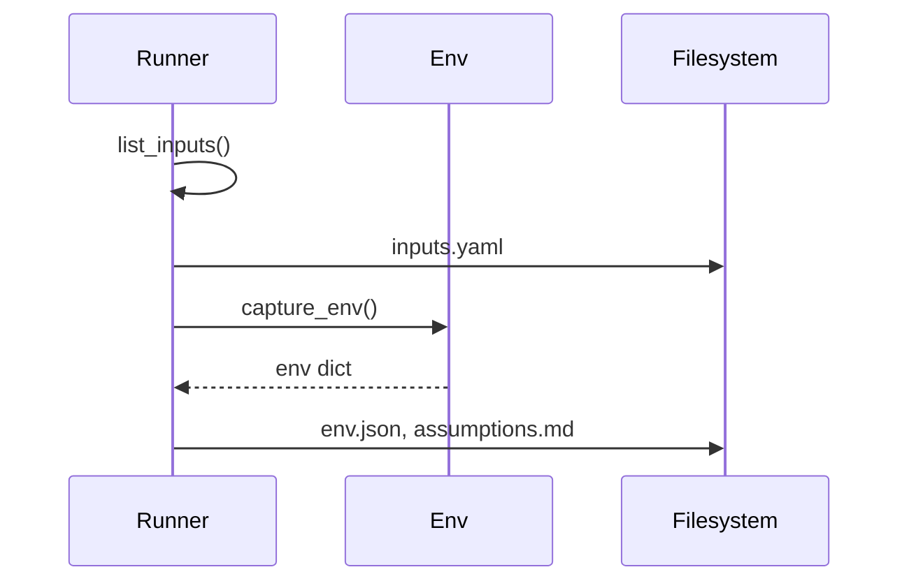
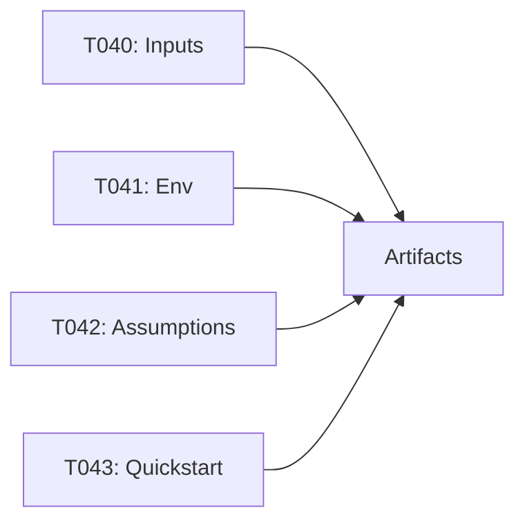

# Implementation Guide: User Story 3 — Reproducible Inputs & Notes

**Phase**: 5 | **Feature**: Basic Profiling for DeepSeek‑OCR (Stage 1) | **Tasks**: T040–T043

## Files

### Modified
- `/data2/huangzhe/code/llm-perf-opt/src/llm_perf_opt/profiling/hw.py` (environment capture)
- `/data2/huangzhe/code/llm-perf-opt/specs/001-profile-deepseek-ocr/quickstart.md` (reproducibility notes)

### Created (runtime artifacts)
- `/data2/huangzhe/code/llm-perf-opt/tmp/stage1/<run_id>/inputs.yaml`
- `/data2/huangzhe/code/llm-perf-opt/tmp/stage1/<run_id>/env.json`
- `/data2/huangzhe/code/llm-perf-opt/tmp/stage1/<run_id>/assumptions.md`

## Public APIs

### T040: Emit input list and metadata

```python
# within runner or a helper module
from __future__ import annotations
from pathlib import Path
import yaml

def list_inputs(root: str) -> list[dict]:
    paths = [*Path(root).glob('*.png'), *Path(root).glob('*.jpg')]
    return [{"path": str(p.resolve())} for p in sorted(paths)]

def write_inputs_yaml(paths: list[dict], out_path: str) -> None:
    with open(out_path, 'w') as f:
        yaml.safe_dump(paths, f)
```

### T041: Capture environment info

```python
# /data2/huangzhe/code/llm-perf-opt/src/llm_perf_opt/profiling/hw.py
import json, torch
import transformers as H

def capture_env() -> dict:
    info = {
        "gpu": get_device_name(),
        "cuda": torch.version.cuda if torch.cuda.is_available() else None,
        "torch": torch.__version__,
        "transformers": H.__version__,
    }
    return info

def write_env_json(path: str) -> None:
    with open(path, 'w') as f:
        json.dump(capture_env(), f, indent=2)
```

### T042: Persist run assumptions

```python
def write_assumptions(out_path: str, repeats: int, device: str, decoding: dict) -> None:
    with open(out_path, 'w') as f:
        f.write(f"repeats: {repeats}\n")
        f.write(f"device: {device}\n")
        f.write(f"decoding: {decoding}\n")
```

**Usage Flow**:



## Phase Integration



## Testing

```bash
pixi run python - <<'PY'
from llm_perf_opt.profiling.hw import capture_env
assert 'torch' in capture_env()
print('ok')
PY
```

## References
- Spec (US3): `/data2/huangzhe/code/llm-perf-opt/specs/001-profile-deepseek-ocr/spec.md`
