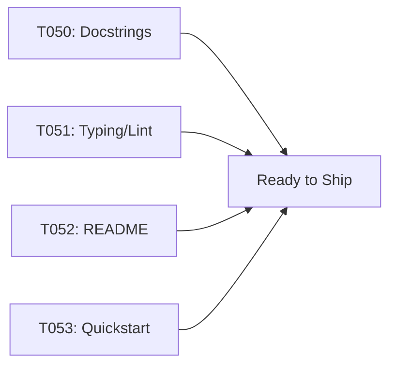

# Implementation Guide: Polish & Cross-Cutting

**Phase**: 6 | **Feature**: Basic Profiling for DeepSeek‑OCR (Stage 1) | **Tasks**: T050–T053

## Files

### Modified
- `/data2/huangzhe/code/llm-perf-opt/src/llm_perf_opt/**` (docstrings, typing)
- `/data2/huangzhe/code/llm-perf-opt/pyproject.toml` (ensure mypy/ruff config sufficient)
- `/data2/huangzhe/code/llm-perf-opt/README.md` (CLI usage snippet)
- `/data2/huangzhe/code/llm-perf-opt/specs/001-profile-deepseek-ocr/quickstart.md` (manual validation steps)

## Public APIs

### T050: NumPy-style docstrings

```python
def function(arg: int) -> int:
    """One-line summary.

    Parameters
    ----------
    arg : int
        Description

    Returns
    -------
    int
        Description

    Examples
    --------
    >>> function(1)
    2
    """
    ...
```

### T051: Typing + linters

```bash
pixi run mypy src/
pixi run ruff check .
pixi run ruff format .
```

### T052: CLI usage snippet

```markdown
```bash
pixi run python -m llm_perf_opt.runners.llm_profile_runner \
  --model-path /abs/models/deepseek-ocr \
  --input-dir  /abs/data/samples \
  --repeats 3
```
```

### T053: Manual validation steps

1. Prepare 10–20 images under `/data2/huangzhe/code/llm-perf-opt/data/samples`
2. Run the CLI with repeats=3
3. Verify `report.md`, `metrics.json`, and `stakeholder_summary.md`

## Phase Integration



## Testing

```bash
pixi run mypy src/
pixi run ruff check .
```

## References
- Constitution: `/data2/huangzhe/code/llm-perf-opt/.specify/memory/constitution.md`

## Summary of What’s Done

- T050: Reviewed and ensured NumPy‑style docstrings across public modules:
  - `src/llm_perf_opt/runners/dsocr_analyzer.py`, `src/llm_perf_opt/runners/llm_profile_runner.py`
  - `src/llm_perf_opt/profiling/{export.py,aggregate.py,mfu.py,hw.py}`
  - Added examples and clarified parameter/return sections where relevant.
- T051: Typing and Linting
  - mypy: added `OperatorRecord` TypedDict and propagated types through runner and exporters; fixed Counter→dict[float] aggregation.
  - ruff: cleaned up E402 by marking scripts as `# ruff: noqa: E402`, removed unused imports, and fixed stray f‑strings.
  - Verified: `pixi run mypy src/` and `pixi run ruff check .` pass clean.
- T052: README CLI snippet
  - Added “CLI Usage (Stage 1 Profiling)” with a Pixi command using Hydra overrides.
- T053: Manual validation steps
  - Updated `specs/001-profile-deepseek-ocr/quickstart.md` with a concrete run command and a checklist of expected artifacts (report.md, operators.md with Mean ms, stakeholder_summary.md tables, metrics.json, env.json, inputs.yaml, assumptions.md).

All tasks T050–T053 are marked as completed in `specs/001-profile-deepseek-ocr/tasks.md`.
