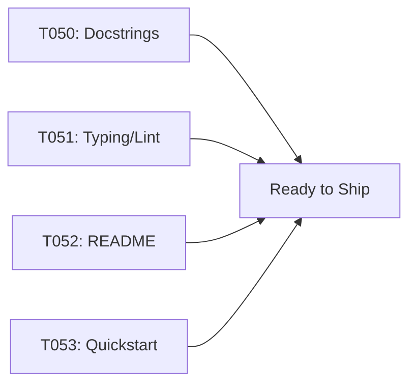

# Implementation Guide: Polish & Cross-Cutting

**Phase**: 6 | **Feature**: Basic Profiling for DeepSeek‑OCR (Stage 1) | **Tasks**: T050–T053

## Files

### Modified
- `/data2/huangzhe/code/llm-perf-opt/src/llm_perf_opt/**` (docstrings, typing)
- `/data2/huangzhe/code/llm-perf-opt/pyproject.toml` (ensure mypy/ruff config sufficient)
- `/data2/huangzhe/code/llm-perf-opt/README.md` (CLI usage snippet)
- `/data2/huangzhe/code/llm-perf-opt/specs/001-profile-deepseek-ocr/quickstart.md` (manual validation steps)

## Public APIs

### T050: NumPy-style docstrings

```python
def function(arg: int) -> int:
    """One-line summary.

    Parameters
    ----------
    arg : int
        Description

    Returns
    -------
    int
        Description

    Examples
    --------
    >>> function(1)
    2
    """
    ...
```

### T051: Typing + linters

```bash
pixi run mypy src/
pixi run ruff check .
pixi run ruff format .
```

### T052: CLI usage snippet

```markdown
```bash
pixi run python -m llm_perf_opt.runners.llm_profile_runner \
  --model-path /abs/models/deepseek-ocr \
  --input-dir  /abs/data/samples \
  --repeats 3
```
```

### T053: Manual validation steps

1. Prepare 10–20 images under `/data2/huangzhe/code/llm-perf-opt/data/samples`
2. Run the CLI with repeats=3
3. Verify `report.md`, `metrics.json`, and `stakeholder_summary.md`

## Phase Integration



## Testing

```bash
pixi run mypy src/
pixi run ruff check .
```

## References
- Constitution: `/data2/huangzhe/code/llm-perf-opt/.specify/memory/constitution.md`
