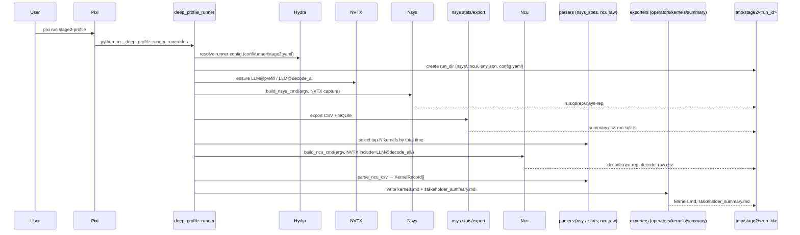
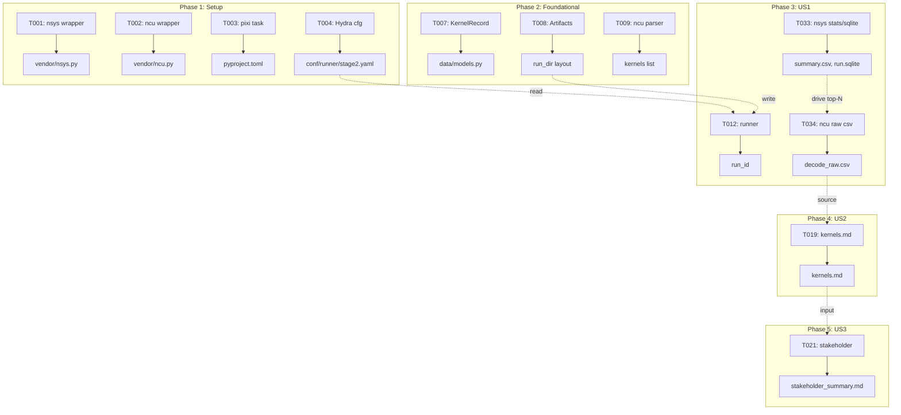
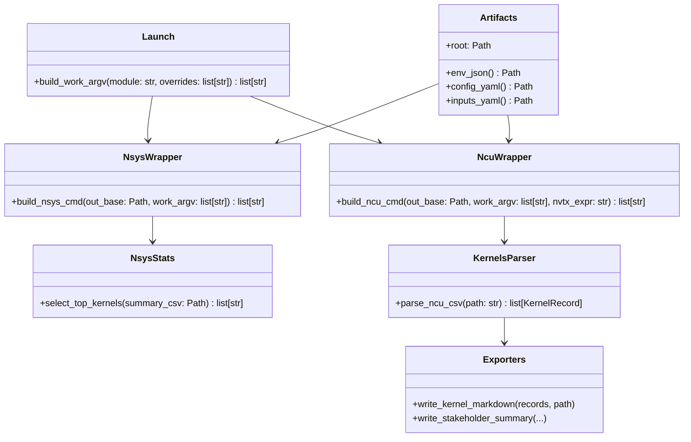
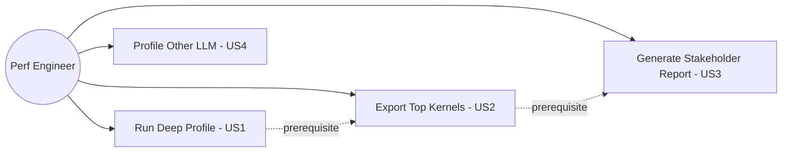
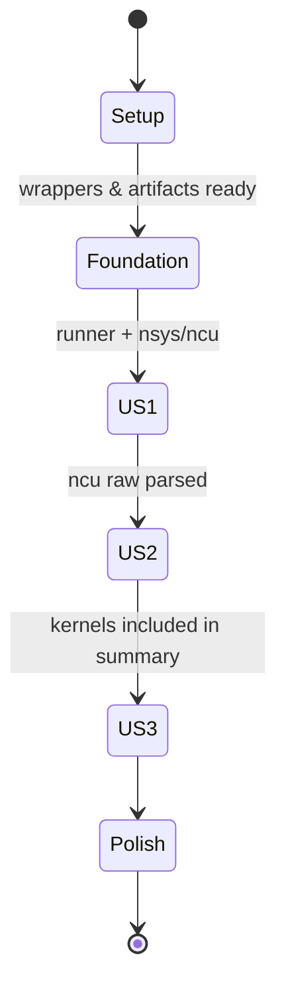
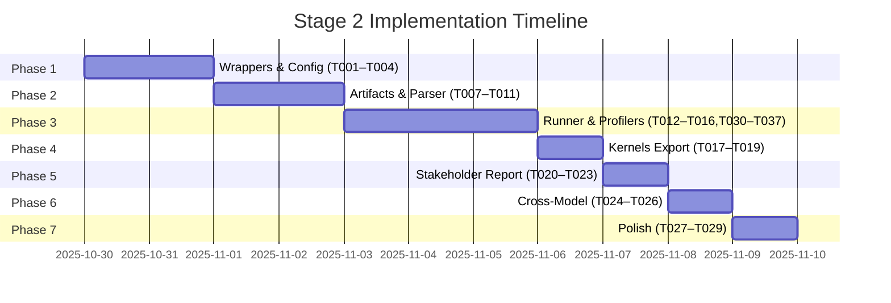

# Phase Integration Guide: Stage 2 — NVIDIA-Backed Deep LLM Profiling

**Feature**: `002-nvidia-llm-profiling` | **Phases**: 7

## Overview

Stage 2 layers NVIDIA Nsight tools on top of the Stage 1 runner to capture end-to-end timelines (nsys) and per-kernel metrics (ncu). NVTX stage ranges gate collection; Hydra controls configuration and ensures artifacts land under `tmp/stage2/<run_id>/`. Kernel metrics feed the new `kernels.md` while existing operator/aggregate logic powers stakeholder reports.

## Phase Flow



## Artifact Flow Between Phases



## System Architecture



## Use Cases



## Activity Flow



## Inter-Phase Dependencies

### Phase 1 → Phase 2

Artifacts
- `conf/runner/stage2.yaml` — runner configuration (mkdir `conf/runner/` if missing)
- `conf/profiling/*` — external profiler presets (torch/nsys/ncu)
- `pyproject.toml` Pixi task — entrypoint for US1

Code Dependencies
```python
# Phase 2 uses Phase 1 wrappers
from llm_perf_opt.profiling.vendor.nsys import build_nsys_cmd
from llm_perf_opt.profiling.vendor.ncu import build_ncu_cmd
```

### Phase 2 → Phase 3

Artifacts
- Run dir layout (`nsys/`, `ncu/`) created by Artifacts

Code Dependencies
```python
from llm_perf_opt.profiling.artifacts import Artifacts
from llm_perf_opt.data.models import KernelRecord
```

### Phase 3 → Phase 4/5

Artifacts
- `nsys` CSV, `ncu` raw CSV → sources for kernels.md
- `kernels.md` → input for stakeholder summary

Code Dependencies
```python
from llm_perf_opt.profiling.nsys_stats import select_top_kernels
from llm_perf_opt.profiling.kernels import parse_ncu_csv
from llm_perf_opt.profiling.export import write_kernel_markdown, write_stakeholder_summary
```

## Data Flow Timeline



## Integration Testing

```bash
# Unit tests (exporters)
pixi run pytest tests/unit/test_kernels_export.py -q
pixi run pytest tests/unit/test_stakeholder_summary.py -q

# Manual end-to-end
pixi run stage2-profile -- +run.mode=deep +inputs.manifest=/abs/path/inputs.yaml

# Validate artifacts exist
python - <<'PY'
from pathlib import Path
root = Path('tmp/stage2')
run = sorted([p for p in root.iterdir() if p.is_dir()])[-1]
for rel in ['nsys', 'ncu', 'kernels.md', 'stakeholder_summary.md', 'env.json', 'config.yaml']:
    p = run / rel
    print(rel, 'OK' if p.exists() else 'MISSING')
PY
```

## Critical Integration Points

1. NVTX range labels must match hint (`LLM@prefill`, `LLM@decode_all`) for correct ncu filtering.
2. Hydra must set `hydra.run.dir` to `tmp/stage2/<run_id>` so nsys/ncu outputs land under the same run.
3. nsys export/statistics must occur before selecting top kernels to feed ncu.
4. ncu must run with `--target-processes all` and NVTX include to bound collection and capture child processes.
5. Stakeholder summary must include both operators and kernels tables for complete attribution.

## References
- Individual phase guides: `context/tasks/002-nvidia-llm-profiling/impl-phase-*.md`
- Spec: `specs/002-nvidia-llm-profiling/spec.md`
- Tasks breakdown: `specs/002-nvidia-llm-profiling/tasks.md`
- Data model: `specs/002-nvidia-llm-profiling/data-model.md`
- Hint: `context/hints/nv-profile-kb/howto-manage-nsys-ncu-processes-for-llm.md`
