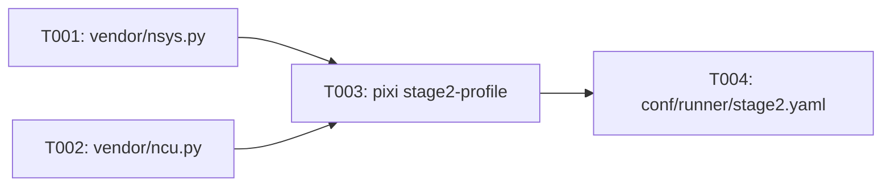

# Implementation Guide: Setup

Phase: 1 | Feature: Stage 2 — NVIDIA-Backed Deep LLM Profiling | Tasks: T001–T006

## Files

### Created
- src/llm_perf_opt/profiling/vendor/nsys.py
- src/llm_perf_opt/profiling/vendor/ncu.py
- conf/runner/stage2.yaml
- tests/manual/stage2_profile/README.md

### Modified
- pyproject.toml (add `stage2-profile` task)
- .gitignore (ignore `tmp/stage2/`)

## Public APIs

### T001: build_nsys_cmd

Build a safe argv list for `nsys profile`, gated by NVTX.

```python
# src/llm_perf_opt/profiling/vendor/nsys.py
from pathlib import Path
from typing import Sequence

def build_nsys_cmd(out_base: Path, work_argv: Sequence[str], *,
                   trace: str = "cuda,nvtx,osrt", sample: str = "none",
                   capture: str = "nvtx", nvtx_capture: str = "range@LLM") -> list[str]:
    return [
        "nsys", "profile",
        f"--trace={trace}", f"--sample={sample}",
        f"--capture-range={capture}", f"--nvtx-capture={nvtx_capture}",
        "-o", str(out_base),
    ] + list(work_argv)
```

### T002: build_ncu_cmd

Roofline-first metrics with NVTX include and all processes.

```python
# src/llm_perf_opt/profiling/vendor/ncu.py
from pathlib import Path
from typing import Sequence

DEFAULT_METRICS = (
    "flop_count_hp,flop_count_sp,gpu__time_duration.sum,"
    "sm__throughput.avg.pct_of_peak_sustained_elapsed,"
    "dram__throughput.avg.pct_of_peak_sustained_elapsed"
)

def build_ncu_cmd(out_base: Path, work_argv: Sequence[str], *, nvtx_expr: str) -> list[str]:
    return [
        "ncu", "--target-processes", "all",
        "--nvtx", "--nvtx-include", nvtx_expr,
        "--set", "roofline", "--section", ".*SpeedOfLight.*",
        "--metrics", DEFAULT_METRICS,
        "-o", str(out_base),
    ] + list(work_argv)
```

## Phase Integration



### Runner Interop (Refactor Compatibility)

- Stage 1 now controls static analysis via a runner config group (`conf/runners/`).
- When Stage 2 spawns the Stage 1 runner as the workload to profile, pass the Hydra override `runners=stage1.no-static` to disable static analysis during Nsight capture.
  - Rationale: avoids extra overhead and duplicate artifacts while collecting Nsight traces/metrics.
  - Example `work_argv` (to use with `build_nsys_cmd`/`build_ncu_cmd`):
    - `['python', '-m', 'llm_perf_opt.runners.llm_profile_runner', "dataset.subset_filelist=/abs/dev-20.txt", 'device=cuda:0', 'repeats=1', 'infer.max_new_tokens=64', "runners=stage1.no-static"]`

## Testing

```bash
pixi run python -c "import llm_perf_opt; print('ok')"
pixi run python -c "print('stage2-profile' in open('pyproject.toml').read())"
# Confirm Stage 1 runner config interop for Stage 2 (should be False when using no-static)
pixi run python - <<'PY'
import hydra
from omegaconf import OmegaConf
with hydra.initialize(config_path='conf', version_base=None):
    cfg = hydra.compose(config_name='config', overrides=['runners=stage1.no-static'])
    print('analysis.static.enabled=', OmegaConf.select(cfg, 'runners.analysis.static.enabled'))
PY
```

## References
- Spec: specs/002-nvidia-llm-profiling/spec.md
- Tasks: specs/002-nvidia-llm-profiling/tasks.md
- Hint: context/hints/nv-profile-kb/howto-manage-nsys-ncu-processes-for-llm.md

## Summary
- Created vendor wrappers: `src/llm_perf_opt/profiling/vendor/nsys.py`, `src/llm_perf_opt/profiling/vendor/ncu.py`
- Added Pixi task: `stage2-profile` in `pyproject.toml`
- Verified runner config present: `conf/runner/stage2.yaml` (mode, top_n_kernels, artifacts.stage2_dir)
- Seeded manual tests doc: `tests/manual/stage2_profile/README.md`
- Appended ignore rule: `tmp/stage2/` in `.gitignore`
- Updated `specs/002-nvidia-llm-profiling/tasks.md` to mark T001–T006 as completed
