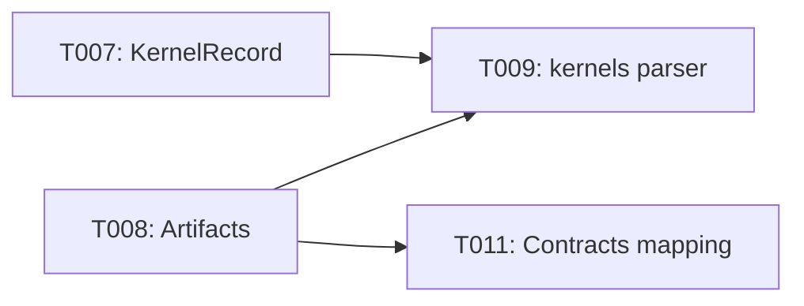

# Implementation Guide: Foundational

Phase: 2 | Feature: Stage 2 — NVIDIA-Backed Deep LLM Profiling | Tasks: T007–T011

## Files

### Created
- src/llm_perf_opt/profiling/artifacts.py
- src/llm_perf_opt/profiling/kernels.py
- src/llm_perf_opt/profiling/vendor/checks.py
- specs/002-nvidia-llm-profiling/contracts/MAPPING.md

### Modified
- src/llm_perf_opt/data/models.py (add KernelRecord, optional LLMProfileReport.kernels_topk)

## Public APIs

### T007: KernelRecord

```python
from attrs import define, field

@define(kw_only=True)
class KernelRecord:
    kernel_name: str = field()
    device: str = field()
    total_ms: float = field()
    calls: int = field()
    mean_ms: float = field()
```

### T008: Artifacts manager

```python
from pathlib import Path

class Artifacts:
    def __init__(self, root: Path):
        self.root = root
        (root/"nsys").mkdir(parents=True, exist_ok=True)
        (root/"ncu").mkdir(parents=True, exist_ok=True)

    def path(self, name: str) -> Path:
        return self.root / name
```

### T009: Nsight Compute CSV parser

```python
import csv
from typing import List

def parse_ncu_csv(csv_path: str) -> list[dict]:
    rows: List[dict] = []
    with open(csv_path, newline="", encoding="utf-8") as f:
        for row in csv.DictReader(f):
            rows.append(row)
    return rows
```

## Phase Integration



## Testing

```bash
pixi run python - <<'PY'
from llm_perf_opt.profiling.artifacts import Artifacts
from pathlib import Path
art = Artifacts(Path('tmp/stage2/demo'))
print(art.path('env.json'))
PY
```

## References
- Data model: specs/002-nvidia-llm-profiling/data-model.md
- Spec: specs/002-nvidia-llm-profiling/spec.md
