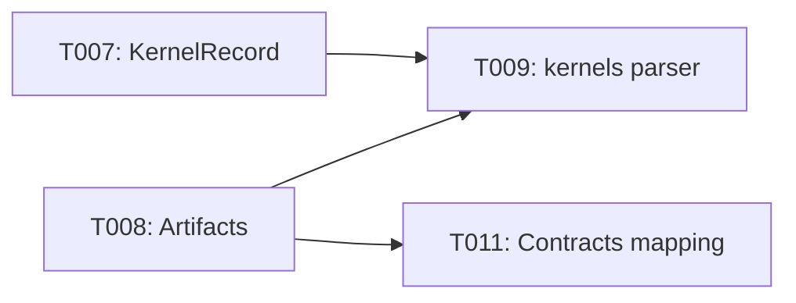

# Implementation Guide: Foundational

Phase: 2 | Feature: Stage 2 — NVIDIA-Backed Deep LLM Profiling | Tasks: T007–T011

## Files

### Created
- src/llm_perf_opt/profiling/artifacts.py
- src/llm_perf_opt/profiling/kernels.py
- src/llm_perf_opt/profiling/vendor/checks.py
- specs/002-nvidia-llm-profiling/contracts/MAPPING.md

### Modified
- src/llm_perf_opt/data/models.py (add KernelRecord, optional LLMProfileReport.kernels_topk)

## Public APIs

### T007: KernelRecord

```python
from attrs import define, field

@define(kw_only=True)
class KernelRecord:
    kernel_name: str = field()
    device: str = field()
    total_ms: float = field()
    calls: int = field()
    mean_ms: float = field()
```

### T008: Artifacts manager

```python
from pathlib import Path

class Artifacts:
    def __init__(self) -> None: ...  # no-arg constructor per coding guide
    @classmethod
    def from_root(cls, root: Path | str) -> "Artifacts": ...
    def set_root(self, root: Path | str) -> None: ...
    @property
    def root(self) -> Path: ...
    def path(self, name: str) -> Path: ...
```

### T009: Nsight Compute CSV parser

```python
import csv
from typing import List

def parse_ncu_csv(csv_path: str) -> list[dict]:
    rows: List[dict] = []
    with open(csv_path, newline="", encoding="utf-8") as f:
        for row in csv.DictReader(f):
            rows.append(row)
    return rows
```

## Phase Integration



## Testing

```bash
pixi run python - <<'PY'
from llm_perf_opt.profiling.artifacts import Artifacts
art = Artifacts.from_root('tmp/stage2/demo')
print(art.path('env.json'))
PY
```

## References
- Data model: specs/002-nvidia-llm-profiling/data-model.md
- Spec: specs/002-nvidia-llm-profiling/spec.md

## Summary
- Implemented T007–T011 (Foundational):
  - Added `KernelRecord` and extended `LLMProfileReport` with optional `kernels_topk` in `src/llm_perf_opt/data/models.py`.
  - Created artifacts manager in `src/llm_perf_opt/profiling/artifacts.py`:
    - `new_run_id()`, `create_stage2_root()`, `Artifacts.from_root()/set_root()`; writers for `env.json`, `config.yaml`, `inputs.yaml`.
  - Added kernel parsers in `src/llm_perf_opt/profiling/kernels.py`:
    - `parse_ncu_csv()`, `parse_ncu_json()`, and `kernels_from_ncu_rows()` mapping → `KernelRecord[]`.
  - Added vendor tool checks in `src/llm_perf_opt/profiling/vendor/checks.py` (`ensure_nsys()`, `ensure_ncu()`).
  - Added contract→CLI mapping note at `specs/002-nvidia-llm-profiling/contracts/MAPPING.md`.
- Documentation and code style:
  - Added module-level docstrings and NumPy-style function/class docs per `magic-context/general/python-coding-guide.md`.
  - Ensured service/helper class (`Artifacts`) uses no-arg constructor, `m_` member prefix, read-only properties, and explicit setters/factory methods.
- Quick validation commands executed:
  - Artifacts smoke: create root, write env/config/inputs; verify layout.
  - Parsers import OK; vendor checks callable.
