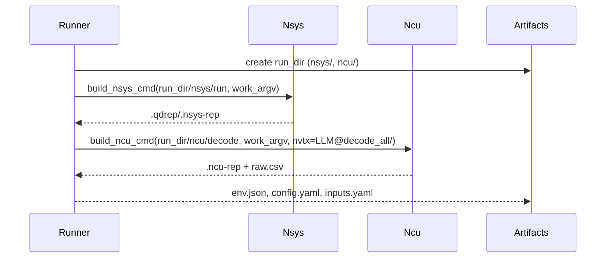

# Implementation Guide: US1 — Deep Profiling Session

Phase: 3 | Feature: Stage 2 — NVIDIA-Backed Deep LLM Profiling | Tasks: T012–T016, T030–T037

## Files

### Created
- src/llm_perf_opt/runners/deep_profile_runner.py
- tests/manual/stage2_profile/manual_stage2_profile.py
- src/llm_perf_opt/profiling/vendor/launch.py
- src/llm_perf_opt/profiling/nsys_stats.py

### Modified
- src/llm_perf_opt/profiling/vendor/nsys.py
- src/llm_perf_opt/profiling/vendor/ncu.py
- src/llm_perf_opt/profiling/nvtx_utils.py
- conf/runner/stage2.yaml
- src/llm_perf_opt/profiling/artifacts.py

## Public APIs

### T012: Hydra entrypoint

```python
import hydra
from omegaconf import DictConfig

@hydra.main(version_base=None, config_path='../../../conf/runner', config_name='stage2')
def main(cfg: DictConfig) -> None:
    # 1) Create run dir + provenance
    # 2) Build work argv with Hydra overrides
    # 3) Run nsys and ncu subprocesses
    # 4) Export operators/kernels tables, stakeholder summary
    pass
```

### T030/T031: NVTX ranges — use existing session tags

NVTX segmentation already exists in the model session (`dsocr_session.py`) via
`prefill`/`decode` ranges and sub-stage hooks (`sam`, `clip`, `projector`). Do
not add new NVTX helpers; instead, align profiler filters to these labels.

- Nsight Systems: use NVTX range gating without label filter (`nvtx_capture=range`).
- Nsight Compute: include `decode*` to focus on decode kernels.

### T032: Hydra‑aware argv builder

```python
from typing import Sequence

def build_work_argv(module: str, overrides: Sequence[str]) -> list[str]:
    return ["python", "-m", module, *overrides]
```

## Usage Flow



## Pseudocode

```python
art = Artifacts(run_dir)
work = build_work_argv('llm_perf_opt.runners.llm_profile_runner', hydra_overrides)
subprocess.run(build_nsys_cmd(art.root/"nsys"/"run", work), check=True)
subprocess.run(build_ncu_cmd(art.root/"ncu"/"decode", work, nvtx_expr='decode*'), check=True)
```

## Testing

```bash
pixi run python tests/manual/stage2_profile/manual_stage2_profile.py
```

## References
- Quickstart: specs/002-nvidia-llm-profiling/quickstart.md
- Hint: context/hints/nv-profile-kb/howto-manage-nsys-ncu-processes-for-llm.md
