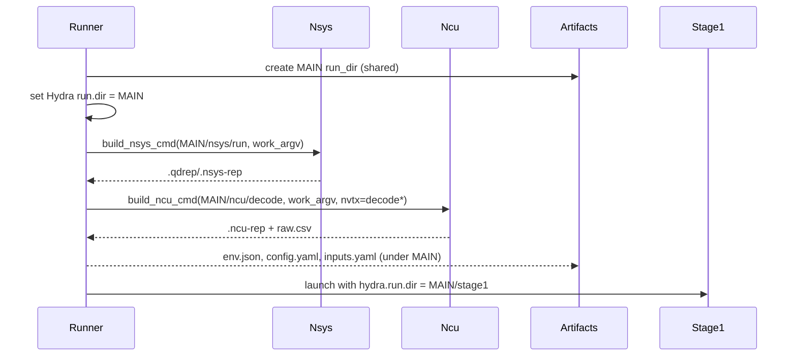

# Implementation Guide: US1 — Deep Profiling Session

Phase: 3 | Feature: Stage 2 — NVIDIA-Backed Deep LLM Profiling | Tasks: T012–T016, T030–T037

## Files

### Created
- src/llm_perf_opt/runners/deep_profile_runner.py
- tests/manual/stage2_profile/manual_stage2_profile.py
- src/llm_perf_opt/profiling/vendor/launch.py
- src/llm_perf_opt/profiling/nsys_stats.py

### Modified
- src/llm_perf_opt/profiling/vendor/nsys.py
- src/llm_perf_opt/profiling/vendor/ncu.py
- src/llm_perf_opt/profiling/nvtx_utils.py
- conf/runner/stage2.yaml
- src/llm_perf_opt/profiling/artifacts.py

## Public APIs

### T012: Hydra entrypoint

```python
import hydra
from omegaconf import DictConfig

@hydra.main(version_base=None, config_path='../../../conf', config_name='runner/stage2')
def main(cfg: DictConfig) -> None:
    # 1) Create run dir + provenance
    # 2) Build work argv with Hydra overrides
    # 3) Run nsys and ncu subprocesses
    # 4) Export operators/kernels tables, stakeholder summary
    pass
```

### T030/T031: NVTX ranges — use existing session tags

NVTX segmentation already exists in the model session (`dsocr_session.py`) via
`prefill`/`decode` ranges and sub-stage hooks (`sam`, `clip`, `projector`). Do
not add new NVTX helpers; instead, align profiler filters to these labels.

- Nsight Systems: use NVTX range gating with a concrete range name (e.g., `nvtx_capture=decode` or `prefill`).
- Nsight Compute: include `decode*` to focus on decode kernels.

### T032: Hydra‑aware argv builder

```python
from typing import Sequence

def build_work_argv(module: str, overrides: Sequence[str]) -> list[str]:
    return ["python", "-m", module, *overrides]
```

## Usage Flow



## Pseudocode

```python
art = Artifacts(MAIN)
work = build_work_argv('llm_perf_opt.runners.llm_profile_runner', hydra_overrides, hydra_run_dir=str(art/"stage1"))
subprocess.run(build_nsys_cmd(art.root/"nsys"/"run", work), check=True)
subprocess.run(build_ncu_cmd(art.root/"ncu"/"decode", work, nvtx_expr='decode*'), check=True)
```

## Testing

```bash
pixi run python tests/manual/stage2_profile/manual_stage2_profile.py
```

## Summary
- Unified config and outputs
  - Runner config path consolidated under `conf/runner/` (previous `conf/runners/` merged).
  - One MAIN run directory per Stage 2 run (Hydra `hydra.run.dir`), typically under `tmp/stage2/<timestamp>`.
  - Stage 1 artifacts live in `MAIN/stage1/`; all temporary and Hydra outputs for both stages stay under MAIN.
  - Legacy `outputs/` is deprecated; artifacts now land under `tmp/` and are ignored by VCS.
- Nsight Systems (nsys)
  - Uses NVTX range gating by default. Set a specific capture expression that matches emitted ranges, e.g. `nsys.nvtx_capture=prefill` (default) or `decode`.
  - Enables non‑registered NVTX strings via `--env-var=NSYS_NVTX_PROFILER_REGISTER_ONLY=0` for Python NVTX labels.
  - Resolves `.nsys-rep`/`.qdrep` automatically and exports summary/SQLite when a report exists (`nsys export --type sqlite`).
- Nsight Compute (ncu)
  - NVTX gating default is on; toggle with `ncu.gating_nvtx` (true|false). When off, no NVTX include or kernel regex is applied.
  - Drops brittle `--section` filters; prefers stable presets/metrics and `--set roofline` when available.
  - Supports `--list-sections`; writes `MAIN/ncu/sections.txt` for inspection and version‑dependent tuning.
  - When available, top‑N kernels are derived from NSYS stats to form a `kernel_regex` seed; falls back gracefully if stats are missing.
- CLI/argv and Hydra integration
  - `build_work_argv` injects Hydra overrides for Stage 1, including `hydra.run.dir=MAIN/stage1` and `hydra.job.chdir=false`.
  - Device mapping works with `CUDA_VISIBLE_DEVICES` and `+stage1_runner.device=cuda:0` so GPU index `1` can be targeted reliably.
- Stage 1 coordination
  - Static analyzer disabled during deep profiling via `runner@stage1_runner=stage1.no-static`.
  - Torch profiler disabled to avoid CUPTI conflicts: `torch_profiler.enabled=false`.
- Presets and provenance
  - Defaults live in `conf/profiling/nsys/nsys.default.yaml` and `conf/profiling/ncu/ncu.default.yaml`.
  - Provenance files (`env.json`, `config.yaml`, `inputs.yaml`) are written under MAIN for each run.

### Troubleshooting
- If no NSYS report appears under `MAIN/nsys/` with gating enabled:
  - Ensure the capture expression matches emitted NVTX range names (`prefill`, `decode`, `sam`, `clip`, `projector`). Try `nsys.nvtx_capture=decode`.
  - Confirm `NSYS_NVTX_PROFILER_REGISTER_ONLY=0` is in effect (we inject via `--env-var`).
  - As a temporary fallback, disable gating (`+nsys.gating_nvtx=false`) to force capture, then re‑enable after confirming ranges.

### Open Issue (under review)
- On this setup, `nsys.nvtx_capture=decode` produced "No reports were generated", while `nsys.nvtx_capture=prefill` produced a valid `run.nsys-rep` and `summary_cuda_gpu_kern_sum.csv`. Default is now `prefill` to ensure reliable capture. This variance is left for further code review and validation. See: `context/logs/code-review/20251030-061211-phase3-nvtx-gating-issue.md`.

### Range Replay: "No NVTX ranges were profiled" (NCU)

Context: Implementing Phase 3 (US1) NVTX range replay and testing against a tiny NVTX‑annotated workload to validate per‑range outputs.

Environment
- pixi env: `rtx5090` (CUDA 12.8)
- Torch: reports CUDA available; device count 1; `device=cuda:0`

Workload under Nsight Compute
- Module override: `pipeline.workload.module=llm_perf_opt.runners.nvtx_dummy_workload`
- Model: `ShallowResNet` with `nvtx.annotate('stem'|'residual'|'head')` in forward (fixed from `nvtx.range` → `nvtx.annotate`)
- Inputs created on `device` and model moved to `device`

NCU invocations tried
1) Multiple labels (incorrect formatting):
   ```bash
   --replay-mode range --nvtx --nvtx-include 'stem;residual;head'
   ```
   - Result: NCU did not match any range; raw.csv contained the warning. Root cause: Nsight Compute expects multiple `--nvtx-include` flags (one per pattern), not a single semicolon‑delimited string.

2) Single label (correct formatting):
   ```bash
   --replay-mode range --nvtx --nvtx-include stem
   ```
   - Example command captured:
     - `tmp/phase3-output/20251106-230659/ncu/cmd.txt`
   - Observed raw log:
     - `tmp/phase3-output/20251106-230659/ncu/raw.csv` → `==WARNING== No ranges were profiled.`
   - Consolidated region report shows the intended label (via assembler fallback), but NCU did not produce replayed data.

Hydra/Config fixes made to facilitate testing
- Added `ncu_cli.nvtx.include: null` in presets so struct mode accepts `+pipeline.ncu.ncu_cli.nvtx.include=…` overrides.
- Manual test and docs use quoting and `+` prefix to satisfy Hydra override grammar.

Likely causes per NVIDIA docs
- Range Replay requires that the NVTX‑gated ranges meet specific conditions (synchronization, supported CUDA API usage inside the range, etc.). PyTorch execution within these NVTX ranges may include unsupported API calls or schedule kernels outside the start/end range window, leading to no replayable ranges.
- References: Nsight Compute Profiling Guide (Range Replay requirements) and CLI docs for NVTX filtering behavior.

What we tried (summary)
- Corrected NVTX API in model (`nvtx.annotate`), verified GPU execution.
- Fixed include string formatting: switched from `'stem;residual;head'` to single `stem`.
- Ensured NCU CSV log path is always set; added workload override to run the NVTX dummy forward.
- Assembler fallback now materializes `ncu/regions/` structure even if NCU outputs no ranges (for doc/tests parity).

Next steps to obtain real range data
- Try `replay_mode=app-range` (relaunch per range; more tolerant to framework behavior); keep `--nvtx --nvtx-include stem`.
- Make ranges “obviously” cover launches: add `torch.cuda.synchronize()` at the end of each NVTX block in `ShallowResNet.forward`.
- Validate gating in per‑kernel mode first: `replay_mode=kernel` with `+ncu_cli.nvtx.include=stem`, confirm kernels are captured in raw.csv.
- Enhance builder to accept multiple include labels by emitting repeated `--nvtx-include` flags.

## References
- Quickstart: specs/002-nvidia-llm-profiling/quickstart.md
- Hint: context/hints/nv-profile-kb/howto-manage-nsys-ncu-processes-for-llm.md
