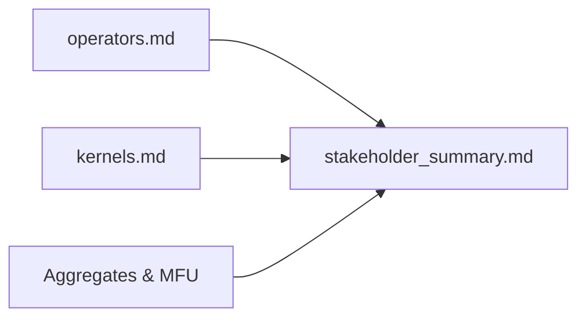

# Implementation Guide: US3 — Stakeholder Report

Phase: 5 | Feature: Stage 2 — NVIDIA-Backed Deep LLM Profiling | Tasks: T020–T023

## Files

### Created
- tests/unit/test_stakeholder_summary.py

### Modified
- src/llm_perf_opt/profiling/export.py
- src/llm_perf_opt/runners/deep_profile_runner.py

## Public APIs

### T021: Extend stakeholder summary to include Top Kernels

```python
def write_stakeholder_summary(path: str, *,
    top_ops: list[dict],
    stage_takeaways: dict[str,str],
    stats: dict | None = None,
    top_kernels: list[dict] | None = None,
) -> None: ...
```

## Phase Integration



## Testing

```bash
pixi run pytest tests/unit/test_stakeholder_summary.py -q
```

## References
- Spec: specs/002-nvidia-llm-profiling/spec.md (US3)
