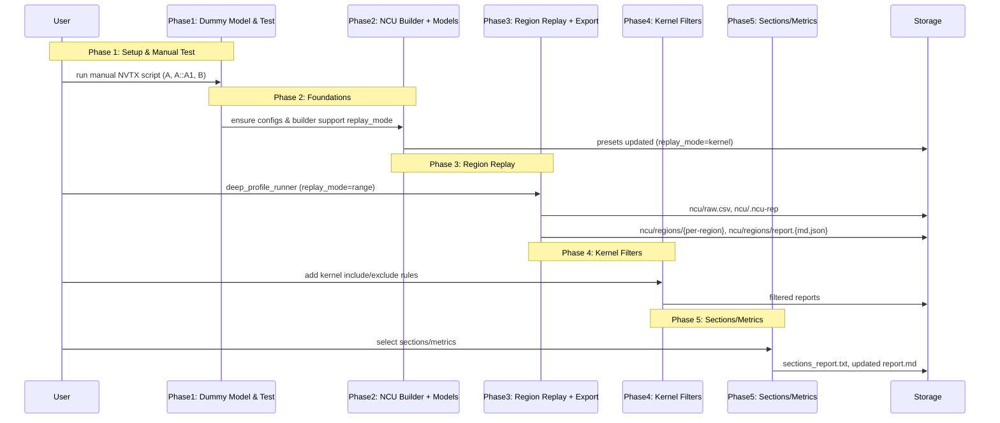
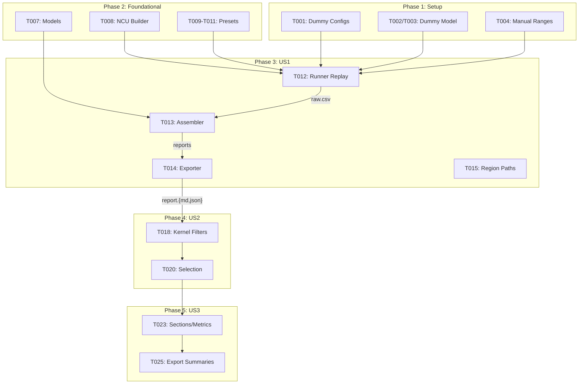
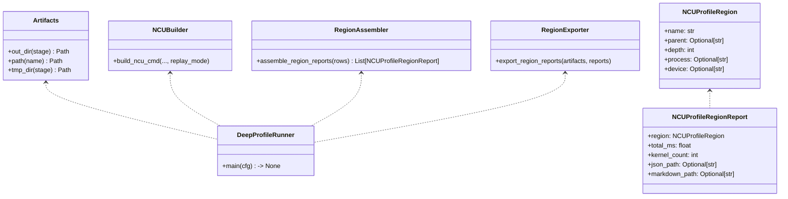
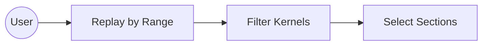
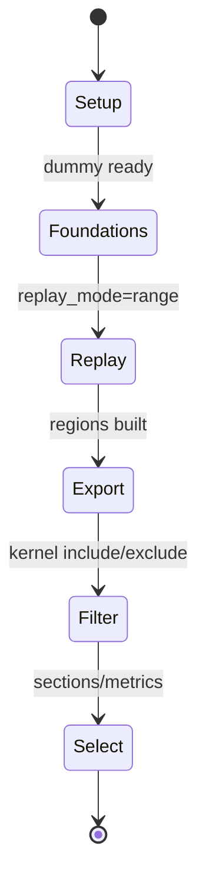
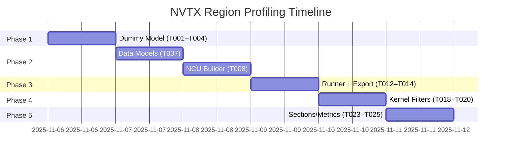

# Phase Integration Guide: NVTX-based NCU Regional Profiling

**Feature**: `003-nvtx-ncu-profiling` | **Phases**: 5 + Polish

## Overview

This feature adds NVTX-range–aware Nsight Compute profiling to Stage 2. We introduce a dummy model for deterministic kernels, extend the NCU command builder with replay mode, and implement per-region aggregation/export. The flow remains Hydra-driven and reuses existing Stage 2 infrastructure and artifacts layout.

## Phase Flow



## Artifact Flow Between Phases



## System Architecture



## Use Cases



## Activity Flow



## Inter-Phase Dependencies

### Phase 1 → Phase 3

Artifacts:
- `conf/model/dummy_shallow_resnet/*` — dummy model configs used in all tests
- `tests/manual/ncu/manual_nvtx_regions.py` — deterministic NVTX ranges

### Phase 2 → Phase 3

Code Dependencies:
```python
from llm_perf_opt.profiling.vendor.ncu import build_ncu_cmd  # replay_mode support
from llm_perf_opt.data.ncu_regions import NCUProfileRegion, NCUProfileRegionReport
```

## Data Flow Timeline



## Integration Testing

```bash
# End-to-end with dummy model, range replay, sections
pixi run -e rtx5090 python -m llm_perf_opt.runners.deep_profile_runner \
  model/dummy_shallow_resnet/arch@model=dummy_shallow_resnet.default \
  model/dummy_shallow_resnet/infer@infer=dummy_shallow_resnet.default \
  pipeline.ncu.enable=true \
  pipeline.ncu.ncu_cli.replay_mode=range \
  pipeline.ncu.ncu_cli.sections='[SpeedOfLight,Occupancy]'

# Validate region artifacts exist
rg -n "# NCU Region Reports" tmp/profile-output/*/ncu/regions/report.md
```

## Critical Integration Points

1. Phase 2 replay_mode must be honored by runner and builder
2. CSV must include range-identifying columns for grouping; assembler falls back to "(unlabeled)"
3. Region exporter must not break if sections import is skipped (no .ncu-rep)

## References
- Phase guides: `context/tasks/003-nvtx-ncu-profiling/impl-phase-*.md`
- Spec: `specs/003-nvtx-ncu-profiling/spec.md`
- Tasks: `specs/003-nvtx-ncu-profiling/tasks.md`
