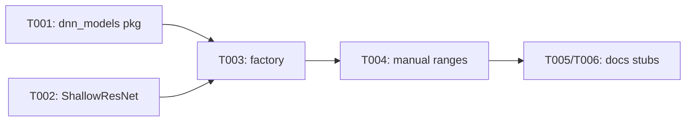

# Implementation Guide: Phase 1 - Setup

**Phase**: 1 | **Feature**: 003-nvtx-ncu-profiling | **Tasks**: T001–T006

## Files

### Created
- `src/llm_perf_opt/dnn_models/__init__.py`
- `src/llm_perf_opt/dnn_models/shallow_resnet.py`
- `src/llm_perf_opt/dnn_models/factory.py`
- `tests/manual/ncu/manual_nvtx_regions.py`
- `conf/model/dummy_shallow_resnet/arch/dummy_shallow_resnet.default.yaml`
- `conf/model/dummy_shallow_resnet/infer/dummy_shallow_resnet.default.yaml`

### Modified
- `docs/running.md` (add NVTX Range Replay stub and dummy model usage)
- `docs/configuration.md` (add NCU CLI Config Mapping stub)

## Public APIs

### T001: Dummy Models Package Scaffold

Provide a simple import surface for dummy models.

```python
# src/llm_perf_opt/dnn_models/__init__.py

from .factory import get_model

__all__ = ["get_model"]
```

### T002: ShallowResNet Dummy Model

A very small CNN suitable for CPU/GPU with NVTX-friendly forward.

```python
# src/llm_perf_opt/dnn_models/shallow_resnet.py
from __future__ import annotations

from dataclasses import dataclass
from typing import Tuple

import torch
import torch.nn as nn
import nvtx


class BasicBlock(nn.Module):
    def __init__(self, channels: int) -> None:
        super().__init__()
        self.conv1 = nn.Conv2d(channels, channels, 3, padding=1)
        self.bn1 = nn.BatchNorm2d(channels)
        self.relu = nn.ReLU(inplace=True)
        self.conv2 = nn.Conv2d(channels, channels, 3, padding=1)
        self.bn2 = nn.BatchNorm2d(channels)

    def forward(self, x: torch.Tensor) -> torch.Tensor:  # noqa: D401
        identity = x
        with nvtx.range("block.conv1"):
            out = self.relu(self.bn1(self.conv1(x)))
        with nvtx.range("block.conv2"):
            out = self.bn2(self.conv2(out))
        return self.relu(out + identity)


class ShallowResNet(nn.Module):
    """A tiny residual CNN for synthetic workload.

    Responsibilities:
    - Provide deterministic, short GPU kernels for profiling
    - Emit NVTX ranges within forward for range-based replay
    """

    def __init__(self, in_ch: int = 3, base: int = 16, num_blocks: int = 3):
        super().__init__()
        self.stem = nn.Sequential(
            nn.Conv2d(in_ch, base, 3, padding=1), nn.BatchNorm2d(base), nn.ReLU(inplace=True)
        )
        self.blocks = nn.Sequential(*[BasicBlock(base) for _ in range(num_blocks)])
        self.head = nn.Sequential(nn.AdaptiveAvgPool2d(1), nn.Flatten(), nn.Linear(base, 10))

    @torch.no_grad()
    def warmup(self, device: torch.device | str = "cpu") -> None:
        x = torch.randn(1, 3, 64, 64, device=device)
        _ = self.forward(x)

    def forward(self, x: torch.Tensor) -> torch.Tensor:  # noqa: D401
        with nvtx.range("stem"):
            x = self.stem(x)
        with nvtx.range("residual"):
            x = self.blocks(x)
        with nvtx.range("head"):
            x = self.head(x)
        return x
```

### T003: Model Factory

```python
# src/llm_perf_opt/dnn_models/factory.py
from __future__ import annotations

from typing import Literal
import torch

from .shallow_resnet import ShallowResNet

ModelName = Literal["dummy_shallow_resnet"]


def get_model(name: ModelName, device: str | None = None) -> torch.nn.Module:
    """Return a dummy model instance by name.

    Args:
        name: One of supported dummy models.
        device: Optional device string, e.g., "cuda:0".

    Returns:
        torch.nn.Module: Instantiated and moved to device if provided.
    """

    if name == "dummy_shallow_resnet":
        m = ShallowResNet()
    else:  # pragma: no cover - explicit error for future extensions
        raise ValueError(f"Unknown dummy model: {name}")
    if device is not None:
        m.to(device)
    return m
```

### T004: Manual Test Scaffold

Manual test to generate three NVTX ranges (A, B, nested A::A1) around model.forward.

```python
# tests/manual/ncu/manual_nvtx_regions.py
from __future__ import annotations

import argparse
import torch
import nvtx

from llm_perf_opt.dnn_models import get_model


def main() -> None:
    ap = argparse.ArgumentParser()
    ap.add_argument("--device", default="cuda:0")
    args = ap.parse_args()
    device = args.device

    model = get_model("dummy_shallow_resnet", device=device)
    x = torch.randn(4, 3, 64, 64, device=device)

    # Range A
    nvtx.push_range("A")
    _ = model(x)
    # Nested A::A1
    nvtx.push_range("A::A1")
    _ = model(x)
    nvtx.pop_range()
    nvtx.pop_range()

    # Range B
    nvtx.push_range("B")
    _ = model(x)
    nvtx.pop_range()


if __name__ == "__main__":
    main()
```

### T005/T006: Docs Stubs

Add placeholders in docs to be filled in Phase 3–5.

```md
# docs/running.md (NVTX Range Replay stub)

NVTX Range Replay (stub)
- Use dummy model configs via Hydra overrides:
  - `model/dummy_shallow_resnet/arch@model=dummy_shallow_resnet.default`
  - `model/dummy_shallow_resnet/infer@infer=dummy_shallow_resnet.default`
- See Phase 3 guide for exact commands.
```

```md
# docs/configuration.md (NCU CLI Config Mapping stub)

NCU CLI Config Mapping (stub)
- `pipeline.ncu.ncu_cli.replay_mode` → `--replay-mode`
- `pipeline.ncu.ncu_cli.nvtx.include` → `--nvtx --nvtx-include`
- `pipeline.ncu.ncu_cli.kernel_name` → `--kernel-name`
- `pipeline.ncu.ncu_cli.kernel_name_base` → `--kernel-name-base`
```

## Phase Integration



## Testing

```bash
# Sanity import
python - <<'PY'
from llm_perf_opt.dnn_models import get_model
m = get_model('dummy_shallow_resnet')
print(type(m).__name__)
PY

# Manual NVTX range generation (no Nsight yet)
python tests/manual/ncu/manual_nvtx_regions.py --device cpu
```

## References
- Spec: `specs/003-nvtx-ncu-profiling/spec.md`
- Tasks: `specs/003-nvtx-ncu-profiling/tasks.md`
- NVTX helpers: `src/llm_perf_opt/profiling/nvtx_utils.py`
