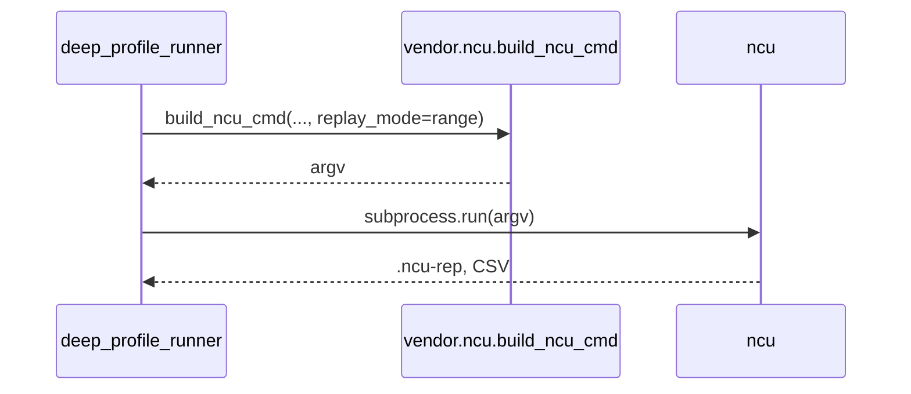

# Implementation Guide: Phase 2 - Foundational

**Phase**: 2 | **Feature**: 003-nvtx-ncu-profiling | **Tasks**: T007–T011

## Files

### Created
- `src/llm_perf_opt/data/ncu_regions.py`

### Modified
- `src/llm_perf_opt/profiling/vendor/ncu.py` (add `replay_mode` → `--replay-mode`)
- `conf/profiling/ncu/ncu.default.yaml` (add `ncu_cli.replay_mode: kernel`)
- `conf/profiling/ncu/ncu.high.yaml` (add `ncu_cli.replay_mode: kernel`)
- `conf/profiling/ncu/ncu.rtx3090.yaml` (add `ncu_cli.replay_mode: kernel`)

## Public APIs

### T007: Data Models for Regions

```python
# src/llm_perf_opt/data/ncu_regions.py
from __future__ import annotations

from typing import Optional
from attrs import define, field


@define(kw_only=True)
class NCUProfileRegion:
    """An NVTX-labeled region profiled by Nsight Compute.

    Attributes
    ----------
    name: Region display name (e.g., 'A', 'A::A1')
    parent: Optional parent region name for nesting
    depth: Nesting depth (0=root)
    process: Process identifier if multi-process
    device: Device identifier (e.g., 'cuda:0')
    """

    name: str
    parent: Optional[str] = None
    depth: int = 0
    process: Optional[str] = None
    device: Optional[str] = None


@define(kw_only=True)
class NCUProfileRegionReport:
    """Aggregated metrics and kernel summaries for a region."""

    region: NCUProfileRegion
    # Basic aggregates (best-effort)
    total_ms: float = 0.0    # inclusive time for region
    kernel_count: int = 0
    # Optional source files produced during export
    sections_path: Optional[str] = None
    csv_path: Optional[str] = None
    markdown_path: Optional[str] = None
    json_path: Optional[str] = None
```

### T008: Extend NCU Builder with Replay Mode

Add an optional `replay_mode: str | None = None` param to `build_ncu_cmd` and map to `--replay-mode` when provided (values: `kernel`, `range`, `app-range`).

```python
# src/llm_perf_opt/profiling/vendor/ncu.py (excerpt)

def build_ncu_cmd(
    out_base: Path,
    work_argv: Sequence[str],
    *,
    nvtx_expr: Optional[str],
    kernel_regex: str | None = None,
    csv_log: Path | None = None,
    use_nvtx: bool = True,
    set_name: str | None = "roofline",
    metrics: Union[str, Sequence[str], None] = None,
    sections: Optional[_Seq[str]] = None,
    target_processes: Optional[str] = "all",
    force_overwrite: bool = False,
    kernel_name_base: str = "demangled",
    replay_mode: str | None = None,  # NEW
) -> list[str]:
    # ...
    if replay_mode:
        cmd += ["--replay-mode", str(replay_mode)]
    # ...
```

### T009–T011: Add Config Default for Replay Mode

Set default to `kernel` (backward-compatible) in all relevant presets.

```yaml
# conf/profiling/ncu/ncu.default.yaml
ncu_cli:
  replay_mode: kernel
```

## Usage Flow



## Pseudocode

```python
# deep_profile_runner (read from cfg)
ncu_cli = cfg.pipeline.ncu.ncu_cli
replay_mode = getattr(ncu_cli, "replay_mode", "kernel")

ncu_cmd = build_ncu_cmd(
    out_base=ncu_out,
    work_argv=work,
    nvtx_expr=nvtx_expr,
    # ...
    replay_mode=replay_mode,
)
subprocess.run(ncu_cmd, check=False)
```

## Testing

```bash
# Validate config defaults (visual)
rg -n "replay_mode" conf/profiling/ncu

# Smoke-run NCU builder (dry)
python - <<'PY'
from pathlib import Path
from llm_perf_opt.profiling.vendor.ncu import build_ncu_cmd
print(build_ncu_cmd(Path('out'), ['echo','hi'], nvtx_expr=None, replay_mode='range'))
PY
```

## References
- Spec: `specs/003-nvtx-ncu-profiling/spec.md`
- Tasks: `specs/003-nvtx-ncu-profiling/tasks.md`
