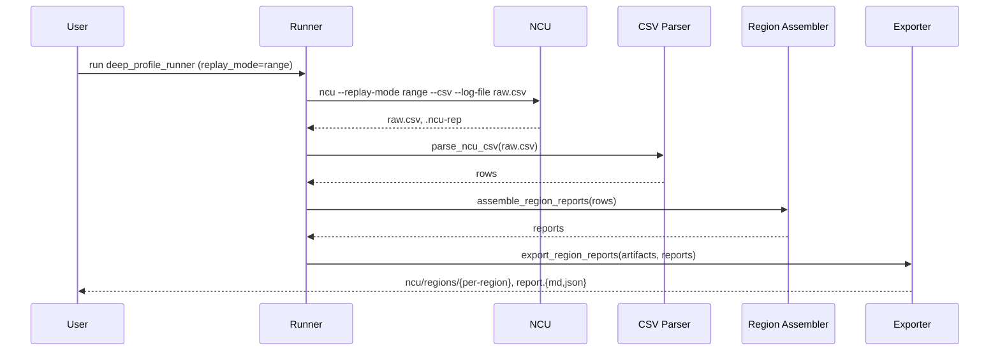

# Implementation Guide: Phase 3 - User Story 1

**Phase**: 3 | **Feature**: 003-nvtx-ncu-profiling | **Tasks**: T012–T017

## Files

### Created
- `src/llm_perf_opt/profiling/regions.py`
- `src/llm_perf_opt/profiling/export_regions.py`

### Modified
- `src/llm_perf_opt/runners/deep_profile_runner.py` (add NVTX range replay flow, per-region outputs)
- `src/llm_perf_opt/profiling/artifacts.py` (add filesystem-safe region path helper)
- `docs/running.md` (update examples for NVTX range replay)

## Public APIs

### T012: NVTX Range Replay and Per-Region Outputs in Runner

Add replay handling in the Stage 2 runner. When `replay_mode in {"range", "app-range"}` and NVTX gating is enabled, run NCU, parse CSV, and organize artifacts under `ncu/regions/<region>/` with a consolidated report under `ncu/regions/`.

```python
# src/llm_perf_opt/runners/deep_profile_runner.py (excerpt)
from llm_perf_opt.profiling.regions import assemble_region_reports
from llm_perf_opt.profiling.export_regions import export_region_reports
from llm_perf_opt.profiling.artifacts import sanitized_region_dir

# ... read cfg.pipeline.ncu.ncu_cli.replay_mode into `replay_mode`

ncu_cmd = build_ncu_cmd(
    ncu_out,
    work,
    nvtx_expr=nvtx_expr,
    # ...
    replay_mode=replay_mode,
)
subprocess.run(ncu_cmd, check=False)

# If replay by range/app-range, parse CSV and write per-region outputs
if replay_mode in {"range", "app-range"}:
    rows = parse_ncu_csv(csv_log)
    reports = assemble_region_reports(rows, device=device_sel)
    export_region_reports(artifacts, reports)
```

### T013: Region Assembler

Convert NCU CSV rows into `NCUProfileRegionReport` entries by grouping on best-effort NVTX range columns.

```python
# src/llm_perf_opt/profiling/regions.py
from __future__ import annotations

from typing import Iterable, List
from collections import defaultdict

from llm_perf_opt.data.ncu_regions import NCUProfileRegion, NCUProfileRegionReport


def _range_key(row: dict) -> str:
    # Best-effort column discovery across NCU versions
    for k in ("NVTX Range Name", "Range Name", "NVTX Range", "Range"):
        v = row.get(k)
        if v:
            return str(v)
    return "(unlabeled)"


def assemble_region_reports(rows: Iterable[dict], *, device: str = "cuda:0") -> List[NCUProfileRegionReport]:
    buckets: dict[str, list[dict]] = defaultdict(list)
    for r in rows:
        buckets[_range_key(r)].append(r)

    out: List[NCUProfileRegionReport] = []
    for name, group in buckets.items():
        total_ms = 0.0
        kernel_count = 0
        for r in group:
            # Infer totals
            try:
                total_ms += float(str(r.get("gpu__time_duration.sum", r.get("Total Time", 0))).replace(",", ""))
            except Exception:
                pass
            try:
                kernel_count += int(float(str(r.get("Calls", r.get("Invocations", 1))).replace(",", "")))
            except Exception:
                kernel_count += 1
        region = NCUProfileRegion(name=name, device=device)
        out.append(NCUProfileRegionReport(region=region, total_ms=max(total_ms, 0.0), kernel_count=max(kernel_count, 0)))
    return out
```

### T014: Region Report Exporters (Markdown + JSON)

```python
# src/llm_perf_opt/profiling/export_regions.py
from __future__ import annotations

import json
from pathlib import Path
from typing import Iterable, List

from llm_perf_opt.profiling.artifacts import sanitized_region_dir
from llm_perf_opt.data.ncu_regions import NCUProfileRegionReport


def export_region_reports(artifacts, reports: Iterable[NCUProfileRegionReport]) -> List[Path]:
    base = artifacts.out_dir("ncu") / "regions"
    base.mkdir(parents=True, exist_ok=True)
    index_md = base / "report.md"
    index_json = base / "report.json"

    # Write consolidated JSON
    payload = [
        {
            "name": r.region.name,
            "total_ms": r.total_ms,
            "kernel_count": r.kernel_count,
        }
        for r in reports
    ]
    index_json.write_text(json.dumps(payload, indent=2), encoding="utf-8")

    # Write consolidated Markdown
    lines = ["# NCU Region Reports", "", "| Region | Total ms | Kernels |", "|---|---:|---:|"]
    for r in reports:
        lines.append(f"| {r.region.name} | {r.total_ms:.3f} | {r.kernel_count} |")
    index_md.write_text("\n".join(lines) + "\n", encoding="utf-8")

    # Optionally, create per-region dirs (future: place section extracts there)
    for r in reports:
        sanitized_region_dir(artifacts, r.region.name)
    return [index_md, index_json]
```

### T015: Filesystem-safe Region Path Helper

```python
# src/llm_perf_opt/profiling/artifacts.py (new helper)
import re

def sanitized_region_dir(artifacts: Artifacts, name: str) -> Path:
    safe = re.sub(r"[^A-Za-z0-9_.-]+", "_", name)[:80]
    p = artifacts.out_dir("ncu") / "regions" / safe
    p.mkdir(parents=True, exist_ok=True)
    return p
```

### T016: Manual Test (3 ranges)

Use the Phase 1 script `tests/manual/ncu/manual_nvtx_regions.py` with the dummy model Hydra overrides.

### T017: Docs Update

Add runnable example to `docs/running.md`:

```bash
pixi run -e rtx5090 python -m llm_perf_opt.runners.deep_profile_runner \
  model/dummy_shallow_resnet/arch@model=dummy_shallow_resnet.default \
  model/dummy_shallow_resnet/infer@infer=dummy_shallow_resnet.default \
  pipeline.ncu.enable=true pipeline.nsys.enable=false \
  pipeline.ncu.ncu_cli.replay_mode=range \
  pipeline.ncu.ncu_cli.nvtx.include='*' \
  device=cuda:0
```

## Usage Flow



## Pseudocode

```python
rows = parse_ncu_csv(csv_log)
reports = assemble_region_reports(rows, device=device_sel)
paths = export_region_reports(artifacts, reports)
```

## Testing

```bash
# Run with dummy model + range replay
pixi run -e rtx5090 python -m llm_perf_opt.runners.deep_profile_runner \
  model/dummy_shallow_resnet/arch@model=dummy_shallow_resnet.default \
  model/dummy_shallow_resnet/infer@infer=dummy_shallow_resnet.default \
  pipeline.ncu.enable=true pipeline.ncu.ncu_cli.replay_mode=range \
  device=cuda:0

# Verify artifacts
ls tmp/profile-output/*/ncu/regions
sed -n '1,60p' tmp/profile-output/*/ncu/regions/report.md
```

## References
- Spec: `specs/003-nvtx-ncu-profiling/spec.md`
- Tasks: `specs/003-nvtx-ncu-profiling/tasks.md`
