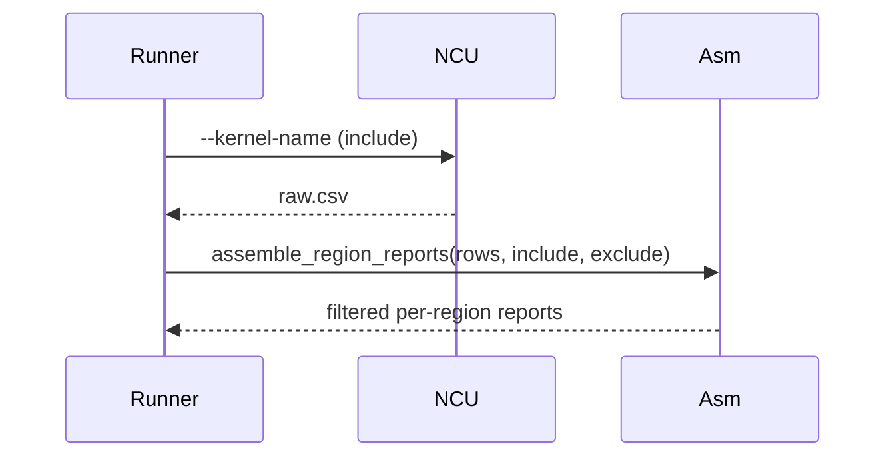

# Implementation Guide: Phase 4 - User Story 2

**Phase**: 4 | **Feature**: 003-nvtx-ncu-profiling | **Tasks**: T018–T022

## Files

### Modified
- `src/llm_perf_opt/runners/deep_profile_runner.py` (read kernel filters, pass to NCU)
- `src/llm_perf_opt/profiling/regions.py` (apply include/exclude to per-region kernel lists)
- `conf/profiling/ncu/ncu.default.yaml` (add optional `ncu_cli.kernel_exclude` placeholders)
- `conf/profiling/ncu/ncu.high.yaml` (add optional `ncu_cli.kernel_exclude` placeholders)
- `docs/configuration.md` (kernel filter examples)

## Public APIs

### T018: Runner Pass-through for Kernel Filters

```python
# src/llm_perf_opt/runners/deep_profile_runner.py (excerpt)
ncu_cli = getattr(ncu_cfg, "ncu_cli", {})
kernel_name = getattr(ncu_cli, "kernel_name", None)
kernel_name_base = str(getattr(ncu_cli, "kernel_name_base", "demangled"))

ncu_cmd = build_ncu_cmd(
    # ...
    kernel_regex=kernel_name,  # The CLI supports exact or regex: prefix
    kernel_name_base=kernel_name_base,
)
```

### T019: Config Placeholders for Exclude Rules

```yaml
# conf/profiling/ncu/ncu.default.yaml
ncu_cli:
  # Optional kernel exclusions (runner filters after import)
  # kernel_exclude:
  #   - regex:memcpy.*
  #   - regex:memset.*
```

### T020: Apply Include/Exclude Selection in Region Assembly

Extend the assembler to accept optional include/exclude patterns applied to kernel name fields within each region.

```python
# src/llm_perf_opt/profiling/regions.py (excerpt)
import re
from typing import Sequence

def _match(name: str, pat: str) -> bool:
    if pat.startswith("regex:"):
        return bool(re.search(pat.split(":",1)[1], name))
    return name == pat

def filter_rows(rows: list[dict], include: Sequence[str] | None, exclude: Sequence[str] | None) -> list[dict]:
    def get_name(r: dict) -> str:
        return r.get("Kernel Name") or r.get("Name") or ""
    out = []
    for r in rows:
        nm = get_name(r)
        if include and not any(_match(nm, p) for p in include):
            continue
        if exclude and any(_match(nm, p) for p in exclude):
            continue
        out.append(r)
    return out

def assemble_region_reports(rows: Iterable[dict], *, device: str = "cuda:0", include: Sequence[str] | None = None, exclude: Sequence[str] | None = None) -> List[NCUProfileRegionReport]:
    # ... per-region bucketization as before
    for name, group in buckets.items():
        group = filter_rows(group, include, exclude)
        # compute aggregates
```

### T021: Manual Test Extension

Add a kernel regex (e.g., `regex:.*conv.*`) to the manual script invocation and verify that only matching kernels appear in per-region listings and counts.

### T022: Documentation Examples

Update `docs/configuration.md` with examples:

```md
- Exact match: `pipeline.ncu.ncu_cli.kernel_name=my_kernel`
- Regex match: `pipeline.ncu.ncu_cli.kernel_name=regex:my_.*`
- Exclusions (applied in post-processing):
  - `pipeline.ncu.ncu_cli.kernel_exclude=[regex:memcpy.*, regex:memset.*]`
```

## Usage Flow



## Testing

```bash
pixi run -e rtx5090 python -m llm_perf_opt.runners.deep_profile_runner \
  model/dummy_shallow_resnet/arch@model=dummy_shallow_resnet.default \
  model/dummy_shallow_resnet/infer@infer=dummy_shallow_resnet.default \
  pipeline.ncu.enable=true pipeline.ncu.ncu_cli.replay_mode=range \
  pipeline.ncu.ncu_cli.kernel_name='regex:.*conv.*'
```

## References
- Spec: `specs/003-nvtx-ncu-profiling/spec.md`
- Tasks: `specs/003-nvtx-ncu-profiling/tasks.md`
