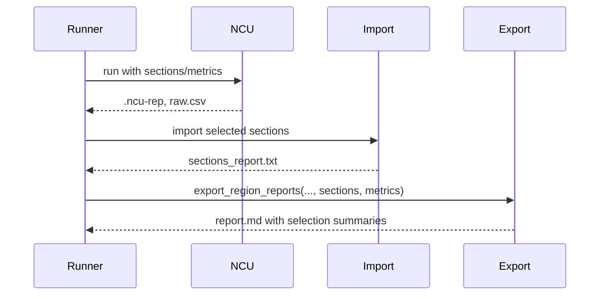

# Implementation Guide: Phase 5 - User Story 3

**Phase**: 5 | **Feature**: 003-nvtx-ncu-profiling | **Tasks**: T023–T026

## Files

### Modified
- `src/llm_perf_opt/runners/deep_profile_runner.py` (ensure sections/metrics propagate for range flows; import per-region sections)
- `conf/profiling/ncu/ncu.default.yaml` (sample sections/metrics for region runs)
- `src/llm_perf_opt/profiling/export_regions.py` (include selected sections/metrics summaries in Markdown)
- `docs/configuration.md` (document overrides and replay interactions)

## Public APIs

### T023: Ensure Sections/Metrics Apply in Replay Flows

```python
# src/llm_perf_opt/runners/deep_profile_runner.py (excerpt)
ncu_sections = list(getattr(ncu_cli, "sections", []) or [])
ncu_metrics = getattr(ncu_cli, "metrics", None)

ncu_cmd = build_ncu_cmd(
    # ... existing args ...
    sections=ncu_sections,
    metrics=ncu_metrics,
)

# After run, if sections were requested and rep exists, import selected sections
if ncu_sections:
    ncu_rep = Path(str(ncu_out) + ".ncu-rep")
    if ncu_rep.exists():
        sec_cmd = build_ncu_import_sections_cmd(ncu_rep, ncu_sections, page="raw")
        with open(artifacts.path("ncu/sections_report.txt"), "w", encoding="utf-8") as sf:
            subprocess.run(sec_cmd, check=False, stdout=sf, stderr=subprocess.STDOUT)
```

### T024: Sample Sections/Metrics in Preset

Add or confirm examples already present; ensure they are documented as applicable to range flows.

```yaml
# conf/profiling/ncu/ncu.default.yaml
ncu_cli:
  sections:
    - SpeedOfLight
    - MemoryWorkloadAnalysis
    - Occupancy
  metrics:
    - gpu__time_duration.sum
    - sm__throughput.avg.pct_of_peak_sustained_elapsed
    - dram__throughput.avg.pct_of_peak_sustained_elapsed
```

### T025: Include Selection Summaries in Markdown

```python
# src/llm_perf_opt/profiling/export_regions.py (excerpt)
def export_region_reports(artifacts, reports: Iterable[NCUProfileRegionReport], *, sections: list[str] | None = None, metrics: list[str] | None = None) -> List[Path]:
    # ... write index_json as before ...
    lines = ["# NCU Region Reports", ""]
    if sections:
        lines += ["## Selected Sections", "", "- " + "\n- ".join(sections), ""]
    if metrics:
        lines += ["## Selected Metrics", "", "- " + "\n- ".join(metrics), ""]
    lines += ["## Summary", "", "| Region | Total ms | Kernels |", "|---|---:|---:|"]
    # ... rest unchanged ...
```

### T026: Documentation

Document override patterns and replay interactions in `docs/configuration.md`:

```md
- Sections-only collection reduces driver overhead; combine with `replay_mode=range` to scope per-region summaries
- Metrics and sections are mutually independent; specifying both increases profiling cost
- Example:
  `pipeline.ncu.ncu_cli.sections=[SpeedOfLight,Occupancy] pipeline.ncu.ncu_cli.replay_mode=range`
```

## Usage Flow



## Testing

```bash
pixi run -e rtx5090 python -m llm_perf_opt.runners.deep_profile_runner \
  model/dummy_shallow_resnet/arch@model=dummy_shallow_resnet.default \
  model/dummy_shallow_resnet/infer@infer=dummy_shallow_resnet.default \
  pipeline.ncu.enable=true pipeline.ncu.ncu_cli.replay_mode=range \
  pipeline.ncu.ncu_cli.sections='[SpeedOfLight,Occupancy]'

sed -n '1,120p' tmp/profile-output/*/ncu/regions/report.md
```

## References
- Spec: `specs/003-nvtx-ncu-profiling/spec.md`
- Tasks: `specs/003-nvtx-ncu-profiling/tasks.md`
