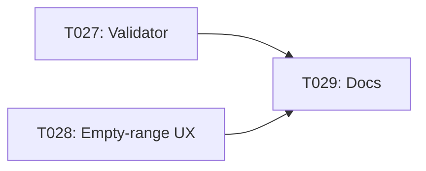

# Implementation Guide: Phase N - Polish & Cross-Cutting

**Phase**: N | **Feature**: 003-nvtx-ncu-profiling | **Tasks**: T027–T029

## Files

### Created
- `scripts/ncu/validate_regions_json.py`

### Modified
- `src/llm_perf_opt/runners/deep_profile_runner.py` (improve empty-range handling)
- `docs/internals.md` (nesting semantics and artifact layout)

## Public APIs

### T027: JSON Schema Validator

```python
# scripts/ncu/validate_regions_json.py
from __future__ import annotations

import json
import argparse
from pathlib import Path

try:
    import jsonschema  # type: ignore
except Exception:  # pragma: no cover - optional dep
    jsonschema = None


def main() -> int:
    ap = argparse.ArgumentParser()
    ap.add_argument("--schema", default="specs/003-nvtx-ncu-profiling/contracts/openapi.yaml")
    ap.add_argument("json_path")
    args = ap.parse_args()
    if jsonschema is None:
        print("jsonschema not installed; skipping validation (OK for dev)")
        return 0
    data = json.loads(Path(args.json_path).read_text(encoding="utf-8"))
    # TODO: load schema from OpenAPI or a distilled JSON Schema
    # jsonschema.validate(instance=data, schema=schema)
    print("Validation stub passed (implement schema loading)")
    return 0


if __name__ == "__main__":
    raise SystemExit(main())
```

### T028: Empty-range Handling

Detect no matching regions and emit a helpful message to `ncu/regions/report.md`.

```python
# src/llm_perf_opt/runners/deep_profile_runner.py (excerpt)
reports = assemble_region_reports(rows, device=device_sel)
if not reports:
    (artifacts.out_dir("ncu") / "regions" / "report.md").write_text(
        "# NCU Region Reports\n\nNo matching NVTX ranges were captured.\n\n" \
        "Hints: set pipeline.ncu.ncu_cli.nvtx.include, ensure ranges exist, or fallback to --replay-mode kernel.\n",
        encoding="utf-8",
    )
    return
```

### T029: Docs

Document:
- Inclusive nesting semantics (parent totals include child activity)
- Artifact layout under `ncu/regions/<sanitized_name>/`

## Usage Flow



## Testing

```bash
# Validate JSON (stub)
python scripts/ncu/validate_regions_json.py tmp/profile-output/<run>/ncu/regions/report.json

# Trigger empty ranges (no NVTX include)
pixi run -e rtx5090 python -m llm_perf_opt.runners.deep_profile_runner \
  model/dummy_shallow_resnet/arch@model=dummy_shallow_resnet.default \
  model/dummy_shallow_resnet/infer@infer=dummy_shallow_resnet.default \
  pipeline.ncu.enable=true pipeline.ncu.ncu_cli.replay_mode=range \
  pipeline.ncu.ncu_cli.nvtx.include=''
```

## References
- Spec: `specs/003-nvtx-ncu-profiling/spec.md`
- Tasks: `specs/003-nvtx-ncu-profiling/tasks.md`
