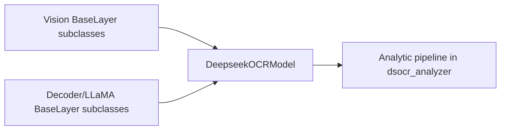
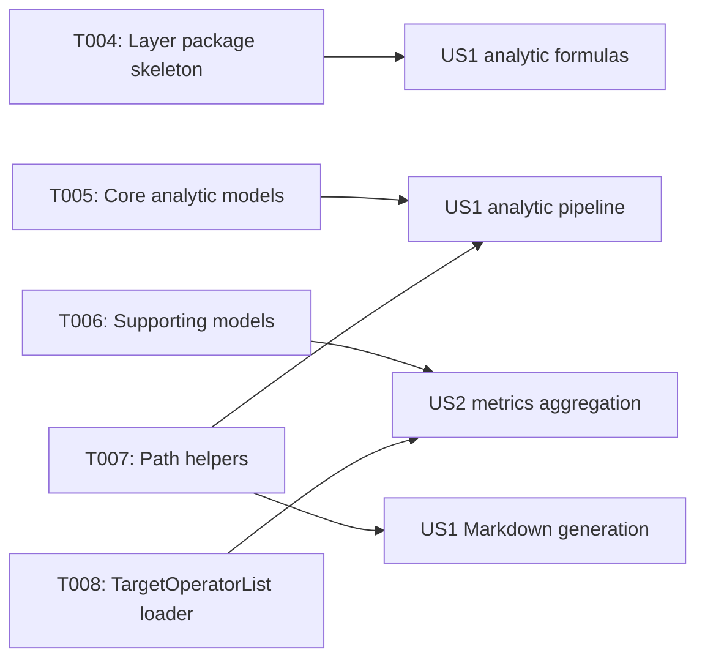

# Implementation Guide: Phase 2 – Foundational (Blocking Prerequisites)

**Phase**: 2 | **Feature**: DeepSeek-OCR Analytic Modeling in ModelMeter (`001-deepseek-ocr-modelmeter`) | **Tasks**: T004–T008

## Goal

Define the core analytic data models, package structure, and helpers required to implement, run, and serialize DeepSeek-OCR analytic models. This phase produces the `attrs` data structures, ModelMeter layer package skeletons, and path/operator-list utilities used by all user stories.

## Public APIs

### T004: DeepSeek-OCR analytic layer package skeleton

Create the hierarchical package under `extern/modelmeter/models/deepseek_ocr/layers/` reflecting the TorchInfo module hierarchy and `BaseLayer` subclass stubs.

```python
# extern/modelmeter/models/deepseek_ocr/layers/core/deepseek_ocr_model.py

from __future__ import annotations

from extern.modelmeter.layers.base import BaseLayer


class DeepseekOCRModel(BaseLayer):
    """Analytic root for DeepSeek-OCR.

    Responsibilities:
    - Aggregate FLOPs/IO/memory metrics across vision, decoder, and LLaMA submodules.
    - Provide a single entry point for model-level analytic estimates.
    """

    def __init__(self, *, vision_layer: BaseLayer, decoder_layer: BaseLayer) -> None:
        super().__init__()
        self.m_vision_layer = vision_layer
        self.m_decoder_layer = decoder_layer

    def forward_tensor_core_flops(self) -> float:
        return (
            (self.m_vision_layer.forward_tensor_core_flops() or 0.0)
            + (self.m_decoder_layer.forward_tensor_core_flops() or 0.0)
        )

    # Other BaseLayer methods follow a similar aggregation pattern.
```

**Usage Flow**:



### T005/T006: Core analytic domain models in `src/llm_perf_opt/data/deepseek_ocr_analytic.py`

Implement the entities defined in `data-model.md` as `attrs` models.

```python
# src/llm_perf_opt/data/deepseek_ocr_analytic.py

from __future__ import annotations
from typing import Literal
from attrs import define, field
from attrs.validators import instance_of


@define(kw_only=True)
class DeepSeekOCRModelSpec:
    """Model specification for DeepSeek-OCR analytic reports."""

    model_id: str = field(validator=[instance_of(str)])
    model_variant: str = field(validator=[instance_of(str)])
    hf_revision: str | None = field(default=None)
    config_path: str = field(validator=[instance_of(str)])
    hidden_size: int = field(validator=[instance_of(int)])
    intermediate_size: int = field(validator=[instance_of(int)])
    num_layers: int = field(validator=[instance_of(int)])
    num_attention_heads: int = field(validator=[instance_of(int)])
    vision_backbone: Literal["sam_vit_b", "clip_vit_l", "other"] = field(validator=[instance_of(str)])
    uses_moe: bool = field(validator=[instance_of(bool)])
    notes: str = field(default="")


@define(kw_only=True)
class OCRWorkloadProfile:
    """Synthetic workload profile (e.g., dsocr-standard-v1)."""

    profile_id: str = field(validator=[instance_of(str)])
    description: str = field(validator=[instance_of(str)])
    seq_len: int = field(validator=[instance_of(int)])
    base_size: int = field(validator=[instance_of(int)])
    image_size: int = field(validator=[instance_of(int)])
    crop_mode: bool = field(validator=[instance_of(bool)])
    max_new_tokens: int = field(validator=[instance_of(int)])
    doc_kind: Literal["text_heavy", "mixed_layout", "image_rich", "synthetic"] = field(
        validator=[instance_of(str)]
    )
    num_pages: int = field(validator=[instance_of(int)])
```

Expose these models via `src/llm_perf_opt/data/__init__.py` so other modules can import them.

### T007: Analytic artifact path helpers in `src/llm_perf_opt/utils/paths.py`

Add helpers that construct absolute paths for analytic artifacts based on a run ID.

```python
# src/llm_perf_opt/utils/paths.py

import os


def analytic_model_dir(run_id: str) -> str:
    """Return directory for analytic artifacts for a given run."""

    from llm_perf_opt.utils.paths import workspace_root  # if already exists

    root = workspace_root()
    return os.path.join(root, "tmp", "profile-output", run_id, "static_analysis", "analytic_model")


def analytic_layer_docs_dir(run_id: str) -> str:
    """Return directory for per-layer Markdown docs."""

    return os.path.join(analytic_model_dir(run_id), "layers")
```

### T008: Load `TargetOperatorList` from TorchInfo artifacts

Provide a parser for TorchInfo outputs.

```python
# src/llm_perf_opt/utils/dsocr_callgraph_parse.py

from __future__ import annotations
import json
from pathlib import Path
from llm_perf_opt.data.deepseek_ocr_analytic import TargetOperatorList, OperatorSpec


def load_target_operator_list(artifact_dir: str) -> TargetOperatorList:
    """Load TorchInfo operator snapshot into a TargetOperatorList."""

    base = Path(artifact_dir)
    layers_json = base / "torchinfo-unique-layers.json"
    with layers_json.open("r", encoding="utf-8") as f:
        data = json.load(f)

    operators = [
        OperatorSpec(
            class_name=entry["class_name"],
            class_name_qualified=entry["class_name_qualified"],
            is_pytorch_builtin=entry["is_torch_builtin"],
            is_custom=not entry["is_torch_builtin"],
            children_classes=entry.get("children", []),
            default_category_id="",
        )
        for entry in data["layers"]
    ]

    return TargetOperatorList(
        snapshot_id=data["generated_at"],
        source_artifact_dir=str(base.resolve()),
        layers_md_path=str((base / "torchinfo-unique-layers.md").resolve()),
        layers_json_path=str(layers_json.resolve()),
        stages_json_path=str((base / "torchinfo-stages.json").resolve()),
        operators=operators,
    )
```

---

## Phase Integration



Phase 2 produces the building blocks used by the analytic runner and exporters in later phases.

---

## Testing

### Test Input

- TorchInfo artifacts under `reports/20211117-dsorc-op-analysis/static-20251118-130533/`.
- Python environment from Phase 1.

### Test Procedure

```bash
cd /workspace/code/llm-perf-opt

# 1. Import domain models
pixi run -e rtx5090 python -c "from llm_perf_opt.data.deepseek_ocr_analytic import DeepSeekOCRModelSpec, AnalyticModelReport"

# 2. Import path helpers
pixi run -e rtx5090 python -c "from llm_perf_opt.utils.paths import analytic_model_dir; print(analytic_model_dir('test-run'))"

# 3. Load TargetOperatorList
pixi run -e rtx5090 python - << 'EOF'
from llm_perf_opt.utils.dsocr_callgraph_parse import load_target_operator_list
tol = load_target_operator_list('reports/20211117-dsorc-op-analysis/static-20251118-130533')
print(len(tol.operators))
EOF
```

### Test Output

- Imports succeed without raising exceptions.
- Path helpers return absolute paths under `tmp/profile-output/<run_id>/static_analysis/analytic_model/`.
- `load_target_operator_list` loads a non-zero number of `OperatorSpec` instances.

---

## References

- Spec: `specs/001-deepseek-ocr-modelmeter/spec.md`
- Data model: `specs/001-deepseek-ocr-modelmeter/data-model.md`
- Contracts: `specs/001-deepseek-ocr-modelmeter/contracts/`

---

## Implementation Summary

### What has been implemented

- Added DeepSeek-OCR analytic domain models in `src/llm_perf_opt/data/deepseek_ocr_analytic.py`, including:
  - Core entities: `DeepSeekOCRModelSpec`, `OCRWorkloadProfile`, `AnalyticModelReport`.
  - Supporting entities: `AnalyticModuleNode`, `OperatorCategory`, `ModuleMetricsSnapshot`, `OperatorMetrics`,
    `TargetOperatorList`, `OperatorSpec`.
  - Validators for absolute path fields (`config_path`, TorchInfo artifact paths, `layer_docs_dir`) and non-negative
    numeric metrics (FLOPs, I/O, memory, counts, shares).
- Updated `src/llm_perf_opt/data/__init__.py` to re-export existing Stage 1 profiling models from `models.py` and to
  export all DeepSeek-OCR analytic data models so downstream code can import from `llm_perf_opt.data`.
- Created the DeepSeek-OCR analytic layer package skeleton under `extern/modelmeter/models/deepseek_ocr/layers/`:
  - `__init__.py` exposing `DeepseekOCRModel`.
  - `core/` with `deepseek_ocr_model.py` implementing `DeepseekOCRModel(BaseLayer)` that aggregates
    `forward_tensor_core_flops` from injected `vision_layer` and `decoder_layer`.
  - `vision/` with stub `BaseLayer` subclasses:
    `Attention`, `Block`, `CLIPVisionEmbeddings`, `ImageEncoderViT`, `LayerNorm2d`, `MLPBlock`, `MlpProjector`,
    `NoTPAttention`, `NoTPFeedForward`, `NoTPTransformer`, `NoTPTransformerBlock`, `PatchEmbed`, `VitModel`.
  - `decoder/` with stub `BaseLayer` subclasses:
    `DeepseekV2DecoderLayer`, `DeepseekV2MLP`, `DeepseekV2MoE`, `DeepseekV2RMSNorm`, `MoEGate`.
  - `llama/` with stub `BaseLayer` subclasses:
    `LlamaFlashAttention2`, `LlamaRotaryEmbedding`.
- Extended `src/llm_perf_opt/utils/paths.py` with:
  - `workspace_root()` to locate the workspace by walking up from `paths.py` until `pyproject.toml` or `.git` is found.
  - `analytic_model_dir(run_id)` to return an absolute path under
    `tmp/profile-output/<run_id>/static_analysis/analytic_model`.
  - `analytic_layer_docs_dir(run_id)` to return the corresponding `layers/` subdirectory for Markdown docs.
- Extended `src/llm_perf_opt/utils/dsocr_callgraph_parse.py` with:
  - Imports of `OperatorSpec` and `TargetOperatorList` from `llm_perf_opt.data.deepseek_ocr_analytic`.
  - `load_target_operator_list(artifact_dir)` that:
    - Resolves `artifact_dir` and TorchInfo files (`torchinfo-unique-layers.{json,md}`, `torchinfo-stages.json`) to
      absolute paths.
    - Parses `torchinfo-unique-layers.json` into a list of `OperatorSpec` instances.
    - Returns a populated `TargetOperatorList` with `snapshot_id`, artifact paths, and operator list.
- Updated `specs/001-deepseek-ocr-modelmeter/tasks.md` Phase 2 entries T004–T008 to `[X]` now that the layer package
  skeleton, domain models, path helpers, and TorchInfo loader are implemented.

### How to verify

- From the workspace root (`/workspace/code/llm-perf-opt`), run the Phase 2 smoke tests:

  ```bash
  # 1. Import domain models
  pixi run -e rtx5090 python -c "from llm_perf_opt.data.deepseek_ocr_analytic import DeepSeekOCRModelSpec, AnalyticModelReport"

  # 2. Import path helpers and confirm absolute analytic model path
  pixi run -e rtx5090 python -c "from llm_perf_opt.utils.paths import analytic_model_dir; print(analytic_model_dir('test-run'))"

  # 3. Load TargetOperatorList from TorchInfo artifacts
  pixi run -e rtx5090 python - << 'EOF'
  from llm_perf_opt.utils.dsocr_callgraph_parse import load_target_operator_list
  tol = load_target_operator_list('reports/20211117-dsorc-op-analysis/static-20251118-130533')
  print(f"snapshot_id={tol.snapshot_id}")
  print(f"num_operators={len(tol.operators)}")
  print(tol.layers_json_path)
  EOF
  ```

- Expected outcomes:
  - Step 1: Imports succeed without raising exceptions.
  - Step 2: `analytic_model_dir('test-run')` prints an absolute path of the form
    `/workspace/code/llm-perf-opt/tmp/profile-output/test-run/static_analysis/analytic_model`.
  - Step 3: `load_target_operator_list` succeeds, `snapshot_id` matches the `generated_at` field in
    `torchinfo-unique-layers.json`, `num_operators` equals `num_unique_layers` (currently 29), and
    `layers_json_path` is an absolute path into the `reports/20211117-dsorc-op-analysis/static-20251118-130533/`
    directory.

- Optional: run the existing unit tests to ensure Phase 2 changes do not break Stage 1/2 profiling flows:

  ```bash
  pixi run -e rtx5090 pytest tests/unit -q
  ```

