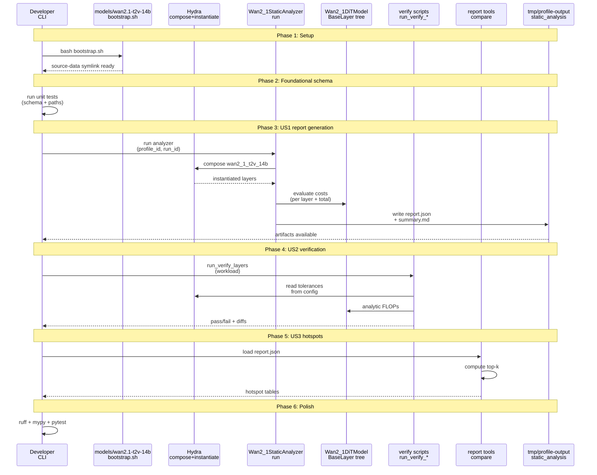
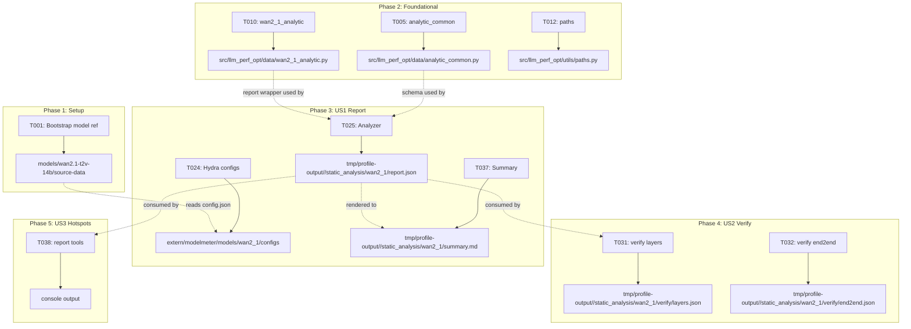
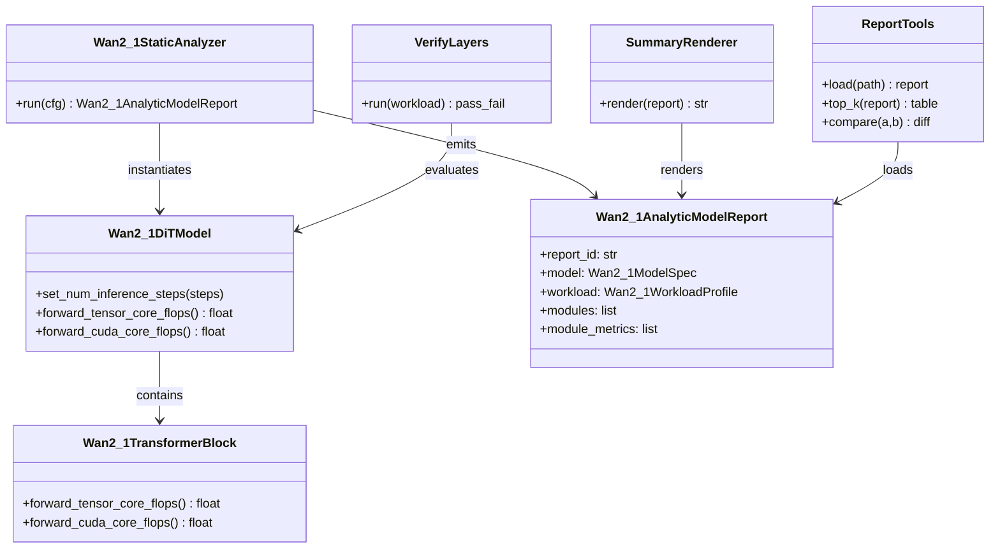
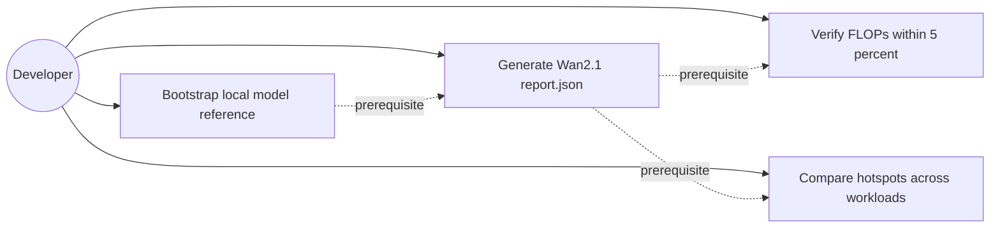
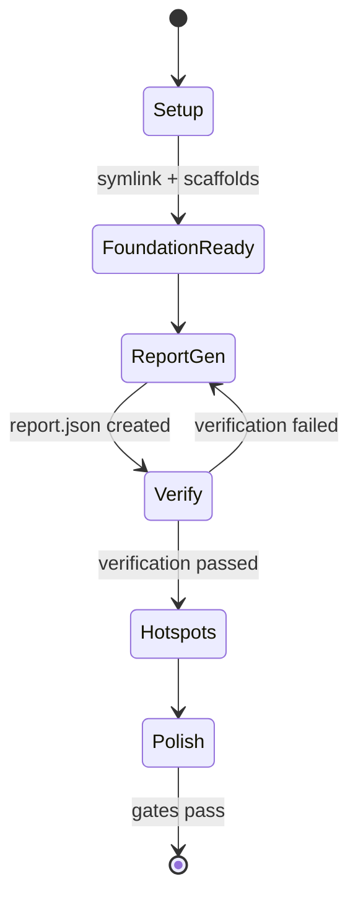

# Phase Integration Guide: Wan2.1 Analytic FLOP Model

**Feature**: `004-wan2-1-analytic-model` | **Phases**: 6

## Overview

This feature delivers a ModelMeter-style analytic model for Wan2.1-T2V-14B and a static-analysis workflow that emits a structured `report.json`, optional `summary.md`, and verification outputs under `tmp/profile-output/<run_id>/static_analysis/wan2_1/`.
The phases build incrementally: Phase 1 prepares the local model metadata reference, Phase 2 standardizes report schema and compatibility, Phase 3 implements report generation (MVP), Phase 4 enforces FLOP accuracy gates, Phase 5 adds hotspot tooling, and Phase 6 hardens documentation and repo-wide quality gates.

## Phase Flow

**MUST HAVE: End-to-End Sequence Diagram**



## Artifact Flow Between Phases



## System Architecture



## Use Cases



## Activity Flow



## Inter-Phase Dependencies

### Phase 1 → Phase 2

**Artifacts**:
- `models/wan2.1-t2v-14b/source-data/` provides local model metadata for later configs and report “model spec” fields.

**Code Dependencies**:
- None (Phase 2 is pure-Python schema and path helpers).

### Phase 2 → Phase 3

**Artifacts**:
- Shared schema types from `src/llm_perf_opt/data/analytic_common.py` are required for the Wan analyzer to build `report.json`.
- Path helpers from `src/llm_perf_opt/utils/paths.py` are required for consistent output layout.

**Code Dependencies**:

```python
from llm_perf_opt.data.wan2_1_analytic import Wan2_1AnalyticModelReport
from llm_perf_opt.utils.paths import wan2_1_report_path


def write_report(report: Wan2_1AnalyticModelReport) -> None:
    out_path = wan2_1_report_path(report.report_id)
    ...
```

### Phase 3 → Phase 4

**Artifacts**:
- `tmp/profile-output/<run_id>/static_analysis/wan2_1/report.json` is the shared input to verification and hotspot tooling.

**Code Dependencies**:
- Verification scripts import the analytic model package (`modelmeter.models.wan2_1`) and must use the same geometry and FLOP conventions as the analyzer.

### Phase 3 → Phase 5

**Artifacts**:
- `report.json` is the input to summary rendering and report comparison tools.

**Code Dependencies**:
- Hotspot tooling depends on the shared schema invariants (stable module ids and consistent metric semantics).

## Integration Testing

```bash
# Phase 2: schema and path helper tests
pixi run pytest tests/unit/data/test_analytic_common.py
pixi run pytest tests/unit/utils/test_paths_wan2_1.py

# Phase 3: report generation (may skip if local model reference unavailable)
pixi run pytest tests/integration/wan2_1/test_wan2_1_analyzer_report.py

# Phase 4: verification (may skip if local reference unavailable)
pixi run pytest tests/integration/wan2_1/test_verify_layers_ci_tiny.py
```

## Critical Integration Points

1. Phase 1 bootstrap correctness: `models/wan2.1-t2v-14b/source-data/config.json` must be readable or analyzer/verification must fail with an actionable message.
2. Stable module ids: transformer blocks and key subcomponents must have deterministic ids so layer-by-layer verification and hotspot comparisons are meaningful across runs.
3. FLOP counting convention alignment: verification comparisons must use the same convention as the chosen reference measurement (`torch.utils.flop_counter.FlopCounterMode`), and any intentional omissions must be explicit and controlled (for example via a “torch-visible” mode flag).
4. Step scaling semantics: total FLOPs scale with `num_inference_steps`, while reported weight/activation memory must not scale with steps.
5. Output layout invariants: all artifacts must live under `tmp/profile-output/<run_id>/static_analysis/wan2_1/` so manual inspection and automation can locate them predictably.

## References

- Individual phase guides:
  - `context/tasks/working/004-wan2-1-analytic-model/impl-phase-1-setup.md`
  - `context/tasks/working/004-wan2-1-analytic-model/impl-phase-2-foundational.md`
  - `context/tasks/working/004-wan2-1-analytic-model/impl-phase-3-us1-report.md`
  - `context/tasks/working/004-wan2-1-analytic-model/impl-phase-4-us2-verify.md`
  - `context/tasks/working/004-wan2-1-analytic-model/impl-phase-5-us3-hotspots.md`
  - `context/tasks/working/004-wan2-1-analytic-model/impl-phase-6-polish.md`
- Spec: `specs/004-wan2-1-analytic-model/spec.md`
- Tasks breakdown: `specs/004-wan2-1-analytic-model/tasks.md`
- Data model: `specs/004-wan2-1-analytic-model/data-model.md`
- Contracts: `specs/004-wan2-1-analytic-model/contracts/`
