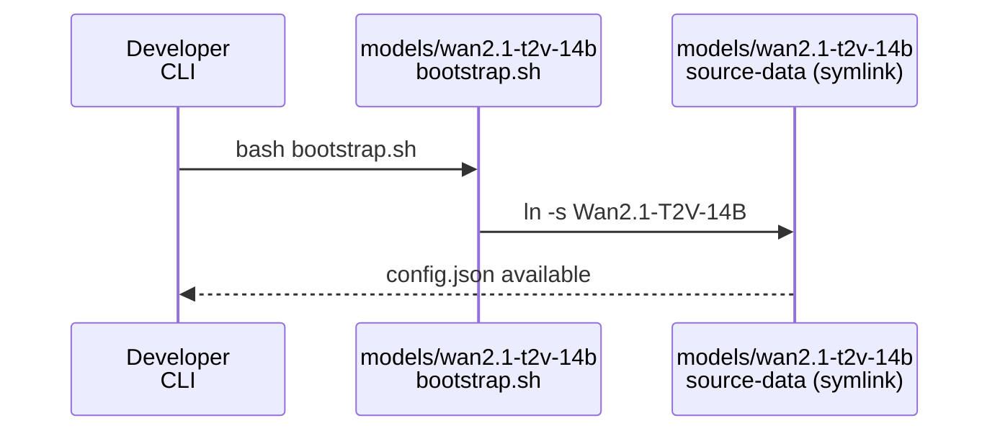
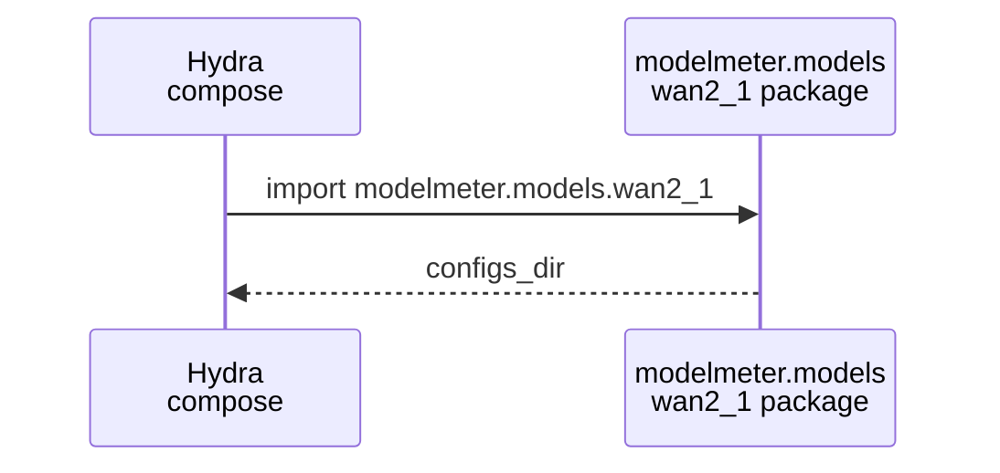
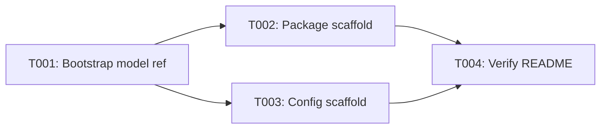

# Implementation Guide: Setup

**Phase**: 1 | **Feature**: Wan2.1 Analytic FLOP Model | **Tasks**: T001–T004

## Goal

Prepare a local Wan2.1-T2V-14B model reference directory and scaffold the ModelMeter + Hydra layout so later phases can compose the analytic model, run the analyzer, and run verification scripts without guessing paths.

## Public APIs

### T001: Local model reference bootstrap

This task creates `models/wan2.1-t2v-14b/source-data` as a symlink to your local `Wan2.1-T2V-14B` directory so analytic configs can read metadata like `config.json` without committing weights.

```bash
# models/wan2.1-t2v-14b/bootstrap.sh
export LLM_MODELS_ROOT=/data1/huangzhe/llm-models
bash models/wan2.1-t2v-14b/bootstrap.sh

test -f models/wan2.1-t2v-14b/source-data/config.json
```

**Usage Flow**:



**Pseudocode**:

```python
def bootstrap():
    target = env("WAN21_T2V_14B_PATH") or env("LLM_MODELS_ROOT") + "/Wan2.1-T2V-14B"
    assert exists(target)
    rm("models/wan2.1-t2v-14b/source-data")
    ln_s(target, "models/wan2.1-t2v-14b/source-data")
```

---

### T002: `modelmeter.models.wan2_1` package scaffold

This task creates the package entrypoints so Hydra configs can import Wan2.1 analytic layers via stable module paths under `modelmeter.models.wan2_1.*`.

```python
# extern/modelmeter/models/wan2_1/__init__.py
from __future__ import annotations

from pathlib import Path


def configs_dir() -> str:
    """Return the absolute path to the Wan2.1 ModelMeter Hydra config directory."""

    return str(Path(__file__).resolve().parent / "configs")


__all__ = ["configs_dir"]
```

```python
# extern/modelmeter/models/wan2_1/layers/__init__.py
"""Wan2.1 analytic layers (ModelMeter BaseLayer implementations)."""

__all__ = []
```

**Usage Flow**:



---

### T003: Hydra config scaffold

This task creates the top-level config file and a README describing the config group layout, mirroring the DeepSeek-OCR pattern under `extern/modelmeter/models/deepseek_ocr/configs/`.

```yaml
# extern/modelmeter/models/wan2_1/configs/wan2_1_t2v_14b.yaml
defaults:
  - _self_
description: "Wan2.1-T2V-14B analytic model config (scaffold)"
```

---

### T004: Verification scaffold

This task creates `extern/modelmeter/models/wan2_1/scripts/verify/README.md` to document how verification scripts will be invoked (device, prerequisites, and expected outputs) once implemented in later phases.

## Phase Integration



## Testing

### Test Input

- Environment variable `LLM_MODELS_ROOT` pointing to a directory containing `Wan2.1-T2V-14B`, or `WAN21_T2V_14B_PATH` pointing directly to the model directory.
- Filesystem permission to create/replace `models/wan2.1-t2v-14b/source-data`.

### Test Procedure

```bash
bash models/wan2.1-t2v-14b/bootstrap.sh
test -L models/wan2.1-t2v-14b/source-data
test -f models/wan2.1-t2v-14b/source-data/config.json
```

### Test Output

- `models/wan2.1-t2v-14b/source-data` exists as a symlink.
- `models/wan2.1-t2v-14b/source-data/config.json` exists and is readable.

## References

- Spec: `specs/004-wan2-1-analytic-model/spec.md`
- Plan: `specs/004-wan2-1-analytic-model/plan.md`
- Tasks: `specs/004-wan2-1-analytic-model/tasks.md`

## Implementation Summary

TODO (fill after implementation): summarize created files and how to validate the bootstrap/config scaffolding.
