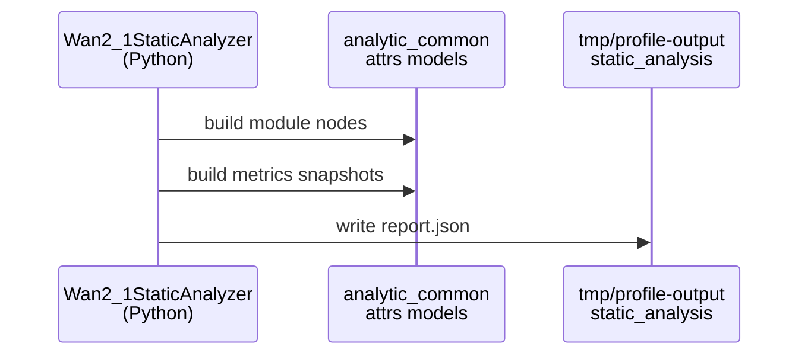
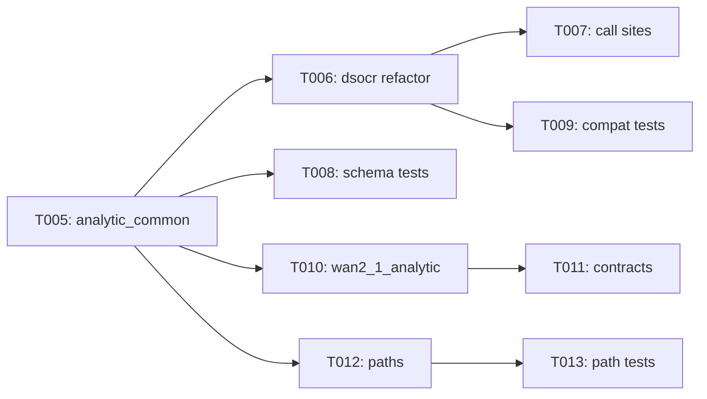

# Implementation Guide: Foundational Schema and Contracts

**Phase**: 2 | **Feature**: Wan2.1 Analytic FLOP Model | **Tasks**: T005–T013

## Goal

Introduce shared analytic report schema components (module tree + operator categories + metrics snapshots), preserve DeepSeek-OCR compatibility, and add Wan2.1 domain models + output path helpers that later phases will use to generate and validate `report.json`.

## Public APIs

### T005: Shared analytic schema module

Create a shared `attrs` schema module so both DeepSeek-OCR and Wan2.1 can build reports with the same node/metric structure and validation behavior.

```python
# src/llm_perf_opt/data/analytic_common.py
from __future__ import annotations

from typing import Any, Dict

from attrs import Attribute, define, field
from attrs.validators import instance_of


def _validate_non_negative_float(_instance: object, attribute: Attribute[float], value: float) -> None:
    if value < 0.0:
        raise ValueError(f"{attribute.name} must be non-negative, got {value!r}")


@define(kw_only=True)
class AnalyticModuleNode:
    """Node in the analytic module hierarchy (shared across models)."""

    module_id: str = field(validator=[instance_of(str)])
    name: str = field(validator=[instance_of(str)])
    qualified_class_name: str = field(validator=[instance_of(str)])
    stage: str = field(validator=[instance_of(str)], metadata={"help": "Model-defined stage label (e.g., diffusion, vision, decode)"})
    parent_id: str | None = field(default=None)
    children: list[str] = field(factory=list)
    repetition: str = field(default="none", validator=[instance_of(str)])
    repetition_count: int | None = field(default=None)
    constructor_params: Dict[str, Any] = field(factory=dict)


@define(kw_only=True)
class ModuleMetricsSnapshot:
    """Aggregated analytic metrics for a single module under a workload."""

    module_id: str = field(validator=[instance_of(str)])
    profile_id: str = field(validator=[instance_of(str)])
    total_flops_tflops: float = field(validator=[instance_of(float), _validate_non_negative_float])
```

**Usage Flow**:



---

### T006: DeepSeek-OCR schema refactor with re-exports

Refactor `src/llm_perf_opt/data/deepseek_ocr_analytic.py` to import shared schema types from `src/llm_perf_opt/data/analytic_common.py` and re-export them so existing imports keep working.

```python
# src/llm_perf_opt/data/deepseek_ocr_analytic.py
from llm_perf_opt.data.analytic_common import AnalyticModuleNode, ModuleMetricsSnapshot, OperatorCategory, OperatorMetrics

__all__ = [
    # existing DeepSeek-OCR-specific exports
    # ...
    # compatibility re-exports
    "AnalyticModuleNode",
    "OperatorCategory",
    "ModuleMetricsSnapshot",
    "OperatorMetrics",
]
```

---

### T007: DeepSeek-OCR call-site compatibility

Update call sites that import analytic schema types so they remain compatible after the refactor (no behavioral changes to DeepSeek-OCR reports).

- `src/llm_perf_opt/runners/dsocr_analyzer.py`
- `src/llm_perf_opt/contracts/models.py`

---

### T008: Unit tests for shared schema

Add unit tests validating shared schema invariants (non-negative metrics, serialization roundtrips, and stable required fields).

- `tests/unit/data/test_analytic_common.py`

---

### T009: Unit tests for DeepSeek-OCR schema backward compatibility

Add unit tests ensuring the DeepSeek-OCR module still exposes the names expected by existing code and that basic instantiation still works.

- `tests/unit/data/test_deepseek_ocr_analytic_compat.py`

---

### T010: Wan2.1 domain models

Implement Wan2.1-specific model/workload wrappers that reuse the shared schema types, so the analyzer can emit a strongly typed report.

```python
# src/llm_perf_opt/data/wan2_1_analytic.py
from __future__ import annotations

from attrs import define, field
from attrs.validators import instance_of

from llm_perf_opt.data.analytic_common import AnalyticModuleNode, ModuleMetricsSnapshot, OperatorCategory


@define(kw_only=True)
class Wan2_1ModelSpec:
    model_id: str = field(validator=[instance_of(str)])
    model_variant: str = field(validator=[instance_of(str)])
    config_path: str = field(validator=[instance_of(str)])
    hidden_size: int = field(validator=[instance_of(int)])
    num_layers: int = field(validator=[instance_of(int)])
    num_attention_heads: int = field(validator=[instance_of(int)])
    head_dim: int = field(validator=[instance_of(int)])
    mlp_intermediate_size: int = field(validator=[instance_of(int)])
    vae_downsample_factor: int = field(validator=[instance_of(int)])
    patch_size: int = field(validator=[instance_of(int)])
    latent_channels: int = field(validator=[instance_of(int)])
    notes: str = field(default="", validator=[instance_of(str)])


@define(kw_only=True)
class Wan2_1WorkloadProfile:
    profile_id: str = field(validator=[instance_of(str)])
    description: str = field(validator=[instance_of(str)])
    batch_size: int = field(validator=[instance_of(int)])
    num_frames: int = field(validator=[instance_of(int)])
    height: int = field(validator=[instance_of(int)])
    width: int = field(validator=[instance_of(int)])
    num_inference_steps: int = field(validator=[instance_of(int)])
    text_len: int = field(validator=[instance_of(int)])


@define(kw_only=True)
class Wan2_1AnalyticModelReport:
    report_id: str = field(validator=[instance_of(str)])
    model: Wan2_1ModelSpec = field()
    workload: Wan2_1WorkloadProfile = field()
    modules: list[AnalyticModuleNode] = field(factory=list)
    operator_categories: list[OperatorCategory] = field(factory=list)
    module_metrics: list[ModuleMetricsSnapshot] = field(factory=list)
    notes: str = field(default="", validator=[instance_of(str)])
```

---

### T011: Wan2.1 contract models

Extend `src/llm_perf_opt/contracts/models.py` with contract request/response types mirroring `specs/004-wan2-1-analytic-model/contracts/python-contracts.md` so the CLI wrapper can be contract-shaped.

```python
# src/llm_perf_opt/contracts/models.py
@define(kw_only=True)
class Wan2_1AnalyticRequest:
    model_id: str = field(validator=[instance_of(str)])
    model_variant: str = field(validator=[instance_of(str)])
    workload_profile_id: str = field(validator=[instance_of(str)])
    overrides: dict[str, int] | None = field(default=None)
    profile_run_id: str | None = field(default=None)
    force_rebuild: bool = field(default=False, validator=[instance_of(bool)])
```

---

### T012: Wan2.1 static-analysis output path helpers

Add path helpers for Wan2.1 artifacts so runners and tests do not hardcode directory strings.

```python
# src/llm_perf_opt/utils/paths.py
from __future__ import annotations

from pathlib import Path


def wan2_1_analytic_dir(run_id: str) -> str:
    """Return the directory for Wan2.1 analytic artifacts for a given run id."""

    root = Path(workspace_root())
    return str(root / "tmp" / "profile-output" / run_id / "static_analysis" / "wan2_1")


def wan2_1_report_path(run_id: str) -> str:
    """Return the absolute path to the Wan2.1 analytic report.json."""

    return str(Path(wan2_1_analytic_dir(run_id)) / "report.json")
```

---

### T013: Unit tests for Wan2.1 path helpers

Add unit tests validating that path helpers return absolute paths and that they match the expected directory layout.

- `tests/unit/utils/test_paths_wan2_1.py`

## Phase Integration



## Testing

### Test Input

- No external model weights required for this phase (schema and path helpers are pure-Python).

### Test Procedure

```bash
pixi run pytest tests/unit/data/test_analytic_common.py
pixi run pytest tests/unit/data/test_deepseek_ocr_analytic_compat.py
pixi run pytest tests/unit/utils/test_paths_wan2_1.py
```

### Test Output

- All tests pass (`N passed, 0 failed`).
- No filesystem artifacts are written outside `tmp/` (unit tests should use `tmp_path` fixtures).

## References

- Spec: `specs/004-wan2-1-analytic-model/spec.md`
- Data model: `specs/004-wan2-1-analytic-model/data-model.md`
- Contracts: `specs/004-wan2-1-analytic-model/contracts/`
- Tasks: `specs/004-wan2-1-analytic-model/tasks.md`

## Implementation Summary

TODO (fill after implementation): summarize the extracted shared schema types, the DeepSeek-OCR compatibility strategy, and how Wan2.1 report wrappers and path helpers are used by later phases.
