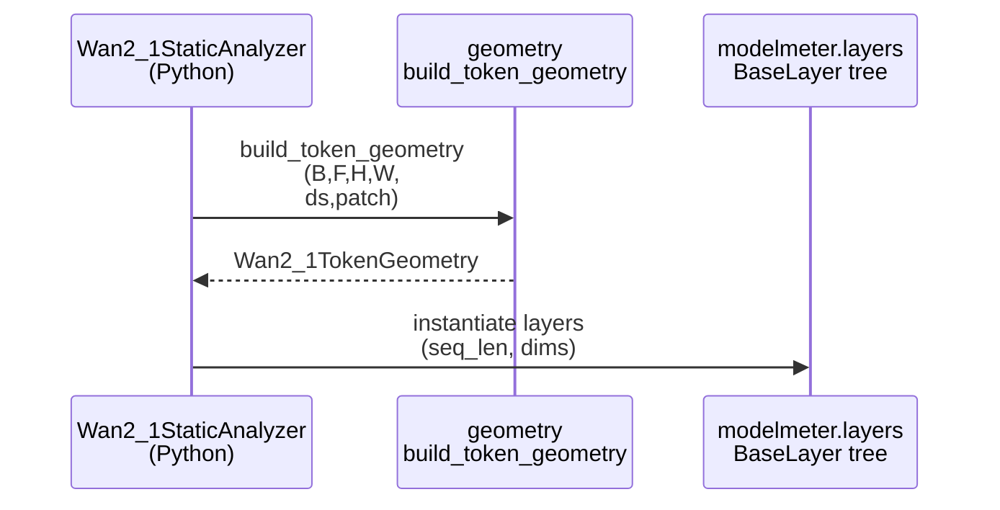
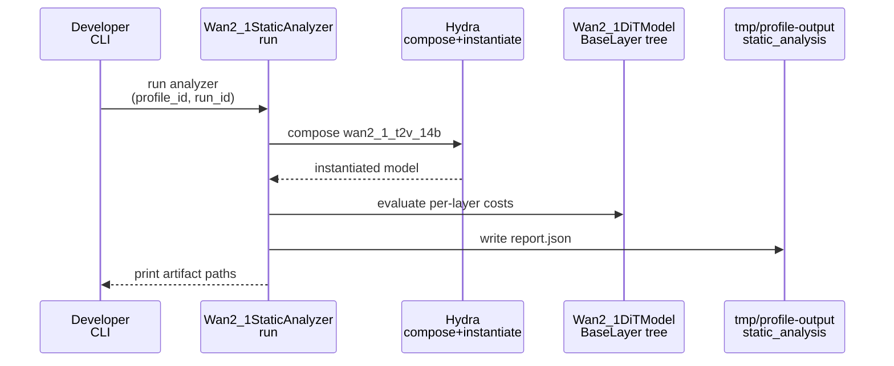
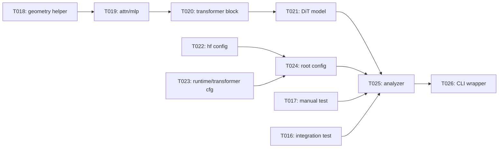

# Implementation Guide: US1 Report Generation

**Phase**: 3 | **Feature**: Wan2.1 Analytic FLOP Model | **Tasks**: T014–T026

## Goal

Implement the Wan2.1-T2V-14B analytic model (diffusion transformer core) and a static-analysis runner that writes `tmp/profile-output/<run_id>/static_analysis/wan2_1/report.json` with per-layer metrics, stable module ids, and end-to-end totals that equal the sum of per-layer values.

## Public APIs

### T014: Token-geometry unit tests

Add fast, deterministic tests validating the canonical token geometry helper is monotonic with frames and resolution and linear in steps (for FLOPs), using only synthetic inputs.

- `tests/unit/wan2_1/test_geometry.py`

---

### T015: Report invariants unit tests

Add tests ensuring report invariants hold: non-negative finite metrics, stable module ids, and totals equal sum of module metrics (within tolerance).

- `tests/unit/wan2_1/test_report_invariants.py`

---

### T016: Report generation integration test

Add an integration test that runs the analyzer on the CI tiny workload and asserts `report.json` exists and passes basic invariants; skip with a clear message if the local Wan2.1 model reference is not available.

- `tests/integration/wan2_1/test_wan2_1_analyzer_report.py`

---

### T017: Manual test script

Create a manual test that writes visible artifacts under a user-chosen run id and prints where to find them.

- `tests/manual/wan2_1/manual_wan2_1_static_analysis.py`

---

### T018: Canonical video/latent token geometry helper

Implement a single canonical geometry helper used by analytic layers and tests, and make it the only place where the “pixels → latents → tokens” mapping lives.

```python
# extern/modelmeter/models/wan2_1/layers/geometry.py
from __future__ import annotations

from dataclasses import dataclass


@dataclass(frozen=True)
class Wan2_1TokenGeometry:
    """Derived token geometry for a video workload."""

    batch_size: int
    num_frames: int
    height: int
    width: int
    vae_downsample_factor: int
    patch_size: int
    latent_h: int
    latent_w: int
    tokens_per_frame: int
    dit_seq_len: int


def build_token_geometry(
    *,
    batch_size: int,
    num_frames: int,
    height: int,
    width: int,
    vae_downsample_factor: int,
    patch_size: int,
) -> Wan2_1TokenGeometry:
    """Compute latents and transformer token sequence length for the workload."""

    # Implementation should define rounding behavior explicitly (e.g., ceil-div vs floor-div).
    ...
```

**Usage Flow**:



---

### T019: Analytic attention and MLP sublayers

Implement reusable analytic sublayers for transformer attention and feed-forward so block logic stays readable and testable.

- `extern/modelmeter/models/wan2_1/layers/transformer/wan2_1_attention.py`
- `extern/modelmeter/models/wan2_1/layers/transformer/wan2_1_mlp.py`

```python
# extern/modelmeter/models/wan2_1/layers/transformer/wan2_1_attention.py
from __future__ import annotations

from typing_extensions import override

from modelmeter.layers.base import BaseLayer
from modelmeter.models.common import StageCostMixin


class Wan2_1Attention(StageCostMixin, BaseLayer):
    """Analytic attention sublayer used inside a Wan2.1 transformer block."""

    def __init__(self) -> None:
        super().__init__()
        self.m_attn: BaseLayer | None = None

    @classmethod
    def from_config(cls, *, batch_size: int, seq_len: int, hidden_size: int, num_heads: int, head_dim: int) -> "Wan2_1Attention":
        inst = cls()
        # Compose internal modelmeter primitive layers here.
        return inst

    @override
    def forward_tensor_core_flops(self) -> float:
        return float((self.m_attn.forward_tensor_core_flops() if self.m_attn else 0.0) or 0.0)
```

---

### T020: Transformer block analytic layer

Implement a block layer that composes norm/modulation, attention, and MLP and exposes a stable internal structure so later reporting can assign stable hierarchical module ids (block index and subcomponent names).

- `extern/modelmeter/models/wan2_1/layers/transformer/wan2_1_transformer_block.py`

```python
# extern/modelmeter/models/wan2_1/layers/transformer/wan2_1_transformer_block.py
from __future__ import annotations

from typing_extensions import override

from modelmeter.layers.base import BaseLayer
from modelmeter.models.common import StageCostMixin

from modelmeter.models.wan2_1.layers.transformer.wan2_1_attention import Wan2_1Attention
from modelmeter.models.wan2_1.layers.transformer.wan2_1_mlp import Wan2_1MLP


class Wan2_1TransformerBlock(StageCostMixin, BaseLayer):
    """Analytic transformer block (attention + MLP) for Wan2.1 diffusion core."""

    def __init__(self) -> None:
        super().__init__()
        self.m_attn: Wan2_1Attention | None = None
        self.m_mlp: Wan2_1MLP | None = None

    @classmethod
    def from_config(cls, *, batch_size: int, seq_len: int, hidden_size: int, num_heads: int, head_dim: int, mlp_intermediate_size: int) -> "Wan2_1TransformerBlock":
        inst = cls()
        inst.m_attn = Wan2_1Attention.from_config(batch_size=batch_size, seq_len=seq_len, hidden_size=hidden_size, num_heads=num_heads, head_dim=head_dim)
        inst.m_mlp = Wan2_1MLP.from_config(batch_size=batch_size, seq_len=seq_len, hidden_size=hidden_size, intermediate_size=mlp_intermediate_size)
        return inst

    @override
    def forward_tensor_core_flops(self) -> float:
        return float((self.m_attn.get_forward_cost().flops_tflops if self.m_attn else 0.0) + (self.m_mlp.get_forward_cost().flops_tflops if self.m_mlp else 0.0))
```

---

### T021: Diffusion-core analytic layer + step scaling

Implement the analytic diffusion transformer root layer that aggregates a stack of blocks and scales compute linearly with `num_inference_steps` without scaling memory by steps.

- `extern/modelmeter/models/wan2_1/layers/core/wan2_1_dit_model.py`

```python
# extern/modelmeter/models/wan2_1/layers/core/wan2_1_dit_model.py
from __future__ import annotations

from typing import List

from typing_extensions import override

from modelmeter.layers.base import BaseLayer
from modelmeter.models.common import StageCostMixin

from modelmeter.models.wan2_1.layers.transformer.wan2_1_transformer_block import Wan2_1TransformerBlock


class Wan2_1DiTModel(StageCostMixin, BaseLayer):
    """Analytic diffusion transformer core for Wan2.1 (stack of transformer blocks)."""

    def __init__(self) -> None:
        super().__init__()
        self.m_blocks: List[Wan2_1TransformerBlock] = []
        self.m_num_inference_steps: int = 1

    def set_num_inference_steps(self, steps: int) -> None:
        if steps <= 0:
            raise ValueError("steps must be positive")
        self.m_num_inference_steps = int(steps)

    @override
    def forward_tensor_core_flops(self) -> float:
        per_step = sum((b.forward_tensor_core_flops() or 0.0) for b in self.m_blocks)
        return float(per_step * float(self.m_num_inference_steps))
```

---

### T022: HF architecture config for Wan2.1-T2V-14B

Add a config group mirroring the minimal architecture fields read from `models/wan2.1-t2v-14b/source-data/config.json` (only what analytic layers require).

- `extern/modelmeter/models/wan2_1/configs/hf/wan2_1_t2v_14b.yaml`

---

### T023: Runtime/workload + transformer config groups

Add workload defaults and transformer-block configuration groups so the top-level config can be composed with clear overrides.

- `extern/modelmeter/models/wan2_1/configs/runtime/analytic_defaults.yaml`
- `extern/modelmeter/models/wan2_1/configs/transformer/wan2_1_dit.yaml`

---

### T024: Model root config and top-level composition

Implement the top-level Hydra config that instantiates the analytic root model via `_target_` and wires `hf`, `runtime`, and `transformer` groups together.

- `extern/modelmeter/models/wan2_1/configs/model/wan2_1_root.yaml`
- `extern/modelmeter/models/wan2_1/configs/wan2_1_t2v_14b.yaml`

---

### T025: Wan2.1 static analyzer runner

Implement the analyzer that composes the Hydra config, instantiates the analytic layer tree, traverses it into shared schema nodes/metrics, and writes artifacts under `tmp/profile-output/<run_id>/static_analysis/wan2_1/`.

- `src/llm_perf_opt/runners/wan2_1_analyzer.py`

```python
# src/llm_perf_opt/runners/wan2_1_analyzer.py
from __future__ import annotations

from dataclasses import dataclass
from pathlib import Path

from llm_perf_opt.data.wan2_1_analytic import Wan2_1AnalyticModelReport, Wan2_1WorkloadProfile


@dataclass(frozen=True)
class Wan2_1AnalyzerConfig:
    workload_profile_id: str
    run_id: str


class Wan2_1StaticAnalyzer:
    """Generate Wan2.1 analytic reports (filesystem artifacts under tmp/profile-output)."""

    def __init__(self) -> None:
        self.m_logger = None

    def run(self, *, cfg: Wan2_1AnalyzerConfig) -> Wan2_1AnalyticModelReport:
        """Compose Hydra, build analytic model, and write report artifacts."""

        ...
```

**Usage Flow**:



---

### T026: Contract-oriented CLI wrapper

Add a thin CLI wrapper that parses flags into the contract request type and dispatches to the analyzer, mirroring the existing DeepSeek-OCR wrapper pattern.

- `src/llm_perf_opt/runners/wan2_1_analyzer_main.py`

## Phase Integration



## Testing

### Test Input

- `models/wan2.1-t2v-14b/source-data/config.json` must exist (Phase 1 bootstrap).
- For manual runs, a Hydra run dir under `tmp/profile-output/<run_id>/` (use `hydra.run.dir=...`).

### Test Procedure

```bash
# Unit tests for geometry and report invariants.
pixi run pytest tests/unit/wan2_1/test_geometry.py
pixi run pytest tests/unit/wan2_1/test_report_invariants.py

# Integration test (may skip if Wan2.1 local reference is unavailable).
pixi run pytest tests/integration/wan2_1/test_wan2_1_analyzer_report.py

# Manual end-to-end artifact generation for inspection.
pixi run -e rtx5090 python tests/manual/wan2_1/manual_wan2_1_static_analysis.py \
  --run-id 'wan2-1-manual-001'
```

### Test Output

- `tmp/profile-output/<run_id>/static_analysis/wan2_1/report.json` exists and contains per-layer metrics plus totals.
- Manual run prints artifact locations and key totals (for quick sanity inspection).

## References

- Spec: `specs/004-wan2-1-analytic-model/spec.md`
- Plan: `specs/004-wan2-1-analytic-model/plan.md`
- Data model: `specs/004-wan2-1-analytic-model/data-model.md`
- Contracts: `specs/004-wan2-1-analytic-model/contracts/`
- Tasks: `specs/004-wan2-1-analytic-model/tasks.md`

## Implementation Summary

TODO (fill after implementation): summarize the implemented Wan2.1 analytic layer tree, how module ids are assigned, and how the analyzer converts analytic costs into a shared-schema `report.json` artifact.
