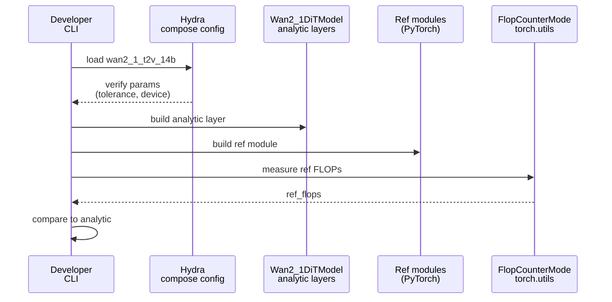

# Implementation Guide: US2 FLOP Verification

**Phase**: 4 | **Feature**: Wan2.1 Analytic FLOP Model | **Tasks**: T027–T034

## Goal

Provide automated verification that analytic FLOPs match a reference measurement (PyTorch `FlopCounterMode`) layer-by-layer and end-to-end (within the analytic scope) within a ≤5% relative error budget for the standard workload set.

## Public APIs

### T027: Unit tests for FLOP diff computation and tolerance enforcement

Add unit tests for any shared verification utilities (relative difference computation, formatting, and threshold enforcement).

- `tests/unit/wan2_1/test_verify_utils.py`

---

### T028: Integration test for CI-tiny verification

Add an integration test that runs the CI tiny workload verification when the local Wan2.1 reference is available; otherwise skip cleanly.

- `tests/integration/wan2_1/test_verify_layers_ci_tiny.py`

---

### T029: Verification tolerances in config

Add a `verify_run.accept_rel_diff` section to the top-level analytic config so verification scripts have a single source of truth for acceptable errors.

- `extern/modelmeter/models/wan2_1/configs/wan2_1_t2v_14b.yaml`

```yaml
verify_run:
  device: cuda:0
  accept_rel_diff:
    default: 0.05
    layers: ${.default}
    end2end: ${.default}
    core: ${.default}
```

---

### T030: PyTorch reference modules for FLOP measurement

Implement small PyTorch modules that mirror the math being modeled analytically (attention + MLP + block), sufficient for `FlopCounterMode` to produce a stable reference FLOP count for the same shapes.

- `extern/modelmeter/models/wan2_1/scripts/verify/_reference_modules.py`

```python
# extern/modelmeter/models/wan2_1/scripts/verify/_reference_modules.py
from __future__ import annotations

import torch
from torch import nn


class RefWan2_1MLP(nn.Module):
    def __init__(self, *, hidden_size: int, intermediate_size: int) -> None:
        super().__init__()
        self.fc1 = nn.Linear(hidden_size, intermediate_size, bias=False)
        self.fc2 = nn.Linear(intermediate_size, hidden_size, bias=False)

    def forward(self, x: torch.Tensor) -> torch.Tensor:
        return self.fc2(torch.nn.functional.gelu(self.fc1(x)))
```

---

### T031: Per-layer verification script

Implement a script that measures FLOPs of reference modules and compares to analytic sublayers/blocks, printing per-layer relative differences and failing fast when any exceed the tolerance.

- `extern/modelmeter/models/wan2_1/scripts/verify/run_verify_layers.py`

```python
# extern/modelmeter/models/wan2_1/scripts/verify/run_verify_layers.py
from __future__ import annotations

from torch.utils.flop_counter import FlopCounterMode


def _measure_flops(mod, x) -> int:
    mod.eval()
    flop_counter = FlopCounterMode(mods=mod, display=False, depth=None)
    with flop_counter:
        _ = mod(x)
    return flop_counter.get_total_flops()


def _rel_diff(*, analytic_flops: float, ref_flops: int) -> float:
    return abs(analytic_flops - float(ref_flops)) / float(ref_flops)
```

**Usage Flow**:



---

### T032: End-to-end verification script

Implement a script that compares analytic diffusion-core FLOPs across `num_inference_steps` to a reference measurement computed by running a reference diffusion core forward in a loop (or by scaling one-step FLOPs) using the same convention as the analytic model.

- `extern/modelmeter/models/wan2_1/scripts/verify/run_verify_end2end.py`

---

### T033: Analytic aggregation invariant check

Implement a script that checks internal invariants like “model FLOPs equal sum of configured sublayers” (useful to catch wiring bugs in the analytic layer tree).

- `extern/modelmeter/models/wan2_1/scripts/verify/run_verify_core.py`

---

### T034: Verification README

Document how to run verification scripts, prerequisites (local model reference, device), and what pass/fail looks like.

- `extern/modelmeter/models/wan2_1/scripts/verify/README.md`

## Phase Integration

```mermaid
graph LR
    T030[T030: ref modules] --> T031[T031: verify layers];
    T029[T029: tolerances cfg] --> T031;
    T029 --> T032[T032: verify end2end];
    AM[Analytic model<br/>(US1)] --> T031;
    AM --> T032;
    AM --> T033[T033: verify core];
    T031 --> T028[T028: integration test];
    T031 --> T027[T027: unit tests];
```

## Testing

### Test Input

- Local Wan2.1 model reference symlink exists (Phase 1): `models/wan2.1-t2v-14b/source-data/`.
- CUDA device available if reference modules must run on GPU (`verify_run.device=cuda:0`), otherwise use `--device cpu` if supported by reference modules.

### Test Procedure

```bash
# Unit tests (pure Python).
pixi run pytest tests/unit/wan2_1/test_verify_utils.py

# Integration test (may skip if local reference is unavailable).
pixi run pytest tests/integration/wan2_1/test_verify_layers_ci_tiny.py

# Manual verification runs.
pixi run -e rtx5090 python -m modelmeter.models.wan2_1.scripts.verify.run_verify_layers --workload wan2-1-ci-tiny
pixi run -e rtx5090 python -m modelmeter.models.wan2_1.scripts.verify.run_verify_end2end --workload wan2-1-512p
```

### Test Output

- Per-layer verification prints a table of layer names and relative diffs and exits non-zero on the first failure above tolerance.
- End-to-end verification prints analytic vs reference totals and relative diff and exits non-zero on failure.

## References

- Spec: `specs/004-wan2-1-analytic-model/spec.md`
- Research: `specs/004-wan2-1-analytic-model/research.md`
- Tasks: `specs/004-wan2-1-analytic-model/tasks.md`

## Implementation Summary

TODO (fill after implementation): summarize reference module coverage, tolerance wiring, and how verification handles “local model unavailable” cases in CI.
