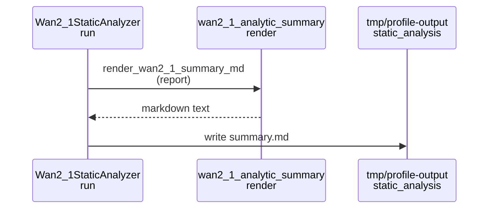

# Implementation Guide: US3 Hotspots and Workload Comparison

**Phase**: 5 | **Feature**: Wan2.1 Analytic FLOP Model | **Tasks**: T035–T038

## Goal

Make reports actionable by adding summary/hotspot tooling: extract top-10 layers and top-5 categories by FLOPs, and compare how costs shift across workloads (frames, resolution, steps) using the existing `report.json` artifacts.

## Public APIs

### T035: Unit tests for top-k extraction and stable ordering

Add unit tests for hotspot extraction logic (top-k layers/categories by FLOPs) with stable tie-breaking, using synthetic reports.

- `tests/unit/wan2_1/test_hotspots.py`

---

### T036: Integration test for monotonic scaling and hotspot attribution

Add an integration test that generates two reports with different workloads (or loads fixtures) and validates monotonic scaling and reasonable hotspot attribution; skip cleanly if local model reference is unavailable.

- `tests/integration/wan2_1/test_hotspot_scaling.py`

---

### T037: Summary markdown generator

Implement a summary generator that converts a report into a human-readable `summary.md` including top-k layers and categories by FLOPs and key workload parameters.

- `src/llm_perf_opt/visualize/wan2_1_analytic_summary.py`
- Integrate it in `src/llm_perf_opt/runners/wan2_1_analyzer.py`

```python
# src/llm_perf_opt/visualize/wan2_1_analytic_summary.py
from __future__ import annotations

from llm_perf_opt.data.wan2_1_analytic import Wan2_1AnalyticModelReport


def render_wan2_1_summary_md(report: Wan2_1AnalyticModelReport) -> str:
    """Render a stakeholder-friendly markdown summary of a Wan2.1 analytic report."""

    ...
```

**Usage Flow**:



---

### T038: Report tooling CLI

Implement a CLI for loading `report.json`, printing hotspots, and comparing two reports (for workload comparisons and regression triage).

- `src/llm_perf_opt/runners/wan2_1_report_tools.py`

```python
# src/llm_perf_opt/runners/wan2_1_report_tools.py
from __future__ import annotations

import argparse


def main() -> int:
    parser = argparse.ArgumentParser(description="Wan2.1 analytic report tools.")
    parser.add_argument("--report", type=str, required=True, help="Path to report.json")
    parser.add_argument("--compare", type=str, default=None, help="Optional second report.json to diff against")
    return 0
```

## Phase Integration

```mermaid
graph LR
    RPT[report.json<br/>(US1)] --> T037[T037: summary.md];
    RPT --> T038[T038: report tools];
    T038 --> T035[T035: hotspot unit tests];
    RPT --> T036[T036: hotspot integration test];
```

## Testing

### Test Input

- Two report artifacts under `tmp/profile-output/<run_id>/static_analysis/wan2_1/report.json` (can be generated via US1 analyzer or provided as fixtures).

### Test Procedure

```bash
pixi run pytest tests/unit/wan2_1/test_hotspots.py
pixi run pytest tests/integration/wan2_1/test_hotspot_scaling.py

# Manual inspection: generate a report then view summary.md.
pixi run -e rtx5090 python -m llm_perf_opt.runners.wan2_1_analyzer \
  hydra.run.dir='tmp/profile-output/${now:%Y%m%d-%H%M%S}' \
  workload.profile_id=wan2-1-512p
```

### Test Output

- `summary.md` exists beside `report.json` and lists top-10 layers and top-5 categories by FLOPs for the report workload.
- `wan2_1_report_tools.py` prints hotspot tables and (when `--compare` is provided) a clear diff of top contributors.

## References

- Spec: `specs/004-wan2-1-analytic-model/spec.md`
- Tasks: `specs/004-wan2-1-analytic-model/tasks.md`

## Implementation Summary

TODO (fill after implementation): summarize summary markdown format choices, hotspot extraction rules, and how comparison diffs are intended to be used during performance investigations.
