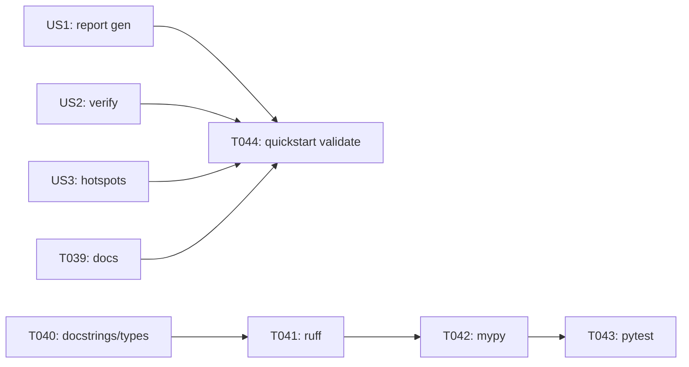

# Implementation Guide: Polish and Cross-Cutting Concerns

**Phase**: 6 | **Feature**: Wan2.1 Analytic FLOP Model | **Tasks**: T039–T044

## Goal

Harden the feature for day-to-day use: ensure docs are accurate, all public APIs have NumPy-style docstrings and type hints, and the repository gates (ruff, mypy, pytest) pass with the new Wan2.1 analytic model and verification tooling.

## Public APIs

### T039: Documentation updates

Update the project docs to point to Wan2.1 static analysis and verification entrypoints and explain where outputs land under `tmp/profile-output/<run_id>/`.

- `docs/running.md`

---

### T040: Docstrings and typing

Audit new public classes/functions introduced under `src/llm_perf_opt/` and `extern/modelmeter/models/wan2_1/` and ensure they have NumPy-style docstrings and full type annotations.

---

### T041: Ruff gate

Run ruff and fix issues in the files modified by this feature.

```bash
pixi run ruff check .
```

---

### T042: Mypy gate

Run mypy and fix issues in the files modified by this feature.

```bash
pixi run mypy src
```

---

### T043: Test gates

Run unit and integration tests and fix failures; ensure integration tests skip cleanly when local Wan2.1 references are unavailable.

```bash
pixi run pytest tests/unit/
pixi run pytest tests/integration/
```

---

### T044: Quickstart validation

Re-run the commands in `specs/004-wan2-1-analytic-model/quickstart.md` and update the document if flags, paths, or outputs changed during implementation.

## Phase Integration



## Testing

### Test Input

- A completed implementation of phases 1–5.
- Optional local model reference under `models/wan2.1-t2v-14b/source-data/` for integration tests that depend on local metadata or reference FLOP measurement.

### Test Procedure

```bash
pixi run ruff check .
pixi run mypy src
pixi run pytest tests/unit/
pixi run pytest tests/integration/
```

### Test Output

- `ruff` and `mypy` exit 0.
- `pytest` passes (or integration tests skip with clear messaging when local references are unavailable).
- `specs/004-wan2-1-analytic-model/quickstart.md` matches current behavior and paths.

## References

- Spec: `specs/004-wan2-1-analytic-model/spec.md`
- Quickstart: `specs/004-wan2-1-analytic-model/quickstart.md`
- Tasks: `specs/004-wan2-1-analytic-model/tasks.md`

## Implementation Summary

TODO (fill after implementation): summarize doc updates, gate outcomes, and any known limitations or environment prerequisites that remain.
