# Report of DeepSeek-OCR Kernel-level Profiling (V2)

## Overview

This report presents complete profiling data for the top 20 kernels observed during decode.

The intention of this report is to present the findings from kernel-level profiling of the DeepSeek-OCR model using NVIDIA Nsight Systems (nsys) and Nsight Compute (ncu), to identify the performance characteristics and potential bottlenecks during inference, to guide future NPU design (inference oriented).

This report shows:
- Top kernels used by DeepSeek-OCR during inference
- Detailed performance metrics collected via NVIDIA Nsight Compute (NCU) for **all 20 kernels**
- Histograms of kernel execution metrics
- Roofline analysis for all profiled kernels
- Classification of kernels by type (compute-bound, memory-bound, balanced)
- Implementation details of profiling setup and methodology

**Highlights:**
- **100% kernel coverage**: All 20 kernels successfully profiled
- More comprehensive roofline analysis with the complete dataset

## Experiment

### Setup

**Hardware:**
- GPU: NVIDIA GeForce RTX 5090 (Blackwell architecture, sm_120)
- Compute Capability: 12.0

**Software:**
- CUDA: 12.8
- PyTorch: 2.10.0.dev20251102+cu128
- Transformers: 4.46.3
- Profiling Tools: NVIDIA Nsight Systems, NVIDIA Nsight Compute

**Model Configuration:**
- Model: DeepSeek-OCR
- Precision: BF16 (bfloat16)
- Inference Mode: Autoregressive generation
- Max New Tokens: 64
- Temperature: 0.0 (greedy decoding)
- Context Length Mode: Auto
- No Repeat N-gram Size: 20

**Dataset:**
- Dataset: OmniDocBench
- Samples: 20 images (dev-20 subset)
- Preprocessing: Base size 1024, image size 640, crop mode enabled

**Profiling Configuration:**
- Stage 1: PyTorch Profiler (operator-level analysis, disabled for Stage 2 workload)
- Stage 2: Nsight Systems (CUDA timeline, NVTX-gated on "decode" phase)
- Nsight Compute: Roofline metrics, SpeedOfLight, MemoryWorkloadAnalysis, Occupancy sections
- Kernel Selection: Top 20 kernels by total execution time from Nsys analysis

### Top Kernels by Total Time

The following table shows the top 20 kernels by cumulative execution time during the decode phase of inference, as measured by Nsight Systems (NVTX‑gated on decode). Kernels are categorized by source library and given human‑friendly names based on their functionality.

| Time % | Library | Kernel Name | Description |
|--------|---------|-------------|-------------|
| 34.4% | cuBLAS | GEMV (BF16, template=7) | Matrix-vector multiplication for decode |
| 14.8% | cuBLAS | GEMV (BF16, template=6) | Matrix-vector multiplication for decode |
| 6.0% | PyTorch ATen | Direct Copy (float) | Memory copy/cast for intermediates |
| 4.2% | PyTorch ATen | Elementwise Multiply (BF16, vec) | Vectorized elementwise multiply |
| 3.9% | PyTorch ATen | SiLU Activation (BF16, vec) | Vectorized SiLU activation in FFN |
| 2.9% | PyTorch ATen | Elementwise Multiply (BF16) | Elementwise multiply (BF16) |
| 2.8% | PyTorch ATen | Cat Batched Copy (vec, 128-tile) | Concatenate heads (vectorized) |
| 2.7% | PyTorch ATen | Copy/Cast (BF16, vec) | BF16 vectorized copy |
| 2.4% | FlashAttention | Flash Forward Split-KV (BF16) | IO-aware fused attention with split K/V |
| 2.0% | PyTorch ATen | Elementwise Add (BF16, vec) | Vectorized add for residuals |
| 1.8% | PyTorch ATen | Cat Batched Copy (vec, 64-tile) | Concatenate heads (64 tile) |
| 1.8% | PyTorch ATen | Elementwise Multiply (float) | FP32 elementwise multiply |
| 1.6% | PyTorch ATen | Mean Reduction (float) | Reduction operations for normalization |
| 1.5% | PyTorch ATen | Elementwise Neg (BF16) | Negation operations |
| 1.4% | FlashAttention | Flash Split-KV Combine | Combine split-KV outputs |
| 1.3% | PyTorch ATen | TopK Gather (float) | Gather top-K values/indices |
| 1.2% | PyTorch ATen | Index Put (elementwise) | Advanced indexing write |
| 1.2% | PyTorch ATen | Bitonic Sort (KV in-place) | In-place key-value bitonic sort |
| 1.1% | PyTorch ATen | Elementwise Multiply (float, vec) | Vectorized elementwise multiply |
| 1.0% | PyTorch ATen | Sum Reduction (float) | Sum reduction |

**Key Observations:**
- **GEMV Dominance (49.2%)**: The two cuBLAS GEMV variants account for nearly half of all execution time, which is characteristic of autoregressive decode where batch size = 1 and matrix-vector products dominate over matrix-matrix products.
- **ATen Elementwise Operations (21.7%)**: A significant portion of time is spent in PyTorch's elementwise kernels, suggesting opportunities for kernel fusion.
- **FlashAttention (3.8%)**: Despite being highly optimized, attention still represents a meaningful fraction of compute time.
- **Memory Operations (8.7%)**: Direct memory copies and casts represent overhead that could be reduced with better memory layout planning.

### Kernel Classification

NCU profiling was performed on all top 20 kernels, with **100% success rate** yielding valid metrics for all kernels. The kernels were classified based on roofline analysis:

| Classification | Count | % of Profiled |
|----------------|-------|---------------|
| Memory-bound | 9 | 45.0% |
| Balanced | 7 | 35.0% |
| Compute-bound | 4 | 20.0% |
| **Unknown** | **0** | **0%** ✓ |

**Performance Characteristics by Classification:**

| Metric | Compute-Bound | Memory-Bound | Balanced | Overall Mean |
|--------|---------------|--------------|----------|--------------|
| SM Throughput | 36.21% | 9.38% | 12.25% | 15.75% |
| DRAM Throughput | 9.89% | 34.23% | 12.62% | 21.80% |
| Memory Throughput | 32.23% | 41.20% | 27.52% | 34.62% |
| Achieved Occupancy | 31.51% | 43.22% | 39.32% | 39.51% |
| L1 Hit Rate | 6.54% | 9.51% | 9.65% | 8.96% |
| L2 Hit Rate | 71.93% | 16.40% | 51.97% | 39.95% |
| Mean Duration | 137.44 μs | 9.67 μs | 39.75 μs | 45.75 μs |

**Key Insights:**
1. **Complete dataset**: all 20 kernels have valid classifications.
2. **Resource utilization**: overall means indicate low utilization (SM 15.75%, memory 34.62%, achieved occupancy 39.51%).
3. **Memory‑bound majority (45%)**: nearly half the kernels are constrained by memory bandwidth.
4. **Compute‑bound share (20%)**: four kernels are compute‑bound and longer‑running on average (137.44 μs).
5. **Duration distribution**: compute‑bound kernels take longer than memory‑bound (9.67 μs avg), consistent with complex math operations.

**Metric Definitions:**
1. **SM Throughput**: percent of peak SM compute activity achieved by the kernel. NCU metric: `sm__throughput.avg.pct_of_peak_sustained_active`. Indicates compute pressure; high values often correlate with compute‑bound kernels.
2. **DRAM Throughput**: percent of peak off‑chip memory bandwidth (GDDR/HBM) used. NCU metric: `dram__throughput.avg.pct_of_peak_sustained_active`. Indicates external memory pressure; high values mean heavy DRAM traffic.
3. **Memory Throughput**: aggregate memory subsystem activity across caches and DRAM. NCU metric: `mem__throughput.avg.pct_of_peak_sustained_active`. Can be high even when DRAM% is low if most traffic is served by L1/L2; not additive with DRAM%.
4. **Achieved Occupancy**: fraction of active warps relative to the theoretical maximum residency on an SM. NCU: Occupancy section “Achieved Occupancy” (derived from active warps vs hardware limits). Low values suggest insufficient parallelism or latency hiding.
5. **L1 Hit Rate**: percent of L1/TEX cacheable requests served from L1. NCU (Memory Workload Analysis): “L1/TEX Cache Hit Rate” (derived). Sensitive to access path and cache controls; interpret with care alongside Memory/DRAM throughput.
6. **L2 Hit Rate**: percent of L2‑cacheable requests served from L2. NCU (Memory Workload Analysis): “L2 Cache Hit Rate” (derived). Higher L2 hit can reduce DRAM throughput and improve effective bandwidth.
7. **Mean Duration**: average single‑invocation kernel duration (μs). NCU: per‑kernel “Duration” field. Longer durations typically indicate heavier compute or larger tiles.

**How to Interpret This Table:**
1. **Per‑class averages**: values are per‑class averages across kernels (unweighted by runtime); the overall mean averages all 20.
2. **Compute‑bound signature**: compute‑bound kernels show higher SM throughput (36.21%) and longer average duration (137.44 μs), indicating math‑heavy kernels that benefit from tensor‑core utilization, tiling, and ILP.
3. **Memory‑bound signature**: memory‑bound kernels show higher DRAM/memory throughput (34.23%/41.20%) and short average durations (9.67 μs), indicating bandwidth‑limited, low‑arithmetic‑intensity work that benefits from fusion, layout, and reuse.
4. **Balanced signature**: balanced kernels underutilize both compute and memory, suggesting opportunities for fusion or specialization.
5. **Cache hit caveat**: cache hit rates vary by access path (e.g., streaming loads, cache‑bypass, cp.async→SMEM). Treat per‑class cache numbers as indicative; full per‑kernel details are in the raw NCU data.

### Top Kernels by Duration (NCU)

The following kernels had the longest individual execution times in V2:

| Duration (μs) | Classification | Kernel |
|---------------|----------------|--------|
| 404.70 | Compute-bound | CUTLASS GEMM (128×256 tile, BF16, ReLU) |
| 160.74 | Balanced | Memory-Efficient Attention (CUTLASS BF16, 64×64) |
| 111.81 | Compute-bound | CUTLASS GEMM (256×128 tile, BF16, ReLU) |
| 94.91 | Balanced | ATen Elementwise Add (BF16, 6144 blocks) |
| 23.42 | Compute-bound | CUTLASS GEMM (32×32 tile, BF16, WMMA) |
| 18.34 | Memory-bound | cuBLAS GEMV (BF16, template=6) |
| 18.08 | Memory-bound | ATen Direct Copy (float, 12288 blocks) |
| 10.34 | Memory-bound | FlashAttention Split-KV Forward |
| 9.82 | Memory-bound | ATen Cat Batched Copy (512-thread blocks) |
| 7.97 | Memory-bound | ATen Mean Reduction (float, 512 threads) |

**Analysis:**
- **Longest kernel (404.70 μs)**: Indicates a long‑tail duration distribution driven by large‑tile GEMM.
- **Memory‑Efficient Attention (160.74 μs)**: Balanced classification; 2nd longest, showing attention is a major contributor.
- **CUTLASS GEMM dominance**: 3 of top 4 longest kernels are compute‑bound CUTLASS GEMM operations with large tiles (128×256, 256×128).
- **Balanced kernels can be costly**: kernel_0009 (fmha attention, 160.74 μs) and elementwise add (94.91 μs) underutilize both compute and memory.
- **Memory‑bound kernels are short‑lived**: Average 9.67 μs, reflecting bandwidth‑limited, low–arithmetic intensity operations with small work sizes.
- **FlashAttention at 10.34 μs**: Efficient for a fused attention kernel; far faster than the 160.74 μs memory‑efficient attention variant.

### Histograms of Kernel Execution Metrics

The following histograms show the distribution of key performance metrics across all profiled kernels, revealing common patterns and outliers.

#### Compute and Memory Throughput

**SM Throughput (% of Peak)**

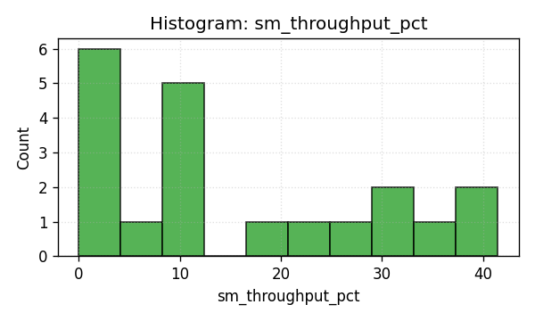

Most kernels cluster at very low SM utilization (<15%), confirming the overall underutilization of compute resources.

**DRAM Throughput (% of Peak)**

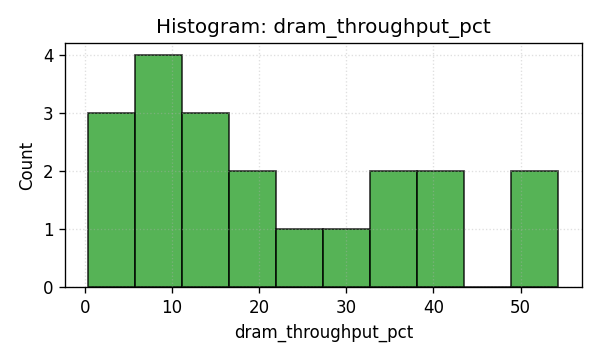

DRAM throughput shows a bimodal distribution with most kernels either very low (<10%) or moderate (20-30%), indicating distinct memory-bound and compute-bound populations.

**Memory Throughput (% of Peak)**

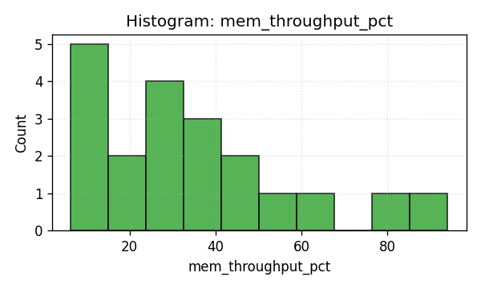

Combined memory throughput metric shows similar bimodal pattern, with memory-bound kernels reaching 40-90% utilization.

**Memory Throughput (GB/s)**

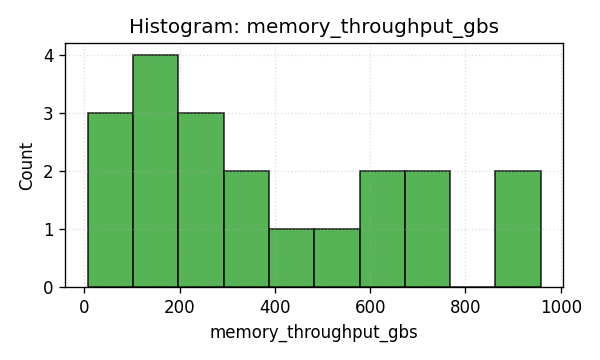

Absolute throughput values show most kernels operate in the 5-400 GB/s range, well below the RTX 5090's theoretical peak.

#### Cache Performance

**L1 Texture Cache Hit Rate**

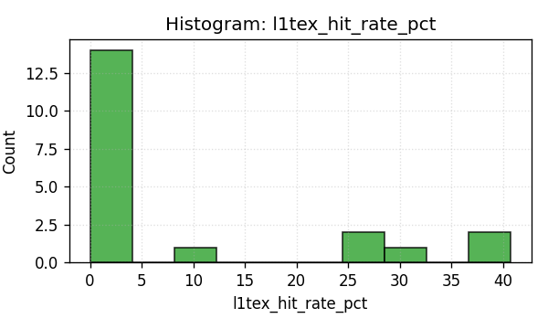

L1 hit rates are extremely poor, with most kernels achieving 0-10% hit rate, indicating working sets exceed L1 capacity or have poor spatial locality.

**L1 Texture Cache Throughput (% of Peak)**

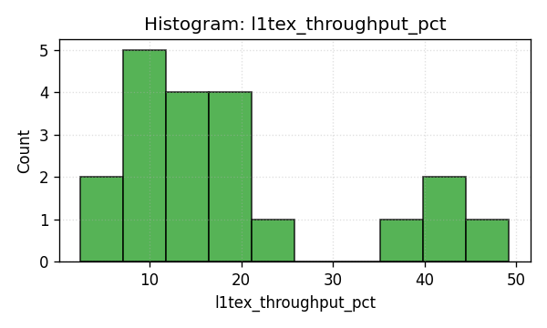

L1 throughput shows wide distribution from 2-50%, suggesting varied cache access patterns across kernel types.

**L2 Cache Hit Rate**

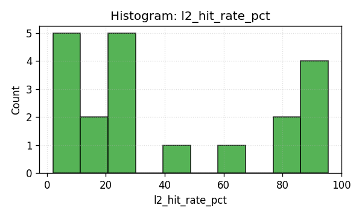

L2 hit rates are better than L1, clustering around 15-90%, suggesting working sets partially fit in L2 and benefit from temporal reuse.

**L2 Cache Throughput (% of Peak)**

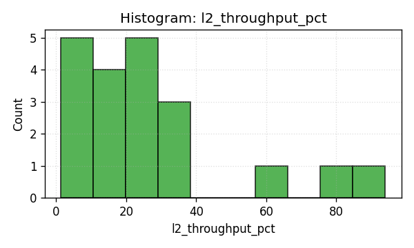

L2 throughput shows most kernels in the 1-30% range, with some outliers at 80-90% indicating heavy L2 traffic.

#### Occupancy Metrics

**Achieved Occupancy**

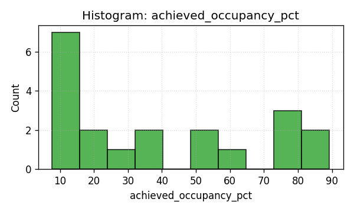

Achieved occupancy is highly varied, ranging from near 0% to 90%, with many kernels in the 7-40% range indicating insufficient parallelism.

**Theoretical Occupancy**

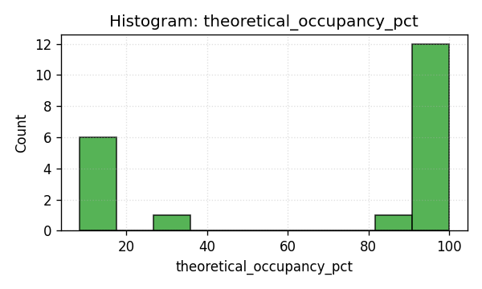

Theoretical occupancy shows most kernels should achieve 80-100% occupancy, but achieved occupancy is much lower, suggesting runtime bottlenecks (memory latency, synchronization) prevent reaching theoretical limits.

#### Kernel Duration and Memory Activity

**Kernel Duration**

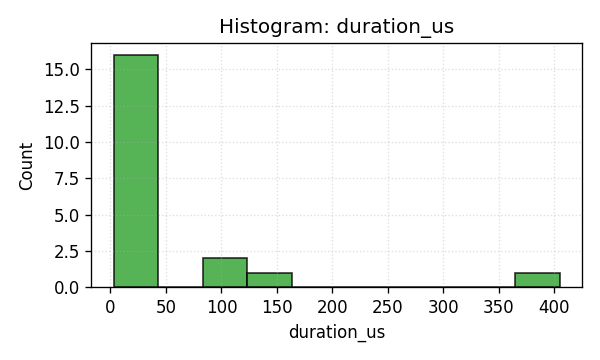

Kernel durations span roughly 2–405 μs (long‑tailed), with most kernels being short‑lived (<10 μs), potentially suffering from launch overhead relative to compute time. The upper tail includes CUTLASS GEMM kernels (e.g., 404.70 μs).

**Memory Busy Percentage**

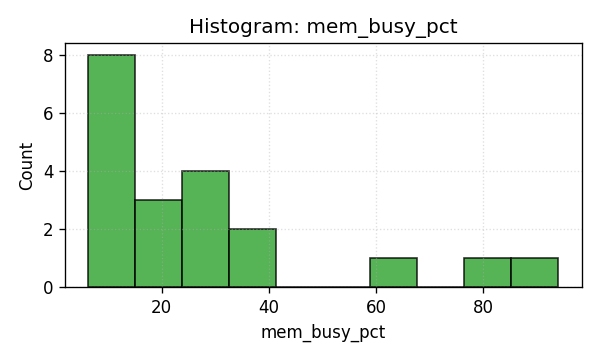

Memory subsystem busy time shows wide variation, with memory-bound kernels keeping memory busy 20-90% of the time.

**Maximum Bandwidth Utilization**

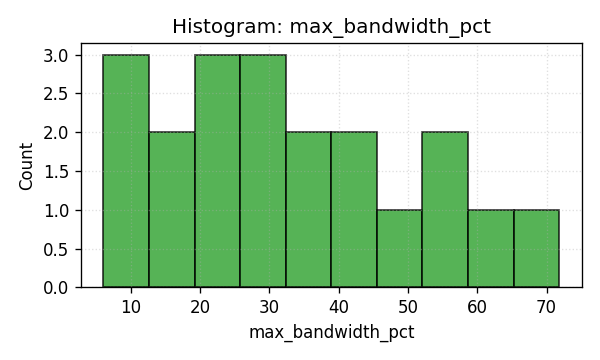

Peak bandwidth utilization across all memory types shows most kernels reach only 5-50% of maximum available bandwidth.

These histograms reveal the distribution of performance characteristics across all profiled kernels and help identify common patterns and outliers.

### Roofline Analysis

Roofline analysis provides a visual representation of kernel performance relative to hardware limits, plotting arithmetic intensity (FLOPs per byte) against achieved performance (FLOP/s).

#### Normalized Roofline

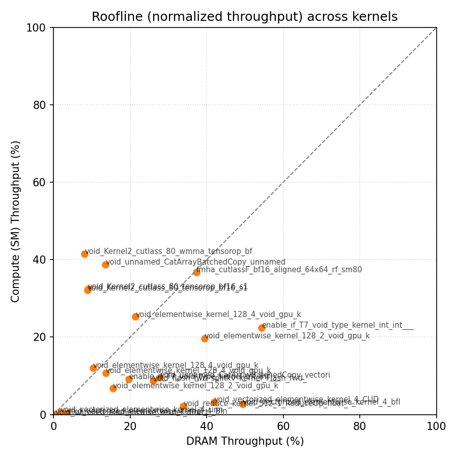

The normalized roofline plot shows kernel performance relative to theoretical peaks. Key observations:
- Most kernels cluster in the **low arithmetic intensity region** (< 100 FLOPs/byte), indicating they are memory-bound
- Very few kernels approach the **compute roof** (horizontal line at the top); the memory roof is the diagonal line
- The gap between actual performance and the roofline indicates significant optimization headroom

#### Physical Roofline

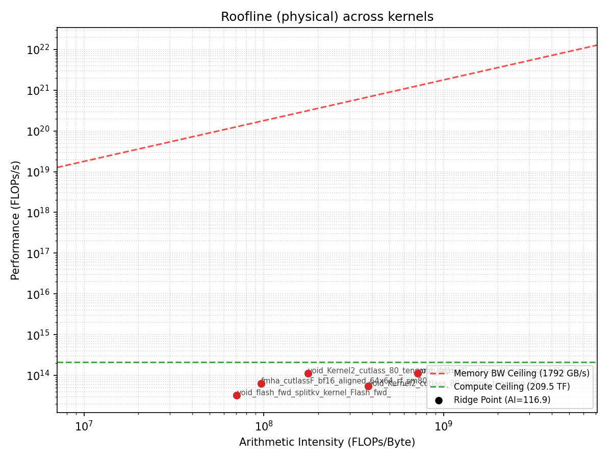

The physical roofline shows actual hardware throughput characteristics with real bandwidth and compute limits for the RTX 5090. This plot confirms:
- **Memory-bound kernels** (left side) are constrained by DRAM bandwidth, achieving <500 GFLOP/s despite varying arithmetic intensity
- **Compute-bound kernels** (right side) show higher FLOP/s but still operate well below peak tensor core throughput
- The **transition point** between memory-bound and compute-bound occurs around 50-100 FLOPs/byte for this workload

Individual per-kernel roofline plots (both normalized and physical) are available in `ncu-v2/analysis/roofline_per_kernel/` for detailed analysis of specific kernels.

**Roofline Interpretation:**
- **Memory-bound kernels** (45% of profiled kernels) cluster in the low arithmetic intensity region, constrained by memory bandwidth rather than compute throughput. These kernels would benefit from memory access optimizations, kernel fusion, and data layout improvements.
- **Compute-bound kernels** (20% of profiled kernels) appear in the higher arithmetic intensity region but still operate at only ~34% SM throughput, suggesting inefficient tensor core utilization or insufficient parallelism.
- **Balanced kernels** (35% of profiled kernels) fall in the transition region with very low resource utilization across all metrics, indicating they are neither efficiently using memory nor compute.

The roofline analysis confirms that the majority of kernels are operating well below both the memory bandwidth roof and the compute roof, indicating substantial optimization headroom—most kernels achieve less than 50% of their theoretical performance ceiling.

## Conclusions

### Summary of Findings

1. **Complete Profiling Coverage**: Successfully profiled all 20 top kernels with 100% data coverage.

2. **GEMV Bottleneck (49.2% of time)**: The autoregressive decode phase is dominated by cuBLAS GEMV operations, which is expected for single‑token generation. These operations are inherently memory‑bound with poor compute utilization on modern GPUs.

3. **Low Hardware Utilization (absolute)**:
   - SM throughput 15.75%
   - Memory throughput 34.62%
   - Achieved occupancy 39.51%
   - Indicates substantial underutilization with room for optimization

4. **Memory Hierarchy**:
   - L1 hit rate is poor at 8.96%
   - L2 hit rate is 39.95%
   - Suggests kernel_0009 (memory‑efficient attention) and kernel_0016 (CUTLASS GEMM) have poor cache locality

5. **Kernel Fusion Opportunities**: The prevalence of small elementwise operations (multiply, add, activation functions) consuming 21.7% of time suggests significant potential for kernel fusion to reduce memory traffic and launch overhead.

6. **Mixed Precision Overhead**: Frequent BF16 ↔ FP32 conversions (6% of time in copy/cast operations) indicate suboptimal data type management.

7. **Attention Kernel Insights**:
   - **kernel_0009** (Memory‑Efficient Attention): 160.74 μs execution time, classified as balanced, indicating it underutilizes both compute and memory
   - Comparison with FlashAttention (10.34 μs) shows 15.5x difference, highlighting the efficiency gains of different attention implementations
   - Suggests opportunities to replace memory‑efficient attention with FlashAttention variants

8. **Compute‑Bound Share**: 4 compute‑bound kernels (20% of total). These kernels average 137.44 μs—significantly longer than memory‑bound (9.67 μs) or balanced (39.75 μs) kernels.

### Performance Bottlenecks Identified

1. **Decode-phase GEMV Inefficiency**: Single-token autoregressive generation results in batch-1 GEMV operations that cannot effectively utilize tensor cores or achieve high memory bandwidth.

2. **Insufficient Parallelism**: Low occupancy across all kernel types indicates the model is not generating enough parallel work to saturate the RTX 5090's massive parallelism (21,760 CUDA cores, 680 Tensor Cores).

3. **Memory Hierarchy Underutilization**: Poor cache hit rates suggest that:
   - Working sets don't fit in L1 cache
   - Temporal reuse is not being exploited effectively
   - Prefetching and memory access patterns are suboptimal

4. **Kernel Launch Overhead**: The large number of small, short-running kernels (many < 5 μs) suggests that kernel launch overhead may be significant relative to actual compute time.

### Recommendations for Optimization

1. **Continuous Batching**: Implement continuous batching or speculative decoding to increase batch size during decode, converting GEMV operations to more efficient GEMM operations.

2. **Kernel Fusion**:
   - Fuse elementwise operations (multiply, add, activations) into single kernels
   - Combine layernorm + linear + activation into fused operators
   - Explore torch.compile or custom CUDA kernels for critical paths

3. **KV-Cache Optimization**:
   - Implement paged attention to improve KV-cache memory access patterns
   - Use FlashDecoding or similar techniques optimized for decode phase
   - Consider quantized KV-cache (INT8/INT4) to reduce memory bandwidth pressure

4. **Memory Layout Optimization**:
   - Minimize BF16 ↔ FP32 conversions by keeping more operations in BF16
   - Use in-place operations where possible to eliminate copies
   - Optimize tensor layouts for contiguous memory access

5. **Increase Parallelism**:
   - Larger batch sizes through batching multiple requests
   - Prefill-decode disaggregation to run prefill and decode on separate instances
   - Multi-query/grouped-query attention to reduce memory bandwidth in decode

### Recommendations for Future NPU Design (Inference-Oriented)

Based on the profiling results, the following architectural considerations are recommended for an inference-optimized NPU targeting vision-language models like DeepSeek-OCR:

#### 1. Tensor Core / CUDA Core Balance

**Finding**: 20% of profiled kernels are compute‑bound, and even these achieve only ~34% SM throughput.

**Recommendation**:
- **Reduce tensor core density** compared to training-oriented GPUs (e.g., 30-40% of die area vs. 50%+ on H100)
- **Increase CUDA core count** for elementwise operations and memory-bound workloads
- Provide specialized units for common activation functions (GELU, SiLU, LayerNorm) that currently run as separate kernels
- Consider dedicated int4/int8 tensor cores optimized for quantized inference

#### 2. Memory Bandwidth Requirements

**Finding**: Overall average memory throughput of 34.62%; memory‑bound kernels average 41.20% throughput, still below saturation.

**Recommendation**:
- **Memory bandwidth can be lower** than training GPUs without sacrificing performance for these workloads
- **Target 2-3 TB/s** for a high-end inference NPU (vs. 3.35 TB/s on H100)
- Invest savings from reduced bandwidth in larger on-chip caches
- Prioritize HBM latency over bandwidth for decode-phase operations

#### 3. L1 / L2 Cache Ratio and Sizing

**Finding**: L1 hit rate of 8.96%, L2 hit rate of 39.95%, suggesting working sets exceed L1 but only partially fit in L2.

**Recommendation**:
- **Increase L2 cache significantly** (target: 128–256 MB vs. 40 MB on A100; 50 MB on H100)
- **Decrease L1 cache** or make it more configurable (allow trading L1 for shared memory)
- Implement **victim cache** between L1 and L2 to capture evicted data
- Add **KV-cache-specific buffers** with high-bandwidth on-chip SRAM (32-64 MB) to reduce DRAM traffic for attention
- Optimize cache replacement policies for transformer access patterns (sequential KV-cache access)

#### 4. Specialized Decode Units

**Finding**: 49.2% of time in GEMV operations with poor utilization.

**Recommendation**:
- **Dedicated GEMV accelerators** optimized for batch-1, low-latency matrix-vector products
- **Systolic array configured for decode**: narrower (e.g., 128 columns vs. 256+) but deeper to pipeline multiple small GEMVs
- **Weight-stationary dataflow** to keep weight matrices on-chip for repeated decode steps
- Consider **in-SRAM compute** for small fully-connected layers to eliminate DRAM access

#### 5. Operator Fusion Hardware

**Finding**: 21.7% of time in small elementwise kernels that could be fused.

**Recommendation**:
- **Programmable fusion engine** that can combine multiple operations without round-trips to memory
- Support common fusion patterns: `linear → activation`, `add → layernorm`, `multiply → add → activation`
- **Macro-op ISA** allowing specification of fused operation sequences
- Hardware support for dynamic control flow to enable efficient in-kernel branching

#### 6. Precision and Data Type Support

**Finding**: BF16 dominates, but 6% overhead in conversions; mixed precision is common.

**Recommendation**:
- **Native BF16 as primary datatype** throughout the pipeline
- **Hardware-accelerated FP8** for weights and activations (E4M3/E5M2) with minimal overhead
- **INT4/INT8 support** in tensor cores for extreme quantization
- **Per-channel dynamic range** hardware for fine-grained quantization
- Minimal conversion overhead between formats (single-cycle conversions)

#### 7. Parallelism and Occupancy

**Finding**: Achieved occupancy around 39% indicates insufficient parallelism for available resources.

**Recommendation**:
- **Reduce SM count** compared to training GPUs (e.g., 60-80 SMs vs. 132 on H100)
- **Deeper pipelines per SM** to extract more instruction-level parallelism
- **Larger warp/thread group sizes** to amortize control overhead
- **Better latency hiding** mechanisms specifically tuned for decode-phase access patterns
- Support for **fine-grained batching** in hardware to group multiple single-token operations

#### 8. Interconnect and Multi-Chip Scaling

**Recommendation**:
- **Lower inter-chip bandwidth** requirements (300-500 GB/s vs. 900 GB/s NVLink) since inference has less all-reduce traffic
- **Optimized for pipeline parallelism** and tensor parallelism with less emphasis on data parallelism
- **Asymmetric topologies** allowing prefill instances to be separate from decode instances
- **Fast KV-cache exchange** for disaggregated prefill-decode architectures

#### 9. Power Efficiency

**Recommendation**:
- **Target 3-5x higher TOPS/W** than training GPUs by reducing tensor core density and memory bandwidth
- **Aggressive clock gating** for unused tensor cores during memory-bound phases
- **DVFS optimized for inference latency targets** (e.g., P99 latency rather than throughput)
- **Specialized low-power modes** for decode phase vs. prefill phase

---

**Profiling Artifacts**: All raw data, metrics, histograms, roofline plots, and analysis scripts are available in the `reports/20251107-dsocr/ncu-v2/analysis/` directory.

---

## Appendix: Methodology Details

This section summarizes collection settings and the rule used to classify kernels.

- Nsight Systems: CUDA timeline gated via NVTX on the decode phase to select top kernels by total time.
- Nsight Compute: Sections collected include SpeedOfLight, MemoryWorkloadAnalysis, Roofline, and Occupancy; kernel names recorded with full signatures.
- Peaks for roofline:
  - Compute peak: device BF16/Tensor Core peak performance for the RTX 5090 (Blackwell).
  - Memory peak: theoretical GDDR7 bandwidth (≈1.79 TB/s) and measured effective bandwidth from NCU; the ridge point uses the effective bandwidth.
- Ridge point: computed as P_peak / BW_eff; for this workload it falls in the ~50–100 FLOPs/byte range depending on measured BW_eff.
- Classification rule:
  - Memory‑bound: arithmetic intensity < ridge point and memory throughput meaningfully higher than SM throughput.
  - Compute‑bound: arithmetic intensity ≥ ridge point and SM/Tensor utilization meaningfully higher than memory throughput.
  - Balanced: neither memory nor compute utilization approaches their respective roofs (low across both dimensions).

## Appendix: Full Kernel Function Names

This appendix provides the complete, unabbreviated kernel function names for traceability and debugging purposes. These correspond to the kernels listed in the "Top Kernels by Total Time" section.

### Kernel Name Mapping Table

The following table maps human-friendly kernel names to their full mangled function signatures as they appear in profiler outputs.

| Rank | Time % | Friendly Kernel Name | Library | Full Function Signature |
|------|--------|---------------------|---------|-------------------------|
| 1 | 34.4% | GEMV-1 (BF16, template=7) | cuBLAS | `std::enable_if<!T7, void>::type internal::gemvx::kernel<int, int, __nv_bfloat16, __nv_bfloat16, __nv_bfloat16, float, (bool)0, (bool)1, (bool)1, (bool)0, (int)7, (bool)0, cublasGemvParamsEx<int, cublasGemvTensorStridedBatched<const __nv_bfloat16>, cublasGemvTensorStridedBatched<const __nv_bfloat16>, cublasGemvTensorStridedBatched<__nv_bfloat16>, float>>(T13)` |
| 2 | 14.8% | GEMV-2 (BF16, template=6) | cuBLAS | `std::enable_if<!T7, void>::type internal::gemvx::kernel<int, int, __nv_bfloat16, __nv_bfloat16, __nv_bfloat16, float, (bool)0, (bool)1, (bool)1, (bool)0, (int)6, (bool)0, cublasGemvParamsEx<int, cublasGemvTensorStridedBatched<const __nv_bfloat16>, cublasGemvTensorStridedBatched<const __nv_bfloat16>, cublasGemvTensorStridedBatched<__nv_bfloat16>, float>>(T13)` |
| 3 | 6.0% | Direct Copy (float) | PyTorch ATen | `void at::native::unrolled_elementwise_kernel<at::native::direct_copy_kernel_cuda(at::TensorIteratorBase &)::[lambda() (instance 3)]::operator ()() const::[lambda() (instance 7)]::operator ()() const::[lambda(float) (instance 1)], std::array<char *, (unsigned long)2>, (int)4, TrivialOffsetCalculator<(int)1, unsigned int>, TrivialOffsetCalculator<(int)1, unsigned int>, at::native::memory::LoadWithCast<(int)1>, at::native::memory::StoreWithCast<(int)1>>(int, T1, T2, T4, T5, T6, T7)` |
| 4 | 4.2% | Elementwise Multiply (BF16, vec) | PyTorch ATen | `void at::native::vectorized_elementwise_kernel<(int)4, at::native::BinaryFunctor<c10::BFloat16, c10::BFloat16, c10::BFloat16, at::native::binary_internal::MulFunctor<float>>, std::array<char *, (unsigned long)3>>(int, T2, T3)` |
| 5 | 3.9% | SiLU Activation (BF16, vec) | PyTorch ATen | `void at::native::vectorized_elementwise_kernel<(int)4, at::native::<unnamed>::silu_kernel(at::TensorIteratorBase &)::[lambda() (instance 1)]::operator ()() const::[lambda() (instance 6)]::operator ()() const::[lambda(c10::BFloat16) (instance 1)], std::array<char *, (unsigned long)2>>(int, T2, T3)` |
| 6 | 2.9% | Elementwise Multiply (BF16) | PyTorch ATen | `void at::native::elementwise_kernel<(int)128, (int)4, void at::native::gpu_kernel_impl_nocast<at::native::BinaryFunctor<c10::BFloat16, c10::BFloat16, c10::BFloat16, at::native::binary_internal::MulFunctor<float>>>(at::TensorIteratorBase &, const T1 &)::[lambda(int) (instance 1)]>(int, T3)` |
| 7 | 2.8% | Cat Batched Copy (vec, 128-tile) | PyTorch ATen | `void at::native::<unnamed>::CatArrayBatchedCopy_vectorized<at::native::<unnamed>::OpaqueType<(unsigned int)2>, unsigned int, (int)3, (int)128, (int)1, (int)16, (int)8>(char *, at::native::<unnamed>::CatArrInputTensorMetadata<T1, T2, T4, T5>, at::native::<unnamed>::TensorSizeStride<T2, (unsigned int)4>, int, T2)` |
| 8 | 2.7% | Copy/Cast (BF16, vec) | PyTorch ATen | `void at::native::vectorized_elementwise_kernel<(int)4, at::native::bfloat16_copy_kernel_cuda(at::TensorIteratorBase &)::[lambda(float) (instance 1)], std::array<char *, (unsigned long)2>>(int, T2, T3)` |
| 9 | 2.4% | Flash Forward Split-KV (BF16) | FlashAttention | `void flash::flash_fwd_splitkv_kernel<Flash_fwd_kernel_traits<(int)128, (int)64, (int)128, (int)4, (bool)0, (bool)0, cutlass::bfloat16_t, Flash_kernel_traits<(int)128, (int)64, (int)128, (int)4, cutlass::bfloat16_t>>, (bool)0, (bool)0, (bool)0, (bool)0, (bool)1, (bool)0, (bool)1, (bool)0>(flash::Flash_fwd_params)` |
| 10 | 2.0% | Elementwise Add (BF16, vec) | PyTorch ATen | `void at::native::vectorized_elementwise_kernel<(int)4, at::native::CUDAFunctor_add<c10::BFloat16>, std::array<char *, (unsigned long)3>>(int, T2, T3)` |
| 11 | 1.8% | Cat Batched Copy (vec, 64-tile) | PyTorch ATen | `void at::native::<unnamed>::CatArrayBatchedCopy<at::native::<unnamed>::OpaqueType<(unsigned int)2>, unsigned int, (int)4, (int)64, (int)64>(T1 *, at::native::<unnamed>::CatArrInputTensorMetadata<T1, T2, T4, T5>, at::native::<unnamed>::TensorSizeStride<T2, (unsigned int)4>, int, T2)` |
| 12 | 1.8% | Elementwise Multiply (float) | PyTorch ATen | `void at::native::elementwise_kernel<(int)128, (int)2, void at::native::gpu_kernel_impl_nocast<at::native::BinaryFunctor<float, float, float, at::native::binary_internal::MulFunctor<float>>>(at::TensorIteratorBase &, const T1 &)::[lambda(int) (instance 1)]>(int, T3)` |
| 13 | 1.6% | Mean Reduction (float) | PyTorch ATen | `void at::native::reduce_kernel<(int)512, (int)1, at::native::ReduceOp<float, at::native::MeanOps<float, float, float, float>, unsigned int, float, (int)4, (int)4>>(T3)` |
| 14 | 1.5% | Elementwise Neg (BF16) | PyTorch ATen | `void at::native::elementwise_kernel<(int)128, (int)4, void at::native::gpu_kernel_impl_nocast<at::native::neg_kernel_cuda(at::TensorIteratorBase &)::[lambda() (instance 2)]::operator ()() const::[lambda() (instance 9)]::operator ()() const::[lambda(c10::BFloat16) (instance 1)]>(at::TensorIteratorBase &, const T1 &)::[lambda(int) (instance 1)]>(int, T3)` |
| 15 | 1.4% | Flash Split-KV Combine | FlashAttention | `void flash::flash_fwd_splitkv_combine_kernel<Flash_fwd_kernel_traits<(int)128, (int)64, (int)128, (int)4, (bool)0, (bool)0, cutlass::bfloat16_t, Flash_kernel_traits<(int)128, (int)64, (int)128, (int)4, cutlass::bfloat16_t>>, (int)4, (int)3, (bool)1>(flash::Flash_fwd_params)` |
| 16 | 1.3% | TopK Gather (float) | PyTorch ATen | `void at::native::sbtopk::gatherTopK<float, unsigned int, (int)1, (bool)0>(at::cuda::detail::TensorInfo<const T1, T2>, T2, T2, bool, T2, T2, at::cuda::detail::TensorInfo<T1, T2>, T2, at::cuda::detail::TensorInfo<long, T2>, T2, T1 *)` |
| 17 | 1.2% | Index Put (elementwise) | PyTorch ATen | `void at::native::index_elementwise_kernel<(int)128, (int)4, void at::native::gpu_index_kernel<void at::native::index_put_kernel_impl<at::native::OpaqueType<(int)2>>(at::TensorIterator &, c10::ArrayRef<long>, c10::ArrayRef<long>)::[lambda(char *, const char *, long) (instance 1)]>(at::TensorIteratorBase &, c10::ArrayRef<long>, c10::ArrayRef<long>, const T1 &, bool)::[lambda(int) (instance 1)]>(long, T3)` |
| 18 | 1.2% | Bitonic Sort (KV in-place) | PyTorch ATen | `void at::native::bitonicSortKVInPlace<(int)-2, (int)-1, (int)16, (int)16, long, long, at::native::LTOp<long, (bool)1>, unsigned int>(at::cuda::detail::TensorInfo<T5, T8>, T8, T8, T8, at::cuda::detail::TensorInfo<T6, T8>, T8, T7)` |
| 19 | 1.1% | Elementwise Multiply (float, vec) | PyTorch ATen | `void at::native::vectorized_elementwise_kernel<(int)4, at::native::AUnaryFunctor<float, float, float, at::native::binary_internal::MulFunctor<float>>, std::array<char *, (unsigned long)2>>(int, T2, T3)` |
| 20 | 1.0% | Sum Reduction (float) | PyTorch ATen | `void at::native::reduce_kernel<(int)128, (int)4, at::native::ReduceOp<float, at::native::func_wrapper_t<float, at::native::sum_functor<float, float, float>::operator ()(at::TensorIterator &)::[lambda(float, float) (instance 1)]>, unsigned int, float, (int)4, (int)4>>(T3)` |

### Notes on Function Name Interpretation

**Template Parameters:**
- Values in angle brackets `< >` encode compile-time configuration
- Data types: `__nv_bfloat16`, `float`, `c10::BFloat16`, `cutlass::bfloat16_t`
- Tile sizes: e.g., `(int)128, (int)64, (int)128, (int)4` for block/warp/thread configuration
- Boolean flags: `(bool)0` (false) and `(bool)1` (true) control kernel behavior variants

**Mangled Names:**
- `T1`, `T2`, `T3`, etc. are C++ template parameter placeholders
- `T13` in cuBLAS refers to parameter pack expansion

**Lambda Expressions:**
- `[lambda() (instance N)]` are anonymous functions generated by PyTorch's functional programming patterns
- Instance numbers differentiate multiple lambdas with similar signatures

**Namespace Prefixes:**
- `at::native::` - PyTorch ATen (A Tensor Library) native CUDA kernels
- `internal::gemvx::` - cuBLAS internal generalized matrix-vector product
- `flash::` - FlashAttention library kernels

**Practical Usage:**

This mapping table enables:
1. **Exact string matching** in Nsight Compute `.ncu-rep` files or CSV exports
2. **Filtering profiler outputs** by copying full signatures
3. **Source code tracing** to specific template instantiations in PyTorch/cuBLAS/CUTLASS
4. **Cross-referencing** with per-kernel roofline plots in `ncu-v2/analysis/roofline_per_kernel/`
5. **Automated analysis** by parsing function signatures to extract configuration parameters

**Key Differences Between Similar Kernels:**

- **GEMV-1 vs GEMV-2**: Template parameter `(int)7` vs `(int)6` controls internal tiling strategy
- **Cat Batched Copy variants**: Template parameters `(int)3, (int)128` vs `(int)4, (int)64` specify copy dimensions and tile sizes
- **Vectorized vs non-vectorized elementwise**: `vectorized_elementwise_kernel` uses vector loads/stores (template param `(int)4` = 4-element vectors)
