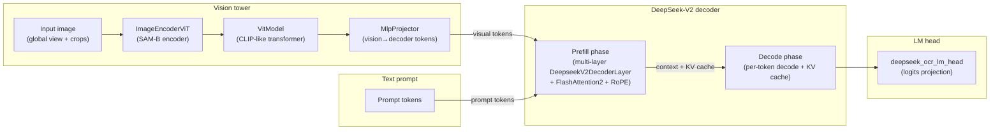

# DeepSeek-OCR Analytic Architecture and Ops (ModelMeter)

This document describes the analytic architecture and operator-level decomposition of the DeepSeek-OCR 3B model as implemented in `extern/modelmeter/models/deepseek_ocr`, focusing on layers, tensor shapes, and closed-form FLOP/IO formulas rather than end-to-end performance metrics.

The analytic model is configured via Hydra using `extern/modelmeter/models/deepseek_ocr/configs/deepseek_ocr.yaml`, which composes: - `hf: deepseek_ocr_3b` for architecture metadata (hidden size, number of layers, heads, MoE layout, etc.) - `runtime: analytic_defaults` for sequence lengths, batch size, and general analysis parameters - `vision: deepseek_ocr_base` for the SAM + CLIP + projector vision tower - `decoder: deepseek_ocr_base` for DeepSeek-V2 decoder blocks - `head: deepseek_ocr_lm_head` for the LM head projection - `model: deepseek_ocr_root.default` (or `deepseek_ocr_root.default.no_crop`) for the root `DeepseekOCRModel` analytic factory

At a high level, the analytic topology follows the vendor DeepSeek-OCR architecture:
- Vision branch
  - Input image (global padded view and optional dynamic crops) is processed by a SAM-B style encoder (`ImageEncoderViT`) to produce dense visual features.
  - A CLIP-like vision transformer (`VitModel` built from `NoTPTransformerBlock` and `Attention` / `NoTPAttention` / `MLPBlock` / `NoTPFeedForward`) consumes SAM features and produces a sequence of semantic visual tokens.
  - `MlpProjector` reduces and projects the concatenated SAM + CLIP tokens into the decoder embedding space, yielding a sequence of visual tokens compatible with the text decoder.
- Decoder branch
  - A stack of `num_hidden_layers` `DeepseekV2DecoderLayer` blocks implements the text decoder, combining LLaMA-style attention (FlashAttention2 + RoPE), DeepSeek-V2 MLP or MoE experts, and RMSNorm.
  - The decoder operates in two phases: a prefill phase over the full context (visual tokens + prompt tokens) and a decode phase that runs one token at a time and updates a KV cache.
- Head
  - The LM head `deepseek_ocr_lm_head` projects decoder hidden states to vocabulary logits.



The remainder of this document summarizes the analytic layer types and their per-op FLOP/IO breakdowns.

For reference, a static `torchinfo` pass over the vendor DeepSeek-OCR checkpoint (`reports/20211117-dsorc-op-analysis/static-20251118-130533/torchinfo-layers.json`, run with `base_size=1024`, `image_size=640`, `crop_mode=true`) reports `total_params = 3,170,627,840` and `param_bytes = 6,341,255,680`, which corresponds to ≈5.9 GiB (≈6.3 GB) of half-precision weights to hold the full model parameters in memory.

## 1 Layer Inventory by Subpackage (Non-core Layers)

### 1.1 Vision Layers (`layers/vision`)

- **PatchEmbed** (`patch_embed.py`): Conv2d-based patch embedding that maps images of shape `(B, C_in, H, W)` to a grid of patch embeddings; FLOPs are dominated by Tensor Core convolution math `2 * B * H_out * W_out * kernel_h * kernel_w * C_in * C_out`, while I/O counts input and output activations and memory tracks weights plus patch-embedded features.
- **Attention** (`attention.py`): SAM-style 2D attention over windowed or global spatial regions, treating windows as an effective batch dimension; decomposes FLOPs into QKV projections, relative position bias, SDPA matmuls, and output projection, and reports activation I/O for inputs, QKV, and outputs.
- **MLPBlock** (`mlp_block.py`): Two-layer feed-forward block inside SAM vision transformer blocks with Tensor Core matmuls for `embedding_dim → mlp_dim → embedding_dim` and CUDA-core GELU activations; I/O covers input, hidden, and output activations.
- **Block** (`block.py`): Composite SAM-style vision transformer block that aggregates an `Attention` sublayer and `MLPBlock` plus small LayerNorm and window-partition overhead; FLOPs and I/O are the sums of its children plus optional norm FLOPs.
- **LayerNorm2d** (`layer_norm2d.py`): NCHW LayerNorm used in the convolutional neck, modeled as a CUDA-core-dominated kernel with FLOPs proportional to `5 * B * C * H * W` and I/O approximated as a few reads and writes of the feature tensor.
- **CLIPVisionEmbeddings** (`clip_vision_embeddings.py`): CLIP-style embeddings combining patch embeddings, a CLS token, and positional embeddings; can reuse precomputed patch embeddings from SAM (zero conv FLOPs) or include patch-embedding FLOPs via an internal `PatchEmbed` instance, while counting embedding activations in I/O and memory.
- **NoTPAttention** (`notp_attention.py`): CLIP-L NoTP multi-head attention with QKV and output projections plus SDPA matmuls; uses Tensor Core FLOPs for GEMMs and typically ignores small CUDA-core softmax and masking work, while I/O counts input, QKV, and output activations.
- **NoTPFeedForward** (`notp_feedforward.py`): CLIP-L QuickGELU-based MLP modeled as two Tensor-Core matmuls plus CUDA-core activation work; I/O includes input, hidden, and output activations in fp16/bf16.
- **NoTPTransformerBlock** (`notp_transformer_block.py`): Aggregates a `NoTPAttention` and `NoTPFeedForward` sublayer plus LayerNorm overhead into a single transformer block, summing FLOPs, I/O, and memory and attributing extra norm FLOPs to CUDA cores.
- **NoTPTransformer** (`notp_transformer.py`): Wrapper around a sequence of `NoTPTransformerBlock` instances representing the full CLIP-L transformer depth; purely aggregates FLOPs, I/O, and memory across blocks and provides stack-level arithmetic intensity.
- **ImageEncoderViT** (`image_encoder_vit.py`): SAM-B encoder built from `PatchEmbed`, a stack of `Block` instances with windowed/global attention, and a convolutional neck that includes `LayerNorm2d`; FLOPs and I/O reflect both conv and transformer components and scale with image size, window size, and depth.
- **VitModel** (`vit_model.py`): Wrapper around `CLIPVisionEmbeddings` and `NoTPTransformer`, plus a final LayerNorm modeled as CUDA-core work; aggregates their FLOPs and I/O and exposes combined parameter and activation footprints for the CLIP tower via memory methods.
- **MlpProjector** (`mlp_projector.py`): Vision-to-decoder projector that can be identity, linear, or a small MLP stack over concatenated SAM+CLIP tokens; Tensor Core matmuls for projection layers and optional CUDA-core GELU activations, with I/O proportional to the number of vision tokens and embedding dimensions.
- **VisionWorkload helpers** (`vision_workload.py`): Shape-only utilities (not `BaseLayer`s) that reconstruct vendor-style crop layouts and token counts (global vs crops) from image geometry, patch size, and downsample ratio so that analytic configs and scripts can derive vision FLOPs and I/O purely from shapes.

### 1.2 Decoder Layers (`layers/decoder`)

- **DeepseekV2MLP** (`deepseek_v2_mlp.py`): SwiGLU feed-forward network used in DeepSeek-V2 decoder blocks and MoE experts, with Tensor Core FLOPs approximated as `6 * B * S * h * i` for gate/up/down projections and CUDA-core FLOPs for SwiGLU activation and gated multiplication; I/O accounts for input, intermediate, and output activations.
- **MoEGate** (`moe_gate.py`): MoE routing gate that scores tokens over experts and selects the top-`k_active`; uses Tensor Core GEMMs for the hidden-to-experts projection and CUDA-core work for softmax, top-k, and normalization, with I/O covering gate inputs, logits, and top-k routing weights.
- **DeepseekV2MoE** (`deepseek_v2_moe.py`): MoE block combining `MoEGate`, a routed experts MLP (`DeepseekV2MLP` with effective batch `B * k_active`), and an optional shared-expert MLP; aggregates FLOPs, I/O, and memory across routed and shared experts for a static `(B, S, h)` workload.
- **DeepseekV2RMSNorm** (`deepseek_v2_rms_norm.py`): RMSNorm normalization in decoder blocks, modeled as a CUDA-core operation with FLOPs `≈ 3 * B * S * d`, zero Tensor Core FLOPs, and I/O plus parameter memory proportional to the hidden size.
- **DeepseekV2DecoderLayer** (`deepseek_v2_decoder_layer.py`): Full DeepSeek-V2 decoder block composed of two `DeepseekV2RMSNorm` instances, an attention primitive (`LlamaFlashAttention2` or `LlamaAttention`), and either `DeepseekV2MLP` or `DeepseekV2MoE`; tracks a simple prefill/decode stage and a `SyntheticKVCache` meta-object so FLOPs, I/O, and KV-cache memory can be interpreted for either prefill or decode shapes.
- **LMHead** (`lm_head.py`): Final decoder projection from hidden size `h` to vocabulary size `V` modeled as a single Tensor-Core matmul with FLOPs `2 * B * S * h * V`, negligible CUDA-core work, I/O for hidden states and logits, and stage-aware sequence length for prefill vs per-token decode.

### 1.3 LLaMA Layers and Primitives (`layers/llama`)

- **LlamaAttention** (`llama_attention.py`): Non-flash LLaMA attention path (standard SDPA) with FLOP formulas aligned to FlashAttention2 but representing the unfused path that PyTorch’s flop counter sees; supports prefill and decode shapes via separate query and KV lengths and attributes all matmul math to Tensor Cores.
- **LlamaFlashAttention2** (`llama_flash_attention2.py`): Fused FlashAttention2 path used in DeepSeek-V2 decoder blocks, with closed-form FLOPs for QKV projections, attention core, and output projection, separate prefill/decode modes (via `set_prefill_shape` and `set_decode_shape`), and I/O and memory methods used in verification and MFU analysis.
- **LlamaRotaryEmbedding** (`llama_rotary_embedding.py`): RoPE primitive modeled as CUDA-core work with FLOPs from the frequency-position matmul and I/O dominated by reading and writing cosine and sine embeddings of shape `(B, S, dim)`, making its arithmetic intensity relatively low but its absolute contribution small compared to attention matmuls.

## 2 Layer-Level Reference

#### 2.1 Vision Layers

##### 2.1.1 PatchEmbed (`layers/vision/patch_embed.py`)

**What it is**  
Conv2d-based patch embedding that maps input images `(B, C_in, H, W)` to a grid of patch embeddings `(B, H_out, W_out, C_out)` with channel dimension `C_out = embed_dim`, matching the SAM encoder’s `PatchEmbed` output layout.

**Pseudo-code (PyTorch-style)**

``` python
# x: (B, C_in, H, W)
x_conv = conv2d(
    x,
    weight,
    bias,
    stride=(patch_size, patch_size),
    kernel_size=(patch_size, patch_size),
    padding=padding,
)                          # (B, C_out, H_out, W_out)
x_out = x_conv.permute(0, 2, 3, 1)  # (B, H_out, W_out, C_out)
```

**FLOPs (forward)**  
Let `K = patch_size`, `B = batch_size`, `C_in = in_chans`, `C_out = embed_dim`, `H_out, W_out` be output spatial sizes.  
`F_conv = 2 * B * H_out * W_out * K * K * C_in * C_out` FLOPs.

**I/O (forward)**  
Input activations: `B * C_in * H * W` values.  
Output activations: `B * C_out * H_out * W_out` values.  
Total bytes (fp16/bf16): `(B * C_in * H * W + B * C_out * H_out * W_out) * 2`.  
Total bits: multiply the above by `8`.

##### 2.1.2 Attention (`layers/vision/attention.py`)

**What it is**  
SAM-style 2D multi-head self-attention over windowed or global patches, parameterized by window area `S = window_area` and number of windows `num_windows` treated as effective batch.

**Pseudo-code (PyTorch-style)**

``` python
# x: (B_eff, S, C), where B_eff = num_windows
qkv = linear(x)  # (B_eff, S, 3 * C)
q, k, v = qkv.chunk(3, dim=-1)  # each: (B_eff, S, C)
q = reshape(q, B_eff, num_heads, S, head_dim)
k = reshape(k, B_eff, num_heads, S, head_dim)
v = reshape(v, B_eff, num_heads, S, head_dim)
attn_scores = (q @ k.transpose(-2, -1)) * scale  # (B_eff, num_heads, S, S)
attn_probs = softmax(attn_scores, dim=-1)
context = attn_probs @ v  # (B_eff, num_heads, S, head_dim)
out = linear(reshape(context, B_eff, S, C))  # (B_eff, S, C)
```

**FLOPs (forward, dominant terms)**  
Let `B_eff = num_windows`, `S = window_area`, `C = dim`, `H = num_heads`, `d = C / H`.  
QKV projection: `F_qkv = 2 * B_eff * S * C * (3 * C)`.  
Attention matmuls (`QK^T` and `AV`): `F_sdpa = 2 * B_eff * H * S * S * d * 2`.  
Output projection: `F_out = 2 * B_eff * S * C * C`.  
Total: `F_attn ≈ F_qkv + F_sdpa + F_out`.

**I/O (forward)**  
Input activations: `B_eff * S * C`.  
QKV activations: `B_eff * S * 3 * C`.  
Output activations: `B_eff * S * C`.  
Total activations (values): `B_eff * S * (5 * C)`.  
Bytes (fp16/bf16): multiply by `2`; bits: multiply by `16`.

##### 2.1.3 MLPBlock (`layers/vision/mlp_block.py`)

**What it is**  
Two-layer MLP with GELU used inside SAM vision transformer blocks, mapping `embedding_dim → mlp_dim → embedding_dim` over `B, S` tokens.

**Pseudo-code (PyTorch-style)**

``` python
# x: (B, S, D)
h = linear1(x)  # (B, S, M)
h = gelu(h)     # (B, S, M)
y = linear2(h)  # (B, S, D)
```

**FLOPs (forward)**  
Let `D = embedding_dim`, `M = mlp_dim`, `N = B * S`.  
First linear: `F_1 = 2 * N * D * M`.  
Second linear: `F_2 = 2 * N * M * D`.  
Total Tensor Core FLOPs: `F_mlp_tc = F_1 + F_2`.  
GELU (CUDA-core): `F_gelu ≈ c_act * N * M`, where `c_act` is an activation constant (e.g., 4).

**I/O (forward)**  
Input activations: `N * D`.  
Hidden activations: `N * M`.  
Output activations: `N * D`.  
Total values: `N * (2 * D + M)`; bytes and bits follow as above.

##### 2.1.4 Block (`layers/vision/block.py`)

**What it is**  
Composite SAM-style vision transformer block with pre-norm attention and MLP residual branches plus lightweight norms and window partitioning.

**Pseudo-code (PyTorch-style)**

``` python
# x: (B, S, D)
x = x + attn(norm1(x))  # Attention is vision.Attention
x = x + mlp(norm2(x))   # MLPBlock
```

**FLOPs (forward)**  
Let `F_attn` be FLOPs of inner `Attention`, `F_mlp` for `MLPBlock`, and `F_norm` for LayerNorm/window ops.  
Total: `F_block ≈ F_attn + F_mlp + F_norm` (with `F_norm` typically much smaller).

**I/O (forward)**  
Aggregated from sublayers:  
`IO_block ≈ IO_attn + IO_mlp + IO_norm`, where `IO_*` comes from the respective analytic methods; inputs and outputs have shape `(B, S, D)` at each residual step.

##### 2.1.5 LayerNorm2d (`layers/vision/layer_norm2d.py`)

**What it is**  
2D LayerNorm over NCHW feature maps in the SAM convolutional neck, normalizing channels per pixel for `(B, C, H, W)`.

**Pseudo-code (PyTorch-style)**

``` python
# x: (B, C, H, W)
mean = x.mean(dim=1, keepdim=True)                  # (B, 1, H, W)
var = ((x - mean) ** 2).mean(dim=1, keepdim=True)   # (B, 1, H, W)
x_norm = (x - mean) / (var + eps).sqrt()           # (B, C, H, W)
y = x_norm * weight.view(1, C, 1, 1) + bias.view(1, C, 1, 1)  # (B, C, H, W)
```

**FLOPs (forward)**  
Let `N = B * C * H * W`. LayerNorm2d is approximated as:  
`F_ln ≈ c_ln * N`, with `c_ln ≈ 5` scalar FLOPs per element.

**I/O (forward)**  
Input activations: `N`.  
Output activations: `N`.  
Multiple reads/writes are approximated as a small constant factor `k` (e.g., 4):  
`IO_ln_values ≈ k * N`; bytes and bits follow by scaling by datatype size and 8.

##### 2.1.6 CLIPVisionEmbeddings (`layers/vision/clip_vision_embeddings.py`)

**What it is**  
Embeddings module that produces CLIP-style tokens (CLS + patches) given lower-level features or raw images; optionally includes an internal Conv2d patch embedding.

**Pseudo-code (PyTorch-style)**  
`use_precomputed_patch_embeds=True` case:

``` python
# x_patches: (B, C, H_p, W_p) from SAM
x_tokens = x_patches.flatten(2).transpose(1, 2)  # (B, S, D)
cls = cls_embed.expand(B, 1, D)                  # (B, 1, D)
pos = pos_embed[:, : S + 1, :]                   # (1, S + 1, D)
out = torch.cat([cls, x_tokens], dim=1) + pos    # (B, S + 1, D)
```

`use_precomputed_patch_embeds=False` adds an initial `PatchEmbed` conv on `(B, C_in, H, W)`.

**FLOPs (forward)**  
If `use_precomputed_patch_embeds=True`, FLOPs are negligible (adds/broadcasts).  
If `False`, FLOPs include `F_patch_embed` from the internal `PatchEmbed`; token-level adds for CLS and positions are modeled as small CUDA-core overhead.

**I/O (forward)**  
Token sequence: `B * (S + 1) * D` values (CLS + patches).  
If patch embedding is computed here, I/O also includes image read and patch output like `PatchEmbed`.

##### 2.1.7 NoTPAttention (`layers/vision/notp_attention.py`)

**What it is**  
Standard CLIP-L style multi-head attention over sequences `(B, S, C)` with `num_heads` and no tensor-product tricks.

**Pseudo-code (PyTorch-style)**

``` python
# x: (B, S, C)
qkv = linear(x)                                # (B, S, 3 * C)
q, k, v = qkv.chunk(3, dim=-1)                # each: (B, S, C)
q = q.view(B, S, H, d).transpose(1, 2)        # (B, H, S, d)
k = k.view(B, S, H, d).transpose(1, 2)        # (B, H, S, d)
v = v.view(B, S, H, d).transpose(1, 2)        # (B, H, S, d)
attn = softmax(q @ k.transpose(-2, -1), -1)   # (B, H, S, S)
context = attn @ v                            # (B, H, S, d)
y = linear(context.transpose(1, 2).reshape(B, S, C))  # (B, S, C)
```

**FLOPs (forward, dominant terms)**  
`B, S, C, H, d = C / H` as above.  
`F_qkv = 2 * B * S * C * (3 * C)`  
`F_sdpa = 2 * B * H * S * S * d * 2`  
`F_out = 2 * B * S * C * C`  
Total: `F_notp_attn ≈ F_qkv + F_sdpa + F_out`.

**I/O (forward)**  
Input: `B * S * C`.  
QKV: `B * S * 3 * C`.  
Output: `B * S * C`.  
Total activations: `B * S * (5 * C)`; bytes/bits as before.

##### 2.1.8 NoTPFeedForward (`layers/vision/notp_feedforward.py`)

**What it is**  
QuickGELU-based feed-forward MLP used in CLIP-L blocks, very similar structurally to `MLPBlock` but with CLIP’s activation choice.

**Pseudo-code (PyTorch-style)**

``` python
# x: (B, S, D)
h = fc1(x)          # (B, S, H)
h = quick_gelu(h)   # (B, S, H)
y = fc2(h)          # (B, S, D)
```

**FLOPs (forward)**  
Let `D = dim`, `H = hidden_dim`, `N = B * S`.  
`F_fc1 = 2 * N * D * H`  
`F_fc2 = 2 * N * H * D`  
Total Tensor Core FLOPs: `F_ff_tc = F_fc1 + F_fc2`.  
QuickGELU (CUDA-core): `F_act ≈ c_act * N * H`.

**I/O (forward)**  
Input: `N * D`.  
Hidden: `N * H`.  
Output: `N * D`.  
Total values: `N * (2 * D + H)`; bytes/bits follow via datatype scaling.

##### 2.1.9 NoTPTransformerBlock (`layers/vision/notp_transformer_block.py`)

**What it is**  
Composite CLIP-L transformer block with NoTP attention, feed-forward MLP, and two LayerNorms.

**Pseudo-code (PyTorch-style)**

``` python
# x: (B, S, D)
x = x + attention(norm1(x))  # NoTPAttention
x = x + mlp(norm2(x))        # NoTPFeedForward
```

**FLOPs (forward)**  
Let `F_attn` and `F_mlp` be FLOPs of child layers and `F_ln` that of norms.  
`F_block ≈ F_attn + F_mlp + F_ln`.

**I/O (forward)**  
`IO_block ≈ IO_attn + IO_mlp + IO_ln`, with all activations shaped `(B, S, D)` at each residual step.

##### 2.1.10 NoTPTransformer (`layers/vision/notp_transformer.py`)

**What it is**  
Stack of `L` NoTP transformer blocks modeling the CLIP-L vision backbone depth.

**Pseudo-code (PyTorch-style)**

``` python
# x: (B, S, D)
for block in blocks:  # len(blocks) = L
    x = block(x)      # (B, S, D)
```

**FLOPs (forward)**  
If each block `i` has `F_block_i`, then:  
`F_transformer = Σ_i F_block_i`.  
For homogeneous blocks: `F_transformer ≈ L * F_block`.

**I/O (forward)**  
Similarly aggregated: `IO_transformer = Σ_i IO_block_i`.

##### 2.1.11 ImageEncoderViT (`layers/vision/image_encoder_vit.py`)

**What it is**  
SAM-B image encoder composed of `PatchEmbed`, a stack of SAM-style `Block`s with windowed/global attention, and a convolutional neck with `LayerNorm2d`.

**Pseudo-code (PyTorch-style)**

``` python
# x: (B, C_in, H, W)
x_hw = patch_embed(x)                        # (B, H_p, W_p, D)
if pos_embed is not None:
    x_hw = x_hw + get_abs_pos_sam(pos_embed, x_hw.size(1))  # (B, H_p, W_p, D)
for blk in blocks:                             # SAM-style Blocks
    x_hw = blk(x_hw)                           # (B, H_p, W_p, D)
feat = neck(x_hw.permute(0, 3, 1, 2))         # (B, C_out, H_p, W_p)
x2 = net_2(feat)                               # (B, 512, H_p/2, W_p/2)
x3 = net_3(x2.clone())                         # (B, 1024, H_p/4, W_p/4)
return x3
```

**FLOPs (forward)**  
Sum of components:  
`F_image_encoder ≈ F_patch_embed + Σ_blocks F_block_i + F_neck_convs + F_neck_norms`.

**I/O (forward)**  
Similarly:  
`IO_image_encoder ≈ IO_patch_embed + Σ_blocks IO_block_i + IO_neck_convs + IO_neck_norms`, with activations flowing as `(B, C_in, H, W) → (B, H_p, W_p, D) → (B, C_out, H_p, W_p) → (B, 1024, H_p/4, W_p/4)`.

##### 2.1.12 VitModel (`layers/vision/vit_model.py`)

**What it is**  
ViT wrapper for the CLIP-L vision tower combining CLIP vision embeddings and the NoTP transformer stack plus final LayerNorm.

**Pseudo-code (PyTorch-style)**

``` python
# x: pixel_values (B, C_in, H, W)
# patch_embeds: optional SAM features (B, C_sam, H_sam, W_sam) or None
tokens = embeddings(x, patch_embeds)  # (B, S, D)
h = pre_layernorm(tokens)            # (B, S, D)
out = transformer(h)                 # (B, S, D)
```

**FLOPs (forward)**  
`F_vit ≈ F_embeddings + F_transformer + F_ln_final`, where `F_ln_final ≈ 5 * B * S * D`.

**I/O (forward)**  
`IO_vit ≈ IO_embeddings + IO_transformer + IO_ln_final`, all over `(B, S, D)` activations.

##### 2.1.13 MlpProjector (`layers/vision/mlp_projector.py`)

**What it is**  
MLP-based projector that fuses SAM and CLIP features and maps them into decoder embedding space over `N = B * num_tokens` vision tokens.

**Pseudo-code (PyTorch-style)**  
`projector_type="mlp_gelu"`:

``` python
# x: (B, N, D_in)
h = linear_in(x)   # (B, N, D_out)
h = gelu(h)        # (B, N, D_out)
for _ in range(depth - 1):
    h = linear_mid(h)  # (B, N, D_out)
    h = gelu(h)        # (B, N, D_out)
out = h  # (B, N, D_out)
```

**FLOPs (forward)**  
Let `N = B * num_tokens`, `D_in = input_dim`, `D_out = output_dim`.  
First layer: `F_first = 2 * N * D_in * D_out`.  
Each additional layer: `F_mid = 2 * N * D_out * D_out`.  
Total Tensor Core FLOPs:  
`F_proj_tc = F_first + (depth - 1) * F_mid`.  
Activations (CUDA-core): `F_act ≈ c_act * N * D_out * depth`.

**I/O (forward)**  
Input values: `N * D_in`.  
Output values: `N * D_out`.  
Intermediate activations: about `N * D_out * (depth - 1)`.  
Total bytes/bits from these value counts.

#### 2.2 Decoder Layers

##### 2.2.1 DeepseekV2MLP (`layers/decoder/deepseek_v2_mlp.py`)

**What it is**  
SwiGLU MLP used in DeepSeek-V2 decoder blocks and MoE experts, acting on `(B, S, h)` with intermediate dimension `i`.

**Pseudo-code (PyTorch-style)**

``` python
# x: (B, S, h)
gate = gate_proj(x)      # (B, S, i)
up = up_proj(x)          # (B, S, i)
h = swiglu(gate, up)     # (B, S, i)
y = down_proj(h)         # (B, S, h)
```

**FLOPs (forward)**  
Let `N = B * S`, `h = hidden_size`, `i = intermediate_size`.  
`F_gate = 2 * N * h * i`  
`F_up   = 2 * N * h * i`  
`F_down = 2 * N * i * h`  
Tensor Core FLOPs: `F_mlp_tc ≈ 6 * N * h * i`.  
SwiGLU activation (CUDA-core): `F_act ≈ c_act * N * i`.

**I/O (forward)**  
Input: `N * h`.  
Intermediate (gate, up, h): roughly `3 * N * i`.  
Output: `N * h`.  
Total values ≈ `N * (2 * h + 3 * i)`.

##### 2.2.2 MoEGate (`layers/decoder/moe_gate.py`)

**What it is**  
Expert routing gate that projects `(B, S, h)` to expert logits `(B, S, E)` and selects the top-`k_active` experts per token.

**Pseudo-code (PyTorch-style)**

``` python
# x: (B, S, h)
logits = gate_proj(x)        # (B, S, E)
scores = softmax(logits, -1) # (B, S, E)
topk_scores, topk_indices = scores.topk(k_active, dim=-1)  # (B, S, k_active)
```

**FLOPs (forward)**  
Let `N = B * S`, `h = hidden_size`, `E = num_experts`.  
Projection: `F_proj = 2 * N * h * E` (Tensor Core).  
Softmax + top-k (CUDA-core): `F_softmax_topk ≈ c_gate * N * E` (e.g., `≈ 6 * N * E`).

**I/O (forward)**  
Input: `N * h`.  
Logits: `N * E`.  
Top-k scores: `N * k_active`.  
Total values ≈ `N * (h + E + k_active)`.

##### 2.2.3 DeepseekV2MoE (`layers/decoder/deepseek_v2_moe.py`)

**What it is**  
Mixture-of-Experts block combining a router (`MoEGate`), routed expert MLPs, and optional shared experts over `(B, S, h)`.

**Pseudo-code (PyTorch-style)**

``` python
# x: (B, S, h)
scores, indices = moe_gate(x)                    # routing (B, S, k_active)
expert_inputs = dispatch_to_experts(x, indices)  # (B * k_active, S, h)
expert_outputs = expert_mlp(expert_inputs)       # (B * k_active, S, h)
shared_outputs = shared_mlp(x) if use_shared else 0  # (B, S, h)
y = combine(expert_outputs, shared_outputs, scores, indices)  # (B, S, h)
```

**FLOPs (forward)**  
Let `N = B * S`.  
Routing: `F_gate` from `MoEGate`.  
Routed experts: `F_expert ≈ 6 * (B * k_active * S) * h * i` from `DeepseekV2MLP` with effective batch `B * k_active`.  
Shared experts: if present, `F_shared ≈ 6 * N * h * (i * num_shared_experts)`.  
Total Tensor Core FLOPs: `F_moe_tc ≈ F_expert + F_shared`, plus CUDA-core router/activation overhead.

**I/O (forward)**  
Router: `IO_gate`.  
Expert inputs and outputs: roughly `k_active * N * h` each for dispatch and combine.  
Shared expert: `N * h` input/output.  
Total I/O is the sum of these components.

##### 2.2.4 DeepseekV2RMSNorm (`layers/decoder/deepseek_v2_rms_norm.py`)

**What it is**  
RMSNorm normalization over `(B, S, d)` activations in decoder blocks.

**Pseudo-code (PyTorch-style)**

``` python
# x: (B, S, d)
rms = (x.pow(2).mean(dim=-1, keepdim=True) + eps).sqrt()  # (B, S, 1)
x_norm = x / rms                                          # (B, S, d)
y = x_norm * weight + bias                                # (B, S, d)
```

**FLOPs (forward)**  
Let `N = B * S * d`. RMSNorm is approximated as:  
`F_rms ≈ c_rms * N`, with `c_rms ≈ 3` scalar FLOPs per element.

**I/O (forward)**  
Input and output each have `N` elements; total I/O is `≈ k * N` for a small constant `k` accounting for multiple passes.

##### 2.2.5 DeepseekV2DecoderLayer (`layers/decoder/deepseek_v2_decoder_layer.py`)

**What it is**  
Full DeepSeek-V2 decoder layer including pre-attention RMSNorm, self-attention (flash or non-flash), pre-MLP RMSNorm, and either dense MLP or MoE, with optional stateful prefill/decode configuration and KV-cache meta.

**Pseudo-code (PyTorch-style)**

``` python
# x: (B, S, h)
h1 = rmsnorm1(x)                   # (B, S, h)
attn_out = self_attn(h1, kv_cache) # (B, S, h)
x = x + attn_out                   # (B, S, h)
h2 = rmsnorm2(x)                   # (B, S, h)
mlp_out = mlp_or_moe(h2)           # (B, S, h)
x = x + mlp_out                    # (B, S, h)
```

**FLOPs (forward)**  
`F_layer ≈ F_rms1 + F_attn + F_rms2 + F_mlp_or_moe`, where:  
- `F_attn` comes from `LlamaFlashAttention2` or `LlamaAttention` under the current prefill/decode shape.  
- `F_mlp_or_moe` comes from `DeepseekV2MLP` or `DeepseekV2MoE`.

**I/O (forward)**  
`IO_layer ≈ IO_rms1 + IO_attn + IO_rms2 + IO_mlp_or_moe`, all over `(B, S, h)`.

##### 2.2.6 LMHead (`layers/decoder/lm_head.py`)

**What it is**  
Final linear projection from decoder hidden states `(B, S, h)` to logits over vocabulary size `V`, used in both prefill and per-token decode.

**Pseudo-code (PyTorch-style)**

``` python
# x: (B, S, h) for prefill, (B, 1, h) for decode
logits = linear(x)  # (B, S, V) or (B, 1, V)
```

**FLOPs (forward)**  
Let `N = B * S`.  
`F_lm = 2 * N * h * V` Tensor Core FLOPs.

**I/O (forward)**  
Input: `N * h`.  
Output: `N * V`.  
Total values: `N * (h + V)`.

#### 2.3 LLaMA Layers and Primitives

##### 2.3.1 LlamaAttention (`layers/llama/llama_attention.py`)

**What it is**  
Analytic standard (non-flash) LLaMA attention for the SDPA path, with support for prefill (`S_q = S_kv`) and decode (`S_q = 1`, `S_kv = context_len`) sequence shapes.

**Pseudo-code (PyTorch-style)**

``` python
# x: (B, S_q, d_model)
qkv = linear(x)                              # (B, S_q, 3 * d_model)
q, k, v = qkv.chunk(3, dim=-1)              # (B, S_q, d_model) each
q = q.view(B, S_q, H, d).transpose(1, 2)    # (B, H, S_q, d)
k = k.view(B, S_kv, H, d).transpose(1, 2)   # (B, H, S_kv, d)
v = v.view(B, S_kv, H, d).transpose(1, 2)   # (B, H, S_kv, d)
attn = softmax(q @ k.transpose(-2, -1), -1) # (B, H, S_q, S_kv)
context = attn @ v                          # (B, H, S_q, d)
y = linear(context.transpose(1, 2).reshape(B, S_q, d_model))  # (B, S_q, d_model)
```

**FLOPs (forward, dominant terms)**  
Let `B, S_q, S_kv, d_model, H, d = d_model / H`, and `r = num_key_value_heads / H`.  
`F_qkv = 2 * B * S_q * d_model * d_model * (1 + 2 * r)`  
`F_attn_core = 4 * B * H * S_q * S_kv * d`  
`F_out = 2 * B * S_q * d_model * d_model`  
Total: `F_llama_attn ≈ F_qkv + F_attn_core + F_out`.

**I/O (forward)**  
As with other attention: input `B * S_q * d_model`, QKV `B * S_q * 3 * d_model`, output `B * S_q * d_model`, plus attention probabilities `(B, H, S_q, S_kv)` if materialized (in non-flash path).

##### 2.3.2 LlamaFlashAttention2 (`layers/llama/llama_flash_attention2.py`)

**What it is**  
FlashAttention2-based analytic attention for LLaMA-style decoder blocks, sharing FLOP structure with `LlamaAttention` but modeling a fused kernel that avoids materializing full score matrices while keeping math similar.

**Pseudo-code (PyTorch-style)**

``` python
# x: (B, S_q, d_model)
qkv = linear(x)                     # (B, S_q, 3 * d_model)
q, k, v = qkv.chunk(3, dim=-1)
q, k, v = reshape_to_heads(q, k, v) # (B, H, S_q, d), (B, H_kv, S_kv, d)
attn_out = flash_attention(q, k, v) # (B, H, S_q, d)
y = linear(merge_heads(attn_out))   # (B, S_q, d_model)
```

**FLOPs (forward, dominant terms)**  
Same decomposition as LLaMA SDPA:  
`F_qkv = 2 * B * S_q * d_model * d_model * (1 + 2 * r)`  
`F_attn_core = 4 * B * H * S_q * S_kv * d`  
`F_out = 2 * B * S_q * d_model * d_model`  
with `r = num_key_value_heads / H`.  
Total: `F_flash_attn ≈ F_qkv + F_attn_core + F_out`.

**I/O (forward)**  
FlashAttention2 streams K/V from memory and does not materialize full `(S_q, S_kv)` score matrices; analytically, input/QKV/output activation counts match those of `LlamaAttention`, but intermediate score tensors are treated as an internal SRAM detail rather than a DRAM I/O term.

##### 2.3.3 LlamaRotaryEmbedding (`layers/llama/llama_rotary_embedding.py`)

**What it is**  
Rotary position embedding (RoPE) primitive that generates cosine and sine tensors used to modulate attention Q/K representations.

**Pseudo-code (PyTorch-style)**

``` python
# position_ids: (B, S)
inv_freq = compute_inv_freq(dim // 2)      # (D_rot,)
theta = torch.einsum("i, bs -> bsi", inv_freq, position_ids)  # (B, S, D_rot)
cos = theta.cos()                          # (B, S, D_rot)
sin = theta.sin()                          # (B, S, D_rot)
```

**FLOPs (forward, dominant terms)**  
Let `B, S, D_rot = dim`.  
Frequency-position matmul via einsum: `F_freq ≈ 2 * B * S * (D_rot / 2)`.  
Cos/sin evaluations are treated as lower-order analytics and often ignored in FLOP counts.

**I/O (forward)**  
Cosine and sine outputs: `B * S * D_rot` each.  
Total RoPE embedding values: `2 * B * S * D_rot`; bytes and bits via datatype scaling.

### 2.1 Vision Stack: ImageEncoderViT (SAM-B)

**Definition**

`ImageEncoderViT` models the SAM-B image encoder used in DeepSeek-OCR, including patch embedding, ViT blocks, and optional convolutional neck layers. It converts a 2D input image (or multiple views such as global view and crops) into a set of high-level visual features that are later consumed by CLIP.

**Analytic Modeling**

`ImageEncoderViT` is built from: - `PatchEmbed` for initial convolution-based patch embedding (`layers/vision/patch_embed.py`) - A stack of transformer blocks (`layers/vision/block.py`, `layers/vision/notp_transformer_block.py`) - LayerNorm and convolutional neck components

FLOPs: - Tensor Core FLOPs come from Conv2d-based patch embedding and transformer matmuls (attention QKV projections, SDPA matmuls, MLP linear layers). - CUDA core FLOPs capture layer norms, activations (e.g., GELU), and other elementwise operations.

I/O: - `forward_cal_io()` counts the bytes needed to read the input image tensor and write intermediate feature maps and encoder outputs, converted to terabits. - For convolutions, it includes input image and patch-embedded outputs. - For transformer blocks, it aggregates I/O from attention and MLP sublayers: token activations, QKV activations, hidden activations, and outputs.

Memory: - `forward_memory_weight()` reports SAM encoder parameter memory (GB) assuming bf16/fp16. - `forward_memory_activation()` approximates peak activation footprint across patch embedding, transformer blocks, and neck layers. - KV cache is zero (no attention KV is persisted between forward calls at the vision level).

### 2.2 Vision Stack: VitModel (CLIP / NoTP Vision Transformer)

**Definition**

`VitModel` models the CLIP/NoTP-style vision transformer that consumes downsampled SAM features and produces a sequence of visual tokens. It is constructed from a stack of `NoTPTransformerBlock` components, each composed of attention and MLP sublayers, plus embedding and final normalization layers.

**Analytic Modeling**

FLOPs: - Tensor Core FLOPs are dominated by: - QKV projections and output projections in attention. - SDPA matmuls (`QK^T` and `AV` ) modeled as large GEMMs. - MLP matmuls (hidden expansion and projection back to model dimension). - CUDA core FLOPs may additionally account for softmax, activation functions, and LayerNorm, but many analytic layers treat these as negligible and keep `forward_cuda_core_flops()` small or zero.

I/O: - `forward_cal_io()` counts: - Input token activations at each layer (`B * S * dim`). - QKV token activations (`B * S * 3 * dim`). - MLP hidden activations and outputs where modeled explicitly.

Memory: - `forward_memory_weight()` captures CLIP transformer parameters (per-block attention and MLP weights, plus embeddings and norms). - `forward_memory_activation()` captures typical peak activation memory across the transformer stack. - `forward_memory_kvcache()` is zero because CLIP attention does not maintain a KV cache across images.

### 2.3 Vision Stack: MlpProjector

**Definition**

`MlpProjector` represents the analytic projector that fuses SAM and CLIP embeddings and maps them into the decoder embedding space. It models the multi-layer perceptron that operates over concatenated visual tokens and produces a sequence of decoder-compatible tokens.

**Analytic Modeling**

FLOPs: - Tensor Core FLOPs capture matmuls for: - Input dimension → hidden dimension. - Hidden dimension → decoder embedding dimension.

I/O: - `forward_cal_io()` approximates: - Reading input tokens (`B * num_tokens * input_dim`). - Writing output tokens (`B * num_tokens * output_dim`).

Memory: - `forward_memory_weight()` captures projector parameter memory. - `forward_memory_activation()` approximates activations for the projector MLP. - KV cache is zero (no recurrent state).

### 2.4 Decoder Stack: DeepseekV2DecoderLayer and Subcomponents

**Definition**

`DeepseekV2DecoderLayer` models a single DeepSeek-V2 decoder block, including: - Multi-head attention with LLaMA-style FlashAttention2 and RoPE. - Either a dense MLP (`DeepseekV2MLP`) or a Mixture-of-Experts block (`DeepseekV2MoE` + `MoEGate`), depending on layer configuration. - RMSNorm layers for input/output normalization.

The root model repeats this layer `num_decoder_layers` times to form the full text decoder.

**Analytic Modeling**

FLOPs: - Tensor Core FLOPs include: - QKV projection matmuls. - Attention matmuls (`QK^T` and `AV`). - MLP or MoE matmuls for expansion and projection. - CUDA core FLOPs optionally include: - Norm and activation FLOPs, softmax, and gating overhead.

I/O: - `forward_cal_io()` focuses on: - Token activations (input, output). - QKV activations. - Hidden activations in MLP or MoE branches.

Memory: - `forward_memory_weight()` captures decoder parameter memory (weights for attention, MLP/MoE, norms, and gating). - `forward_memory_activation()` estimates peak activations per layer. - `forward_memory_kvcache()` models KV cache footprint per layer, based on: - Batch size `B` - Total sequence length `S_total` - Number of heads / key-value heads `H_kv` - Head dimension `d`

KV cache bytes are approximated as:

``` text
KV bytes ≈ 2 * B * H_kv * S_total * d * bytes_per_val
KV GB = KV bytes / 1024³
```

### 2.5 Root Model: DeepseekOCRModel

**Definition**

`DeepseekOCRModel` aggregates the vision stack, decoder stack, and head into a single stateful analytic model that supports three operation modes: - `"vision"`: vision-only analytic pass. - `"prefill"`: one-shot vision + decoder prefill over the full context. - `"decode"`: per-token decode on top of an existing KV cache.

It is instantiated via Hydra configs `deepseek_ocr_root.default.yaml` or `deepseek_ocr_root.default.no_crop.yaml`.

**Analytic Modeling**

`DeepseekOCRModel` offers: - `start_vision(batch_size=B)` to configure the vision-only mode. - `start_prefill(context_len=S_prefill, batch_size=B, kv_cache=None)` to initialize a prefill run and allocate a `SyntheticKVCache`. - `start_decode(kv_cache=None)` to transition into decode mode while reusing the KV cache from prefill. - `decode_one_token()` to advance decode state by one token in analytic simulations.

In each mode, `forward_tensor_core_flops()`, `forward_cuda_core_flops()`, `forward_cal_io()`, `forward_memory_weight()`, `forward_memory_activation()`, and `forward_memory_kvcache()` answer “what is the cost of this mode under the current shape and KV state?”, aggregating contributions from vision, decoder, and head.
