# DeepSeek-OCR Analytical Performance Report

This report summarizes analytical performance validation and scaling behavior for the DeepSeek-OCR model, using the ModelMeter analytic implementation in `extern/modelmeter/models/deepseek_ocr` and the verification and sweep scripts under `extern/modelmeter/models/deepseek_ocr/scripts`.

## Overview and Scope

This document focuses on how well the analytic FLOP/IO/memory model matches the vendor implementation and how analytic costs scale as model and workload parameters change.
Architecture and operator-level details live in `reports/deepseek-ocr-analytical-arch-report.md`; here we concentrate on:
- Per-layer sanity checks (layer-wise verification against reference implementations).
- End-to-end pipeline verification (vision-only and full model).
- Model scaling sweeps (how analytic FLOPs/IO vary with input and model parameters).

All experiments are expected to be run from the `llm-perf-opt` project root using the Pixi RTX 5090 environment unless otherwise noted.

## Per-Layer Sanity Check (Layer-wise Verification)

|Group|Analytic layer|Measured FLOPs (GFLOPs)|Theoretical FLOPs (GFLOPs)|Rel diff (%)|Status|
| :---: | :---: | :---: | :---: | :---: | :---: |
|vision|Attention|2.6071e+01|2.6098e+01|0.1010%|✓|
|vision|MLPBlock|3.8655e+01|3.8705e+01|0.1302%|✓|
|vision|PatchEmbed|4.8318e+00|4.8318e+00|0.0000%|✓|
|vision|Block|1.1033e+02|1.0967e+02|0.5931%|✓|
|vision|CLIPVisionEmbeddings_conv|3.0828e-01|3.0828e-01|0.0000%|✓|
|vision|LayerNorm2d|0.0000e+00|5.2429e-03|0.0000%|✓|
|vision|ImageEncoderViT|9.7691e+02|9.7323e+02|0.3766%|✓|
|vision|NoTPAttention|2.4264e+00|2.4264e+00|0.0000%|✓|
|vision|NoTPFeedForward|4.3117e+00|4.3170e+00|0.1221%|✓|
|vision|NoTPTransformerBlock|6.7382e+00|6.7434e+00|0.0781%|✓|
|vision|NoTPTransformer|1.3476e+01|1.3487e+01|0.0781%|✓|
|vision|VitModel|1.3476e+01|1.3488e+01|0.0879%|✓|
|vision|MlpProjector|4.9159e+00|4.9218e+00|0.1202%|✓|
|decoder|DeepseekV2MLP|2.6927e+01|2.6941e+01|0.0521%|✓|
|decoder|MoEGate|8.3886e-02|8.4083e-02|0.2344%|✓|
|decoder|DeepseekV2MoE|2.8270e+01|2.8284e+01|0.0526%|✓|
|decoder|DeepseekV2RMSNorm|0.0000e+00|1.9661e-03|0.0000%|✓|
|decoder|DeepseekV2DecoderLayer_dense|3.4980e+01|3.4998e+01|0.0513%|✓|
|decoder|DeepseekV2DecoderLayer_moe|3.6323e+01|3.6341e+01|0.0518%|✓|
|llama|LlamaFlashAttention2|6.7110e+00|6.7109e+00|0.0010%|✓|
|llama|LlamaRotaryEmbedding|6.5536e-05|6.5536e-05|0.0000%|✓|

The following table maps analytic layers to their reference implementation classes.

|Group|Analytic layer|Impl class (fully qualified path)|
| :---: | :---: | :---: |
|vision|Attention|deepencoder.Attention|
|vision|MLPBlock|deepencoder.MLPBlock|
|vision|PatchEmbed|deepencoder.PatchEmbed|
|vision|Block|deepencoder.Block|
|vision|CLIPVisionEmbeddings_conv|deepencoder.CLIPVisionEmbeddings|
|vision|LayerNorm2d|deepencoder.LayerNorm2d|
|vision|ImageEncoderViT|deepencoder.ImageEncoderViT|
|vision|NoTPAttention|deepencoder.NoTPAttention|
|vision|NoTPFeedForward|deepencoder.NoTPFeedForward|
|vision|NoTPTransformerBlock|deepencoder.NoTPTransformerBlock|
|vision|NoTPTransformer|deepencoder.NoTPTransformer|
|vision|VitModel|deepencoder.VitModel|
|vision|MlpProjector|deepencoder.MlpProjector|
|decoder|DeepseekV2MLP|modeling_deepseekv2.DeepseekV2MLP|
|decoder|MoEGate|modeling_deepseekv2.MoEGate|
|decoder|DeepseekV2MoE|modeling_deepseekv2.DeepseekV2MoE|
|decoder|DeepseekV2RMSNorm|modeling_deepseekv2.DeepseekV2RMSNorm|
|decoder|DeepseekV2DecoderLayer_dense|modeling_deepseekv2.DeepseekV2DecoderLayer|
|decoder|DeepseekV2DecoderLayer_moe|modeling_deepseekv2.DeepseekV2DecoderLayer|
|llama|LlamaFlashAttention2|transformers.models.llama.modeling_llama.LlamaFlashAttention2|
|llama|LlamaRotaryEmbedding|transformers.models.llama.modeling_llama.LlamaRotaryEmbedding|

## Cost vs. Sweep

This section explores how analytic FLOPs, IO, and memory usage scale as model and input parameters change.
It relies on sweep scripts under `extern/modelmeter/models/deepseek_ocr/scripts/sweep` and any associated helpers.

### Vision Input Shape Sweeps

This subsection studies how vision compute changes with input resolution and crop configuration.
Typical entrypoint:
- `python -m modelmeter.models.deepseek_ocr.scripts.sweep.sweep-vision-input-shape`

Expected content:
- FLOP vs resolution plots or tables for:
  - No-crop global views (varying base size).
  - Crop-mode configurations (varying image size and crop grids).
- Discussion of regimes where vision cost is dominated by SAM vs CLIP vs projector and how that relates to document layout.

The following figures summarize the DeepSeek-OCR analytic vision-stage cost sweep over candidate crop grids captured under `reports/sweep/20251127-132944/vision_crops`, with the x-axis showing vision output tokens (global + crops) annotated by crop grid `[height]x[width]`.

StageCost.flops_tflops vs image token length for the vision stage, comparing analytic normal-attention, analytic flash-attention, and vendor FLOPs for the same workloads.

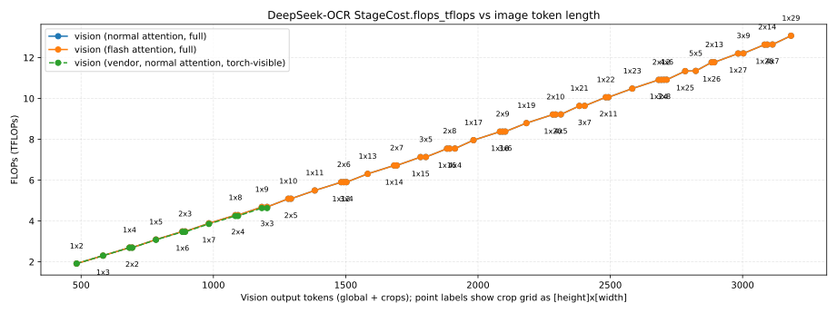

StageCost.io_tb vs image token length for the vision stage, highlighting how activation I/O traffic grows with higher-resolution inputs and denser crop grids.

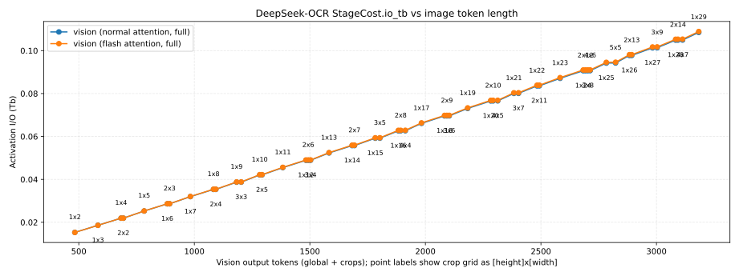

StageCost.arithmetic_intensity vs image token length for the vision stage, indicating how compute-to-memory ratios evolve across the resolution and crop-grid sweep.

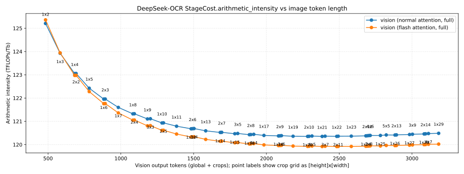

StageCost.activations_gb vs image token length for the vision stage, emphasizing how activation memory scales with input size and crop density, while KV-cache remains effectively zero for vision-only workloads.

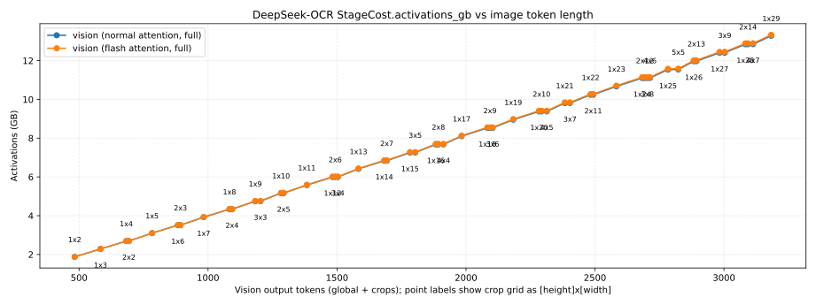

### Sequence Length and Decoder Sweeps

This subsection focuses on how decoder FLOPs and KV-cache memory scale with:
- Prefill context length (`S_prefill`).
- Decode length (`K` tokens).
- Batch size (`B`) and head configuration.

Expected content:
- Analytic curves for:
  - `F_prefill_total` and `F_decode_total` vs `S_prefill`, `K`, and `B`.
  - KV-cache memory vs `S_prefill + K`.
- Identification of regimes where prefill dominates vs decode, and where KV memory becomes a primary constraint.

The following figures summarize the DeepSeek-OCR decode sweep over candidate crop grids captured under `reports/sweep/20251127-132944/e2e_decode`, with a fixed text prompt and number of decode steps and the x-axis showing vision output tokens (global + crops) annotated by crop grid `[height]x[width]`.

DeepSeek-OCR decode FLOPs vs image token length (analytic and vendor curves, aggregated over the configured number of decode steps).

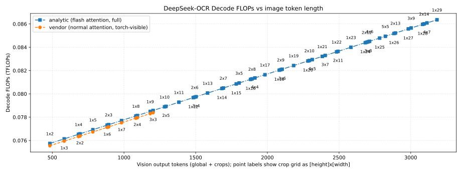

Decode StageCost.flops_tflops vs image token length, showing how total decode FLOPs for `K` steps grow with crop density for normal-attention analytic, flash-attention analytic, and vendor baselines.

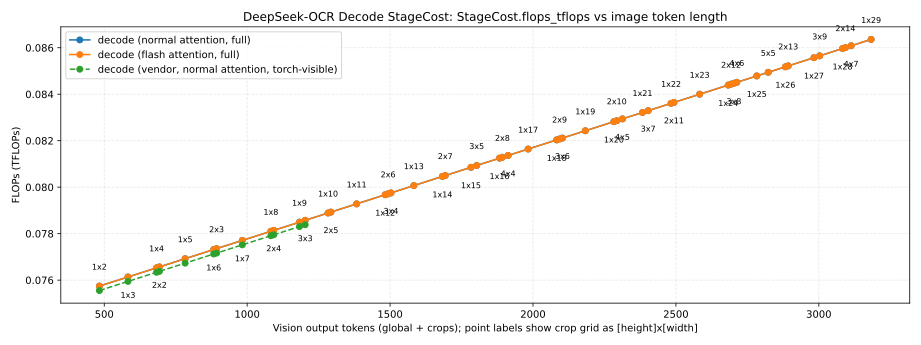

Decode StageCost.io_tb vs image token length, highlighting cumulative activation I/O traffic incurred during `K` decode steps and how it varies with the upstream vision workload.

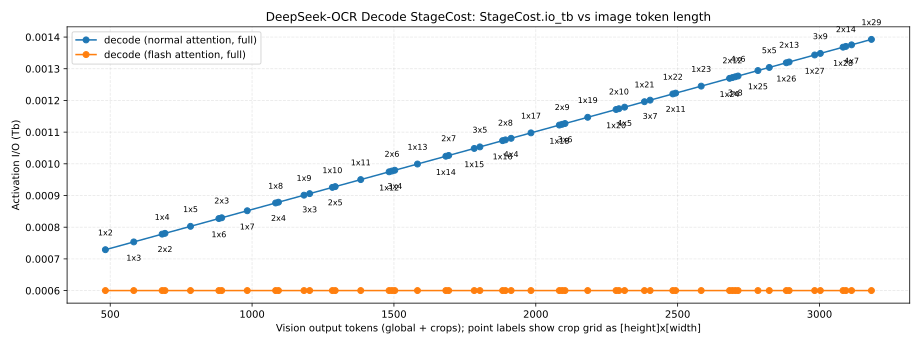

Decode StageCost.arithmetic_intensity vs image token length, indicating how compute-to-memory ratios for decode evolve as crop grids become denser and sequence lengths increase.

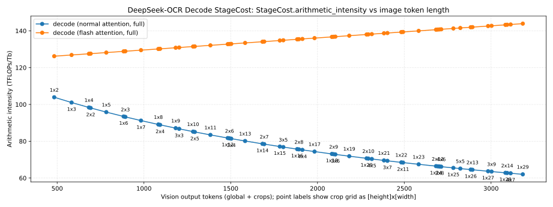

Decode StageCost.activations_gb vs image token length, emphasizing the growth in decoder activation memory over `K` steps and showing where activation footprint becomes comparable to or larger than vision activations.

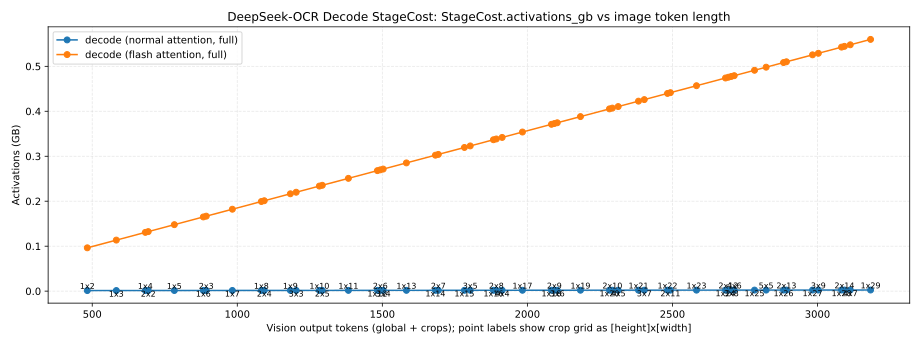

Decode StageCost.kv_gb vs image token length, capturing how KV-cache memory scales with the combination of prefill context and `K` decode tokens across different crop configurations.

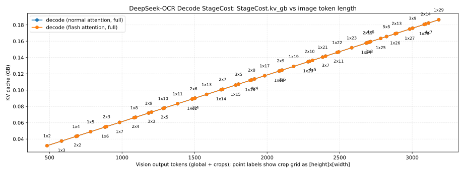

### Combined Workload Profiles

This subsection looks at realistic workload profiles that combine image resolution, context length, and decode length (for example, different OCR workload IDs).

Expected content:
- Summary tables for a few canonical workload profiles (e.g., `<WORKLOAD_PROFILE_ID>` values):
  - Vision FLOPs.
  - Prefill FLOPs.
  - Decode FLOPs (per token and total).
- High-level comments on how these analytic workloads map to expected runtime and MFU when combined with hardware peak tables (referencing `docs/analyzer-mfu.md` rather than reproducing MFU analysis here).

The following figures summarize the DeepSeek-OCR vision+prefill crop-grid sweep captured under `reports/sweep/20251127-132944/e2e_vision_prefill`, where the x-axis is vision output tokens (global + crops) and point labels denote the crop grid as `[height]x[width]`.

DeepSeek-OCR vision+prefill FLOPs vs image token length (analytic and vendor curves, annotated by crop grid).

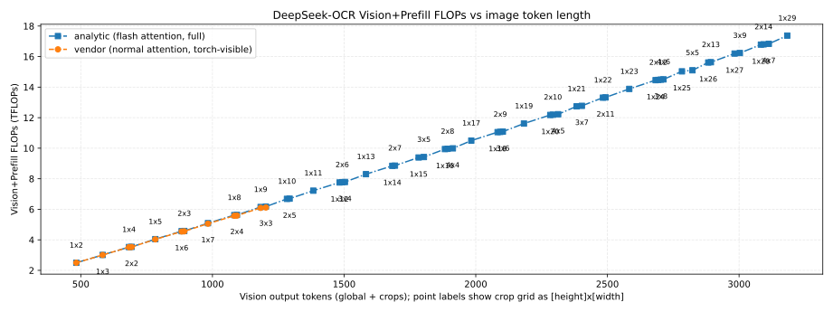

The StageCost structure from `modelmeter.models.common.stage_cost` summarizes per-stage analytic costs for these plots; its fields are:
- `StageCost.flops_tflops`: total forward-pass FLOPs for the stage, expressed in teraFLOPs (including Tensor Core and CUDA core contributions when modeled).
- `StageCost.io_tb`: activation I/O volume in terabits, aggregating reads and writes between on-chip memory and HBM for that stage.
- `StageCost.arithmetic_intensity`: FLOPs per bit of activation I/O (`flops_tflops` divided by `io_tb`), indicating how compute-bound versus bandwidth-bound the stage is.
- `StageCost.activations_gb`: peak activation memory footprint in gigabytes for the stage under the given batch size and sequence length.
- `StageCost.kv_gb`: KV-cache memory footprint in gigabytes attributable to the stage (typically decoder attention blocks), driven by context length and decode length.
For DeepSeek-OCR-3B in this configuration, the total parameter footprint is approximately 2.17 GB and is constant across crop grids, so we report it once here rather than as a separate StageCost curve.

StageCost.flops_tflops vs image token length, broken down by logical stages (vision, decoder, and LM head) to show how each component contributes to total prefill FLOPs as crop density increases.

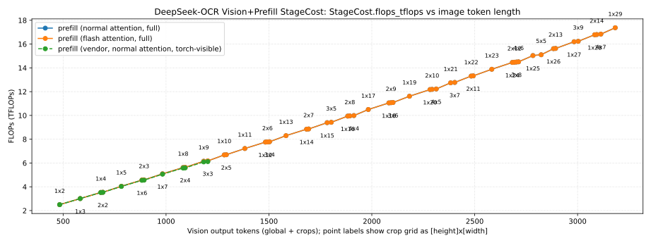

StageCost.io_tb vs image token length, highlighting how activation I/O traffic grows with crop grids and which stages dominate bandwidth requirements.

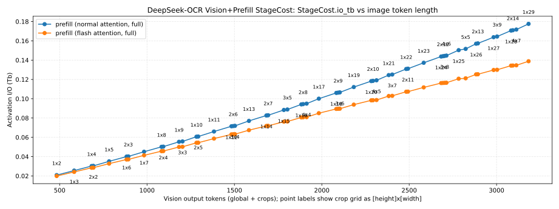

StageCost.arithmetic_intensity vs image token length, indicating how compute-to-memory ratios evolve for different crop configurations and which stages are more compute-bound versus bandwidth-bound.

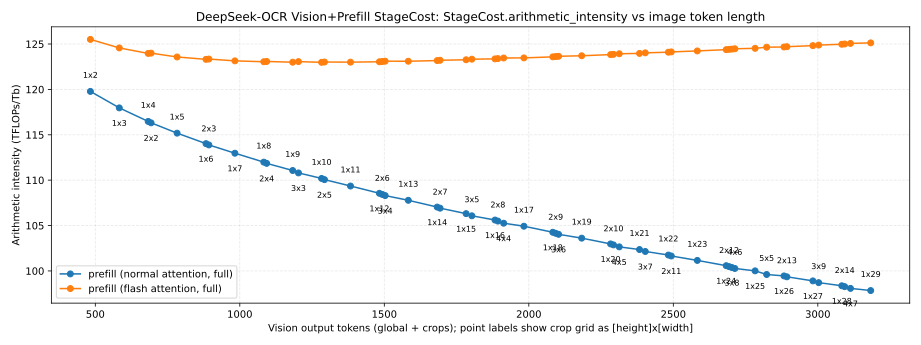

StageCost.activations_gb vs image token length, emphasizing how activation memory grows super-linearly with larger crop grids and where vision activations begin to dominate the memory footprint.

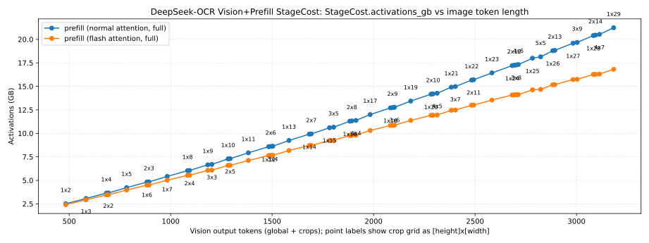

StageCost.kv_gb vs image token length, capturing the KV-cache contribution from the decoder portion of the vision+prefill pipeline for the fixed prefill context used in this sweep.

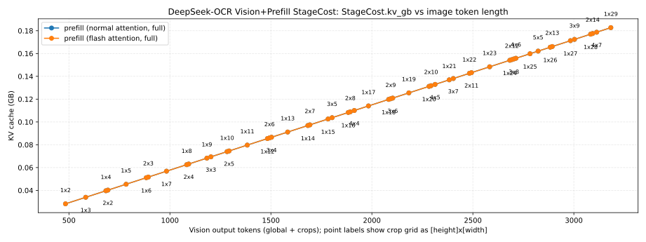

## Objective-based Analysis

To connect these analytic workloads to user-facing responsiveness, the following figure shows the required TFLOPs/s as a function of image token length to meet a fixed 500 ms time-to-first-token (TTFT) budget for the vision+prefill stage (TTFT = 0.5 s), with separate curves for analytic normal attention, analytic flash attention, and the vendor baseline.

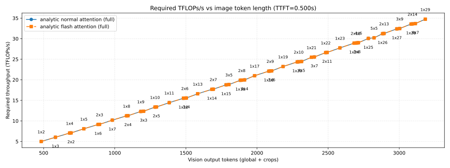

The following table enumerates a subset of those points, showing for each crop grid the total vision output tokens and the compute throughput required to meet the 500 ms TTFT budget under analytic normal and flash attention.

|Num crops|Crop grid (H×W)|Image tokens (global + crops)|Required TFLOPs/s (analytic normal attention, full)|Required TFLOPs/s (analytic flash attention, full)|
| :---: | :---: | :---: | :---: | :---: |
|2|1x2|483|4.994|4.994|
|3|1x3|583|6.019|6.019|
|4|1x4|683|7.051|7.051|
|4|2x2|693|7.076|7.076|
|5|1x5|783|8.088|8.088|
|6|1x6|883|9.132|9.132|
|6|2x3|893|9.158|9.158|
|7|1x7|983|10.181|10.181|
|8|1x8|1083|11.236|11.236|
|8|2x4|1093|11.263|11.263|
|9|1x9|1183|12.297|12.297|
|9|3x3|1203|12.352|12.352|
|10|1x10|1283|13.364|13.364|
|10|2x5|1293|13.392|13.392|
|11|1x11|1383|14.436|14.436|
|12|1x12|1483|15.515|15.515|
|12|2x6|1493|15.544|15.544|
|12|3x4|1503|15.572|15.572|
|13|1x13|1583|16.599|16.599|
|14|1x14|1683|17.689|17.689|
|14|2x7|1693|17.719|17.719|
|15|1x15|1783|18.786|18.786|
|15|3x5|1803|18.846|18.846|
|16|1x16|1883|19.888|19.888|
|16|2x8|1893|19.918|19.918|
|16|4x4|1913|19.979|19.979|
|17|1x17|1983|20.995|20.995|
|18|1x18|2083|22.109|22.109|
|18|2x9|2093|22.140|22.140|
|18|3x6|2103|22.172|22.172|
|19|1x19|2183|23.229|23.229|
|20|1x20|2283|24.354|24.354|
|20|2x10|2293|24.386|24.386|
|20|4x5|2313|24.451|24.451|
|21|1x21|2383|25.486|25.486|
|21|3x7|2403|25.551|25.551|
|22|1x22|2483|26.623|26.623|
|22|2x11|2493|26.656|26.656|
|23|1x23|2583|27.766|27.766|
|24|1x24|2683|28.915|28.915|
|24|2x12|2693|28.949|28.949|
|24|3x8|2703|28.982|28.982|
|24|4x6|2713|29.016|29.016|
|25|1x25|2783|30.070|30.070|
|25|5x5|2823|30.206|30.206|
|26|1x26|2883|31.230|31.230|
|26|2x13|2893|31.265|31.265|
|27|1x27|2983|32.397|32.397|
|27|3x9|3003|32.467|32.467|
|28|1x28|3083|33.569|33.569|
|28|2x14|3093|33.605|33.605|
|28|4x7|3113|33.676|33.676|
|29|1x29|3183|34.748|34.748|
