# DeepSeek-OCR Analytical Performance Report

This report summarizes analytical performance validation and scaling behavior for the DeepSeek-OCR model, using the ModelMeter analytic implementation in `extern/modelmeter/models/deepseek_ocr` and the verification and sweep scripts under `extern/modelmeter/models/deepseek_ocr/scripts`.

## Overview and Scope

This document focuses on how well the analytic FLOP/IO/memory model matches the vendor implementation and how analytic costs scale as model and workload parameters change.
Architecture and operator-level details live in `reports/deepseek-ocr-analytical-arch-report.md`; here we concentrate on:
- Per-layer sanity checks (layer-wise verification against reference implementations).
- End-to-end pipeline verification (vision-only and full model).
- Model scaling sweeps (how analytic FLOPs/IO vary with input and model parameters).

All experiments are expected to be run from the `llm-perf-opt` project root using the Pixi RTX 5090 environment unless otherwise noted.

## Per-Layer Sanity Check (Layer-wise Verification)

|Group|Analytic layer|Measured FLOPs (GFLOPs)|Theoretical FLOPs (GFLOPs)|Rel diff (%)|Status|
| :---: | :---: | :---: | :---: | :---: | :---: |
|vision|Attention|2.6071e+01|2.6098e+01|0.1010%|✓|
|vision|MLPBlock|3.8655e+01|3.8705e+01|0.1302%|✓|
|vision|PatchEmbed|4.8318e+00|4.8318e+00|0.0000%|✓|
|vision|Block|1.1033e+02|1.0967e+02|0.5931%|✓|
|vision|CLIPVisionEmbeddings_conv|3.0828e-01|3.0828e-01|0.0000%|✓|
|vision|LayerNorm2d|0.0000e+00|5.2429e-03|0.0000%|✓|
|vision|ImageEncoderViT|9.7691e+02|9.7323e+02|0.3766%|✓|
|vision|NoTPAttention|2.4264e+00|2.4264e+00|0.0000%|✓|
|vision|NoTPFeedForward|4.3117e+00|4.3170e+00|0.1221%|✓|
|vision|NoTPTransformerBlock|6.7382e+00|6.7434e+00|0.0781%|✓|
|vision|NoTPTransformer|1.3476e+01|1.3487e+01|0.0781%|✓|
|vision|VitModel|1.3476e+01|1.3488e+01|0.0879%|✓|
|vision|MlpProjector|4.9159e+00|4.9218e+00|0.1202%|✓|
|decoder|DeepseekV2MLP|2.6927e+01|2.6941e+01|0.0521%|✓|
|decoder|MoEGate|8.3886e-02|8.4083e-02|0.2344%|✓|
|decoder|DeepseekV2MoE|2.8270e+01|2.8284e+01|0.0526%|✓|
|decoder|DeepseekV2RMSNorm|0.0000e+00|1.9661e-03|0.0000%|✓|
|decoder|DeepseekV2DecoderLayer_dense|3.4980e+01|3.4998e+01|0.0513%|✓|
|decoder|DeepseekV2DecoderLayer_moe|3.6323e+01|3.6341e+01|0.0518%|✓|
|llama|LlamaFlashAttention2|6.7110e+00|6.7109e+00|0.0010%|✓|
|llama|LlamaRotaryEmbedding|6.5536e-05|6.5536e-05|0.0000%|✓|


The following table maps analytic layers to their reference implementation classes.

|Group|Analytic layer|Impl class (fully qualified path)|
| :---: | :---: | :---: |
|vision|Attention|deepencoder.Attention|
|vision|MLPBlock|deepencoder.MLPBlock|
|vision|PatchEmbed|deepencoder.PatchEmbed|
|vision|Block|deepencoder.Block|
|vision|CLIPVisionEmbeddings_conv|deepencoder.CLIPVisionEmbeddings|
|vision|LayerNorm2d|deepencoder.LayerNorm2d|
|vision|ImageEncoderViT|deepencoder.ImageEncoderViT|
|vision|NoTPAttention|deepencoder.NoTPAttention|
|vision|NoTPFeedForward|deepencoder.NoTPFeedForward|
|vision|NoTPTransformerBlock|deepencoder.NoTPTransformerBlock|
|vision|NoTPTransformer|deepencoder.NoTPTransformer|
|vision|VitModel|deepencoder.VitModel|
|vision|MlpProjector|deepencoder.MlpProjector|
|decoder|DeepseekV2MLP|modeling_deepseekv2.DeepseekV2MLP|
|decoder|MoEGate|modeling_deepseekv2.MoEGate|
|decoder|DeepseekV2MoE|modeling_deepseekv2.DeepseekV2MoE|
|decoder|DeepseekV2RMSNorm|modeling_deepseekv2.DeepseekV2RMSNorm|
|decoder|DeepseekV2DecoderLayer_dense|modeling_deepseekv2.DeepseekV2DecoderLayer|
|decoder|DeepseekV2DecoderLayer_moe|modeling_deepseekv2.DeepseekV2DecoderLayer|
|llama|LlamaFlashAttention2|transformers.models.llama.modeling_llama.LlamaFlashAttention2|
|llama|LlamaRotaryEmbedding|transformers.models.llama.modeling_llama.LlamaRotaryEmbedding|

## Cost vs. Sweep

This section explores how analytic FLOPs, IO, and memory usage scale as model and input parameters change.
It relies on sweep scripts under `extern/modelmeter/models/deepseek_ocr/scripts/sweep` and any associated helpers.

### Vision Input Shape Sweeps

This subsection studies how vision compute changes with input resolution and crop configuration.
Typical entrypoint:
- `python -m modelmeter.models.deepseek_ocr.scripts.sweep.sweep-vision-input-shape`

The following figures summarize the DeepSeek-OCR analytic vision-stage cost sweep over candidate crop grids captured under `reports/sweep/20251128-152354/vision_crops`, with the x-axis showing vision output tokens (global + crops) annotated by crop grid `[height]x[width]`.

Total vision-stage FLOPs (in TFLOPs) vs image token length, comparing analytic normal attention, analytic flash attention, and vendor FLOPs for the same workloads.


Although FLOPs are plotted against an aggregated vision-token count, the underlying implementation processes the global view and each crop tile as separate images (crops are stacked in the batch dimension with a fixed per-tile resolution and CLIP sequence length), so the vision attention cost scales approximately as `O(num_crops · S_tile²)` with `S_tile` effectively constant across the sweep, which explains why the total vision-stage FLOPs appear nearly linear in the number of crops (and hence in `image_tokens_total`) rather than quadratic in that aggregated token count.

For reference, the vendor preprocessing first crops the image into tiles and then stacks those tiles along the batch dimension before passing them into SAM and CLIP (see `models/deepseek-ocr/modeling_deepseekocr.py:781-815, 897-900`):

```python
images_crop_raw, crop_ratio = dynamic_preprocess(image)
# ...
width_crop_num, height_crop_num = crop_ratio
images_spatial_crop.append([width_crop_num, height_crop_num])
if width_crop_num > 1 or height_crop_num > 1:
    # process the local views (crops)
    for i in range(len(images_crop_raw)):
        images_crop_list.append(image_transform(images_crop_raw[i]).to(torch.bfloat16))
# ...
if images_crop_list:
    images_crop = torch.stack(images_crop_list, dim=0)   # (num_crops, 3, 640, 640)
else:
    images_crop = torch.zeros((1, 3, base_size, base_size))
```

Activation I/O volume (terabits moved between on-chip memory and HBM) vs image token length for the vision stage, highlighting how traffic grows with higher-resolution inputs and denser crop grids.


Arithmetic intensity (FLOPs per bit of activation I/O) vs image token length for the vision stage, indicating how compute-to-memory ratios evolve across the resolution and crop-grid sweep.


Peak activation memory (GB) vs image token length for the vision stage, emphasizing how activation footprint scales with input size and crop density while KV-cache remains effectively zero for vision-only workloads.


Tensor Core vs CUDA-core FLOPs (log-scale) vs image token length, showing how much of the vision workload is served by Tensor Cores versus CUDA cores across the crop-grid sweep.


The table below summarizes the underlying FLOP split for the analytic vision path at each crop configuration.

|Num crops|Crop grid (H×W)|Image tokens (global + crops)|Tensor Core FLOPs (TFLOPs)|CUDA-core FLOPs (TFLOPs)|Tensor:CUDA ratio (CUDA=1.0)|
| :---: | :---: | :---: | :---: | :---: | :---: |
|2|1x2|483|1.913039e+00|1.329561e-03|1438.851:1.0|
|3|1x3|583|2.303791e+00|1.624969e-03|1417.744:1.0|
|4|2x2|693|2.696587e+00|1.922835e-03|1402.401:1.0|
|5|1x5|783|3.090405e+00|2.221930e-03|1390.865:1.0|
|6|2x3|893|3.486780e+00|2.524098e-03|1381.397:1.0|
|7|1x7|983|3.883836e+00|2.827084e-03|1373.796:1.0|
|8|2x4|1093|4.283788e+00|3.133552e-03|1367.071:1.0|
|9|3x3|1203|4.685615e+00|3.442272e-03|1361.198:1.0|
|10|2x5|1293|5.087613e+00|3.751198e-03|1356.264:1.0|
|20|4x5|2313|9.212379e+00|6.966404e-03|1322.401:1.0|
|30|5x6|3323|1.350839e+01|1.038743e-02|1300.455:1.0|
|40|5x8|4323|1.797309e+01|1.401122e-02|1282.764:1.0|
|50|5x10|5323|2.260819e+01|1.783980e-02|1267.289:1.0|
|60|6x10|6333|2.741879e+01|2.187933e-02|1253.182:1.0|
|70|7x10|7343|3.240148e+01|2.612570e-02|1240.215:1.0|
|80|8x10|8353|3.755628e+01|3.057892e-02|1228.175:1.0|
|90|9x10|9363|4.288317e+01|3.523899e-02|1216.924:1.0|
|100|10x10|10373|4.838216e+01|4.010591e-02|1206.360:1.0|
|110|10x11|11373|5.404388e+01|4.516841e-02|1196.497:1.0|
|120|10x12|12373|5.987599e+01|5.043572e-02|1187.174:1.0|
|130|10x13|13373|6.587849e+01|5.590782e-02|1178.341:1.0|
|140|10x14|14373|7.205139e+01|6.158472e-02|1169.956:1.0|
|150|10x15|15373|7.839468e+01|6.746642e-02|1161.981:1.0|
|160|10x16|16373|8.490836e+01|7.355293e-02|1154.385:1.0|
|170|10x17|17373|9.159244e+01|7.984423e-02|1147.139:1.0|
|181|1x181|18383|9.900294e+01|8.683440e-02|1140.135:1.0|
|190|10x19|19373|1.054718e+02|9.304123e-02|1133.603:1.0|
|200|10x20|20373|1.126670e+02|9.994694e-02|1127.269:1.0|
|211|1x211|21383|1.206168e+02|1.075853e-01|1121.128:1.0|
|220|11x20|22383|1.275875e+02|1.143953e-01|1115.321:1.0|
|230|10x23|23373|1.352752e+02|1.218928e-01|1109.788:1.0|
|241|1x241|24383|1.437643e+02|1.301794e-01|1104.355:1.0|
|250|10x25|25373|1.511992e+02|1.375474e-01|1099.251:1.0|
|260|13x20|26403|1.594833e+02|1.457618e-01|1094.136:1.0|
|271|1x271|27383|1.684452e+02|1.546167e-01|1089.438:1.0|
|281|1x281|28383|1.770130e+02|1.631721e-01|1084.824:1.0|
|290|10x29|29373|1.850921e+02|1.713143e-01|1080.424:1.0|
|300|15x20|30423|1.941191e+02|1.804216e-01|1075.919:1.0|
|310|10x31|31373|2.030609e+02|1.894265e-01|1071.977:1.0|
|321|3x107|32403|2.130428e+02|1.995073e-01|1067.845:1.0|
|331|1x331|33383|2.224078e+02|2.090209e-01|1064.046:1.0|
|340|17x20|34443|2.314947e+02|2.183745e-01|1060.082:1.0|
|350|14x25|35413|2.411624e+02|2.282518e-01|1056.563:1.0|
|360|18x20|36453|2.512101e+02|2.385859e-01|1052.913:1.0|
|370|10x37|37373|2.610566e+02|2.486783e-01|1049.777:1.0|
|381|3x127|38403|2.721274e+02|2.600678e-01|1046.371:1.0|
|390|15x26|39423|2.819179e+02|2.702670e-01|1043.109:1.0|

### Sequence Length and Decoder Sweeps

This subsection focuses on how decoder FLOPs and KV-cache memory scale with:
- Prefill context length (`S_prefill`).
- Decode length (`K` tokens).
- Batch size (`B`) and head configuration.

The following figures summarize the DeepSeek-OCR decode sweep over candidate crop grids captured under `reports/sweep/20251128-152354/e2e_decode`, with a fixed text prompt and number of decode steps and the x-axis showing vision output tokens (global + crops) annotated by crop grid `[height]x[width]`.

DeepSeek-OCR decode FLOPs vs image token length (analytic and vendor curves, aggregated over a fixed `K = 100` decode steps for all points in the sweep).

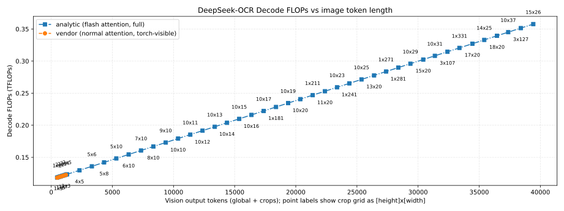

Total decode FLOPs (in TFLOPs) over `K = 100` decode steps vs image token length, showing how full-sequence decode compute (not per-token) grows with crop density for analytic normal attention, analytic flash attention, and vendor baselines.


Decoder activation I/O volume (terabits) over `K = 100` decode steps vs image token length, highlighting how cumulative traffic over the full decode varies with the upstream vision workload.

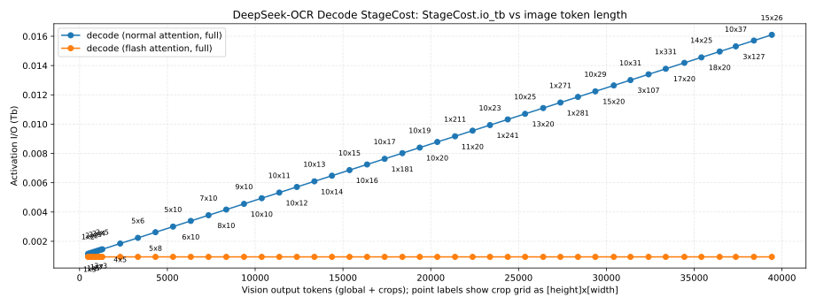

Decoder arithmetic intensity (FLOPs per bit of activation I/O) vs image token length, indicating how compute-to-memory ratios evolve as crop grids become denser and sequence lengths increase.

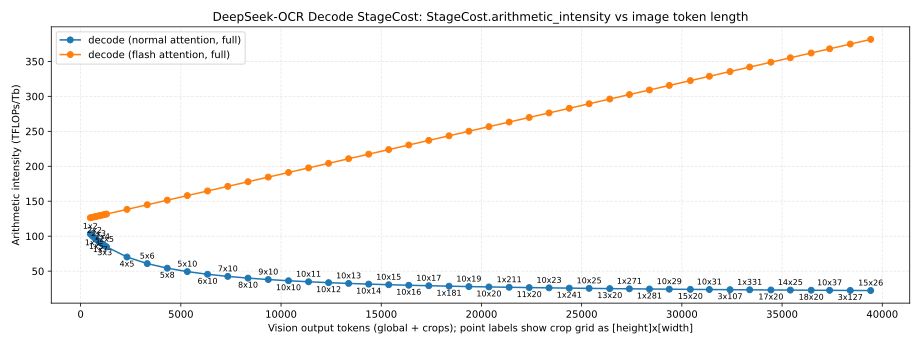

Peak decoder activation memory (GB) over `K = 100` decode steps vs image token length, showing where activation footprint over the full decode becomes comparable to or larger than vision activations.

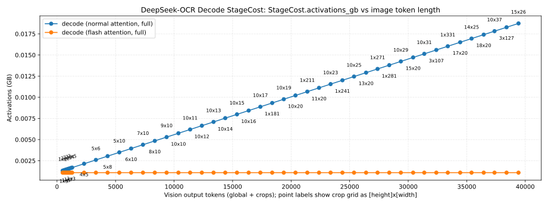

Decoder KV-cache memory (GB) vs image token length, capturing how KV storage scales with the combination of prefill context and `K = 100` decode tokens across different crop configurations.


Tensor Core vs CUDA-core FLOPs (log-scale) vs image token length for the decode stage, highlighting how attention and MLP kernels map onto Tensor Cores versus CUDA cores as sequence length and crop density increase.

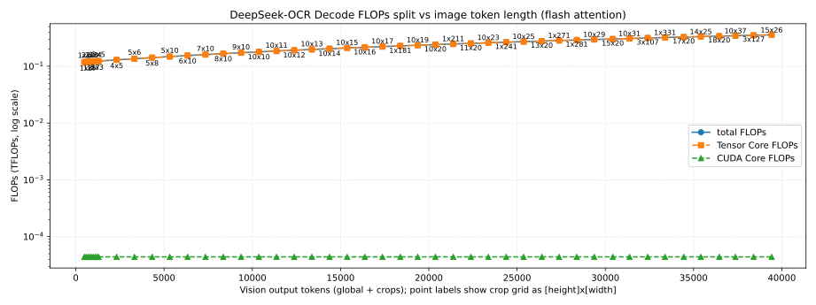

The table below summarizes the analytic decode FLOP split (`K = 100` decode steps) for each crop grid.

|Num crops|Crop grid (H×W)|Image tokens (global + crops)|Tensor Core FLOPs (TFLOPs)|CUDA-core FLOPs (TFLOPs)|Tensor:CUDA ratio (CUDA=1.0)|
| :---: | :---: | :---: | :---: | :---: | :---: |
|2|1x2|483|1.184143e-01|4.408320e-05|2686.156:1.0|
|3|1x3|583|1.190287e-01|4.408320e-05|2700.093:1.0|
|4|2x2|693|1.197046e-01|4.408320e-05|2715.424:1.0|
|5|1x5|783|1.202575e-01|4.408320e-05|2727.967:1.0|
|6|2x3|893|1.209334e-01|4.408320e-05|2743.298:1.0|
|7|1x7|983|1.214863e-01|4.408320e-05|2755.842:1.0|
|8|2x4|1093|1.221622e-01|4.408320e-05|2771.173:1.0|
|9|3x3|1203|1.228380e-01|4.408320e-05|2786.504:1.0|
|10|2x5|1293|1.233910e-01|4.408320e-05|2799.048:1.0|
|20|4x5|2313|1.296579e-01|4.408320e-05|2941.208:1.0|
|30|5x6|3323|1.358633e-01|4.408320e-05|3081.974:1.0|
|40|5x8|4323|1.420073e-01|4.408320e-05|3221.347:1.0|
|50|5x10|5323|1.481513e-01|4.408320e-05|3360.720:1.0|
|60|6x10|6333|1.543567e-01|4.408320e-05|3501.487:1.0|
|70|7x10|7343|1.605622e-01|4.408320e-05|3642.253:1.0|
|80|8x10|8353|1.667676e-01|4.408320e-05|3783.020:1.0|
|90|9x10|9363|1.729731e-01|4.408320e-05|3923.786:1.0|
|100|10x10|10373|1.791785e-01|4.408320e-05|4064.553:1.0|
|110|10x11|11373|1.853225e-01|4.408320e-05|4203.926:1.0|
|120|10x12|12373|1.914665e-01|4.408320e-05|4343.298:1.0|
|130|10x13|13373|1.976105e-01|4.408320e-05|4482.671:1.0|
|140|10x14|14373|2.037545e-01|4.408320e-05|4622.044:1.0|
|150|10x15|15373|2.098985e-01|4.408320e-05|4761.417:1.0|
|160|10x16|16373|2.160425e-01|4.408320e-05|4900.790:1.0|
|170|10x17|17373|2.221865e-01|4.408320e-05|5040.163:1.0|
|181|1x181|18383|2.283919e-01|4.408320e-05|5180.929:1.0|
|190|10x19|19373|2.344745e-01|4.408320e-05|5318.908:1.0|
|200|10x20|20373|2.406185e-01|4.408320e-05|5458.281:1.0|
|211|1x211|21383|2.468239e-01|4.408320e-05|5599.048:1.0|
|220|11x20|22383|2.529679e-01|4.408320e-05|5738.420:1.0|
|230|10x23|23373|2.590505e-01|4.408320e-05|5876.400:1.0|
|241|1x241|24383|2.652559e-01|4.408320e-05|6017.166:1.0|
|250|10x25|25373|2.713385e-01|4.408320e-05|6155.145:1.0|
|260|13x20|26403|2.776668e-01|4.408320e-05|6298.699:1.0|
|271|1x271|27383|2.836879e-01|4.408320e-05|6435.285:1.0|
|281|1x281|28383|2.898319e-01|4.408320e-05|6574.657:1.0|
|290|10x29|29373|2.959145e-01|4.408320e-05|6712.636:1.0|
|300|15x20|30423|3.023657e-01|4.408320e-05|6858.978:1.0|
|310|10x31|31373|3.082025e-01|4.408320e-05|6991.382:1.0|
|321|3x107|32403|3.145308e-01|4.408320e-05|7134.936:1.0|
|331|1x331|33383|3.205519e-01|4.408320e-05|7271.521:1.0|
|340|17x20|34443|3.270646e-01|4.408320e-05|7419.257:1.0|
|350|14x25|35413|3.330243e-01|4.408320e-05|7554.448:1.0|
|360|18x20|36453|3.394140e-01|4.408320e-05|7699.396:1.0|
|370|10x37|37373|3.450665e-01|4.408320e-05|7827.619:1.0|
|381|3x127|38403|3.513948e-01|4.408320e-05|7971.173:1.0|
|390|15x26|39423|3.576617e-01|4.408320e-05|8113.333:1.0|

### Combined Workload Profiles

This subsection looks at realistic workload profiles that combine image resolution, context length, and decode length (for example, different OCR workload IDs).

The following figures summarize the DeepSeek-OCR vision+prefill crop-grid sweep captured under `reports/sweep/20251128-152354/e2e_vision_prefill`, where the x-axis is vision output tokens (global + crops) and point labels denote the crop grid as `[height]x[width]`.

DeepSeek-OCR vision+prefill FLOPs vs image token length (analytic and vendor curves, annotated by crop grid).

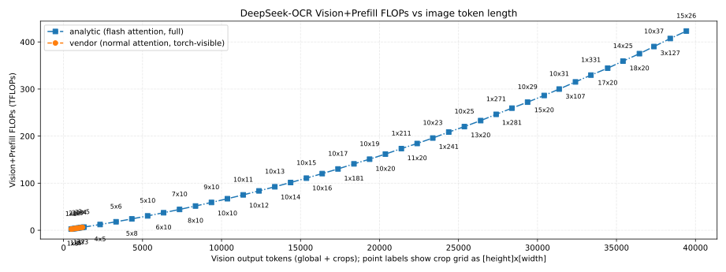

These plots use the `StageCost` structure from `modelmeter.models.common.stage_cost` for per-stage analytic costs; see the appendix for field definitions and interpretation.

Total prefill-stage FLOPs (in TFLOPs), broken down by logical components (vision, decoder, and LM head) vs image token length, showing how each component contributes to total prefill compute as crop density increases.

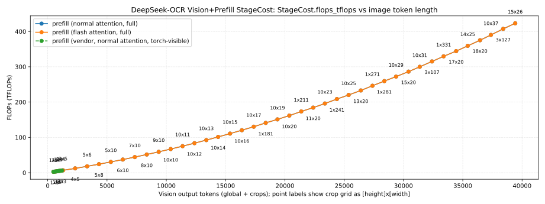

Activation I/O volume (terabits) vs image token length, highlighting how traffic grows with crop grids and which stages dominate bandwidth requirements.

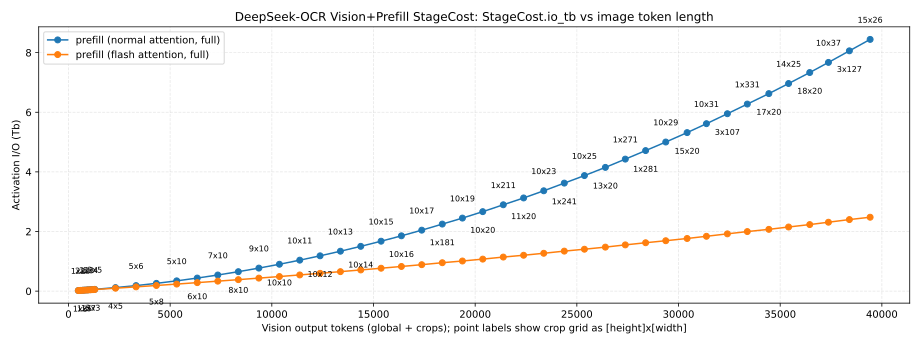

Arithmetic intensity (FLOPs per bit of activation I/O) vs image token length, indicating how compute-to-memory ratios evolve for different crop configurations and which stages are more compute-bound versus bandwidth-bound.

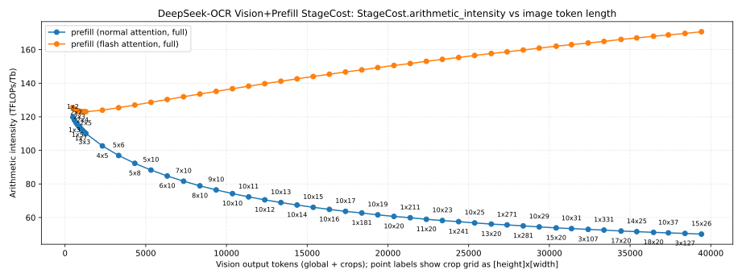

Peak activation memory (GB) vs image token length, emphasizing how activation footprint grows super-linearly with larger crop grids and where vision activations begin to dominate the memory footprint.

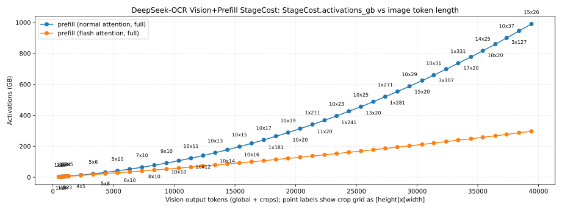

KV-cache memory (GB) vs image token length, capturing the KV-cache contribution from the decoder portion of the vision+prefill pipeline for the fixed prefill context used in this sweep.

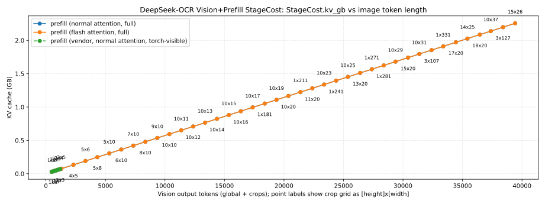

Tensor Core vs CUDA-core FLOPs (log-scale) vs image token length for the combined vision+prefill stage, showing how the overall Tensor Core utilization evolves with larger and denser input crops.

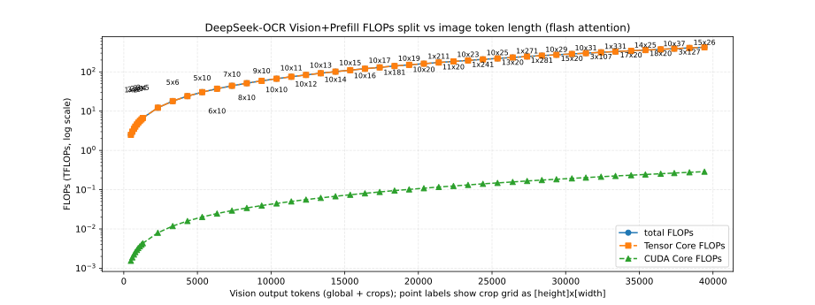

The table below summarizes the analytic vision+prefill FLOP split for each crop configuration.

|Num crops|Crop grid (H×W)|Image tokens (global + crops)|Tensor Core FLOPs (TFLOPs)|CUDA-core FLOPs (TFLOPs)|Tensor:CUDA ratio (CUDA=1.0)|
| :---: | :---: | :---: | :---: | :---: | :---: |
|2|1x2|483|2.495323e+00|1.546891e-03|1613.122:1.0|
|3|1x3|583|3.007828e+00|1.886383e-03|1594.495:1.0|
|4|2x2|693|3.535972e+00|2.232740e-03|1583.692:1.0|
|5|1x5|783|4.041636e+00|2.571510e-03|1571.697:1.0|
|6|2x3|893|4.576062e+00|2.922169e-03|1565.981:1.0|
|7|1x7|983|5.087175e+00|3.264830e-03|1558.175:1.0|
|8|2x4|1093|5.627883e+00|3.619789e-03|1554.754:1.0|
|9|3x3|1203|6.171951e+00|3.977001e-03|1551.911:1.0|
|10|2x5|1293|6.691434e+00|4.325602e-03|1546.937:1.0|
|20|4x5|2313|1.221727e+01|7.990457e-03|1528.982:1.0|
|30|5x6|3323|1.802658e+01|1.185673e-02|1520.367:1.0|
|40|5x8|4323|2.411309e+01|1.592134e-02|1514.514:1.0|
|50|5x10|5323|3.049288e+01|2.019076e-02|1510.239:1.0|
|60|6x10|6333|3.719034e+01|2.467552e-02|1507.175:1.0|
|70|7x10|7343|4.418526e+01|2.936714e-02|1504.582:1.0|
|80|8x10|8353|5.147762e+01|3.426560e-02|1502.312:1.0|
|90|9x10|9363|5.906743e+01|3.937091e-02|1500.281:1.0|
|100|10x10|10373|6.695469e+01|4.468307e-02|1498.435:1.0|
|110|10x11|11373|7.510452e+01|5.018640e-02|1496.511:1.0|
|120|10x12|12373|8.354762e+01|5.589454e-02|1494.737:1.0|
|130|10x13|13373|9.228400e+01|6.180747e-02|1493.088:1.0|
|140|10x14|14373|1.013137e+02|6.792521e-02|1491.547:1.0|
|150|10x15|15373|1.106366e+02|7.424774e-02|1490.100:1.0|
|160|10x16|16373|1.202528e+02|8.077508e-02|1488.736:1.0|
|170|10x17|17373|1.301623e+02|8.750721e-02|1487.446:1.0|
|181|1x181|18383|1.409551e+02|9.494262e-02|1484.635:1.0|
|190|10x19|19373|1.508610e+02|1.015859e-01|1485.059:1.0|
|200|10x20|20373|1.616503e+02|1.089324e-01|1483.951:1.0|
|211|1x211|21383|1.733548e+02|1.170160e-01|1481.462:1.0|
|220|11x20|22383|1.841665e+02|1.242668e-01|1482.025:1.0|
|230|10x23|23373|1.957778e+02|1.322008e-01|1480.912:1.0|
|241|1x241|24383|2.083940e+02|1.409326e-01|1478.678:1.0|
|250|10x25|25373|2.199959e+02|1.487371e-01|1479.092:1.0|
|260|13x20|26403|2.327431e+02|1.574055e-01|1478.621:1.0|
|271|1x271|27383|2.460726e+02|1.666924e-01|1476.207:1.0|
|281|1x281|28383|2.592187e+02|1.756886e-01|1475.444:1.0|
|290|10x29|29373|2.719513e+02|1.842672e-01|1475.853:1.0|
|300|15x20|30423|2.860455e+02|1.938374e-01|1475.698:1.0|
|310|10x31|31373|2.996886e+02|2.032611e-01|1474.402:1.0|
|321|3x107|32403|3.148931e+02|2.137960e-01|1472.867:1.0|
|331|1x331|33383|3.293482e+02|2.237416e-01|1472.002:1.0|
|340|17x20|34443|3.440735e+02|2.335625e-01|1473.154:1.0|
|350|14x25|35413|3.590219e+02|2.438674e-01|1472.201:1.0|
|360|18x20|36453|3.748597e+02|2.546599e-01|1472.001:1.0|
|370|10x37|37373|3.899392e+02|2.651579e-01|1470.592:1.0|
|381|3x127|38403|4.069918e+02|2.770014e-01|1469.277:1.0|
|390|15x26|39423|4.228347e+02|2.876503e-01|1469.961:1.0|

## Objective-based Analysis

This section connects the analytic workloads above to user-facing responsiveness constraints, focusing on two objectives:
- Time-to-first-token (TTFT) for the vision+prefill stage.
- Time-per-output-token (TPOT) for the decode stage.

### Time-to-first-token (TTFT): vision+prefill

For TTFT, we consider a fixed 1.0 s budget for the vision+prefill stage (TTFT = 1.0 s).
The following figure shows the required TFLOPs/s as a function of image token length to meet this TTFT target, with separate curves for analytic normal attention, analytic flash attention, and the vendor baseline.

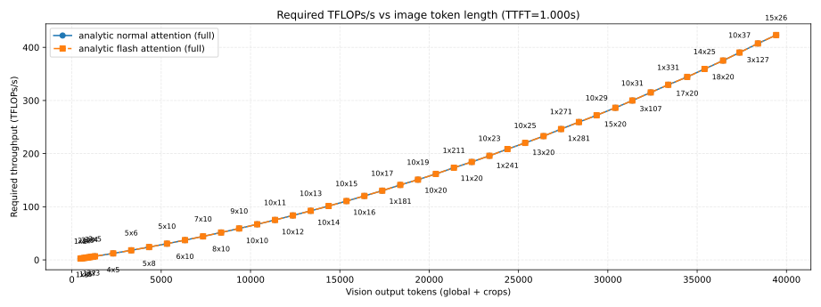

The following table enumerates a subset of those points, showing for each crop grid the total vision output tokens and the compute throughput required to meet the 1.0 s TTFT budget under analytic flash attention.

|Num crops|Crop grid (H×W)|Image tokens (global + crops)|Required TFLOPs/s (analytic flash attention, full)|
| :---: | :---: | :---: | :---: |
|2|1x2|483|2.497|
|3|1x3|583|3.010|
|4|2x2|693|3.538|
|5|1x5|783|4.044|
|6|2x3|893|4.579|
|7|1x7|983|5.090|
|8|2x4|1093|5.632|
|9|3x3|1203|6.176|
|10|2x5|1293|6.696|
|20|4x5|2313|12.225|
|30|5x6|3323|18.038|
|40|5x8|4323|24.129|
|50|5x10|5323|30.513|
|60|6x10|6333|37.215|
|70|7x10|7343|44.215|
|80|8x10|8353|51.512|
|90|9x10|9363|59.107|
|100|10x10|10373|66.999|
|110|10x11|11373|75.155|
|120|10x12|12373|83.604|
|130|10x13|13373|92.346|
|140|10x14|14373|101.382|
|150|10x15|15373|110.711|
|160|10x16|16373|120.334|
|170|10x17|17373|130.250|
|181|1x181|18383|141.050|
|190|10x19|19373|150.963|
|200|10x20|20373|161.759|
|211|1x211|21383|173.472|
|220|11x20|22383|184.291|
|230|10x23|23373|195.910|
|241|1x241|24383|208.535|
|250|10x25|25373|220.145|
|260|13x20|26403|232.901|
|271|1x271|27383|246.239|
|281|1x281|28383|259.394|
|290|10x29|29373|272.136|
|300|15x20|30423|286.239|
|310|10x31|31373|299.892|
|321|3x107|32403|315.107|
|331|1x331|33383|329.572|
|340|17x20|34443|344.307|
|350|14x25|35413|359.266|
|360|18x20|36453|375.114|
|370|10x37|37373|390.204|
|381|3x127|38403|407.269|
|390|15x26|39423|423.122|

### Time-per-output-token (TPOT): decode

To characterize steady-state streaming latency, we also analyze the compute throughput required to hit a target time-per-output-token (TPOT) for the decode stage.
The decode sweep for these runs is configured with a 50 ms per-token budget (TPOT = 0.05 s), and the following figure shows the required TFLOPs/s as a function of image token length under that constraint.

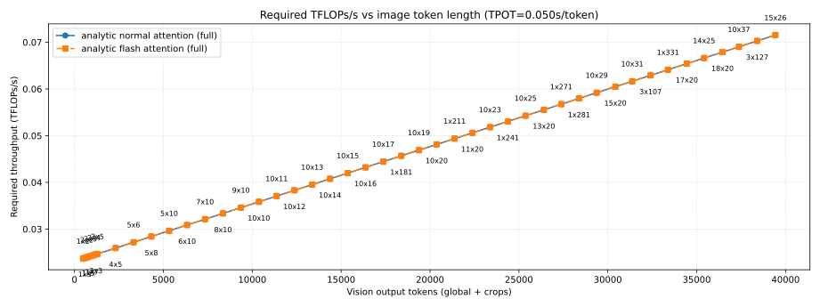

The table below summarizes, for each crop grid, the total vision output tokens, the number of decode steps `K`, and the compute throughput required to satisfy the 50 ms TPOT requirement using the analytic flash-attention path.

|Num crops|Crop grid (H×W)|Image tokens (global + crops)|Decode steps (K)|Required TFLOPs/s (analytic flash attention, full)|
| :---: | :---: | :---: | :---: | :---: |
|2|1x2|483|100|0.024|
|3|1x3|583|100|0.024|
|4|2x2|693|100|0.024|
|5|1x5|783|100|0.024|
|6|2x3|893|100|0.024|
|7|1x7|983|100|0.024|
|8|2x4|1093|100|0.024|
|9|3x3|1203|100|0.025|
|10|2x5|1293|100|0.025|
|20|4x5|2313|100|0.026|
|30|5x6|3323|100|0.027|
|40|5x8|4323|100|0.028|
|50|5x10|5323|100|0.030|
|60|6x10|6333|100|0.031|
|70|7x10|7343|100|0.032|
|80|8x10|8353|100|0.033|
|90|9x10|9363|100|0.035|
|100|10x10|10373|100|0.036|
|110|10x11|11373|100|0.037|
|120|10x12|12373|100|0.038|
|130|10x13|13373|100|0.040|
|140|10x14|14373|100|0.041|
|150|10x15|15373|100|0.042|
|160|10x16|16373|100|0.043|
|170|10x17|17373|100|0.044|
|181|1x181|18383|100|0.046|
|190|10x19|19373|100|0.047|
|200|10x20|20373|100|0.048|
|211|1x211|21383|100|0.049|
|220|11x20|22383|100|0.051|
|230|10x23|23373|100|0.052|
|241|1x241|24383|100|0.053|
|250|10x25|25373|100|0.054|
|260|13x20|26403|100|0.056|
|271|1x271|27383|100|0.057|
|281|1x281|28383|100|0.058|
|290|10x29|29373|100|0.059|
|300|15x20|30423|100|0.060|
|310|10x31|31373|100|0.062|
|321|3x107|32403|100|0.063|
|331|1x331|33383|100|0.064|
|340|17x20|34443|100|0.065|
|350|14x25|35413|100|0.067|
|360|18x20|36453|100|0.068|
|370|10x37|37373|100|0.069|
|381|3x127|38403|100|0.070|
|390|15x26|39423|100|0.072|

## Appendix: StageCost field definitions

The `StageCost` structure from `modelmeter.models.common.stage_cost` summarizes per-stage analytic costs for the vision, decoder, and vision+prefill plots in this report; we interpret its main fields as:
- Total stage FLOPs, expressed in teraFLOPs (TFLOPs), including both Tensor Core and CUDA core contributions when modeled.
- Activation I/O volume, measured in terabits (Tb), aggregating reads and writes between on-chip memory and HBM for that stage.
- Arithmetic intensity, defined as total stage FLOPs divided by activation I/O volume (FLOPs per bit), indicating how compute-bound versus bandwidth-bound the stage is.
- Peak activation memory footprint, measured in gigabytes (GB), for the given batch size and sequence length.
- KV-cache memory footprint, measured in gigabytes (GB), attributable to the stage (typically decoder attention blocks), driven by context length and decode length.
For DeepSeek-OCR-3B in the configuration used for these sweeps, the total parameter footprint is approximately 2.17 GB and is constant across crop grids, so we report it once here rather than as a separate curve.
