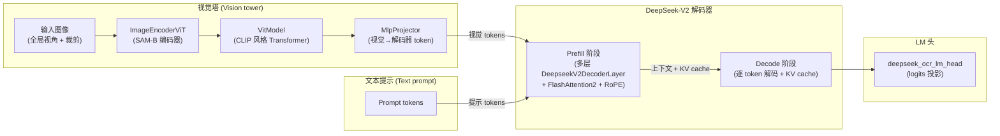
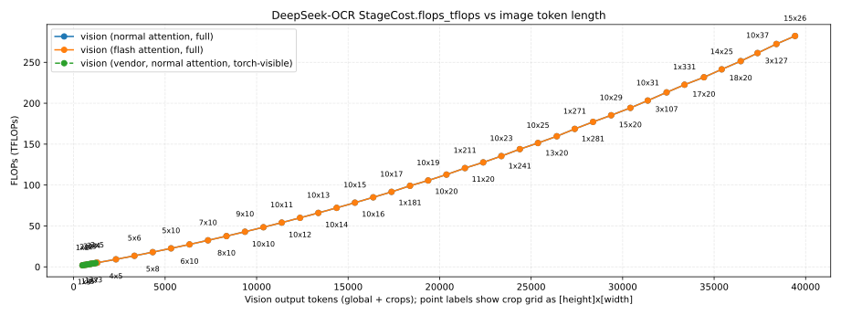
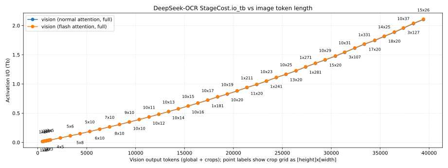
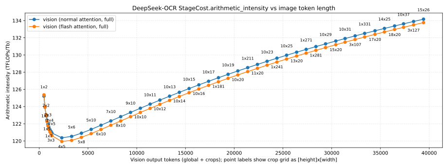
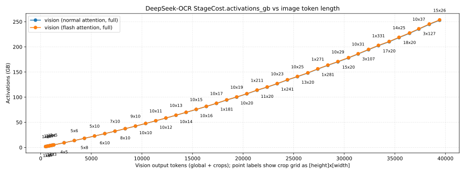
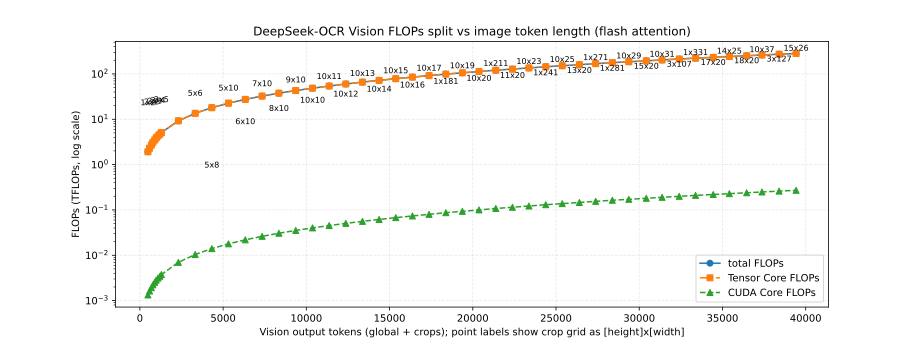

# DeepSeek-OCR 架构与性能解析总结

本文基于 DeepSeek-OCR 在 ModelMeter 中的解析实现，将 DeepSeek-OCR 3B 模型的解析架构描述和逐层定义，与解析性能验证和缩放分析结合在一起进行总结。

## 架构概览

解析模型通过一套基于 Hydra 的配置栈进行配置，该配置栈组合了：
- DeepSeek-OCR 3B 的架构定义（隐藏维度、层数、注意力头、MoE 布局以及相关超参数）。
- 序列长度、batch size 以及通用分析参数的运行时默认值。
- 一个视觉塔（SAM 编码器 + 类 CLIP Transformer + projector），负责产生视觉 token。
- 一个 DeepSeek-V2 解码器堆栈，在 prefill 与 decode 阶段分别消费视觉 token 和文本 token。
- 一个 LM 头，将解码器的隐状态映射到词表 logits。

在整体拓扑上，解析模型遵循官方 DeepSeek-OCR 的架构划分：
- 视觉分支
  - 输入图像（包含全局填充视角和可选的动态裁剪）首先经过 SAM-B 风格编码器（`ImageEncoderViT`）处理，得到稠密视觉特征。
  - 一个类 CLIP 的视觉 Transformer（由 `NoTPTransformerBlock` 与 `Attention` / `NoTPAttention` / `MLPBlock` / `NoTPFeedForward` 组成的 `VitModel`）接收 SAM 特征并输出一串语义视觉 token。
  - `MlpProjector` 将拼接后的 SAM + CLIP token 做降维并投影到解码器嵌入空间，得到与文本解码器兼容的一维视觉 token 序列。
- 解码分支
  - 若干 `num_hidden_layers` 层的 `DeepseekV2DecoderLayer` 组成文本解码器堆栈，结合 LLaMA 风格注意力（FlashAttention2 + RoPE）、DeepSeek-V2 MLP 或 MoE expert 以及 RMSNorm。
  - 解码器工作在两个阶段：prefill 阶段在完整上下文（视觉 token + prompt token）上一次性运行；decode 阶段按 token 逐步生成，并更新 KV cache。
- 输出头
  - LM 头 `deepseek_ocr_lm_head` 将解码器隐状态投影为词表 logits。



本节余下部分对解析层类型、功能角色以及它们如何组合成完整的 DeepSeek-OCR 解析模型做简要总结。

## 逐层清单与定义

### 视觉侧层级

- **PatchEmbed**：基于 Conv2d 的 patch 嵌入层，将形状为 `(B, C_in, H, W)` 的图像映射为 patch 网格上的嵌入；FLOPs 主要由 Tensor Core 卷积计算主导，形式为 `2 * B * H_out * W_out * kernel_h * kernel_w * C_in * C_out`，I/O 统计输入与输出激活，内存则跟踪权重和 patch 后特征。
- **Attention**：SAM 风格的二维注意力，在窗口或全局空间区域上做注意力，将窗口视作有效 batch 维；FLOPs 分解为 QKV 投影、相对位置偏置、SDPA 矩阵乘和输出投影，并报告输入、QKV 以及输出的激活 I/O。
- **MLPBlock**：SAM 视觉 Transformer Block 内的两层前馈块，使用 Tensor Core 做 `embedding_dim → mlp_dim → embedding_dim` 的 GEMM，并在 CUDA core 上执行 GELU 激活；I/O 覆盖输入、隐藏层和输出激活。
- **Block**：组合式 SAM 风格视觉 Transformer Block，聚合 `Attention` 子层与 `MLPBlock`，并包含轻量的 LayerNorm 与窗口划分开销；其 FLOPs 和 I/O 为子层之和以及可选的归一化 FLOPs。
- **LayerNorm2d**：在卷积颈部使用的 NCHW 布局 LayerNorm，建模为以 CUDA core 为主的 kernel，其 FLOPs 与 `5 * B * C * H * W` 成正比，I/O 近似为对特征张量的若干次读写。
- **CLIPVisionEmbeddings**：CLIP 风格的嵌入层，组合 patch 嵌入、CLS token 和位置嵌入；可以复用来自 SAM 的预计算 patch 嵌入（卷积 FLOPs 为零），也可以通过内部 `PatchEmbed` 重新计算 patch 嵌入，同时统计嵌入激活的 I/O 与内存。
- **NoTPAttention**：CLIP-L 中的 NoTP 多头注意力，包含 QKV/输出投影和 SDPA 矩阵乘；使用 Tensor Core FLOPs 估算 GEMM，通常忽略小量 CUDA core softmax 和 mask 相关计算，I/O 统计输入、QKV 与输出。
- **NoTPFeedForward**：CLIP-L NoTP 前馈块的解析版本，将 `hidden_size → intermediate_size → hidden_size` 分解为两次 GEMM，并统计中间激活 I/O 与权重内存占用。
- **NoTPTransformerBlock**：CLIP-L NoTP Transformer Block 的组合层，由 `NoTPAttention` 和 `NoTPFeedForward` 及 LayerNorm 组成；其 FLOPs 与 I/O 为子层之和。
- **NoTPTransformer**：堆叠多个 `NoTPTransformerBlock` 并附加 LayerNorm 的高层封装，用于表达 CLIP Vision 堆栈中的 Transformer 段；其成本为所有 Block 和顶层归一化的总和。
- **VitModel**：CLIP 风格视觉 Transformer 的顶层模型，封装了 patch 嵌入、位置嵌入、多层 `NoTPTransformerBlock` 以及最终的 pool 或投影；解析模型在此汇总所有视觉侧 FLOPs、I/O 和内存。
- **MlpProjector**：负责将 SAM + CLIP token 拼接后投影到解码器嵌入空间的 MLP 投影层；通过两个 GEMM 建模，将输入视觉 token 数量与输出嵌入维度映射为总 FLOPs 和激活 I/O。

### 解码器与 LLaMA 侧层级

- **DeepseekV2MLP**：DeepSeek-V2 解码器内的密集前馈块，使用 Tensor Core GEMM 表达 `hidden_size → ffn_dim → hidden_size`，并在 CUDA core 上建模非线性激活。
- **MoEGate**：DeepSeek-V2 MoE 中的门控模块，建模门控网络的 GEMM、softmax 与 top-k 路由的 FLOPs，并统计门控 logits 与路由索引的 I/O。
- **DeepseekV2MoE**：多专家前馈块，将 MoE 门控与多个 `DeepseekV2MLP` expert 组合；解析模型按照配置好的 expert 数和 top-k 选择数汇总 FLOPs 和 I/O。
- **DeepseekV2RMSNorm**：基于 RMSNorm 的归一化层，FLOPs 与特征维度成线性关系，并统计一次读写完整隐藏状态的 I/O。
- **DeepseekV2DecoderLayer_dense**：不含 MoE 的 DeepSeek-V2 解码层，组合 LLaMA 风格注意力（FlashAttention2 + RoPE）、`DeepseekV2MLP` 和 `DeepseekV2RMSNorm`，其总 FLOPs 和 I/O 为上述子模块之和。
- **DeepseekV2DecoderLayer_moe**：带 MoE 的 DeepSeek-V2 解码层，将 `DeepseekV2MoE` 替换密集前馈块，其成本由注意力、MoE 前馈、归一化和残差 I/O 组成。
- **LlamaFlashAttention2**：LLaMA 解码器中使用的 FlashAttention2 算子，解析模型将其主要成本视为 Tensor Core 上的注意力矩阵乘，并按头数、序列长度和维度统计 FLOPs 与 KV-cache I/O。
- **LlamaRotaryEmbedding**：为注意力 Q/K 应用 RoPE 的嵌入层，主要建模为 CUDA core 上的逐元素运算，FLOPs 与 `B * heads * seq_len * head_dim` 成正比。

## 解析性能与验证

本节汇总 DeepSeek-OCR 的解析性能验证与缩放行为，使用 ModelMeter 的解析实现以及配套的验证与 sweep 脚本。

### 概览与评估范围

分析重点是：解析 FLOPs、I/O 和内存模型与实际厂商实现的匹配程度，以及当模型和工作负载参数变化时解析成本如何缩放。
架构和算子级细节在前文以及独立的架构报告中已有总结；这里主要关注：
- 逐层 sanity check（与参考实现进行 layer-wise 对齐验证）。
- 端到端流水线验证（仅视觉路径和完整模型）。
- 模型缩放 sweep（当输入和模型参数变化时解析 FLOPs 和 I/O 如何变化）。

除非特别说明，所有实验默认在 Pixi 管理的 RTX 5090 环境中运行。

### 逐层 sanity check（layer-wise 验证）

下表展示了解析层级 FLOPs 与厂商实现计数之间的对比，包括测量的 FLOPs、理论 FLOPs、相对误差以及每层验证状态。

|Group|Analytic layer|Measured FLOPs (GFLOPs)|Theoretical FLOPs (GFLOPs)|Rel diff (%)|Status|
| :---: | :---: | :---: | :---: | :---: | :---: |
|vision|Attention|2.6071e+01|2.6098e+01|0.1010%|✓|
|vision|MLPBlock|3.8655e+01|3.8705e+01|0.1302%|✓|
|vision|PatchEmbed|4.8318e+00|4.8318e+00|0.0000%|✓|
|vision|Block|1.1033e+02|1.0967e+02|0.5931%|✓|
|vision|CLIPVisionEmbeddings_conv|3.0828e-01|3.0828e-01|0.0000%|✓|
|vision|LayerNorm2d|0.0000e+00|5.2429e-03|0.0000%|✓|
|vision|ImageEncoderViT|9.7691e+02|9.7323e+02|0.3766%|✓|
|vision|NoTPAttention|2.4264e+00|2.4264e+00|0.0000%|✓|
|vision|NoTPFeedForward|4.3117e+00|4.3170e+00|0.1221%|✓|
|vision|NoTPTransformerBlock|6.7382e+00|6.7434e+00|0.0781%|✓|
|vision|NoTPTransformer|1.3476e+01|1.3487e+01|0.0781%|✓|
|vision|VitModel|1.3476e+01|1.3488e+01|0.0879%|✓|
|vision|MlpProjector|4.9159e+00|4.9218e+00|0.1202%|✓|
|decoder|DeepseekV2MLP|2.6927e+01|2.6941e+01|0.0521%|✓|
|decoder|MoEGate|8.3886e-02|8.4083e-02|0.2344%|✓|
|decoder|DeepseekV2MoE|2.8270e+01|2.8284e+01|0.0526%|✓|
|decoder|DeepseekV2RMSNorm|0.0000e+00|1.9661e-03|0.0000%|✓|
|decoder|DeepseekV2DecoderLayer_dense|3.4980e+01|3.4998e+01|0.0513%|✓|
|decoder|DeepseekV2DecoderLayer_moe|3.6323e+01|3.6341e+01|0.0518%|✓|
|llama|LlamaFlashAttention2|6.7110e+00|6.7109e+00|0.0010%|✓|
|llama|LlamaRotaryEmbedding|6.5536e-05|6.5536e-05|0.0000%|✓|

下表给出解析层到参考实现类的映射，便于在代码中查找对应实现。

|Group|Analytic layer|Impl class (fully qualified path)|
| :---: | :---: | :---: |
|vision|Attention|deepencoder.Attention|
|vision|MLPBlock|deepencoder.MLPBlock|
|vision|PatchEmbed|deepencoder.PatchEmbed|
|vision|Block|deepencoder.Block|
|vision|CLIPVisionEmbeddings_conv|deepencoder.CLIPVisionEmbeddings|
|vision|LayerNorm2d|deepencoder.LayerNorm2d|
|vision|ImageEncoderViT|deepencoder.ImageEncoderViT|
|vision|NoTPAttention|deepencoder.NoTPAttention|
|vision|NoTPFeedForward|deepencoder.NoTPFeedForward|
|vision|NoTPTransformerBlock|deepencoder.NoTPTransformerBlock|
|vision|NoTPTransformer|deepencoder.NoTPTransformer|
|vision|VitModel|deepencoder.VitModel|
|vision|MlpProjector|deepencoder.MlpProjector|
|decoder|DeepseekV2MLP|modeling_deepseekv2.DeepseekV2MLP|
|decoder|MoEGate|modeling_deepseekv2.MoEGate|
|decoder|DeepseekV2MoE|modeling_deepseekv2.DeepseekV2MoE|
|decoder|DeepseekV2RMSNorm|modeling_deepseekv2.DeepseekV2RMSNorm|
|decoder|DeepseekV2DecoderLayer_dense|modeling_deepseekv2.DeepseekV2DecoderLayer|
|decoder|DeepseekV2DecoderLayer_moe|modeling_deepseekv2.DeepseekV2DecoderLayer|
|llama|LlamaFlashAttention2|transformers.models.llama.modeling_llama.LlamaFlashAttention2|
|llama|LlamaRotaryEmbedding|transformers.models.llama.modeling_llama.LlamaRotaryEmbedding|

### 成本与 sweep

本部分分析当模型和输入参数变化时，解析 FLOPs、I/O 与内存使用的缩放规律，使用同一套 ModelMeter 配置下的 sweep 脚本及辅助工具。

#### 视觉输入形状 sweep

这一小节探讨视觉计算随输入分辨率与裁剪配置变化的情况。

下列图表汇总了 DeepSeek-OCR 在不同候选裁剪网格上的视觉阶段解析成本 sweep，产出保存在 `reports/sweep/20251128-152354/vision_crops` 中，横轴为视觉输出 token 数（全局视角 + 各裁剪），图中点的标注为裁剪网格 `[height]x[width]`。

视觉阶段总 FLOPs（以 TFLOPs 计）随图像 token 长度变化，对比解析普通注意力、解析 flash 注意力以及厂商 FLOPs 计数。



需要注意的是，横轴上的 “图像 token 数” 把全局视角和所有裁剪的 token 聚合在一起，但在实现层面，每个裁剪都是一张独立图像，沿 batch 维度堆叠后再送入 SAM 与 CLIP（裁剪 tile 分辨率和 CLIP 序列长度在 sweep 中基本固定），因此视觉注意力的计算量更接近于 `O(num_crops · S_tile²)`，其中 `S_tile` 在 sweep 区间内近似常数，这也解释了在图中 Vision FLOPs 随裁剪数（以及 `image_tokens_total`）呈近似线性变化，而不是对聚合 token 数表现出明显 `O(S_total²)` 的二次曲线。

对应的裁剪与堆叠逻辑可在 `models/deepseek-ocr/modeling_deepseekocr.py:781-815, 897-900` 中看到：

```python
images_crop_raw, crop_ratio = dynamic_preprocess(image)
# ...
width_crop_num, height_crop_num = crop_ratio
images_spatial_crop.append([width_crop_num, height_crop_num])
if width_crop_num > 1 or height_crop_num > 1:
    for i in range(len(images_crop_raw)):
        images_crop_list.append(image_transform(images_crop_raw[i]).to(torch.bfloat16))
# ...
if images_crop_list:
    images_crop = torch.stack(images_crop_list, dim=0)   # (num_crops, 3, 640, 640)
else:
    images_crop = torch.zeros((1, 3, base_size, base_size))
```

视觉阶段激活 I/O 体积（在片上内存与 HBM 之间移动的 Tb 数）随图像 token 长度变化，展示在高分辨率输入与更密集裁剪网格下流量如何增长。



视觉阶段算术强度（FLOPs / 激活 I/O bit）随图像 token 长度变化，刻画随分辨率与裁剪网格 sweep 变化时的计算-带宽比。



视觉阶段峰值激活内存（GB）随图像 token 长度变化，强调在输入尺寸与裁剪密度增大时激活占用如何扩张，同时视觉阶段 KV-cache 近似为零。



视觉阶段 Tensor Core 与 CUDA core FLOPs（log 轴）随图像 token 长度变化，对比不同裁剪网格下两类算子的计算占比。



下表给出了视觉阶段在各裁剪配置下的 FLOPs 拆分（解析路径）。

|Num crops|Crop grid (H×W)|Image tokens (global + crops)|Tensor Core FLOPs (TFLOPs)|CUDA-core FLOPs (TFLOPs)|Tensor:CUDA ratio (CUDA=1.0)|
| :---: | :---: | :---: | :---: | :---: | :---: |
|2|1x2|483|1.913039e+00|1.329561e-03|1438.851:1.0|
|3|1x3|583|2.303791e+00|1.624969e-03|1417.744:1.0|
|4|1x4|683|2.696246e+00|1.922426e-03|1402.523:1.0|
|4|2x2|693|2.696587e+00|1.922835e-03|1402.401:1.0|
|5|1x5|783|3.090405e+00|2.221930e-03|1390.865:1.0|
|6|1x6|883|3.486269e+00|2.523483e-03|1381.530:1.0|
|6|2x3|893|3.486780e+00|2.524098e-03|1381.397:1.0|
|7|1x7|983|3.883836e+00|2.827084e-03|1373.796:1.0|
|8|1x8|1083|4.283107e+00|3.132732e-03|1367.211:1.0|
|8|2x4|1093|4.283788e+00|3.133552e-03|1367.071:1.0|
|9|1x9|1183|4.684082e+00|3.440429e-03|1361.482:1.0|
|9|3x3|1203|4.685615e+00|3.442272e-03|1361.198:1.0|
|10|1x10|1283|5.086761e+00|3.750174e-03|1356.407:1.0|
|10|2x5|1293|5.087613e+00|3.751198e-03|1356.264:1.0|
|11|1x11|1383|5.491144e+00|4.061966e-03|1351.844:1.0|
|12|1x12|1483|5.897231e+00|4.375807e-03|1347.690:1.0|
|12|2x6|1493|5.898253e+00|4.377036e-03|1347.545:1.0|
|12|3x4|1503|5.899275e+00|4.378265e-03|1347.400:1.0|
|13|1x13|1583|6.305021e+00|4.691696e-03|1343.868:1.0|
|14|1x14|1683|6.714516e+00|5.009632e-03|1340.321:1.0|
|14|2x7|1693|6.715709e+00|5.011066e-03|1340.176:1.0|
|15|1x15|1783|7.125715e+00|5.329617e-03|1337.003:1.0|
|15|3x5|1803|7.128271e+00|5.332689e-03|1336.712:1.0|
|16|1x16|1883|7.538617e+00|5.651650e-03|1333.879:1.0|
|16|2x8|1893|7.539980e+00|5.653288e-03|1333.734:1.0|
|16|4x4|1913|7.542707e+00|5.656565e-03|1333.443:1.0|
|17|1x17|1983|7.953224e+00|5.975730e-03|1330.921:1.0|
|18|1x18|2083|8.369534e+00|6.301859e-03|1328.106:1.0|
|18|2x9|2093|8.371068e+00|6.303702e-03|1327.961:1.0|
|18|3x6|2103|8.372601e+00|6.305545e-03|1327.816:1.0|
|19|1x19|2183|8.787548e+00|6.630035e-03|1325.415:1.0|
|20|1x20|2283|9.207267e+00|6.960260e-03|1322.834:1.0|
|20|2x10|2293|9.208971e+00|6.962308e-03|1322.689:1.0|
|20|4x5|2313|9.212379e+00|6.966404e-03|1322.401:1.0|
|21|1x21|2383|9.628689e+00|7.292533e-03|1320.349:1.0|
|21|3x7|2403|9.632267e+00|7.296834e-03|1320.061:1.0|
|22|1x22|2483|1.005182e+01|7.626853e-03|1317.950:1.0|
|22|2x11|2493|1.005369e+01|7.629106e-03|1317.807:1.0|
|23|1x23|2583|1.047665e+01|7.963222e-03|1315.629:1.0|
|24|1x24|2683|1.090318e+01|8.301639e-03|1313.377:1.0|
|24|2x12|2693|1.090522e+01|8.304096e-03|1313.234:1.0|
|24|3x8|2703|1.090727e+01|8.306554e-03|1313.092:1.0|
|24|4x6|2713|1.090931e+01|8.309011e-03|1312.950:1.0|
|25|1x25|2783|1.133142e+01|8.642103e-03|1311.187:1.0|
|25|5x5|2823|1.133994e+01|8.652343e-03|1310.620:1.0|
|26|1x26|2883|1.176136e+01|8.984616e-03|1309.055:1.0|
|26|2x13|2893|1.176357e+01|8.987278e-03|1308.914:1.0|
|27|1x27|2983|1.219301e+01|9.329177e-03|1306.975:1.0|
|27|3x9|3003|1.219761e+01|9.334706e-03|1306.694:1.0|
|28|1x28|3083|1.262635e+01|9.675785e-03|1304.944:1.0|
|28|2x14|3093|1.262874e+01|9.678652e-03|1304.804:1.0|
|28|4x7|3113|1.263351e+01|9.684387e-03|1304.524:1.0|
|29|1x29|3183|1.306141e+01|1.002444e-02|1302.956:1.0|

#### 序列长度与 decode sweep

这一小节聚焦解码器 FLOPs 与 KV-cache 内存随 prefill 上下文长度（`S_prefill`）、decode 长度（`K` 个 token）、batch 大小（`B`）以及注意力头配置的缩放行为。

下列图表汇总了 DeepSeek-OCR 在候选裁剪网格上的 decode sweep，结果保存在 `reports/sweep/20251127-160058/e2e_decode` 中，使用固定文本 prompt 与 decode 步数，横轴同样为视觉输出 token 数（全局视角 + 各裁剪），点标注为裁剪网格 `[height]x[width]`。

DeepSeek-OCR 解码 FLOPs 随图像 token 长度变化（解析与厂商曲线），对每个 sweep 点在固定 `K = 100` decode 步数上进行聚合。


总 decode FLOPs（TFLOPs）随图像 token 长度变化，对固定 `K = 100` 步的完整 decode 序列（而非单 token）进行统计，对比解析普通注意力、解析 flash 注意力和厂商基线。


解码阶段激活 I/O 体积（Tb）随图像 token 长度变化，强调在固定 `K = 100` decode 步数下，累积流量如何随上游视觉工作负载变化。


解码阶段算术强度（FLOPs / 激活 I/O bit）随图像 token 长度变化，展示随着裁剪网格变密、序列长度增加，计算-带宽比如何演化。


解码阶段峰值激活内存（GB）随图像 token 长度变化，展示在完整 `K = 100` decode 过程中，解码激活占用在何处与视觉激活相当甚至超过视觉激活。


解码阶段 KV-cache 内存（GB）随图像 token 长度变化，刻画在不同裁剪配置下，prefill 上下文与 `K = 100` decode token 组合对 KV 存储的影响。


解码阶段 Tensor Core 与 CUDA core FLOPs（log 轴）随图像 token 长度变化，展示随着 decode 工作负载增大，两类算子在总计算中的占比变化。


下表按裁剪配置给出解析 decode 阶段（`K = 100`）的 FLOPs 拆分。

|Num crops|Crop grid (H×W)|Image tokens (global + crops)|Tensor Core FLOPs (TFLOPs)|CUDA-core FLOPs (TFLOPs)|Tensor:CUDA ratio (CUDA=1.0)|
| :---: | :---: | :---: | :---: | :---: | :---: |
|2|1x2|483|1.184143e-01|4.408320e-05|2686.156:1.0|
|3|1x3|583|1.190287e-01|4.408320e-05|2700.093:1.0|
|4|1x4|683|1.196431e-01|4.408320e-05|2714.030:1.0|
|4|2x2|693|1.197046e-01|4.408320e-05|2715.424:1.0|
|5|1x5|783|1.202575e-01|4.408320e-05|2727.967:1.0|
|6|1x6|883|1.208719e-01|4.408320e-05|2741.905:1.0|
|6|2x3|893|1.209334e-01|4.408320e-05|2743.298:1.0|
|7|1x7|983|1.214863e-01|4.408320e-05|2755.842:1.0|
|8|1x8|1083|1.221007e-01|4.408320e-05|2769.779:1.0|
|8|2x4|1093|1.221622e-01|4.408320e-05|2771.173:1.0|
|9|1x9|1183|1.227151e-01|4.408320e-05|2783.717:1.0|
|9|3x3|1203|1.228380e-01|4.408320e-05|2786.504:1.0|
|10|1x10|1283|1.233295e-01|4.408320e-05|2797.654:1.0|
|10|2x5|1293|1.233910e-01|4.408320e-05|2799.048:1.0|
|11|1x11|1383|1.239439e-01|4.408320e-05|2811.591:1.0|
|12|1x12|1483|1.245583e-01|4.408320e-05|2825.528:1.0|
|12|2x6|1493|1.246198e-01|4.408320e-05|2826.922:1.0|
|12|3x4|1503|1.246812e-01|4.408320e-05|2828.316:1.0|
|13|1x13|1583|1.251727e-01|4.408320e-05|2839.466:1.0|
|14|1x14|1683|1.257871e-01|4.408320e-05|2853.403:1.0|
|14|2x7|1693|1.258486e-01|4.408320e-05|2854.797:1.0|
|15|1x15|1783|1.264015e-01|4.408320e-05|2867.340:1.0|
|15|3x5|1803|1.265244e-01|4.408320e-05|2870.128:1.0|
|16|1x16|1883|1.270159e-01|4.408320e-05|2881.278:1.0|
|16|2x8|1893|1.270774e-01|4.408320e-05|2882.671:1.0|
|16|4x4|1913|1.272003e-01|4.408320e-05|2885.459:1.0|
|17|1x17|1983|1.276303e-01|4.408320e-05|2895.215:1.0|
|18|1x18|2083|1.282447e-01|4.408320e-05|2909.152:1.0|
|18|2x9|2093|1.283062e-01|4.408320e-05|2910.546:1.0|
|18|3x6|2103|1.283676e-01|4.408320e-05|2911.940:1.0|
|19|1x19|2183|1.288591e-01|4.408320e-05|2923.089:1.0|
|20|1x20|2283|1.294735e-01|4.408320e-05|2937.027:1.0|
|20|2x10|2293|1.295350e-01|4.408320e-05|2938.420:1.0|
|20|4x5|2313|1.296579e-01|4.408320e-05|2941.208:1.0|
|21|1x21|2383|1.300879e-01|4.408320e-05|2950.964:1.0|
|21|3x7|2403|1.302108e-01|4.408320e-05|2953.751:1.0|
|22|1x22|2483|1.307023e-01|4.408320e-05|2964.901:1.0|
|22|2x11|2493|1.307638e-01|4.408320e-05|2966.295:1.0|
|23|1x23|2583|1.313167e-01|4.408320e-05|2978.839:1.0|
|24|1x24|2683|1.319311e-01|4.408320e-05|2992.776:1.0|
|24|2x12|2693|1.319926e-01|4.408320e-05|2994.170:1.0|
|24|3x8|2703|1.320540e-01|4.408320e-05|2995.563:1.0|
|24|4x6|2713|1.321155e-01|4.408320e-05|2996.957:1.0|
|25|1x25|2783|1.325455e-01|4.408320e-05|3006.713:1.0|
|25|5x5|2823|1.327913e-01|4.408320e-05|3012.288:1.0|
|26|1x26|2883|1.331599e-01|4.408320e-05|3020.650:1.0|
|26|2x13|2893|1.332214e-01|4.408320e-05|3022.044:1.0|
|27|1x27|2983|1.337743e-01|4.408320e-05|3034.588:1.0|
|27|3x9|3003|1.338972e-01|4.408320e-05|3037.375:1.0|
|28|1x28|3083|1.343887e-01|4.408320e-05|3048.525:1.0|
|28|2x14|3093|1.344502e-01|4.408320e-05|3049.919:1.0|
|28|4x7|3113|1.345731e-01|4.408320e-05|3052.706:1.0|
|29|1x29|3183|1.350031e-01|4.408320e-05|3062.462:1.0|

#### 组合工作负载画像

这一小节关注更贴近实际的工作负载画像，将图像分辨率、上下文长度与 decode 长度组合在一起（例如不同的 OCR workload ID）。

下列图表汇总了 DeepSeek-OCR 视觉+prefill 裁剪网格 sweep，结果保存在 `reports/sweep/20251127-160058/e2e_vision_prefill` 中，横轴为视觉输出 token 数（全局视角 + 裁剪），点标注为裁剪网格 `[height]x[width]`。

DeepSeek-OCR 视觉+prefill FLOPs 随图像 token 长度变化（解析与厂商曲线），并以裁剪网格作为标注。


这些图使用了 `modelmeter.models.common.stage_cost` 中的 `StageCost` 结构来表达各阶段的解析成本；其字段定义和解释见附录。

prefill 阶段总 FLOPs（TFLOPs）按逻辑组件（视觉、解码器、LM 头）拆分，并随图像 token 长度变化，展示在裁剪密度升高时各组件对总 prefill 计算量的贡献。


prefill 阶段激活 I/O 体积（Tb）随图像 token 长度变化，突出不同裁剪网格下哪些阶段主导带宽需求。


prefill 阶段算术强度（FLOPs / 激活 I/O bit）随图像 token 长度变化，指示不同裁剪配置下哪些阶段更偏 compute-bound，哪些更偏 bandwidth-bound。


prefill 阶段峰值激活内存（GB）随图像 token 长度变化，强调在大裁剪网格下激活 footprint 如何超线性增长，以及在哪些区域视觉激活开始主导整体内存占用。


prefill 阶段 KV-cache 内存（GB）随图像 token 长度变化，记录在固定 prefill 上下文配置下，解码器部分对 KV-cache footprint 的贡献。


视觉+prefill 组合阶段 Tensor Core 与 CUDA core FLOPs（log 轴）随图像 token 长度变化，总结端到端计算中两类算子的利用率变化趋势。


下表给出了视觉+prefill 组合阶段在各裁剪配置下的 FLOPs 拆分（解析路径）。

|Num crops|Crop grid (H×W)|Image tokens (global + crops)|Tensor Core FLOPs (TFLOPs)|CUDA-core FLOPs (TFLOPs)|Tensor:CUDA ratio (CUDA=1.0)|
| :---: | :---: | :---: | :---: | :---: | :---: |
|2|1x2|483|2.495323e+00|1.546891e-03|1613.122:1.0|
|3|1x3|583|3.007828e+00|1.886383e-03|1594.495:1.0|
|4|1x4|683|3.523265e+00|2.227922e-03|1581.413:1.0|
|4|2x2|693|3.535972e+00|2.232740e-03|1583.692:1.0|
|5|1x5|783|4.041636e+00|2.571510e-03|1571.697:1.0|
|6|1x6|883|4.562939e+00|2.917146e-03|1564.179:1.0|
|6|2x3|893|4.576062e+00|2.922169e-03|1565.981:1.0|
|7|1x7|983|5.087175e+00|3.264830e-03|1558.175:1.0|
|8|1x8|1083|5.614344e+00|3.614562e-03|1553.257:1.0|
|8|2x4|1093|5.627883e+00|3.619789e-03|1554.754:1.0|
|9|1x9|1183|6.144445e+00|3.966342e-03|1549.147:1.0|
|9|3x3|1203|6.171951e+00|3.977001e-03|1551.911:1.0|
|10|1x10|1283|6.677479e+00|4.320169e-03|1545.652:1.0|
|10|2x5|1293|6.691434e+00|4.325602e-03|1546.937:1.0|
|11|1x11|1383|7.213446e+00|4.676045e-03|1542.638:1.0|
|12|1x12|1483|7.752346e+00|5.033969e-03|1540.007:1.0|
|12|2x6|1493|7.766717e+00|5.039606e-03|1541.136:1.0|
|12|3x4|1503|7.781101e+00|5.045243e-03|1542.265:1.0|
|13|1x13|1583|8.294178e+00|5.393941e-03|1537.684:1.0|
|14|1x14|1683|8.838943e+00|5.755961e-03|1535.616:1.0|
|14|2x7|1693|8.853731e+00|5.761803e-03|1536.625:1.0|
|15|1x15|1783|9.386641e+00|6.120029e-03|1533.758:1.0|
|15|3x5|1803|9.416644e+00|6.131917e-03|1535.677:1.0|
|16|1x16|1883|9.937272e+00|6.486145e-03|1532.077:1.0|
|16|2x8|1893|9.952475e+00|6.492191e-03|1532.992:1.0|
|16|4x4|1913|9.982919e+00|6.504285e-03|1534.822:1.0|
|17|1x17|1983|1.049083e+01|6.854308e-03|1530.546:1.0|
|18|1x18|2083|1.104733e+01|7.224520e-03|1529.144:1.0|
|18|2x9|2093|1.106295e+01|7.230772e-03|1529.982:1.0|
|18|3x6|2103|1.107858e+01|7.237023e-03|1530.820:1.0|
|19|1x19|2183|1.160676e+01|7.596780e-03|1527.853:1.0|
|20|1x20|2283|1.216912e+01|7.971088e-03|1526.658:1.0|
|20|2x10|2293|1.218516e+01|7.977544e-03|1527.432:1.0|
|20|4x5|2313|1.221727e+01|7.990457e-03|1528.982:1.0|
|21|1x21|2383|1.273442e+01|8.347444e-03|1525.547:1.0|
|21|3x7|2403|1.276692e+01|8.360561e-03|1527.041:1.0|
|22|1x22|2483|1.330264e+01|8.725848e-03|1524.510:1.0|
|22|2x11|2493|1.331909e+01|8.732509e-03|1525.231:1.0|
|23|1x23|2583|1.387380e+01|9.106299e-03|1523.539:1.0|
|24|1x24|2683|1.444789e+01|9.488799e-03|1522.626:1.0|
|24|2x12|2693|1.446476e+01|9.495665e-03|1523.302:1.0|
|24|3x8|2703|1.448164e+01|9.502531e-03|1523.977:1.0|
|24|4x6|2713|1.449854e+01|9.509397e-03|1524.654:1.0|
|25|1x25|2783|1.502492e+01|9.873347e-03|1521.766:1.0|
|25|5x5|2823|1.509330e+01|9.901220e-03|1524.388:1.0|
|26|1x26|2883|1.560488e+01|1.025994e-02|1520.952:1.0|
|26|2x13|2893|1.562216e+01|1.026701e-02|1521.588:1.0|
|27|1x27|2983|1.618777e+01|1.064859e-02|1520.180:1.0|
|27|3x9|3003|1.622277e+01|1.066293e-02|1521.417:1.0|
|28|1x28|3083|1.677359e+01|1.103928e-02|1519.446:1.0|
|28|2x14|3093|1.679129e+01|1.104655e-02|1520.048:1.0|
|28|4x7|3113|1.682673e+01|1.106111e-02|1521.252:1.0|
|29|1x29|3183|1.736235e+01|1.143202e-02|1518.747:1.0|

## 面向目标的性能分析

本节将上述解析工作负载与面向用户的响应性约束联系起来，聚焦两个目标：
- 视觉+prefill 阶段的首 token 延迟（TTFT, Time-to-first-token）。
- 解码阶段的单 token 延迟（TPOT, Time-per-output-token）。

### 首 token 延迟（TTFT）：视觉+prefill

对于 TTFT，这里假设视觉+prefill 阶段的目标时间预算为 1.0 s（TTFT = 1.0 s）。
下图展示了为满足该 TTFT 目标，在不同图像 token 长度下所需的 TFLOPs/s，其中分别给出了解析普通注意力、解析 flash 注意力以及厂商基线的曲线。


下表列举了其中一部分采样点，对每个裁剪网格给出视觉输出 token 总数，以及在解析 flash 注意力路径下，为满足 1.0 s TTFT 预算所需的计算吞吐（TFLOPs/s）。

|Num crops|Crop grid (H×W)|Image tokens (global + crops)|Required TFLOPs/s (analytic flash attention, full)|
| :---: | :---: | :---: | :---: |
|2|1x2|483|2.497|
|3|1x3|583|3.010|
|4|1x4|683|3.525|
|4|2x2|693|3.538|
|5|1x5|783|4.044|
|6|1x6|883|4.566|
|6|2x3|893|4.579|
|7|1x7|983|5.090|
|8|1x8|1083|5.618|
|8|2x4|1093|5.632|
|9|1x9|1183|6.148|
|9|3x3|1203|6.176|
|10|1x10|1283|6.682|
|10|2x5|1293|6.696|
|11|1x11|1383|7.218|
|12|1x12|1483|7.757|
|12|2x6|1493|7.772|
|12|3x4|1503|7.786|
|13|1x13|1583|8.300|
|14|1x14|1683|8.845|
|14|2x7|1693|8.859|
|15|1x15|1783|9.393|
|15|3x5|1803|9.423|
|16|1x16|1883|9.944|
|16|2x8|1893|9.959|
|16|4x4|1913|9.989|
|17|1x17|1983|10.498|
|18|1x18|2083|11.055|
|18|2x9|2093|11.070|
|18|3x6|2103|11.086|
|19|1x19|2183|11.614|
|20|1x20|2283|12.177|
|20|2x10|2293|12.193|
|20|4x5|2313|12.225|
|21|1x21|2383|12.743|
|21|3x7|2403|12.775|
|22|1x22|2483|13.311|
|22|2x11|2493|13.328|
|23|1x23|2583|13.883|
|24|1x24|2683|14.457|
|24|2x12|2693|14.474|
|24|3x8|2703|14.491|
|24|4x6|2713|14.508|
|25|1x25|2783|15.035|
|25|5x5|2823|15.103|
|26|1x26|2883|15.615|
|26|2x13|2893|15.632|
|27|1x27|2983|16.198|
|27|3x9|3003|16.233|
|28|1x28|3083|16.785|
|28|2x14|3093|16.802|
|28|4x7|3113|16.838|
|29|1x29|3183|17.374|

### 单 token 延迟（TPOT）：decode

为刻画稳态流式输出的延迟，本节分析为满足 decode 阶段目标单 token 延迟（TPOT）所需的计算吞吐。
在这些实验中，decode sweep 采用 50 ms 的单 token 预算（TPOT = 0.05 s），下图给出了在该约束下，不同图像 token 长度对应的所需 TFLOPs/s。


下表按裁剪网格汇总了视觉输出 token 总数、decode 步数 `K` 以及在解析 flash 注意力路径下，为满足 50 ms TPOT 目标所需的计算吞吐。

|Num crops|Crop grid (H×W)|Image tokens (global + crops)|Decode steps (K)|Required TFLOPs/s (analytic flash attention, full)|
| :---: | :---: | :---: | :---: | :---: |
|2|1x2|483|100|0.024|
|3|1x3|583|100|0.024|
|4|1x4|683|100|0.024|
|4|2x2|693|100|0.024|
|5|1x5|783|100|0.024|
|6|1x6|883|100|0.024|
|6|2x3|893|100|0.024|
|7|1x7|983|100|0.024|
|8|1x8|1083|100|0.024|
|8|2x4|1093|100|0.024|
|9|1x9|1183|100|0.025|
|9|3x3|1203|100|0.025|
|10|1x10|1283|100|0.025|
|10|2x5|1293|100|0.025|
|11|1x11|1383|100|0.025|
|12|1x12|1483|100|0.025|
|12|2x6|1493|100|0.025|
|12|3x4|1503|100|0.025|
|13|1x13|1583|100|0.025|
|14|1x14|1683|100|0.025|
|14|2x7|1693|100|0.025|
|15|1x15|1783|100|0.025|
|15|3x5|1803|100|0.025|
|16|1x16|1883|100|0.025|
|16|2x8|1893|100|0.025|
|16|4x4|1913|100|0.025|
|17|1x17|1983|100|0.026|
|18|1x18|2083|100|0.026|
|18|2x9|2093|100|0.026|
|18|3x6|2103|100|0.026|
|19|1x19|2183|100|0.026|
|20|1x20|2283|100|0.026|
|20|2x10|2293|100|0.026|
|20|4x5|2313|100|0.026|
|21|1x21|2383|100|0.026|
|21|3x7|2403|100|0.026|
|22|1x22|2483|100|0.026|
|22|2x11|2493|100|0.026|
|23|1x23|2583|100|0.026|
|24|1x24|2683|100|0.026|
|24|2x12|2693|100|0.026|
|24|3x8|2703|100|0.026|
|24|4x6|2713|100|0.026|
|25|1x25|2783|100|0.027|
|25|5x5|2823|100|0.027|
|26|1x26|2883|100|0.027|
|26|2x13|2893|100|0.027|
|27|1x27|2983|100|0.027|
|27|3x9|3003|100|0.027|
|28|1x28|3083|100|0.027|
|28|2x14|3093|100|0.027|
|28|4x7|3113|100|0.027|
|29|1x29|3183|100|0.027|

### 附录：StageCost 字段定义

ModelMeter 中的 `StageCost` 结构用于汇总本报告中视觉、解码器以及视觉+prefill 图表的逐阶段解析成本，其主要字段含义如下：
- 总阶段 FLOPs，以 teraFLOPs（TFLOPs）表示，在建模时包含 Tensor Core 与 CUDA core 的贡献。
- 激活 I/O 体积，以 terabits（Tb）计，统计该阶段在片上内存与 HBM 之间的读写总量。
- 算术强度，定义为阶段总 FLOPs 除以激活 I/O 体积（FLOPs per bit），用于判断该阶段是更偏计算受限还是带宽受限。
- 峰值激活内存占用，以 GB 表示，针对给定的 batch size 与序列长度。
- KV-cache 内存占用，以 GB 表示，通常由解码器注意力块产生，并受上下文长度与 decode 长度驱动。

在本次 sweep 使用的 DeepSeek-OCR-3B 配置下，总参数量约为 2.17 GB，且在不同裁剪网格之间保持不变，因此我们只在此处统一报告，而不单独绘制曲线。

### 附录：实现文件路径（参考）

对于需要进一步阅读代码的读者，下列路径给出了本总结中各概念组件在代码中的对应位置：
- DeepSeek-OCR 解析模型与 sweep：`extern/modelmeter/models/deepseek_ocr`
- 验证与 sweep 脚本：`extern/modelmeter/models/deepseek_ocr/scripts` 与 `extern/modelmeter/models/deepseek_ocr/scripts/sweep`
- 视觉层包：`layers/vision`（包含 `PatchEmbed`、`Attention`、`MLPBlock`、`Block`、`LayerNorm2d`、`CLIPVisionEmbeddings`、`NoTPAttention`、`NoTPFeedForward`、`NoTPTransformerBlock`、`NoTPTransformer`、`ImageEncoderViT`、`VitModel`、`MlpProjector` 以及相关辅助工具）
- 解码器层包：`layers/decoder`（包含 `DeepseekV2MLP`、`MoEGate`、`DeepseekV2MoE`、`DeepseekV2RMSNorm`、`DeepseekV2DecoderLayer`、`LMHead`）
- LLaMA 基元层包：`layers/llama`（包含 `LlamaAttention`、`LlamaFlashAttention2`、`LlamaRotaryEmbedding`）
- 详细架构报告：`reports/deepseek-ocr-analytical-arch-report.md`
- 详细性能报告：`reports/deepseek-ocr-analytical-perf-report.md`
