# DeepSeek-OCR Analytical Architecture and Performance Summary

This document combines the analytic architecture description and per-layer definitions for the DeepSeek-OCR 3B model with the analytical performance validation and scaling analysis, based on a ModelMeter analytic implementation of DeepSeek-OCR.

## Architecture Overview

The analytic model is configured via a Hydra-based configuration stack that combines:
- A DeepSeek-OCR 3B architecture definition (hidden size, number of layers, attention heads, MoE layout, and related hyperparameters).
- Runtime defaults for sequence lengths, batch size, and general analysis parameters.
- A vision tower (SAM encoder + CLIP-style transformer + projector) that produces visual tokens.
- A DeepSeek-V2 decoder stack that consumes visual and text tokens in prefill and decode phases.
- An LM head that projects decoder hidden states to vocabulary logits.

At a high level, the analytic topology follows the vendor DeepSeek-OCR architecture:
- Vision branch
  - Input image (global padded view and optional dynamic crops) is processed by a SAM-B style encoder (`ImageEncoderViT`) to produce dense visual features.
  - A CLIP-like vision transformer (`VitModel` built from `NoTPTransformerBlock` and `Attention` / `NoTPAttention` / `MLPBlock` / `NoTPFeedForward`) consumes SAM features and produces a sequence of semantic visual tokens.
  - `MlpProjector` reduces and projects the concatenated SAM + CLIP tokens into the decoder embedding space, yielding a sequence of visual tokens compatible with the text decoder.
- Decoder branch
  - A stack of `num_hidden_layers` `DeepseekV2DecoderLayer` blocks implements the text decoder, combining LLaMA-style attention (FlashAttention2 + RoPE), DeepSeek-V2 MLP or MoE experts, and RMSNorm.
  - The decoder operates in two phases: a prefill phase over the full context (visual tokens + prompt tokens) and a decode phase that runs one token at a time and updates a KV cache.
- Head
  - The LM head `deepseek_ocr_lm_head` projects decoder hidden states to vocabulary logits.

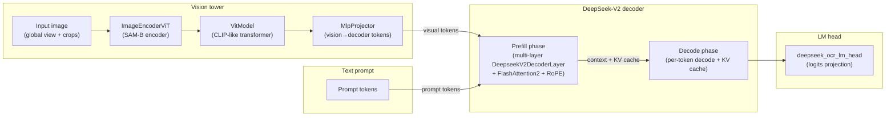

The remainder of this section summarizes the analytic layer types, their roles, and how they compose into the full DeepSeek-OCR analytic model.

## Per-layer inventory and definitions

### Vision layers

- **PatchEmbed**: Conv2d-based patch embedding that maps images of shape `(B, C_in, H, W)` to a grid of patch embeddings; FLOPs are dominated by Tensor Core convolution math `2 * B * H_out * W_out * kernel_h * kernel_w * C_in * C_out`, while I/O counts input and output activations and memory tracks weights plus patch-embedded features.
- **Attention**: SAM-style 2D attention over windowed or global spatial regions, treating windows as an effective batch dimension; decomposes FLOPs into QKV projections, relative position bias, SDPA matmuls, and output projection, and reports activation I/O for inputs, QKV, and outputs.
- **MLPBlock**: Two-layer feed-forward block inside SAM vision transformer blocks with Tensor Core matmuls for `embedding_dim → mlp_dim → embedding_dim` and CUDA-core GELU activations; I/O covers input, hidden, and output activations.
- **Block**: Composite SAM-style vision transformer block that aggregates an `Attention` sublayer and `MLPBlock` plus small LayerNorm and window-partition overhead; FLOPs and I/O are the sums of its children plus optional norm FLOPs.
- **LayerNorm2d**: NCHW LayerNorm used in the convolutional neck, modeled as a CUDA-core-dominated kernel with FLOPs proportional to `5 * B * C * H * W` and I/O approximated as a few reads and writes of the feature tensor.
- **CLIPVisionEmbeddings**: CLIP-style embeddings combining patch embeddings, a CLS token, and positional embeddings; can reuse precomputed patch embeddings from SAM (zero conv FLOPs) or include patch-embedding FLOPs via an internal `PatchEmbed` instance, while counting embedding activations in I/O and memory.
- **NoTPAttention**: CLIP-L NoTP multi-head attention with QKV and output projections plus SDPA matmuls; uses Tensor Core FLOPs for GEMMs and typically ignores small CUDA-core softmax and masking work, while I/O counts input, QKV, and output activations.
- **NoTPFeedForward**: CLIP-L QuickGELU-based MLP modeled as two Tensor-Core matmuls plus CUDA-core activation work; I/O includes input, hidden, and output activations in fp16/bf16.
- **NoTPTransformerBlock**: Aggregates a `NoTPAttention` and `NoTPFeedForward` sublayer plus LayerNorm overhead into a single transformer block, summing FLOPs, I/O, and memory and attributing extra norm FLOPs to CUDA cores.
- **NoTPTransformer**: Wrapper around a sequence of `NoTPTransformerBlock` instances representing the full CLIP-L transformer depth; purely aggregates FLOPs, I/O, and memory across blocks and provides stack-level arithmetic intensity.
- **ImageEncoderViT**: SAM-B encoder built from `PatchEmbed`, a stack of `Block` instances with windowed/global attention, and a convolutional neck that includes `LayerNorm2d`; FLOPs and I/O reflect both conv and transformer components and scale with image size, window size, and depth.
- **VitModel**: Wrapper around `CLIPVisionEmbeddings` and `NoTPTransformer`, plus a final LayerNorm modeled as CUDA-core work; aggregates their FLOPs and I/O and exposes combined parameter and activation footprints for the CLIP tower via memory methods.
- **MlpProjector**: Vision-to-decoder projector that can be identity, linear, or a small MLP stack over concatenated SAM+CLIP tokens; Tensor Core matmuls for projection layers and optional CUDA-core GELU activations, with I/O proportional to the number of vision tokens and embedding dimensions.
- **VisionWorkload helpers**: Shape-only utilities (not `BaseLayer`s) that reconstruct vendor-style crop layouts and token counts (global vs crops) from image geometry, patch size, and downsample ratio so that analytic configs and scripts can derive vision FLOPs and I/O purely from shapes.

### Decoder layers

- **DeepseekV2MLP**: SwiGLU feed-forward network used in DeepSeek-V2 decoder blocks and MoE experts, with Tensor Core FLOPs approximated as `6 * B * S * h * i` for gate/up/down projections and CUDA-core FLOPs for SwiGLU activation and gated multiplication; I/O accounts for input, intermediate, and output activations.
- **MoEGate**: MoE routing gate that scores tokens over experts and selects the top-`k_active`; uses Tensor Core GEMMs for the hidden-to-experts projection and CUDA-core work for softmax, top-k, and normalization, with I/O covering gate inputs, logits, and top-k routing weights.
- **DeepseekV2MoE**: MoE block combining `MoEGate`, a routed experts MLP (`DeepseekV2MLP` with effective batch `B * k_active`), and an optional shared-expert MLP; aggregates FLOPs, I/O, and memory across routed and shared experts for a static `(B, S, h)` workload.
- **DeepseekV2RMSNorm**: RMSNorm normalization in decoder blocks, modeled as a CUDA-core operation with FLOPs `≈ 3 * B * S * d`, zero Tensor Core FLOPs, and I/O plus parameter memory proportional to the hidden size.
- **DeepseekV2DecoderLayer**: Full DeepSeek-V2 decoder block composed of two `DeepseekV2RMSNorm` instances, an attention primitive (`LlamaFlashAttention2` or `LlamaAttention`), and either `DeepseekV2MLP` or `DeepseekV2MoE`; tracks a simple prefill/decode stage and a `SyntheticKVCache` meta-object so FLOPs, I/O, and KV-cache memory can be interpreted for either prefill or decode shapes.
- **LMHead**: Final decoder projection from hidden size `h` to vocabulary size `V` modeled as a single Tensor-Core matmul with FLOPs `2 * B * S * h * V`, negligible CUDA-core work, I/O for hidden states and logits, and stage-aware sequence length for prefill vs per-token decode.

### LLaMA layers and primitives

- **LlamaAttention**: Non-flash LLaMA attention path (standard SDPA) with FLOP formulas aligned to FlashAttention2 but representing the unfused path that PyTorch’s flop counter sees; supports prefill and decode shapes via separate query and KV lengths and attributes all matmul math to Tensor Cores.
- **LlamaFlashAttention2**: Fused FlashAttention2 path used in DeepSeek-V2 decoder blocks, with closed-form FLOPs for QKV projections, attention core, and output projection, separate prefill/decode modes (via `set_prefill_shape` and `set_decode_shape`), and I/O and memory methods used in verification and MFU analysis.
- **LlamaRotaryEmbedding**: RoPE primitive modeled as CUDA-core work with FLOPs from the frequency-position matmul and I/O dominated by reading and writing cosine and sine embeddings of shape `(B, S, dim)`, making its arithmetic intensity relatively low but its absolute contribution small compared to attention matmuls.

## Analytical performance and validation

This section summarizes analytical performance validation and scaling behavior for the DeepSeek-OCR model, using a ModelMeter analytic implementation and its associated verification and sweep scripts.

### Overview and scope

The analysis focuses on how well the analytic FLOP, I/O, and memory model matches the vendor implementation and how analytic costs scale as model and workload parameters change.
Architecture and operator-level details are summarized in the sections above and in a separate architecture-focused report; here we concentrate on:
- Per-layer sanity checks (layer-wise verification against reference implementations).
- End-to-end pipeline verification (vision-only and full model).
- Model scaling sweeps (how analytic FLOPs and I/O vary with input and model parameters).

All experiments are expected to be run in a Pixi-managed RTX 5090 environment unless otherwise noted.

### Per-layer sanity check (layer-wise verification)

|Group|Analytic layer|Measured FLOPs (GFLOPs)|Theoretical FLOPs (GFLOPs)|Rel diff (%)|Status|
| :---: | :---: | :---: | :---: | :---: | :---: |
|vision|Attention|2.6071e+01|2.6098e+01|0.1010%|✓|
|vision|MLPBlock|3.8655e+01|3.8705e+01|0.1302%|✓|
|vision|PatchEmbed|4.8318e+00|4.8318e+00|0.0000%|✓|
|vision|Block|1.1033e+02|1.0967e+02|0.5931%|✓|
|vision|CLIPVisionEmbeddings_conv|3.0828e-01|3.0828e-01|0.0000%|✓|
|vision|LayerNorm2d|0.0000e+00|5.2429e-03|0.0000%|✓|
|vision|ImageEncoderViT|9.7691e+02|9.7323e+02|0.3766%|✓|
|vision|NoTPAttention|2.4264e+00|2.4264e+00|0.0000%|✓|
|vision|NoTPFeedForward|4.3117e+00|4.3170e+00|0.1221%|✓|
|vision|NoTPTransformerBlock|6.7382e+00|6.7434e+00|0.0781%|✓|
|vision|NoTPTransformer|1.3476e+01|1.3487e+01|0.0781%|✓|
|vision|VitModel|1.3476e+01|1.3488e+01|0.0879%|✓|
|vision|MlpProjector|4.9159e+00|4.9218e+00|0.1202%|✓|
|decoder|DeepseekV2MLP|2.6927e+01|2.6941e+01|0.0521%|✓|
|decoder|MoEGate|8.3886e-02|8.4083e-02|0.2344%|✓|
|decoder|DeepseekV2MoE|2.8270e+01|2.8284e+01|0.0526%|✓|
|decoder|DeepseekV2RMSNorm|0.0000e+00|1.9661e-03|0.0000%|✓|
|decoder|DeepseekV2DecoderLayer_dense|3.4980e+01|3.4998e+01|0.0513%|✓|
|decoder|DeepseekV2DecoderLayer_moe|3.6323e+01|3.6341e+01|0.0518%|✓|
|llama|LlamaFlashAttention2|6.7110e+00|6.7109e+00|0.0010%|✓|
|llama|LlamaRotaryEmbedding|6.5536e-05|6.5536e-05|0.0000%|✓|

The following table maps analytic layers to their reference implementation classes.

|Group|Analytic layer|Impl class (fully qualified path)|
| :---: | :---: | :---: |
|vision|Attention|deepencoder.Attention|
|vision|MLPBlock|deepencoder.MLPBlock|
|vision|PatchEmbed|deepencoder.PatchEmbed|
|vision|Block|deepencoder.Block|
|vision|CLIPVisionEmbeddings_conv|deepencoder.CLIPVisionEmbeddings|
|vision|LayerNorm2d|deepencoder.LayerNorm2d|
|vision|ImageEncoderViT|deepencoder.ImageEncoderViT|
|vision|NoTPAttention|deepencoder.NoTPAttention|
|vision|NoTPFeedForward|deepencoder.NoTPFeedForward|
|vision|NoTPTransformerBlock|deepencoder.NoTPTransformerBlock|
|vision|NoTPTransformer|deepencoder.NoTPTransformer|
|vision|VitModel|deepencoder.VitModel|
|vision|MlpProjector|deepencoder.MlpProjector|
|decoder|DeepseekV2MLP|modeling_deepseekv2.DeepseekV2MLP|
|decoder|MoEGate|modeling_deepseekv2.MoEGate|
|decoder|DeepseekV2MoE|modeling_deepseekv2.DeepseekV2MoE|
|decoder|DeepseekV2RMSNorm|modeling_deepseekv2.DeepseekV2RMSNorm|
|decoder|DeepseekV2DecoderLayer_dense|modeling_deepseekv2.DeepseekV2DecoderLayer|
|decoder|DeepseekV2DecoderLayer_moe|modeling_deepseekv2.DeepseekV2DecoderLayer|
|llama|LlamaFlashAttention2|transformers.models.llama.modeling_llama.LlamaFlashAttention2|
|llama|LlamaRotaryEmbedding|transformers.models.llama.modeling_llama.LlamaRotaryEmbedding|

### Cost vs. sweep

This part of the analysis explores how analytic FLOPs, I/O, and memory usage scale as model and input parameters change, using sweep scripts from the same ModelMeter setup and associated helpers.

#### Vision input shape sweeps

This subsection studies how vision compute changes with input resolution and crop configuration.

The following figures summarize the DeepSeek-OCR analytic vision-stage cost sweep over candidate crop grids captured under `reports/sweep/20251127-160058/vision_crops`, with the x-axis showing vision output tokens (global + crops) annotated by crop grid `[height]x[width]`.

Total vision-stage FLOPs (in TFLOPs) vs image token length, comparing analytic normal attention, analytic flash attention, and vendor FLOPs for the same workloads.

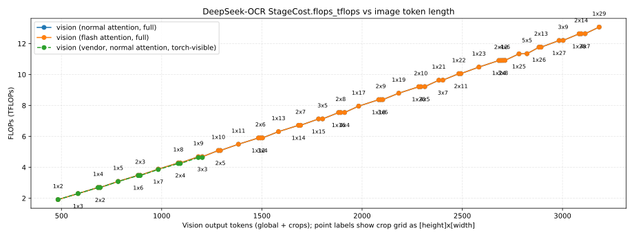

Activation I/O volume (terabits moved between on-chip memory and HBM) vs image token length for the vision stage, highlighting how traffic grows with higher-resolution inputs and denser crop grids.

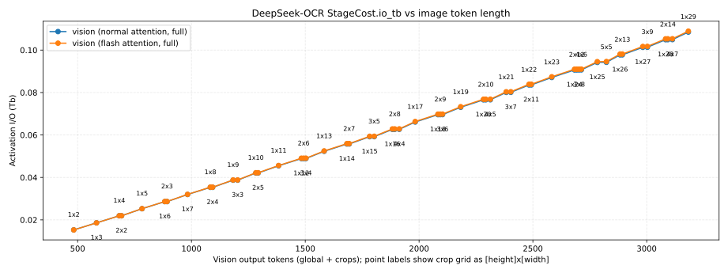

Arithmetic intensity (FLOPs per bit of activation I/O) vs image token length for the vision stage, indicating how compute-to-memory ratios evolve across the resolution and crop-grid sweep.

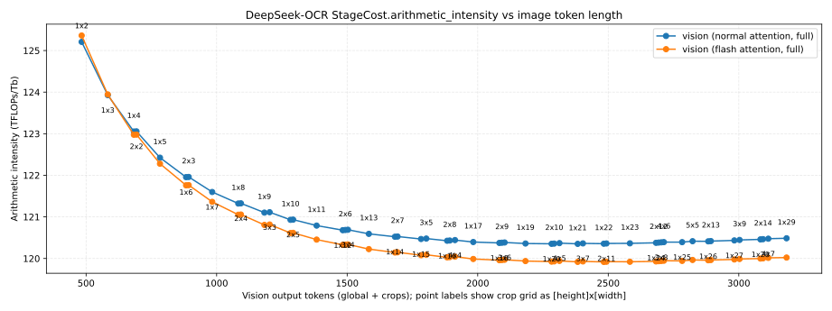

Peak activation memory (GB) vs image token length for the vision stage, emphasizing how activation footprint scales with input size and crop density while KV-cache remains effectively zero for vision-only workloads.

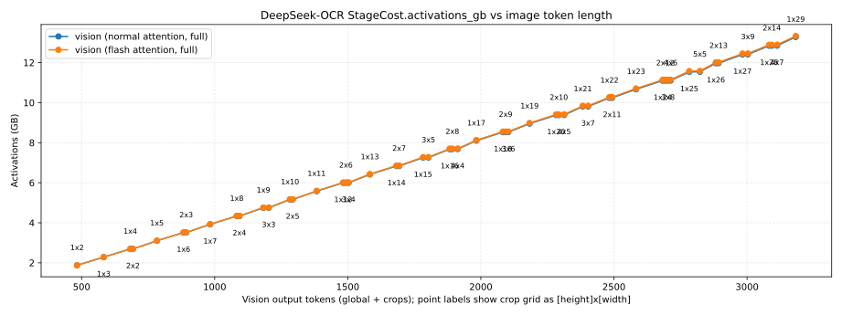

Tensor Core vs CUDA-core FLOPs (log-scale) vs image token length, showing how the vision workload splits between Tensor Core and CUDA-core kernels across crop grids.

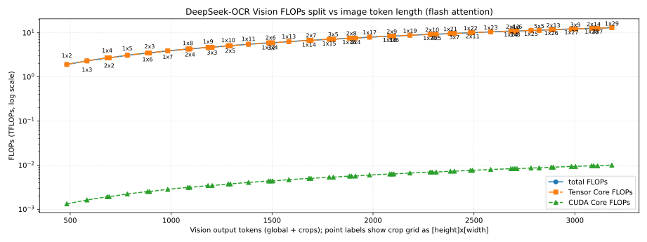

The table below summarizes the analytic vision FLOP split at each crop configuration.

|Num crops|Crop grid (H×W)|Image tokens (global + crops)|Tensor Core FLOPs (TFLOPs)|CUDA-core FLOPs (TFLOPs)|Tensor:CUDA ratio (CUDA=1.0)|
| :---: | :---: | :---: | :---: | :---: | :---: |
|2|1x2|483|1.913039e+00|1.329561e-03|1438.851:1.0|
|3|1x3|583|2.303791e+00|1.624969e-03|1417.744:1.0|
|4|1x4|683|2.696246e+00|1.922426e-03|1402.523:1.0|
|4|2x2|693|2.696587e+00|1.922835e-03|1402.401:1.0|
|5|1x5|783|3.090405e+00|2.221930e-03|1390.865:1.0|
|6|1x6|883|3.486269e+00|2.523483e-03|1381.530:1.0|
|6|2x3|893|3.486780e+00|2.524098e-03|1381.397:1.0|
|7|1x7|983|3.883836e+00|2.827084e-03|1373.796:1.0|
|8|1x8|1083|4.283107e+00|3.132732e-03|1367.211:1.0|
|8|2x4|1093|4.283788e+00|3.133552e-03|1367.071:1.0|
|9|1x9|1183|4.684082e+00|3.440429e-03|1361.482:1.0|
|9|3x3|1203|4.685615e+00|3.442272e-03|1361.198:1.0|
|10|1x10|1283|5.086761e+00|3.750174e-03|1356.407:1.0|
|10|2x5|1293|5.087613e+00|3.751198e-03|1356.264:1.0|
|11|1x11|1383|5.491144e+00|4.061966e-03|1351.844:1.0|
|12|1x12|1483|5.897231e+00|4.375807e-03|1347.690:1.0|
|12|2x6|1493|5.898253e+00|4.377036e-03|1347.545:1.0|
|12|3x4|1503|5.899275e+00|4.378265e-03|1347.400:1.0|
|13|1x13|1583|6.305021e+00|4.691696e-03|1343.868:1.0|
|14|1x14|1683|6.714516e+00|5.009632e-03|1340.321:1.0|
|14|2x7|1693|6.715709e+00|5.011066e-03|1340.176:1.0|
|15|1x15|1783|7.125715e+00|5.329617e-03|1337.003:1.0|
|15|3x5|1803|7.128271e+00|5.332689e-03|1336.712:1.0|
|16|1x16|1883|7.538617e+00|5.651650e-03|1333.879:1.0|
|16|2x8|1893|7.539980e+00|5.653288e-03|1333.734:1.0|
|16|4x4|1913|7.542707e+00|5.656565e-03|1333.443:1.0|
|17|1x17|1983|7.953224e+00|5.975730e-03|1330.921:1.0|
|18|1x18|2083|8.369534e+00|6.301859e-03|1328.106:1.0|
|18|2x9|2093|8.371068e+00|6.303702e-03|1327.961:1.0|
|18|3x6|2103|8.372601e+00|6.305545e-03|1327.816:1.0|
|19|1x19|2183|8.787548e+00|6.630035e-03|1325.415:1.0|
|20|1x20|2283|9.207267e+00|6.960260e-03|1322.834:1.0|
|20|2x10|2293|9.208971e+00|6.962308e-03|1322.689:1.0|
|20|4x5|2313|9.212379e+00|6.966404e-03|1322.401:1.0|
|21|1x21|2383|9.628689e+00|7.292533e-03|1320.349:1.0|
|21|3x7|2403|9.632267e+00|7.296834e-03|1320.061:1.0|
|22|1x22|2483|1.005182e+01|7.626853e-03|1317.950:1.0|
|22|2x11|2493|1.005369e+01|7.629106e-03|1317.807:1.0|
|23|1x23|2583|1.047665e+01|7.963222e-03|1315.629:1.0|
|24|1x24|2683|1.090318e+01|8.301639e-03|1313.377:1.0|
|24|2x12|2693|1.090522e+01|8.304096e-03|1313.234:1.0|
|24|3x8|2703|1.090727e+01|8.306554e-03|1313.092:1.0|
|24|4x6|2713|1.090931e+01|8.309011e-03|1312.950:1.0|
|25|1x25|2783|1.133142e+01|8.642103e-03|1311.187:1.0|
|25|5x5|2823|1.133994e+01|8.652343e-03|1310.620:1.0|
|26|1x26|2883|1.176136e+01|8.984616e-03|1309.055:1.0|
|26|2x13|2893|1.176357e+01|8.987278e-03|1308.914:1.0|
|27|1x27|2983|1.219301e+01|9.329177e-03|1306.975:1.0|
|27|3x9|3003|1.219761e+01|9.334706e-03|1306.694:1.0|
|28|1x28|3083|1.262635e+01|9.675785e-03|1304.944:1.0|
|28|2x14|3093|1.262874e+01|9.678652e-03|1304.804:1.0|
|28|4x7|3113|1.263351e+01|9.684387e-03|1304.524:1.0|
|29|1x29|3183|1.306141e+01|1.002444e-02|1302.956:1.0|

#### Sequence length and decode sweeps

This subsection focuses on how decoder FLOPs and KV-cache memory scale with prefill context length (`S_prefill`), decode length (`K` tokens), batch size (`B`), and attention head configuration.

The following figures summarize the DeepSeek-OCR decode sweep over candidate crop grids captured under `reports/sweep/20251127-160058/e2e_decode`, with a fixed text prompt and number of decode steps and the x-axis showing vision output tokens (global + crops) annotated by crop grid `[height]x[width]`.

DeepSeek-OCR decode FLOPs vs image token length (analytic and vendor curves, aggregated over a fixed `K = 100` decode steps for all points in the sweep).

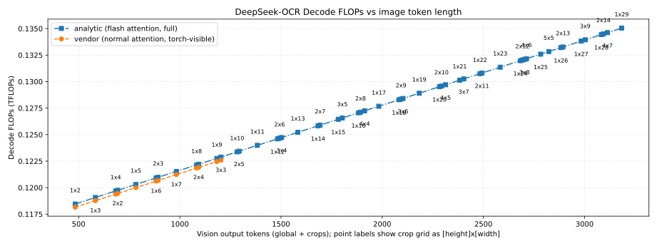

Total decode FLOPs (in TFLOPs) over `K = 100` decode steps vs image token length, showing how full-sequence decode compute (not per-token) grows with crop density for analytic normal attention, analytic flash attention, and vendor baselines.

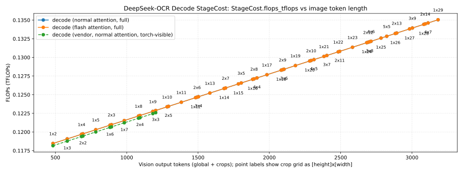

Decoder activation I/O volume (terabits) over `K = 100` decode steps vs image token length, highlighting how cumulative traffic over the full decode varies with the upstream vision workload.

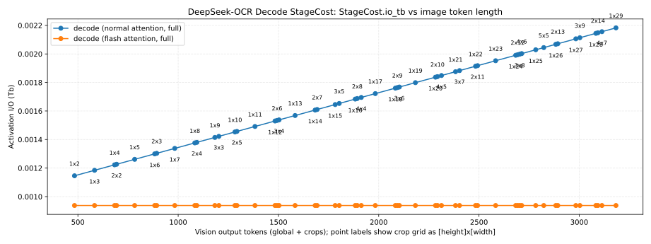

Decoder arithmetic intensity (FLOPs per bit of activation I/O) vs image token length, indicating how compute-to-memory ratios evolve as crop grids become denser and sequence lengths increase.

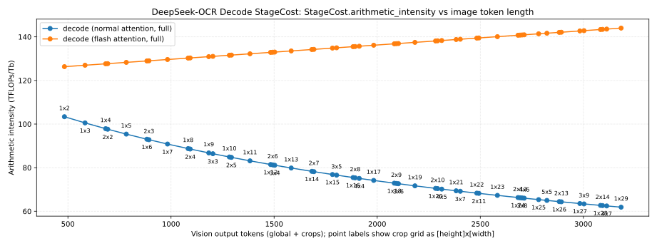

Peak decoder activation memory (GB) over `K = 100` decode steps vs image token length, showing where activation footprint over the full decode becomes comparable to or larger than vision activations.

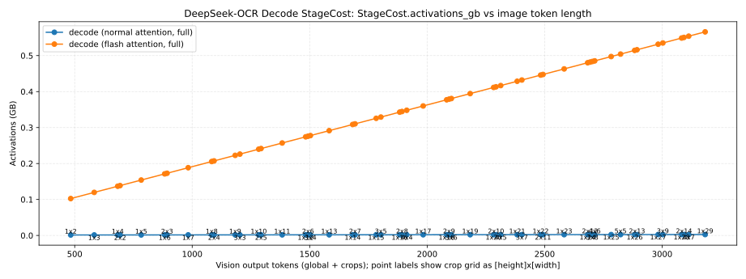

Decoder KV-cache memory (GB) vs image token length, capturing how KV storage scales with the combination of prefill context and `K = 100` decode tokens across different crop configurations.

Tensor Core vs CUDA-core FLOPs (log-scale) vs image token length for the decode stage, highlighting the balance between Tensor Core and CUDA-core work as decode workload increases.

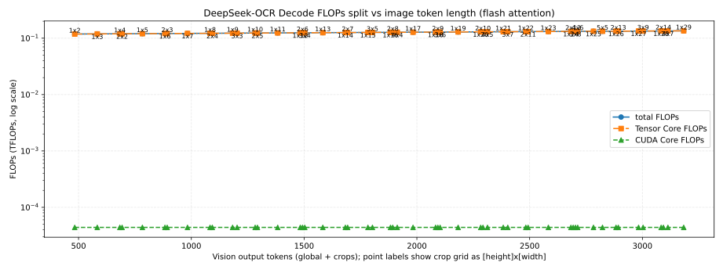

The table below summarizes the analytic decode FLOP split (`K = 100` decode steps) for each crop grid.

|Num crops|Crop grid (H×W)|Image tokens (global + crops)|Tensor Core FLOPs (TFLOPs)|CUDA-core FLOPs (TFLOPs)|Tensor:CUDA ratio (CUDA=1.0)|
| :---: | :---: | :---: | :---: | :---: | :---: |
|2|1x2|483|1.184143e-01|4.408320e-05|2686.156:1.0|
|3|1x3|583|1.190287e-01|4.408320e-05|2700.093:1.0|
|4|1x4|683|1.196431e-01|4.408320e-05|2714.030:1.0|
|4|2x2|693|1.197046e-01|4.408320e-05|2715.424:1.0|
|5|1x5|783|1.202575e-01|4.408320e-05|2727.967:1.0|
|6|1x6|883|1.208719e-01|4.408320e-05|2741.905:1.0|
|6|2x3|893|1.209334e-01|4.408320e-05|2743.298:1.0|
|7|1x7|983|1.214863e-01|4.408320e-05|2755.842:1.0|
|8|1x8|1083|1.221007e-01|4.408320e-05|2769.779:1.0|
|8|2x4|1093|1.221622e-01|4.408320e-05|2771.173:1.0|
|9|1x9|1183|1.227151e-01|4.408320e-05|2783.717:1.0|
|9|3x3|1203|1.228380e-01|4.408320e-05|2786.504:1.0|
|10|1x10|1283|1.233295e-01|4.408320e-05|2797.654:1.0|
|10|2x5|1293|1.233910e-01|4.408320e-05|2799.048:1.0|
|11|1x11|1383|1.239439e-01|4.408320e-05|2811.591:1.0|
|12|1x12|1483|1.245583e-01|4.408320e-05|2825.528:1.0|
|12|2x6|1493|1.246198e-01|4.408320e-05|2826.922:1.0|
|12|3x4|1503|1.246812e-01|4.408320e-05|2828.316:1.0|
|13|1x13|1583|1.251727e-01|4.408320e-05|2839.466:1.0|
|14|1x14|1683|1.257871e-01|4.408320e-05|2853.403:1.0|
|14|2x7|1693|1.258486e-01|4.408320e-05|2854.797:1.0|
|15|1x15|1783|1.264015e-01|4.408320e-05|2867.340:1.0|
|15|3x5|1803|1.265244e-01|4.408320e-05|2870.128:1.0|
|16|1x16|1883|1.270159e-01|4.408320e-05|2881.278:1.0|
|16|2x8|1893|1.270774e-01|4.408320e-05|2882.671:1.0|
|16|4x4|1913|1.272003e-01|4.408320e-05|2885.459:1.0|
|17|1x17|1983|1.276303e-01|4.408320e-05|2895.215:1.0|
|18|1x18|2083|1.282447e-01|4.408320e-05|2909.152:1.0|
|18|2x9|2093|1.283062e-01|4.408320e-05|2910.546:1.0|
|18|3x6|2103|1.283676e-01|4.408320e-05|2911.940:1.0|
|19|1x19|2183|1.288591e-01|4.408320e-05|2923.089:1.0|
|20|1x20|2283|1.294735e-01|4.408320e-05|2937.027:1.0|
|20|2x10|2293|1.295350e-01|4.408320e-05|2938.420:1.0|
|20|4x5|2313|1.296579e-01|4.408320e-05|2941.208:1.0|
|21|1x21|2383|1.300879e-01|4.408320e-05|2950.964:1.0|
|21|3x7|2403|1.302108e-01|4.408320e-05|2953.751:1.0|
|22|1x22|2483|1.307023e-01|4.408320e-05|2964.901:1.0|
|22|2x11|2493|1.307638e-01|4.408320e-05|2966.295:1.0|
|23|1x23|2583|1.313167e-01|4.408320e-05|2978.839:1.0|
|24|1x24|2683|1.319311e-01|4.408320e-05|2992.776:1.0|
|24|2x12|2693|1.319926e-01|4.408320e-05|2994.170:1.0|
|24|3x8|2703|1.320540e-01|4.408320e-05|2995.563:1.0|
|24|4x6|2713|1.321155e-01|4.408320e-05|2996.957:1.0|
|25|1x25|2783|1.325455e-01|4.408320e-05|3006.713:1.0|
|25|5x5|2823|1.327913e-01|4.408320e-05|3012.288:1.0|
|26|1x26|2883|1.331599e-01|4.408320e-05|3020.650:1.0|
|26|2x13|2893|1.332214e-01|4.408320e-05|3022.044:1.0|
|27|1x27|2983|1.337743e-01|4.408320e-05|3034.588:1.0|
|27|3x9|3003|1.338972e-01|4.408320e-05|3037.375:1.0|
|28|1x28|3083|1.343887e-01|4.408320e-05|3048.525:1.0|
|28|2x14|3093|1.344502e-01|4.408320e-05|3049.919:1.0|
|28|4x7|3113|1.345731e-01|4.408320e-05|3052.706:1.0|
|29|1x29|3183|1.350031e-01|4.408320e-05|3062.462:1.0|

#### Combined workload profiles

This subsection looks at realistic workload profiles that combine image resolution, context length, and decode length (for example, different OCR workload IDs).

The following figures summarize the DeepSeek-OCR vision+prefill crop-grid sweep captured under `reports/sweep/20251127-160058/e2e_vision_prefill`, where the x-axis is vision output tokens (global + crops) and point labels denote the crop grid as `[height]x[width]`.

DeepSeek-OCR vision+prefill FLOPs vs image token length (analytic and vendor curves, annotated by crop grid).

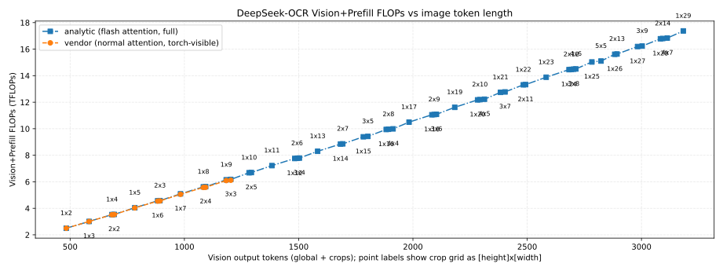

These plots use the `StageCost` structure from `modelmeter.models.common.stage_cost` for per-stage analytic costs; see the appendix for field definitions and interpretation.

Total prefill-stage FLOPs (in TFLOPs), broken down by logical components (vision, decoder, and LM head) vs image token length, showing how each component contributes to total prefill compute as crop density increases.

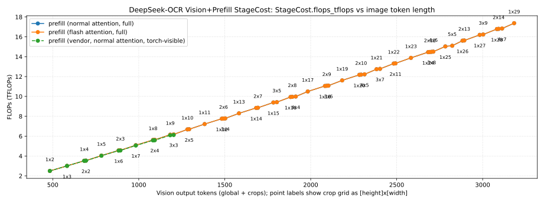

Activation I/O volume (terabits) vs image token length, highlighting how traffic grows with crop grids and which stages dominate bandwidth requirements.

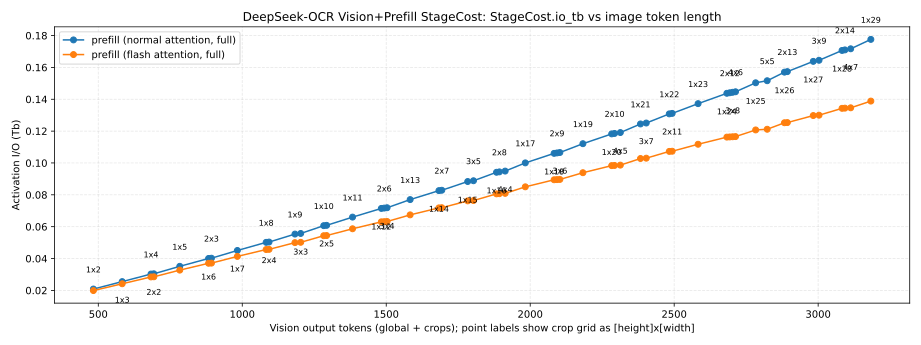

Arithmetic intensity (FLOPs per bit of activation I/O) vs image token length, indicating how compute-to-memory ratios evolve for different crop configurations and which stages are more compute-bound versus bandwidth-bound.

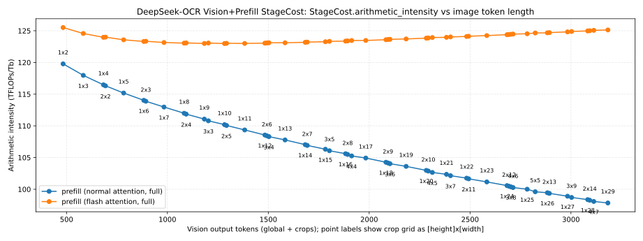

Peak activation memory (GB) vs image token length, emphasizing how activation footprint grows super-linearly with larger crop grids and where vision activations begin to dominate the memory footprint.

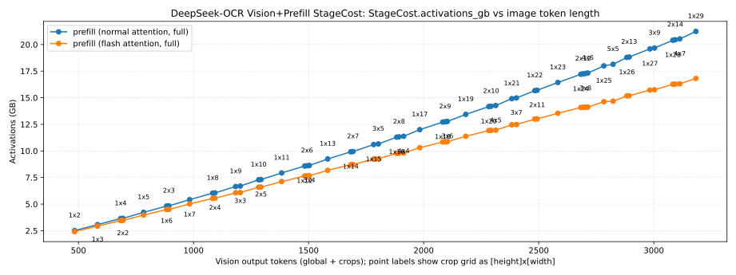

KV-cache memory (GB) vs image token length, capturing the KV-cache contribution from the decoder portion of the vision+prefill pipeline for the fixed prefill context used in this sweep.

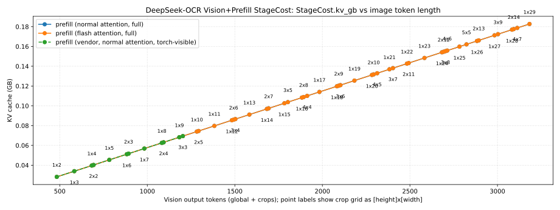

Tensor Core vs CUDA-core FLOPs (log-scale) vs image token length for the combined vision+prefill stage, summarizing how much of the end-to-end compute runs on Tensor Cores versus CUDA cores.

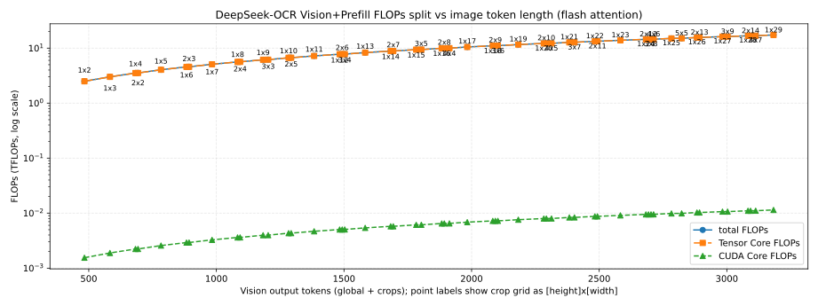

The table below summarizes the analytic vision+prefill FLOP split for each crop configuration.

|Num crops|Crop grid (H×W)|Image tokens (global + crops)|Tensor Core FLOPs (TFLOPs)|CUDA-core FLOPs (TFLOPs)|Tensor:CUDA ratio (CUDA=1.0)|
| :---: | :---: | :---: | :---: | :---: | :---: |
|2|1x2|483|2.495323e+00|1.546891e-03|1613.122:1.0|
|3|1x3|583|3.007828e+00|1.886383e-03|1594.495:1.0|
|4|1x4|683|3.523265e+00|2.227922e-03|1581.413:1.0|
|4|2x2|693|3.535972e+00|2.232740e-03|1583.692:1.0|
|5|1x5|783|4.041636e+00|2.571510e-03|1571.697:1.0|
|6|1x6|883|4.562939e+00|2.917146e-03|1564.179:1.0|
|6|2x3|893|4.576062e+00|2.922169e-03|1565.981:1.0|
|7|1x7|983|5.087175e+00|3.264830e-03|1558.175:1.0|
|8|1x8|1083|5.614344e+00|3.614562e-03|1553.257:1.0|
|8|2x4|1093|5.627883e+00|3.619789e-03|1554.754:1.0|
|9|1x9|1183|6.144445e+00|3.966342e-03|1549.147:1.0|
|9|3x3|1203|6.171951e+00|3.977001e-03|1551.911:1.0|
|10|1x10|1283|6.677479e+00|4.320169e-03|1545.652:1.0|
|10|2x5|1293|6.691434e+00|4.325602e-03|1546.937:1.0|
|11|1x11|1383|7.213446e+00|4.676045e-03|1542.638:1.0|
|12|1x12|1483|7.752346e+00|5.033969e-03|1540.007:1.0|
|12|2x6|1493|7.766717e+00|5.039606e-03|1541.136:1.0|
|12|3x4|1503|7.781101e+00|5.045243e-03|1542.265:1.0|
|13|1x13|1583|8.294178e+00|5.393941e-03|1537.684:1.0|
|14|1x14|1683|8.838943e+00|5.755961e-03|1535.616:1.0|
|14|2x7|1693|8.853731e+00|5.761803e-03|1536.625:1.0|
|15|1x15|1783|9.386641e+00|6.120029e-03|1533.758:1.0|
|15|3x5|1803|9.416644e+00|6.131917e-03|1535.677:1.0|
|16|1x16|1883|9.937272e+00|6.486145e-03|1532.077:1.0|
|16|2x8|1893|9.952475e+00|6.492191e-03|1532.992:1.0|
|16|4x4|1913|9.982919e+00|6.504285e-03|1534.822:1.0|
|17|1x17|1983|1.049083e+01|6.854308e-03|1530.546:1.0|
|18|1x18|2083|1.104733e+01|7.224520e-03|1529.144:1.0|
|18|2x9|2093|1.106295e+01|7.230772e-03|1529.982:1.0|
|18|3x6|2103|1.107858e+01|7.237023e-03|1530.820:1.0|
|19|1x19|2183|1.160676e+01|7.596780e-03|1527.853:1.0|
|20|1x20|2283|1.216912e+01|7.971088e-03|1526.658:1.0|
|20|2x10|2293|1.218516e+01|7.977544e-03|1527.432:1.0|
|20|4x5|2313|1.221727e+01|7.990457e-03|1528.982:1.0|
|21|1x21|2383|1.273442e+01|8.347444e-03|1525.547:1.0|
|21|3x7|2403|1.276692e+01|8.360561e-03|1527.041:1.0|
|22|1x22|2483|1.330264e+01|8.725848e-03|1524.510:1.0|
|22|2x11|2493|1.331909e+01|8.732509e-03|1525.231:1.0|
|23|1x23|2583|1.387380e+01|9.106299e-03|1523.539:1.0|
|24|1x24|2683|1.444789e+01|9.488799e-03|1522.626:1.0|
|24|2x12|2693|1.446476e+01|9.495665e-03|1523.302:1.0|
|24|3x8|2703|1.448164e+01|9.502531e-03|1523.977:1.0|
|24|4x6|2713|1.449854e+01|9.509397e-03|1524.654:1.0|
|25|1x25|2783|1.502492e+01|9.873347e-03|1521.766:1.0|
|25|5x5|2823|1.509330e+01|9.901220e-03|1524.388:1.0|
|26|1x26|2883|1.560488e+01|1.025994e-02|1520.952:1.0|
|26|2x13|2893|1.562216e+01|1.026701e-02|1521.588:1.0|
|27|1x27|2983|1.618777e+01|1.064859e-02|1520.180:1.0|
|27|3x9|3003|1.622277e+01|1.066293e-02|1521.417:1.0|
|28|1x28|3083|1.677359e+01|1.103928e-02|1519.446:1.0|
|28|2x14|3093|1.679129e+01|1.104655e-02|1520.048:1.0|
|28|4x7|3113|1.682673e+01|1.106111e-02|1521.252:1.0|
|29|1x29|3183|1.736235e+01|1.143202e-02|1518.747:1.0|

## Objective-based analysis

This section connects the analytic workloads above to user-facing responsiveness constraints, focusing on two objectives:
- Time-to-first-token (TTFT) for the vision+prefill stage.
- Time-per-output-token (TPOT) for the decode stage.

### Time-to-first-token (TTFT): vision+prefill

For TTFT, we consider a fixed 1.0 s budget for the vision+prefill stage (TTFT = 1.0 s).
The following figure shows the required TFLOPs/s as a function of image token length to meet this TTFT target, with separate curves for analytic normal attention, analytic flash attention, and the vendor baseline.

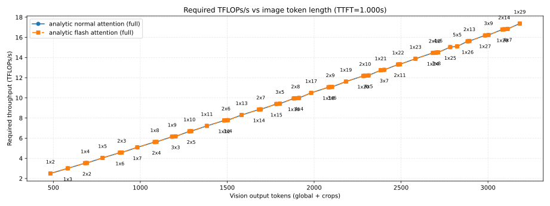

The following table enumerates a subset of those points, showing for each crop grid the total vision output tokens and the compute throughput required to meet the 1.0 s TTFT budget under analytic flash attention.

|Num crops|Crop grid (H×W)|Image tokens (global + crops)|Required TFLOPs/s (analytic flash attention, full)|
| :---: | :---: | :---: | :---: |
|2|1x2|483|2.497|
|3|1x3|583|3.010|
|4|1x4|683|3.525|
|4|2x2|693|3.538|
|5|1x5|783|4.044|
|6|1x6|883|4.566|
|6|2x3|893|4.579|
|7|1x7|983|5.090|
|8|1x8|1083|5.618|
|8|2x4|1093|5.632|
|9|1x9|1183|6.148|
|9|3x3|1203|6.176|
|10|1x10|1283|6.682|
|10|2x5|1293|6.696|
|11|1x11|1383|7.218|
|12|1x12|1483|7.757|
|12|2x6|1493|7.772|
|12|3x4|1503|7.786|
|13|1x13|1583|8.300|
|14|1x14|1683|8.845|
|14|2x7|1693|8.859|
|15|1x15|1783|9.393|
|15|3x5|1803|9.423|
|16|1x16|1883|9.944|
|16|2x8|1893|9.959|
|16|4x4|1913|9.989|
|17|1x17|1983|10.498|
|18|1x18|2083|11.055|
|18|2x9|2093|11.070|
|18|3x6|2103|11.086|
|19|1x19|2183|11.614|
|20|1x20|2283|12.177|
|20|2x10|2293|12.193|
|20|4x5|2313|12.225|
|21|1x21|2383|12.743|
|21|3x7|2403|12.775|
|22|1x22|2483|13.311|
|22|2x11|2493|13.328|
|23|1x23|2583|13.883|
|24|1x24|2683|14.457|
|24|2x12|2693|14.474|
|24|3x8|2703|14.491|
|24|4x6|2713|14.508|
|25|1x25|2783|15.035|
|25|5x5|2823|15.103|
|26|1x26|2883|15.615|
|26|2x13|2893|15.632|
|27|1x27|2983|16.198|
|27|3x9|3003|16.233|
|28|1x28|3083|16.785|
|28|2x14|3093|16.802|
|28|4x7|3113|16.838|
|29|1x29|3183|17.374|

### Time-per-output-token (TPOT): decode

To characterize steady-state streaming latency, we also analyze the compute throughput required to hit a target time-per-output-token (TPOT) for the decode stage.
The decode sweep for these runs is configured with a 50 ms per-token budget (TPOT = 0.05 s), and the following figure shows the required TFLOPs/s as a function of image token length under that constraint.

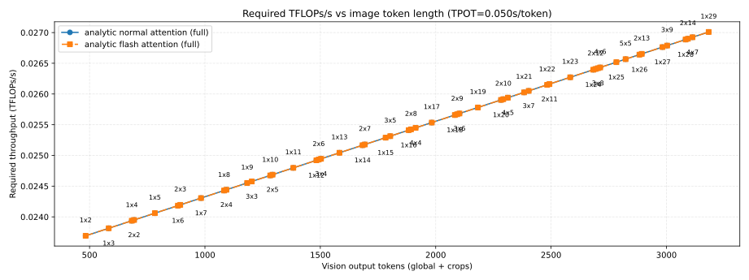

The table below summarizes, for each crop grid, the total vision output tokens, the number of decode steps `K`, and the compute throughput required to satisfy the 50 ms TPOT requirement using the analytic flash-attention path.

|Num crops|Crop grid (H×W)|Image tokens (global + crops)|Decode steps (K)|Required TFLOPs/s (analytic flash attention, full)|
| :---: | :---: | :---: | :---: | :---: |
|2|1x2|483|100|0.024|
|3|1x3|583|100|0.024|
|4|1x4|683|100|0.024|
|4|2x2|693|100|0.024|
|5|1x5|783|100|0.024|
|6|1x6|883|100|0.024|
|6|2x3|893|100|0.024|
|7|1x7|983|100|0.024|
|8|1x8|1083|100|0.024|
|8|2x4|1093|100|0.024|
|9|1x9|1183|100|0.025|
|9|3x3|1203|100|0.025|
|10|1x10|1283|100|0.025|
|10|2x5|1293|100|0.025|
|11|1x11|1383|100|0.025|
|12|1x12|1483|100|0.025|
|12|2x6|1493|100|0.025|
|12|3x4|1503|100|0.025|
|13|1x13|1583|100|0.025|
|14|1x14|1683|100|0.025|
|14|2x7|1693|100|0.025|
|15|1x15|1783|100|0.025|
|15|3x5|1803|100|0.025|
|16|1x16|1883|100|0.025|
|16|2x8|1893|100|0.025|
|16|4x4|1913|100|0.025|
|17|1x17|1983|100|0.026|
|18|1x18|2083|100|0.026|
|18|2x9|2093|100|0.026|
|18|3x6|2103|100|0.026|
|19|1x19|2183|100|0.026|
|20|1x20|2283|100|0.026|
|20|2x10|2293|100|0.026|
|20|4x5|2313|100|0.026|
|21|1x21|2383|100|0.026|
|21|3x7|2403|100|0.026|
|22|1x22|2483|100|0.026|
|22|2x11|2493|100|0.026|
|23|1x23|2583|100|0.026|
|24|1x24|2683|100|0.026|
|24|2x12|2693|100|0.026|
|24|3x8|2703|100|0.026|
|24|4x6|2713|100|0.026|
|25|1x25|2783|100|0.027|
|25|5x5|2823|100|0.027|
|26|1x26|2883|100|0.027|
|26|2x13|2893|100|0.027|
|27|1x27|2983|100|0.027|
|27|3x9|3003|100|0.027|
|28|1x28|3083|100|0.027|
|28|2x14|3093|100|0.027|
|28|4x7|3113|100|0.027|
|29|1x29|3183|100|0.027|

### Appendix: StageCost field definitions

The `StageCost` structure from the ModelMeter library summarizes per-stage analytic costs for the vision, decoder, and vision+prefill plots in this report; we interpret its main fields as:
- Total stage FLOPs, expressed in teraFLOPs (TFLOPs), including both Tensor Core and CUDA core contributions when modeled.
- Activation I/O volume, measured in terabits (Tb), aggregating reads and writes between on-chip memory and HBM for that stage.
- Arithmetic intensity, defined as total stage FLOPs divided by activation I/O volume (FLOPs per bit), indicating how compute-bound versus bandwidth-bound the stage is.
- Peak activation memory footprint, measured in gigabytes (GB), for the given batch size and sequence length.
- KV-cache memory footprint, measured in gigabytes (GB), attributable to the stage (typically decoder attention blocks), driven by context length and decode length.
For DeepSeek-OCR-3B in the configuration used for these sweeps, the total parameter footprint is approximately 2.17 GB and is constant across crop grids, so we report it once here rather than as a separate curve.

### Appendix: Implementation file paths (for reference)

For readers working with the codebase, the conceptual components in this summary map to the following implementation locations:
- DeepSeek-OCR analytic model and sweeps: `extern/modelmeter/models/deepseek_ocr`
- Verification and sweep scripts: `extern/modelmeter/models/deepseek_ocr/scripts` and `extern/modelmeter/models/deepseek_ocr/scripts/sweep`
- Vision layers package: `layers/vision` (for `PatchEmbed`, `Attention`, `MLPBlock`, `Block`, `LayerNorm2d`, `CLIPVisionEmbeddings`, `NoTPAttention`, `NoTPFeedForward`, `NoTPTransformerBlock`, `NoTPTransformer`, `ImageEncoderViT`, `VitModel`, `MlpProjector`, and related helpers)
- Decoder layers package: `layers/decoder` (for `DeepseekV2MLP`, `MoEGate`, `DeepseekV2MoE`, `DeepseekV2RMSNorm`, `DeepseekV2DecoderLayer`, `LMHead`)
- LLaMA primitives package: `layers/llama` (for `LlamaAttention`, `LlamaFlashAttention2`, `LlamaRotaryEmbedding`)
- Detailed architecture report: `reports/deepseek-ocr-analytical-arch-report.md`
- Detailed performance report: `reports/deepseek-ocr-analytical-perf-report.md`
