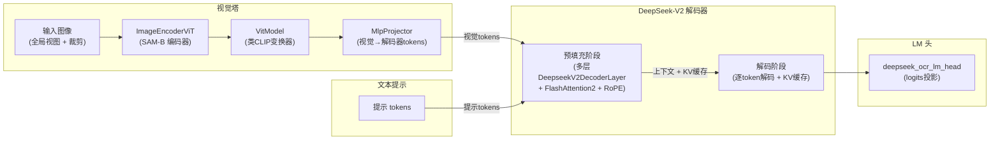

# DeepSeek-OCR 分析架构与性能总结

本文档综合了 DeepSeek-OCR 3B 模型的分析架构描述、逐层定义,以及基于 ModelMeter 分析实现的性能验证和扩展性分析。

## 架构概览

分析模型通过基于 Hydra 的配置栈进行配置,该栈组合了以下内容:
- DeepSeek-OCR 3B 架构定义(隐藏层大小、层数、注意力头数、MoE 布局及相关超参数)。
- 序列长度、批次大小和通用分析参数的运行时默认值。
- 视觉塔(SAM 编码器 + CLIP 风格变换器 + 投影器),生成视觉 token。
- DeepSeek-V2 解码器堆栈,在预填充和解码阶段消费视觉和文本 token。
- LM 头,将解码器隐藏状态投影到词汇表 logits。

在高层次上,分析拓扑遵循 DeepSeek-OCR 供应商架构:
- 视觉分支
  - 输入图像(全局填充视图和可选的动态裁剪)由 SAM-B 风格编码器(`ImageEncoderViT`)处理,生成密集的视觉特征。
  - 类 CLIP 视觉变换器(`VitModel`,由 `NoTPTransformerBlock` 和 `Attention` / `NoTPAttention` / `MLPBlock` / `NoTPFeedForward` 构建)消费 SAM 特征并生成语义视觉 token 序列。
  - `MlpProjector` 将拼接的 SAM + CLIP token 降维并投影到解码器嵌入空间,产生与文本解码器兼容的视觉 token 序列。
- 解码器分支
  - 一个由 `num_hidden_layers` 个 `DeepseekV2DecoderLayer` 块组成的堆栈实现文本解码器,结合 LLaMA 风格注意力(FlashAttention2 + RoPE)、DeepSeek-V2 MLP 或 MoE 专家,以及 RMSNorm。
  - 解码器在两个阶段运行:对完整上下文(视觉 token + 提示 token)的预填充阶段,以及每次运行一个 token 并更新 KV 缓存的解码阶段。
- 头部
  - LM 头 `deepseek_ocr_lm_head` 将解码器隐藏状态投影到词汇表 logits。

本节的其余部分总结了分析层类型、它们的作用以及如何组合成完整的 DeepSeek-OCR 分析模型。

## 逐层清单与定义

### 视觉层

- **PatchEmbed**: 基于 Conv2d 的图像块嵌入,将形状为 `(B, C_in, H, W)` 的图像映射到图像块嵌入网格;FLOPs 由张量核卷积数学 `2 * B * H_out * W_out * kernel_h * kernel_w * C_in * C_out` 主导,I/O 统计输入和输出激活,内存跟踪权重加图像块嵌入特征。
- **Attention**: SAM 风格的 2D 注意力,在窗口化或全局空间区域上运行,将窗口视为有效批次维度;将 FLOPs 分解为 QKV 投影、相对位置偏差、SDPA 矩阵乘法和输出投影,并报告输入、QKV 和输出的激活 I/O。
- **MLPBlock**: SAM 视觉变换器块内的两层前馈块,使用张量核矩阵乘法进行 `embedding_dim → mlp_dim → embedding_dim`,并使用 CUDA 核 GELU 激活;I/O 覆盖输入、隐藏和输出激活。
- **Block**: 复合 SAM 风格视觉变换器块,聚合 `Attention` 子层和 `MLPBlock` 加小的 LayerNorm 和窗口分区开销;FLOPs 和 I/O 是其子层的总和加可选的归一化 FLOPs。
- **LayerNorm2d**: 用于卷积颈部的 NCHW LayerNorm,建模为 CUDA 核主导的内核,FLOPs 与 `5 * B * C * H * W` 成正比,I/O 近似为特征张量的几次读写。
- **CLIPVisionEmbeddings**: CLIP 风格嵌入,结合图像块嵌入、CLS token 和位置嵌入;可重用 SAM 的预计算图像块嵌入(零卷积 FLOPs)或通过内部 `PatchEmbed` 实例包含图像块嵌入 FLOPs,同时在 I/O 和内存中统计嵌入激活。
- **NoTPAttention**: CLIP-L NoTP 多头注意力,包含 QKV 和输出投影加 SDPA 矩阵乘法;使用张量核 FLOPs 进行 GEMMs,通常忽略小的 CUDA 核 softmax 和掩码工作,I/O 统计输入、QKV 和输出激活。
- **NoTPFeedForward**: 基于 QuickGELU 的 CLIP-L MLP,建模为两个张量核矩阵乘法加 CUDA 核激活工作;I/O 包括 fp16/bf16 的输入、隐藏和输出激活。
- **NoTPTransformerBlock**: 将 `NoTPAttention` 和 `NoTPFeedForward` 子层加 LayerNorm 开销聚合到单个变换器块中,总结 FLOPs、I/O 和内存,并将额外的归一化 FLOPs 归因于 CUDA 核。
- **NoTPTransformer**: 围绕一系列 `NoTPTransformerBlock` 实例的包装器,代表完整的 CLIP-L 变换器深度;纯粹聚合各块的 FLOPs、I/O 和内存,并提供栈级算术强度。
- **ImageEncoderViT**: SAM-B 编码器,由 `PatchEmbed`、带窗口化/全局注意力的 `Block` 实例堆栈以及包含 `LayerNorm2d` 的卷积颈部构建;FLOPs 和 I/O 反映卷积和变换器组件,并随图像大小、窗口大小和深度缩放。
- **VitModel**: `CLIPVisionEmbeddings` 和 `NoTPTransformer` 的包装器,加最终 LayerNorm,建模为 CUDA 核工作;聚合它们的 FLOPs 和 I/O,并通过内存方法公开 CLIP 塔的组合参数和激活足迹。
- **MlpProjector**: 视觉到解码器的投影器,可以是恒等、线性或拼接的 SAM+CLIP token 上的小 MLP 堆栈;投影层的张量核矩阵乘法和可选的 CUDA 核 GELU 激活,I/O 与视觉 token 数量和嵌入维度成正比。
- **VisionWorkload 辅助工具**: 仅形状的实用程序(不是 `BaseLayer`),从图像几何、图像块大小和下采样比率重建供应商风格的裁剪布局和 token 计数(全局 vs 裁剪),以便分析配置和脚本可以纯粹从形状派生视觉 FLOPs 和 I/O。

### 解码器层

- **DeepseekV2MLP**: 在 DeepSeek-V2 解码器块和 MoE 专家中使用的 SwiGLU 前馈网络,张量核 FLOPs 近似为 `6 * B * S * h * i`,用于门控/上/下投影,CUDA 核 FLOPs 用于 SwiGLU 激活和门控乘法;I/O 统计输入、中间和输出激活。
- **MoEGate**: MoE 路由门,对专家进行 token 评分并选择 top-`k_active`;使用张量核 GEMMs 进行隐藏到专家的投影,CUDA 核工作进行 softmax、top-k 和归一化,I/O 覆盖门输入、logits 和 top-k 路由权重。
- **DeepseekV2MoE**: MoE 块,结合 `MoEGate`、路由专家 MLP(`DeepseekV2MLP`,有效批次 `B * k_active`)和可选的共享专家 MLP;为静态 `(B, S, h)` 工作负载聚合路由和共享专家的 FLOPs、I/O 和内存。
- **DeepseekV2RMSNorm**: 解码器块中的 RMSNorm 归一化,建模为 CUDA 核操作,FLOPs `≈ 3 * B * S * d`,零张量核 FLOPs,I/O 加参数内存与隐藏大小成正比。
- **DeepseekV2DecoderLayer**: 完整的 DeepSeek-V2 解码器块,由两个 `DeepseekV2RMSNorm` 实例、注意力原语(`LlamaFlashAttention2` 或 `LlamaAttention`)以及 `DeepseekV2MLP` 或 `DeepseekV2MoE` 组成;跟踪简单的预填充/解码阶段和 `SyntheticKVCache` 元对象,以便可以为预填充或解码形状解释 FLOPs、I/O 和 KV 缓存内存。
- **LMHead**: 从隐藏大小 `h` 到词汇表大小 `V` 的最终解码器投影,建模为单个张量核矩阵乘法,FLOPs `2 * B * S * h * V`,可忽略的 CUDA 核工作,隐藏状态和 logits 的 I/O,以及用于预填充 vs 逐 token 解码的阶段感知序列长度。

### LLaMA 层和原语

- **LlamaAttention**: 非 flash 的 LLaMA 注意力路径(标准 SDPA),FLOP 公式与 FlashAttention2 对齐,但代表 PyTorch 的 flop 计数器看到的未融合路径;通过单独的查询和 KV 长度支持预填充和解码形状,并将所有矩阵乘法数学归因于张量核。
- **LlamaFlashAttention2**: 在 DeepSeek-V2 解码器块中使用的融合 FlashAttention2 路径,具有 QKV 投影、注意力核心和输出投影的闭式 FLOPs,单独的预填充/解码模式(通过 `set_prefill_shape` 和 `set_decode_shape`),以及在验证和 MFU 分析中使用的 I/O 和内存方法。
- **LlamaRotaryEmbedding**: RoPE 原语,建模为 CUDA 核工作,FLOPs 来自频率-位置矩阵乘法,I/O 由读写形状为 `(B, S, dim)` 的余弦和正弦嵌入主导,使其算术强度相对较低,但与注意力矩阵乘法相比其绝对贡献很小。

## 分析性能和验证

本节总结了 DeepSeek-OCR 模型的分析性能验证和缩放行为,使用 ModelMeter 分析实现及其相关的验证和扫描脚本。

### 概述和范围

分析关注分析 FLOP、I/O 和内存模型与供应商实现的匹配程度,以及随着模型和工作负载参数变化,分析成本如何缩放。
架构和算子级别的详细信息在上面的部分以及单独的架构重点报告中总结;这里我们专注于:
- 逐层健全性检查(针对参考实现的逐层验证)。
- 端到端管道验证(仅视觉和完整模型)。
- 模型缩放扫描(分析 FLOPs 和 I/O 如何随输入和模型参数变化)。

除非另有说明,否则预计所有实验都在 Pixi 管理的 RTX 5090 环境中运行。

### 逐层健全性检查(逐层验证)

|组|分析层|测量 FLOPs (GFLOPs)|理论 FLOPs (GFLOPs)|相对差异 (%)|状态|
| :---: | :---: | :---: | :---: | :---: | :---: |
|vision|Attention|2.6071e+01|2.6098e+01|0.1010%|✓|
|vision|MLPBlock|3.8655e+01|3.8705e+01|0.1302%|✓|
|vision|PatchEmbed|4.8318e+00|4.8318e+00|0.0000%|✓|
|vision|Block|1.1033e+02|1.0967e+02|0.5931%|✓|
|vision|CLIPVisionEmbeddings_conv|3.0828e-01|3.0828e-01|0.0000%|✓|
|vision|LayerNorm2d|0.0000e+00|5.2429e-03|0.0000%|✓|
|vision|ImageEncoderViT|9.7691e+02|9.7323e+02|0.3766%|✓|
|vision|NoTPAttention|2.4264e+00|2.4264e+00|0.0000%|✓|
|vision|NoTPFeedForward|4.3117e+00|4.3170e+00|0.1221%|✓|
|vision|NoTPTransformerBlock|6.7382e+00|6.7434e+00|0.0781%|✓|
|vision|NoTPTransformer|1.3476e+01|1.3487e+01|0.0781%|✓|
|vision|VitModel|1.3476e+01|1.3488e+01|0.0879%|✓|
|vision|MlpProjector|4.9159e+00|4.9218e+00|0.1202%|✓|
|decoder|DeepseekV2MLP|2.6927e+01|2.6941e+01|0.0521%|✓|
|decoder|MoEGate|8.3886e-02|8.4083e-02|0.2344%|✓|
|decoder|DeepseekV2MoE|2.8270e+01|2.8284e+01|0.0526%|✓|
|decoder|DeepseekV2RMSNorm|0.0000e+00|1.9661e-03|0.0000%|✓|
|decoder|DeepseekV2DecoderLayer_dense|3.4980e+01|3.4998e+01|0.0513%|✓|
|decoder|DeepseekV2DecoderLayer_moe|3.6323e+01|3.6341e+01|0.0518%|✓|
|llama|LlamaFlashAttention2|6.7110e+00|6.7109e+00|0.0010%|✓|
|llama|LlamaRotaryEmbedding|6.5536e-05|6.5536e-05|0.0000%|✓|

下表将分析层映射到其参考实现类。

|组|分析层|实现类(完全限定路径)|
| :---: | :---: | :---: |
|vision|Attention|deepencoder.Attention|
|vision|MLPBlock|deepencoder.MLPBlock|
|vision|PatchEmbed|deepencoder.PatchEmbed|
|vision|Block|deepencoder.Block|
|vision|CLIPVisionEmbeddings_conv|deepencoder.CLIPVisionEmbeddings|
|vision|LayerNorm2d|deepencoder.LayerNorm2d|
|vision|ImageEncoderViT|deepencoder.ImageEncoderViT|
|vision|NoTPAttention|deepencoder.NoTPAttention|
|vision|NoTPFeedForward|deepencoder.NoTPFeedForward|
|vision|NoTPTransformerBlock|deepencoder.NoTPTransformerBlock|
|vision|NoTPTransformer|deepencoder.NoTPTransformer|
|vision|VitModel|deepencoder.VitModel|
|vision|MlpProjector|deepencoder.MlpProjector|
|decoder|DeepseekV2MLP|modeling_deepseekv2.DeepseekV2MLP|
|decoder|MoEGate|modeling_deepseekv2.MoEGate|
|decoder|DeepseekV2MoE|modeling_deepseekv2.DeepseekV2MoE|
|decoder|DeepseekV2RMSNorm|modeling_deepseekv2.DeepseekV2RMSNorm|
|decoder|DeepseekV2DecoderLayer_dense|modeling_deepseekv2.DeepseekV2DecoderLayer|
|decoder|DeepseekV2DecoderLayer_moe|modeling_deepseekv2.DeepseekV2DecoderLayer|
|llama|LlamaFlashAttention2|transformers.models.llama.modeling_llama.LlamaFlashAttention2|
|llama|LlamaRotaryEmbedding|transformers.models.llama.modeling_llama.LlamaRotaryEmbedding|

### 成本 vs. 扫描

本部分分析探讨了随着模型和输入参数变化,分析 FLOPs、I/O 和内存使用如何缩放,使用相同 ModelMeter 设置和相关辅助工具的扫描脚本。

#### 视觉输入形状扫描

本小节研究视觉计算如何随输入分辨率和裁剪配置变化。

以下图表总结了 DeepSeek-OCR 分析视觉阶段成本扫描,涵盖在 `reports/sweep/20251127-160058/vision_crops` 下捕获的候选裁剪网格,x 轴显示视觉输出 token(全局 + 裁剪),由裁剪网格 `[高度]x[宽度]` 注释。

视觉阶段总 FLOPs(以 TFLOPs 为单位)vs 图像 token 长度,比较分析普通注意力、分析 flash 注意力和相同工作负载的供应商 FLOPs。

激活 I/O 容量(片上内存和 HBM 之间移动的太比特)vs 图像 token 长度,用于视觉阶段,突出显示流量如何随更高分辨率输入和更密集的裁剪网格增长。

算术强度(每比特激活 I/O 的 FLOPs)vs 图像 token 长度,用于视觉阶段,指示计算与内存比率如何在分辨率和裁剪网格扫描中演变。

峰值激活内存(GB)vs 图像 token 长度,用于视觉阶段,强调激活足迹如何随输入大小和裁剪密度缩放,而 KV 缓存对于仅视觉工作负载实际上保持为零。

张量核 vs CUDA 核 FLOPs(对数刻度)vs 图像 token 长度,显示视觉工作负载如何在跨裁剪网格的张量核和 CUDA 核内核之间拆分。

下表总结了每个裁剪配置下的分析视觉 FLOP 拆分。

|裁剪数|裁剪网格 (H×W)|图像 tokens (全局 + 裁剪)|张量核 FLOPs (TFLOPs)|CUDA 核 FLOPs (TFLOPs)|张量:CUDA 比率 (CUDA=1.0)|
| :---: | :---: | :---: | :---: | :---: | :---: |
|2|1x2|483|1.913039e+00|1.329561e-03|1438.851:1.0|
|3|1x3|583|2.303791e+00|1.624969e-03|1417.744:1.0|
|4|1x4|683|2.696246e+00|1.922426e-03|1402.523:1.0|
|4|2x2|693|2.696587e+00|1.922835e-03|1402.401:1.0|
|5|1x5|783|3.090405e+00|2.221930e-03|1390.865:1.0|
|6|1x6|883|3.486269e+00|2.523483e-03|1381.530:1.0|
|6|2x3|893|3.486780e+00|2.524098e-03|1381.397:1.0|
|7|1x7|983|3.883836e+00|2.827084e-03|1373.796:1.0|
|8|1x8|1083|4.283107e+00|3.132732e-03|1367.211:1.0|
|8|2x4|1093|4.283788e+00|3.133552e-03|1367.071:1.0|
|9|1x9|1183|4.684082e+00|3.440429e-03|1361.482:1.0|
|9|3x3|1203|4.685615e+00|3.442272e-03|1361.198:1.0|
|10|1x10|1283|5.086761e+00|3.750174e-03|1356.407:1.0|
|10|2x5|1293|5.087613e+00|3.751198e-03|1356.264:1.0|
|11|1x11|1383|5.491144e+00|4.061966e-03|1351.844:1.0|
|12|1x12|1483|5.897231e+00|4.375807e-03|1347.690:1.0|
|12|2x6|1493|5.898253e+00|4.377036e-03|1347.545:1.0|
|12|3x4|1503|5.899275e+00|4.378265e-03|1347.400:1.0|
|13|1x13|1583|6.305021e+00|4.691696e-03|1343.868:1.0|
|14|1x14|1683|6.714516e+00|5.009632e-03|1340.321:1.0|
|14|2x7|1693|6.715709e+00|5.011066e-03|1340.176:1.0|
|15|1x15|1783|7.125715e+00|5.329617e-03|1337.003:1.0|
|15|3x5|1803|7.128271e+00|5.332689e-03|1336.712:1.0|
|16|1x16|1883|7.538617e+00|5.651650e-03|1333.879:1.0|
|16|2x8|1893|7.539980e+00|5.653288e-03|1333.734:1.0|
|16|4x4|1913|7.542707e+00|5.656565e-03|1333.443:1.0|
|17|1x17|1983|7.953224e+00|5.975730e-03|1330.921:1.0|
|18|1x18|2083|8.369534e+00|6.301859e-03|1328.106:1.0|
|18|2x9|2093|8.371068e+00|6.303702e-03|1327.961:1.0|
|18|3x6|2103|8.372601e+00|6.305545e-03|1327.816:1.0|
|19|1x19|2183|8.787548e+00|6.630035e-03|1325.415:1.0|
|20|1x20|2283|9.207267e+00|6.960260e-03|1322.834:1.0|
|20|2x10|2293|9.208971e+00|6.962308e-03|1322.689:1.0|
|20|4x5|2313|9.212379e+00|6.966404e-03|1322.401:1.0|
|21|1x21|2383|9.628689e+00|7.292533e-03|1320.349:1.0|
|21|3x7|2403|9.632267e+00|7.296834e-03|1320.061:1.0|
|22|1x22|2483|1.005182e+01|7.626853e-03|1317.950:1.0|
|22|2x11|2493|1.005369e+01|7.629106e-03|1317.807:1.0|
|23|1x23|2583|1.047665e+01|7.963222e-03|1315.629:1.0|
|24|1x24|2683|1.090318e+01|8.301639e-03|1313.377:1.0|
|24|2x12|2693|1.090522e+01|8.304096e-03|1313.234:1.0|
|24|3x8|2703|1.090727e+01|8.306554e-03|1313.092:1.0|
|24|4x6|2713|1.090931e+01|8.309011e-03|1312.950:1.0|
|25|1x25|2783|1.133142e+01|8.642103e-03|1311.187:1.0|
|25|5x5|2823|1.133994e+01|8.652343e-03|1310.620:1.0|
|26|1x26|2883|1.176136e+01|8.984616e-03|1309.055:1.0|
|26|2x13|2893|1.176357e+01|8.987278e-03|1308.914:1.0|
|27|1x27|2983|1.219301e+01|9.329177e-03|1306.975:1.0|
|27|3x9|3003|1.219761e+01|9.334706e-03|1306.694:1.0|
|28|1x28|3083|1.262635e+01|9.675785e-03|1304.944:1.0|
|28|2x14|3093|1.262874e+01|9.678652e-03|1304.804:1.0|
|28|4x7|3113|1.263351e+01|9.684387e-03|1304.524:1.0|
|29|1x29|3183|1.306141e+01|1.002444e-02|1302.956:1.0|

#### 序列长度和解码扫描

本小节关注解码器 FLOPs 和 KV 缓存内存如何随预填充上下文长度(`S_prefill`)、解码长度(`K` tokens)、批次大小(`B`)和注意力头配置缩放。

以下图表总结了 DeepSeek-OCR 解码扫描,涵盖在 `reports/sweep/20251127-160058/e2e_decode` 下捕获的候选裁剪网格,具有固定的文本提示和解码步数,x 轴显示视觉输出 token(全局 + 裁剪),由裁剪网格 `[高度]x[宽度]` 注释。

DeepSeek-OCR 解码 FLOPs vs 图像 token 长度(分析和供应商曲线,在扫描中所有点的固定 `K = 100` 解码步骤上聚合)。

`K = 100` 解码步骤上的总解码 FLOPs(以 TFLOPs 为单位)vs 图像 token 长度,显示全序列解码计算(不是逐 token)如何随分析普通注意力、分析 flash 注意力和供应商基线的裁剪密度增长。

`K = 100` 解码步骤上的解码器激活 I/O 容量(太比特)vs 图像 token 长度,突出显示完整解码上的累积流量如何随上游视觉工作负载变化。

解码器算术强度(每比特激活 I/O 的 FLOPs)vs 图像 token 长度,指示随着裁剪网格变得更密集和序列长度增加,计算与内存比率如何演变。

`K = 100` 解码步骤上的峰值解码器激活内存(GB)vs 图像 token 长度,显示完整解码上的激活足迹在何处变得与视觉激活相当或更大。

解码器 KV 缓存内存(GB)vs 图像 token 长度,捕获 KV 存储如何随预填充上下文和跨不同裁剪配置的 `K = 100` 解码 token 的组合缩放。

解码阶段的张量核 vs CUDA 核 FLOPs(对数刻度)vs 图像 token 长度,突出显示随着解码工作负载增加,张量核和 CUDA 核工作之间的平衡。

下表总结了每个裁剪网格的分析解码 FLOP 拆分(`K = 100` 解码步骤)。

|裁剪数|裁剪网格 (H×W)|图像 tokens (全局 + 裁剪)|张量核 FLOPs (TFLOPs)|CUDA 核 FLOPs (TFLOPs)|张量:CUDA 比率 (CUDA=1.0)|
| :---: | :---: | :---: | :---: | :---: | :---: |
|2|1x2|483|1.184143e-01|4.408320e-05|2686.156:1.0|
|3|1x3|583|1.190287e-01|4.408320e-05|2700.093:1.0|
|4|1x4|683|1.196431e-01|4.408320e-05|2714.030:1.0|
|4|2x2|693|1.197046e-01|4.408320e-05|2715.424:1.0|
|5|1x5|783|1.202575e-01|4.408320e-05|2727.967:1.0|
|6|1x6|883|1.208719e-01|4.408320e-05|2741.905:1.0|
|6|2x3|893|1.209334e-01|4.408320e-05|2743.298:1.0|
|7|1x7|983|1.214863e-01|4.408320e-05|2755.842:1.0|
|8|1x8|1083|1.221007e-01|4.408320e-05|2769.779:1.0|
|8|2x4|1093|1.221622e-01|4.408320e-05|2771.173:1.0|
|9|1x9|1183|1.227151e-01|4.408320e-05|2783.717:1.0|
|9|3x3|1203|1.228380e-01|4.408320e-05|2786.504:1.0|
|10|1x10|1283|1.233295e-01|4.408320e-05|2797.654:1.0|
|10|2x5|1293|1.233910e-01|4.408320e-05|2799.048:1.0|
|11|1x11|1383|1.239439e-01|4.408320e-05|2811.591:1.0|
|12|1x12|1483|1.245583e-01|4.408320e-05|2825.528:1.0|
|12|2x6|1493|1.246198e-01|4.408320e-05|2826.922:1.0|
|12|3x4|1503|1.246812e-01|4.408320e-05|2828.316:1.0|
|13|1x13|1583|1.251727e-01|4.408320e-05|2839.466:1.0|
|14|1x14|1683|1.257871e-01|4.408320e-05|2853.403:1.0|
|14|2x7|1693|1.258486e-01|4.408320e-05|2854.797:1.0|
|15|1x15|1783|1.264015e-01|4.408320e-05|2867.340:1.0|
|15|3x5|1803|1.265244e-01|4.408320e-05|2870.128:1.0|
|16|1x16|1883|1.270159e-01|4.408320e-05|2881.278:1.0|
|16|2x8|1893|1.270774e-01|4.408320e-05|2882.671:1.0|
|16|4x4|1913|1.272003e-01|4.408320e-05|2885.459:1.0|
|17|1x17|1983|1.276303e-01|4.408320e-05|2895.215:1.0|
|18|1x18|2083|1.282447e-01|4.408320e-05|2909.152:1.0|
|18|2x9|2093|1.283062e-01|4.408320e-05|2910.546:1.0|
|18|3x6|2103|1.283676e-01|4.408320e-05|2911.940:1.0|
|19|1x19|2183|1.288591e-01|4.408320e-05|2923.089:1.0|
|20|1x20|2283|1.294735e-01|4.408320e-05|2937.027:1.0|
|20|2x10|2293|1.295350e-01|4.408320e-05|2938.420:1.0|
|20|4x5|2313|1.296579e-01|4.408320e-05|2941.208:1.0|
|21|1x21|2383|1.300879e-01|4.408320e-05|2950.964:1.0|
|21|3x7|2403|1.302108e-01|4.408320e-05|2953.751:1.0|
|22|1x22|2483|1.307023e-01|4.408320e-05|2964.901:1.0|
|22|2x11|2493|1.307638e-01|4.408320e-05|2966.295:1.0|
|23|1x23|2583|1.313167e-01|4.408320e-05|2978.839:1.0|
|24|1x24|2683|1.319311e-01|4.408320e-05|2992.776:1.0|
|24|2x12|2693|1.319926e-01|4.408320e-05|2994.170:1.0|
|24|3x8|2703|1.320540e-01|4.408320e-05|2995.563:1.0|
|24|4x6|2713|1.321155e-01|4.408320e-05|2996.957:1.0|
|25|1x25|2783|1.325455e-01|4.408320e-05|3006.713:1.0|
|25|5x5|2823|1.327913e-01|4.408320e-05|3012.288:1.0|
|26|1x26|2883|1.331599e-01|4.408320e-05|3020.650:1.0|
|26|2x13|2893|1.332214e-01|4.408320e-05|3022.044:1.0|
|27|1x27|2983|1.337743e-01|4.408320e-05|3034.588:1.0|
|27|3x9|3003|1.338972e-01|4.408320e-05|3037.375:1.0|
|28|1x28|3083|1.343887e-01|4.408320e-05|3048.525:1.0|
|28|2x14|3093|1.344502e-01|4.408320e-05|3049.919:1.0|
|28|4x7|3113|1.345731e-01|4.408320e-05|3052.706:1.0|
|29|1x29|3183|1.350031e-01|4.408320e-05|3062.462:1.0|

#### 组合工作负载配置文件

本小节考察结合图像分辨率、上下文长度和解码长度的实际工作负载配置文件(例如,不同的 OCR 工作负载 ID)。

以下图表总结了 DeepSeek-OCR 视觉+预填充裁剪网格扫描,在 `reports/sweep/20251127-160058/e2e_vision_prefill` 下捕获,x 轴是视觉输出 token(全局 + 裁剪),点标签表示裁剪网格为 `[高度]x[宽度]`。

DeepSeek-OCR 视觉+预填充 FLOPs vs 图像 token 长度(分析和供应商曲线,由裁剪网格注释)。

这些图使用来自 `modelmeter.models.common.stage_cost` 的 `StageCost` 结构进行每阶段分析成本;有关字段定义和解释,请参见附录。

预填充阶段总 FLOPs(以 TFLOPs 为单位),按逻辑组件(视觉、解码器和 LM 头)细分 vs 图像 token 长度,显示随着裁剪密度增加,每个组件如何贡献总预填充计算。

激活 I/O 容量(太比特)vs 图像 token 长度,突出显示流量如何随裁剪网格增长以及哪些阶段主导带宽需求。

算术强度(每比特激活 I/O 的 FLOPs)vs 图像 token 长度,指示不同裁剪配置的计算与内存比率如何演变,以及哪些阶段更多受计算限制还是带宽限制。

峰值激活内存(GB)vs 图像 token 长度,强调激活足迹如何随更大的裁剪网格超线性增长,以及视觉激活在何处开始主导内存足迹。

KV 缓存内存(GB)vs 图像 token 长度,捕获此扫描中使用的固定预填充上下文的视觉+预填充管道解码器部分的 KV 缓存贡献。

组合视觉+预填充阶段的张量核 vs CUDA 核 FLOPs(对数刻度)vs 图像 token 长度,总结端到端计算在张量核与 CUDA 核上运行的量。

下表总结了每个裁剪配置的分析视觉+预填充 FLOP 拆分。

|裁剪数|裁剪网格 (H×W)|图像 tokens (全局 + 裁剪)|张量核 FLOPs (TFLOPs)|CUDA 核 FLOPs (TFLOPs)|张量:CUDA 比率 (CUDA=1.0)|
| :---: | :---: | :---: | :---: | :---: | :---: |
|2|1x2|483|2.495323e+00|1.546891e-03|1613.122:1.0|
|3|1x3|583|3.007828e+00|1.886383e-03|1594.495:1.0|
|4|1x4|683|3.523265e+00|2.227922e-03|1581.413:1.0|
|4|2x2|693|3.535972e+00|2.232740e-03|1583.692:1.0|
|5|1x5|783|4.041636e+00|2.571510e-03|1571.697:1.0|
|6|1x6|883|4.562939e+00|2.917146e-03|1564.179:1.0|
|6|2x3|893|4.576062e+00|2.922169e-03|1565.981:1.0|
|7|1x7|983|5.087175e+00|3.264830e-03|1558.175:1.0|
|8|1x8|1083|5.614344e+00|3.614562e-03|1553.257:1.0|
|8|2x4|1093|5.627883e+00|3.619789e-03|1554.754:1.0|
|9|1x9|1183|6.144445e+00|3.966342e-03|1549.147:1.0|
|9|3x3|1203|6.171951e+00|3.977001e-03|1551.911:1.0|
|10|1x10|1283|6.677479e+00|4.320169e-03|1545.652:1.0|
|10|2x5|1293|6.691434e+00|4.325602e-03|1546.937:1.0|
|11|1x11|1383|7.213446e+00|4.676045e-03|1542.638:1.0|
|12|1x12|1483|7.752346e+00|5.033969e-03|1540.007:1.0|
|12|2x6|1493|7.766717e+00|5.039606e-03|1541.136:1.0|
|12|3x4|1503|7.781101e+00|5.045243e-03|1542.265:1.0|
|13|1x13|1583|8.294178e+00|5.393941e-03|1537.684:1.0|
|14|1x14|1683|8.838943e+00|5.755961e-03|1535.616:1.0|
|14|2x7|1693|8.853731e+00|5.761803e-03|1536.625:1.0|
|15|1x15|1783|9.386641e+00|6.120029e-03|1533.758:1.0|
|15|3x5|1803|9.416644e+00|6.131917e-03|1535.677:1.0|
|16|1x16|1883|9.937272e+00|6.486145e-03|1532.077:1.0|
|16|2x8|1893|9.952475e+00|6.492191e-03|1532.992:1.0|
|16|4x4|1913|9.982919e+00|6.504285e-03|1534.822:1.0|
|17|1x17|1983|1.049083e+01|6.854308e-03|1530.546:1.0|
|18|1x18|2083|1.104733e+01|7.224520e-03|1529.144:1.0|
|18|2x9|2093|1.106295e+01|7.230772e-03|1529.982:1.0|
|18|3x6|2103|1.107858e+01|7.237023e-03|1530.820:1.0|
|19|1x19|2183|1.160676e+01|7.596780e-03|1527.853:1.0|
|20|1x20|2283|1.216912e+01|7.971088e-03|1526.658:1.0|
|20|2x10|2293|1.218516e+01|7.977544e-03|1527.432:1.0|
|20|4x5|2313|1.221727e+01|7.990457e-03|1528.982:1.0|
|21|1x21|2383|1.273442e+01|8.347444e-03|1525.547:1.0|
|21|3x7|2403|1.276692e+01|8.360561e-03|1527.041:1.0|
|22|1x22|2483|1.330264e+01|8.725848e-03|1524.510:1.0|
|22|2x11|2493|1.331909e+01|8.732509e-03|1525.231:1.0|
|23|1x23|2583|1.387380e+01|9.106299e-03|1523.539:1.0|
|24|1x24|2683|1.444789e+01|9.488799e-03|1522.626:1.0|
|24|2x12|2693|1.446476e+01|9.495665e-03|1523.302:1.0|
|24|3x8|2703|1.448164e+01|9.502531e-03|1523.977:1.0|
|24|4x6|2713|1.449854e+01|9.509397e-03|1524.654:1.0|
|25|1x25|2783|1.502492e+01|9.873347e-03|1521.766:1.0|
|25|5x5|2823|1.509330e+01|9.901220e-03|1524.388:1.0|
|26|1x26|2883|1.560488e+01|1.025994e-02|1520.952:1.0|
|26|2x13|2893|1.562216e+01|1.026701e-02|1521.588:1.0|
|27|1x27|2983|1.618777e+01|1.064859e-02|1520.180:1.0|
|27|3x9|3003|1.622277e+01|1.066293e-02|1521.417:1.0|
|28|1x28|3083|1.677359e+01|1.103928e-02|1519.446:1.0|
|28|2x14|3093|1.679129e+01|1.104655e-02|1520.048:1.0|
|28|4x7|3113|1.682673e+01|1.106111e-02|1521.252:1.0|
|29|1x29|3183|1.736235e+01|1.143202e-02|1518.747:1.0|

## 基于目标的分析

本节将上述分析工作负载与面向用户的响应性约束联系起来,重点关注两个目标:
- 视觉+预填充阶段的首 token 时间(TTFT)。
- 解码阶段的每输出 token 时间(TPOT)。

### 首 token 时间(TTFT):视觉+预填充

对于 TTFT,我们考虑视觉+预填充阶段的固定 1.0 秒预算(TTFT = 1.0 s)。
下图显示了满足此 TTFT 目标所需的 TFLOPs/s 作为图像 token 长度的函数,分析普通注意力、分析 flash 注意力和供应商基线具有单独的曲线。

下表列举了这些点的子集,显示对于每个裁剪网格,总视觉输出 token 和在分析 flash 注意力下满足 1.0 s TTFT 预算所需的计算吞吐量。

|裁剪数|裁剪网格 (H×W)|图像 tokens (全局 + 裁剪)|所需 TFLOPs/s (分析 flash 注意力,完整)|
| :---: | :---: | :---: | :---: |
|2|1x2|483|2.497|
|3|1x3|583|3.010|
|4|1x4|683|3.525|
|4|2x2|693|3.538|
|5|1x5|783|4.044|
|6|1x6|883|4.566|
|6|2x3|893|4.579|
|7|1x7|983|5.090|
|8|1x8|1083|5.618|
|8|2x4|1093|5.632|
|9|1x9|1183|6.148|
|9|3x3|1203|6.176|
|10|1x10|1283|6.682|
|10|2x5|1293|6.696|
|11|1x11|1383|7.218|
|12|1x12|1483|7.757|
|12|2x6|1493|7.772|
|12|3x4|1503|7.786|
|13|1x13|1583|8.300|
|14|1x14|1683|8.845|
|14|2x7|1693|8.859|
|15|1x15|1783|9.393|
|15|3x5|1803|9.423|
|16|1x16|1883|9.944|
|16|2x8|1893|9.959|
|16|4x4|1913|9.989|
|17|1x17|1983|10.498|
|18|1x18|2083|11.055|
|18|2x9|2093|11.070|
|18|3x6|2103|11.086|
|19|1x19|2183|11.614|
|20|1x20|2283|12.177|
|20|2x10|2293|12.193|
|20|4x5|2313|12.225|
|21|1x21|2383|12.743|
|21|3x7|2403|12.775|
|22|1x22|2483|13.311|
|22|2x11|2493|13.328|
|23|1x23|2583|13.883|
|24|1x24|2683|14.457|
|24|2x12|2693|14.474|
|24|3x8|2703|14.491|
|24|4x6|2713|14.508|
|25|1x25|2783|15.035|
|25|5x5|2823|15.103|
|26|1x26|2883|15.615|
|26|2x13|2893|15.632|
|27|1x27|2983|16.198|
|27|3x9|3003|16.233|
|28|1x28|3083|16.785|
|28|2x14|3093|16.802|
|28|4x7|3113|16.838|
|29|1x29|3183|17.374|

### 每输出 token 时间(TPOT):解码

为了表征稳态流式延迟,我们还分析了达到解码阶段目标每输出 token 时间(TPOT)所需的计算吞吐量。
这些运行的解码扫描配置为每 token 50 ms 的预算(TPOT = 0.05 s),下图显示了在该约束下作为图像 token 长度函数所需的 TFLOPs/s。

下表总结了对于每个裁剪网格,总视觉输出 token、解码步数 `K` 以及使用分析 flash 注意力路径满足 50 ms TPOT 要求所需的计算吞吐量。

|裁剪数|裁剪网格 (H×W)|图像 tokens (全局 + 裁剪)|解码步数 (K)|所需 TFLOPs/s (分析 flash 注意力,完整)|
| :---: | :---: | :---: | :---: | :---: |
|2|1x2|483|100|0.024|
|3|1x3|583|100|0.024|
|4|1x4|683|100|0.024|
|4|2x2|693|100|0.024|
|5|1x5|783|100|0.024|
|6|1x6|883|100|0.024|
|6|2x3|893|100|0.024|
|7|1x7|983|100|0.024|
|8|1x8|1083|100|0.024|
|8|2x4|1093|100|0.024|
|9|1x9|1183|100|0.025|
|9|3x3|1203|100|0.025|
|10|1x10|1283|100|0.025|
|10|2x5|1293|100|0.025|
|11|1x11|1383|100|0.025|
|12|1x12|1483|100|0.025|
|12|2x6|1493|100|0.025|
|12|3x4|1503|100|0.025|
|13|1x13|1583|100|0.025|
|14|1x14|1683|100|0.025|
|14|2x7|1693|100|0.025|
|15|1x15|1783|100|0.025|
|15|3x5|1803|100|0.025|
|16|1x16|1883|100|0.025|
|16|2x8|1893|100|0.025|
|16|4x4|1913|100|0.025|
|17|1x17|1983|100|0.026|
|18|1x18|2083|100|0.026|
|18|2x9|2093|100|0.026|
|18|3x6|2103|100|0.026|
|19|1x19|2183|100|0.026|
|20|1x20|2283|100|0.026|
|20|2x10|2293|100|0.026|
|20|4x5|2313|100|0.026|
|21|1x21|2383|100|0.026|
|21|3x7|2403|100|0.026|
|22|1x22|2483|100|0.026|
|22|2x11|2493|100|0.026|
|23|1x23|2583|100|0.026|
|24|1x24|2683|100|0.026|
|24|2x12|2693|100|0.026|
|24|3x8|2703|100|0.026|
|24|4x6|2713|100|0.026|
|25|1x25|2783|100|0.027|
|25|5x5|2823|100|0.027|
|26|1x26|2883|100|0.027|
|26|2x13|2893|100|0.027|
|27|1x27|2983|100|0.027|
|27|3x9|3003|100|0.027|
|28|1x28|3083|100|0.027|
|28|2x14|3093|100|0.027|
|28|4x7|3113|100|0.027|
|29|1x29|3183|100|0.027|

### 附录:StageCost 字段定义

来自 ModelMeter 库的 `StageCost` 结构总结了本报告中视觉、解码器和视觉+预填充图的每阶段分析成本;我们将其主要字段解释为:
- 阶段总 FLOPs,以 TFLOPs 表示,包括建模时的张量核和 CUDA 核贡献。
- 激活 I/O 容量,以太比特(Tb)测量,聚合该阶段片上内存和 HBM 之间的读写。
- 算术强度,定义为阶段总 FLOPs 除以激活 I/O 容量(每比特 FLOPs),指示阶段是计算受限还是带宽受限。
- 峰值激活内存足迹,以 GB 测量,针对给定的批次大小和序列长度。
- KV 缓存内存足迹,以 GB 测量,归因于阶段(通常是解码器注意力块),由上下文长度和解码长度驱动。
对于这些扫描中使用的配置中的 DeepSeek-OCR-3B,总参数足迹约为 2.17 GB,在所有裁剪网格中保持恒定,因此我们在此处报告一次,而不是作为单独的曲线。

### 附录:实现文件路径(供参考)

对于使用代码库的读者,本总结中的概念组件映射到以下实现位置:
- DeepSeek-OCR 分析模型和扫描:`extern/modelmeter/models/deepseek_ocr`
- 验证和扫描脚本:`extern/modelmeter/models/deepseek_ocr/scripts` 和 `extern/modelmeter/models/deepseek_ocr/scripts/sweep`
- 视觉层包:`layers/vision`(用于 `PatchEmbed`、`Attention`、`MLPBlock`、`Block`、`LayerNorm2d`、`CLIPVisionEmbeddings`、`NoTPAttention`、`NoTPFeedForward`、`NoTPTransformerBlock`、`NoTPTransformer`、`ImageEncoderViT`、`VitModel`、`MlpProjector` 及相关辅助工具)
- 解码器层包:`layers/decoder`(用于 `DeepseekV2MLP`、`MoEGate`、`DeepseekV2MoE`、`DeepseekV2RMSNorm`、`DeepseekV2DecoderLayer`、`LMHead`)
- LLaMA 原语包:`layers/llama`(用于 `LlamaAttention`、`LlamaFlashAttention2`、`LlamaRotaryEmbedding`)
- 详细架构报告:`reports/deepseek-ocr-analytical-arch-report.md`
- 详细性能报告:`reports/deepseek-ocr-analytical-perf-report.md`
